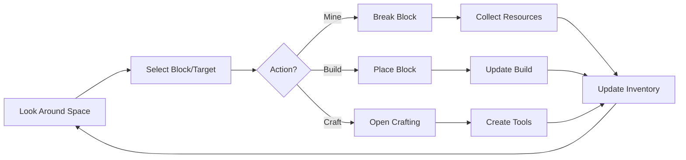

# Reality Minecraft - Design Document

## Document Overview
This document defines the comprehensive game design, UI/UX specifications, and player experience for Reality Minecraft on visionOS.

**Version:** 1.0
**Last Updated:** 2025-11-19
**Game Type:** Spatial Creative Sandbox with Survival Elements
**Target Platform:** Apple Vision Pro (visionOS 2.0+)

---

## Table of Contents
1. [Game Design Document](#game-design-document)
2. [Core Gameplay Loop](#core-gameplay-loop)
3. [Player Progression Systems](#player-progression-systems)
4. [Spatial Gameplay Design](#spatial-gameplay-design)
5. [UI/UX Design](#uiux-design)
6. [Visual Style Guide](#visual-style-guide)
7. [Audio Design](#audio-design)
8. [Accessibility Design](#accessibility-design)
9. [Tutorial & Onboarding](#tutorial--onboarding)
10. [Difficulty Balancing](#difficulty-balancing)
11. [Level Design Principles](#level-design-principles)

---

## 1. Game Design Document

### 1.1 Game Concept

**High Concept**: "Build and survive in Minecraft, but your living room becomes the game world."

**Elevator Pitch**: Reality Minecraft brings the beloved block-building experience into your physical space using Vision Pro. Mine virtual blocks from real walls, build structures that persist in your actual rooms, and defend against mobs that navigate around your furniture.

### 1.2 Core Pillars

```yaml
Design Pillars:
  1. Spatial Creativity:
     - Build anywhere in your physical space
     - Constructions persist between sessions
     - Real-world surfaces become building foundations

  2. Familiar Minecraft Gameplay:
     - Complete feature parity with Minecraft
     - All classic blocks, items, and mobs
     - Creative and Survival modes

  3. Physical World Integration:
     - Mobs navigate around real furniture
     - Lighting responds to room conditions
     - Safety-first design for real-world play

  4. Social Building:
     - Multiplayer in shared physical spaces
     - Collaborative construction projects
     - SharePlay integration

  5. Comfort & Safety:
     - 90 FPS for visual comfort
     - Clear spatial boundaries
     - Ergonomic interaction design
```

### 1.3 Target Audience

```yaml
Primary Audience:
  Demographics:
    - Age: 8-35 years old
    - Existing Minecraft players
    - Early adopters of spatial computing

  Psychographics:
    - Creative builders
    - Exploration-focused players
    - Social gamers
    - Family-friendly gaming

Secondary Audience:
  - Educational users (teachers, students)
  - Content creators (streamers, YouTubers)
  - Architecture/design enthusiasts

Player Motivations:
  - Creativity & Self-Expression
  - Exploration & Discovery
  - Collection & Completion
  - Social Connection
  - Mastery & Skill Development
```

### 1.4 Game Modes

#### Creative Mode
```yaml
Creative Mode:
  Description: "Unlimited resources for pure creative building"

  Features:
    - Unlimited block inventory
    - Flying capability
    - No health or hunger
    - Instant block breaking
    - No mob spawning (optional)

  Use Cases:
    - Architectural projects
    - Artistic creations
    - Educational builds
    - Rapid prototyping

  Spatial Features:
    - Build on any surface
    - Multi-room projects
    - Persistent installations
```

#### Survival Mode
```yaml
Survival Mode:
  Description: "Gather resources and survive against mobs in your space"

  Features:
    - Resource gathering required
    - Health and hunger systems
    - Day/night cycle
    - Mob spawning in dark areas
    - Crafting and progression

  Difficulty Levels:
    - Peaceful: No hostile mobs
    - Easy: Reduced mob damage
    - Normal: Standard Minecraft difficulty
    - Hard: Increased mob damage and spawning

  Spatial Features:
    - Mine blocks from real surfaces
    - Mobs hide behind furniture
    - Room-scale combat
    - Shelter building in physical space
```

#### Adventure Mode
```yaml
Adventure Mode:
  Description: "Play custom maps and experiences"

  Features:
    - Cannot break/place blocks without tools
    - Custom objectives and challenges
    - Story-driven experiences
    - Educational content

  Spatial Features:
    - Location-based challenges
    - Room-specific puzzles
    - Physical treasure hunts
```

---

## 2. Core Gameplay Loop

### 2.1 Minute-to-Minute Gameplay



**Core Loop Activities**:
1. **Observe** - Scan environment with eyes and head movement
2. **Target** - Use eye gaze to select blocks
3. **Action** - Use hand gestures to mine/place/interact
4. **Collect** - Gather resources into inventory
5. **Build** - Place blocks in physical space
6. **Repeat** - Continue creative/survival loop

### 2.2 Session Gameplay (10-30 minutes)

```yaml
Creative Session:
  1. Enter Game World (ImmersiveSpace)
  2. Review Previous Builds
  3. Gather New Blocks (Creative Inventory)
  4. Design & Plan Structure
  5. Build & Iterate
  6. Admire & Share
  7. Save & Exit

Survival Session:
  1. Enter Game World
  2. Check Health/Hunger/Resources
  3. Gather Resources (Mining/Hunting)
  4. Craft Tools/Items
  5. Build/Expand Shelter
  6. Defend Against Mobs (if night)
  7. Save & Exit
```

### 2.3 Long-Term Gameplay (Hours/Days/Weeks)

```yaml
Creative Long-Term:
  - Multi-room construction projects
  - Architectural masterpieces
  - Redstone contraptions
  - Decorative installations

Survival Long-Term:
  - Complete tech tree (wood → diamond tools)
  - Build permanent base
  - Explore all biomes (if implemented)
  - Defeat bosses (future content)
  - Complete achievements
```

---

## 3. Player Progression Systems

### 3.1 Survival Progression

```yaml
Technology Tree:
  Tier 1 - Wood Age (0-10 minutes):
    - Punch trees for wood
    - Craft wooden tools
    - Build crafting table
    - Create basic shelter

  Tier 2 - Stone Age (10-30 minutes):
    - Mine stone blocks
    - Craft stone tools
    - Build furnace
    - Expand shelter

  Tier 3 - Iron Age (30-60 minutes):
    - Mine iron ore
    - Smelt iron ingots
    - Craft iron tools & armor
    - Advanced building

  Tier 4 - Diamond Age (60+ minutes):
    - Mine at deep levels
    - Find diamonds
    - Craft diamond tools & armor
    - Enchanting (future)

  Tier 5 - Endgame (Hours):
    - Nether access (future)
    - Enchanted gear (future)
    - Boss battles (future)
```

### 3.2 Achievement System

```yaml
Achievements:
  Getting Started:
    - "Taking Inventory": Open inventory
    - "Getting Wood": Mine first wood block
    - "Benchmarking": Craft crafting table
    - "Time to Mine": Craft pickaxe

  Spatial Achievements:
    - "Room Builder": Build in first room
    - "Home Sweet Home": Build across 3 rooms
    - "Architect": Build 1000 blocks
    - "Master Builder": Build 10,000 blocks

  Survival Achievements:
    - "First Night": Survive first night
    - "Monster Hunter": Defeat 10 mobs
    - "Iron Man": Craft iron armor
    - "Diamonds!": Mine diamond

  Social Achievements:
    - "Teamwork": Build with another player
    - "Host": Host multiplayer session
    - "Community Builder": Contribute to 100 collaborative blocks
```

### 3.3 Skill Mastery

```yaml
Player Skill Progression:
  Beginner (0-2 hours):
    - Learning basic controls
    - Understanding block placement
    - First simple builds
    - Basic survival skills

  Intermediate (2-10 hours):
    - Efficient resource gathering
    - Complex structures
    - Redstone basics
    - Mob combat proficiency

  Advanced (10-50 hours):
    - Architectural design
    - Redstone engineering
    - Efficient base layout
    - PvP skills (multiplayer)

  Master (50+ hours):
    - Pixel art & sculptures
    - Complex redstone computers
    - Speed-running techniques
    - Teaching others
```

---

## 4. Spatial Gameplay Design

### 4.1 Room-Scale Interaction Zones

```yaml
Interaction Zones:
  Near Zone (0.3m - 0.6m):
    - Detailed block placement
    - Precision building
    - Inventory management
    - Crafting interface

  Mid Zone (0.6m - 2.0m):
    - Primary building area
    - Combat zone
    - Comfortable interaction
    - Most gameplay occurs here

  Far Zone (2.0m - 5.0m):
    - Long-range targeting
    - Environment observation
    - Mob detection
    - Planning perspective

  Extended Zone (5.0m+):
    - Cross-room builds
    - Large-scale planning
    - Multiplayer spaces
```

### 4.2 Physical Space Adaptation

```yaml
Small Spaces (2m x 2m):
  - Seated play supported
  - Vertical building emphasized
  - Focused survival gameplay
  - Single-room creative projects

Medium Spaces (3m x 3m):
  - Standing gameplay
  - Room-scale building
  - Multiplayer for 2 players
  - Standard survival experience

Large Spaces (4m x 4m+):
  - Full movement freedom
  - Multi-room adventures
  - Multiplayer for 4+ players
  - Ambitious creative projects

Furniture Integration:
  Tables:
    - Natural building platforms
    - Elevated structures
    - Crafting stations

  Chairs/Couches:
    - Obstacles for mobs
    - Cover during combat
    - Rest points (visual metaphor)

  Walls:
    - Mining surfaces
    - Vertical building space
    - Gallery for builds

  Floors:
    - Primary building surface
    - Mob spawning areas
    - Foundation for structures
```

### 4.3 Spatial Building Mechanics

```yaml
Block Placement Rules:
  Surface Snapping:
    - Blocks align to 10cm grid
    - Snap to real surfaces (walls, floor, furniture)
    - Visual feedback for valid placement
    - Preview before committing

  Floating Structures:
    - Creative mode: Build anywhere
    - Survival mode: Requires adjacent support
    - Anchored to world coordinates
    - Physics for unsupported blocks (survival)

  Multi-Room Building:
    - Seamless transitions between rooms
    - Per-room chunk loading
    - Doorway integration
    - Persistent across entire home

Safety Systems:
  Boundary Detection:
    - Prevent building in walkways
    - Warning when approaching furniture
    - Safe zone visualization
    - Automatic pause on collision risk

  Comfort Features:
    - Recommended play area marked
    - Ergonomic reach zones
    - Break reminders (30-minute intervals)
    - Lighting adaptation suggestions
```

---

## 5. UI/UX Design

### 5.1 Spatial UI Framework

```yaml
UI Hierarchy:
  Primary HUD (Always Visible):
    - Health bar (bottom left)
    - Hunger bar (bottom right)
    - Hotbar (bottom center)
    - Crosshair/Target indicator (center)

  Secondary UI (Contextual):
    - Block information tooltip
    - Mining progress indicator
    - Placement preview
    - Achievement notifications

  Menu UI (On-Demand):
    - Inventory (full screen overlay)
    - Crafting interface
    - Settings
    - Pause menu
```

### 5.2 HUD Design Specifications

#### Health & Hunger Display
```yaml
Health Bar:
  Position: Bottom left, 30cm from player, -15° vertical angle
  Visual: 10 hearts (Minecraft style)
  Behavior:
    - Shake when taking damage
    - Flash red when low health
    - Regeneration animation
  Size: 20cm width, 3cm height

Hunger Bar:
  Position: Bottom right, 30cm from player, -15° vertical angle
  Visual: 10 drumsticks (Minecraft style)
  Behavior:
    - Shake when hungry
    - Depletes during activity
    - Affects health regeneration
  Size: 20cm width, 3cm height
```

#### Hotbar Design
```yaml
Hotbar:
  Position: Bottom center, 40cm from player, -20° vertical angle
  Layout: 9 slots in horizontal row
  Slot Size: 5cm x 5cm per slot
  Selection: Eye gaze + dwell OR hand gesture
  Visual Feedback:
    - Selected slot: Glowing border
    - Empty slot: Subtle outline
    - Full slot: Block preview + quantity

  Interaction:
    - Look at slot + pinch to select
    - Swipe gesture to scroll
    - Voice command: "Slot [1-9]"
```

#### Target Indicator
```yaml
Crosshair:
  Position: Screen center (follows gaze)
  Visual: Subtle + icon
  Behavior:
    - Changes color when targeting block
    - Mining: Fills radially with progress
    - Placement: Shows placement preview
    - Invalid: Red tint
  Size: 1cm x 1cm
```

### 5.3 Inventory UI

```yaml
Inventory Screen:
  Trigger: Spread hand gesture OR voice "Inventory"
  Layout: 2D grid floating 60cm in front of player
  Dimensions: 60cm x 80cm panel

  Sections:
    Player Inventory (36 slots):
      - 4 rows x 9 columns
      - Drag & drop with hand tracking
      - Eye gaze + pinch to select

    Crafting Grid (3x3):
      - Right side of inventory
      - Recipe suggestions shown
      - Eye gaze to select ingredients

    Equipment Slots:
      - Helmet, Chestplate, Leggings, Boots
      - Left side of inventory
      - Direct placement with hand

    Output Slot:
      - Shows crafted item
      - Pinch to collect

  Interactions:
    - Eye Gaze: Highlight slot
    - Pinch: Pick up/place item
    - Double Pinch: Quick transfer
    - Swipe: Sort inventory
```

### 5.4 Crafting Interface

```yaml
Crafting Table UI:
  Trigger: Look at crafting table + pinch
  Position: Anchored to physical crafting table block

  Layout:
    3x3 Crafting Grid:
      - Positioned above physical block
      - Ingredients placed via hand or gaze
      - Recipe book integration

    Recipe Book:
      - Floating panel to left
      - Shows available recipes
      - Filter by category
      - Scroll with hand gesture

    Output Preview:
      - Large preview of result
      - Shows quantity
      - Pinch to craft

  Smart Crafting:
    - Voice: "Craft wooden pickaxe"
    - Auto-fills recipe if ingredients available
    - Suggests recipes based on inventory
```

### 5.5 Menu & Settings UI

```yaml
Pause Menu:
  Trigger: Hand gesture (palm toward face) OR voice "Pause"
  Position: 50cm in front of player

  Options:
    - Resume Game
    - Settings
    - Save & Quit
    - Help

Settings Panel:
  Categories:
    Graphics:
      - Render Distance: 4-12 chunks
      - Detail Level: Low/Medium/High
      - Particles: On/Off
      - Shadows: On/Off

    Audio:
      - Master Volume
      - Music Volume
      - SFX Volume
      - Spatial Audio: On/Off

    Controls:
      - Hand Tracking Sensitivity
      - Eye Tracking Calibration
      - Voice Commands: On/Off
      - Controller Support

    Gameplay:
      - Difficulty
      - Game Mode
      - Auto-Save Interval
      - Tutorial Hints

    Comfort:
      - Break Reminders
      - Safety Boundaries
      - Locomotion Style
      - UI Distance
```

---

## 6. Visual Style Guide

### 6.1 Art Direction

```yaml
Visual Identity:
  Core Aesthetic: "Minecraft meets Spatial Reality"

  Principles:
    - Authentic Minecraft blocky style
    - Seamless integration with real world
    - Clear visual hierarchy
    - Consistent lighting model
    - Readable from all distances

  Color Palette:
    Primary Colors (Minecraft authentic):
      - Grass Green: #7CB342
      - Stone Gray: #9E9E9E
      - Wood Brown: #8D6E63
      - Sky Blue: #64B5F6

    UI Colors:
      - Background: 80% transparent black
      - Text: White with subtle drop shadow
      - Highlights: Minecraft yellow (#FFEB3B)
      - Warnings: Red (#F44336)

    Spatial Integration:
      - Blocks: Full opacity, authentic textures
      - UI: Semi-transparent to see real world
      - Particles: Additive blending
      - Lighting: Matches room lighting
```

### 6.2 Block Visual Design

```yaml
Block Rendering:
  Texture Resolution: 16x16 (Minecraft authentic)
  Upscaling: Nearest-neighbor (crisp pixels)
  Material: PBR (Physically Based Rendering)

  Block Size: 10cm x 10cm x 10cm cubes

  Visual Properties:
    Opaque Blocks (Stone, Dirt, Wood):
      - Full PBR materials
      - Normal maps for depth
      - Ambient occlusion
      - Cast/receive shadows

    Transparent Blocks (Glass, Water):
      - Alpha blending
      - Refraction effects
      - Reduced shadow casting

    Emissive Blocks (Glowstone, Torches):
      - Emission maps
      - Point light emission
      - Glow intensity: 0-15 Minecraft scale

    Animated Blocks (Water, Lava):
      - Texture animation
      - Particle effects
      - Dynamic lighting
```

### 6.3 Mob Visual Design

```yaml
Mob Appearance:
  Style: Authentic Minecraft models
  Scale: True to Minecraft proportions
  Animation: Smooth 60+ FPS animations

  Rendering:
    - Cel-shaded option (optional)
    - Smooth lighting
    - Animated textures (eyes, mouth)
    - Dynamic shadows

  Visual Feedback:
    - Damage: Flash red
    - Aggro: Glowing eyes
    - Death: Particle explosion
    - Spawning: Fade-in effect

Example Mobs:
  Zombie:
    - Height: 1.95m (scaled to real-world)
    - Green skin, tattered clothes
    - Shambling animation
    - Groaning audio cues

  Creeper:
    - Height: 1.7m
    - Iconic green with face pattern
    - Hissing when approaching
    - Flash white when exploding
```

### 6.4 Environmental Effects

```yaml
Particles:
  Block Breaking:
    - Small block fragments
    - Match block texture
    - Gravity-affected
    - Fade out after 1 second

  Block Placement:
    - Puff of dust
    - Quick scale-in animation
    - Sound effect

  Mob Death:
    - Particle explosion
    - Item drops
    - Experience orbs (future)

Lighting:
  Time of Day:
    - Dawn: Warm orange (6:00 AM)
    - Day: Bright white (12:00 PM)
    - Dusk: Orange-red (6:00 PM)
    - Night: Cool blue (12:00 AM)

  Light Sources:
    - Torch: Flickering orange (light level 14)
    - Glowstone: Steady yellow (light level 15)
    - Lava: Bright orange-red (light level 15)

  Room Integration:
    - Blend with real room lighting
    - Virtual lights affect virtual objects only
    - Optional: Suggest real room lighting changes
```

---

## 7. Audio Design

### 7.1 Audio Categories

```yaml
Music System:
  Ambient Music:
    - Calm 1, 2, 3 (Creative mode)
    - Tense 1, 2 (Survival night)
    - Victory (Achievement)

  Playback Rules:
    - Random selection every 5-10 minutes
    - Crossfade transitions (3 seconds)
    - Pause during intense combat
    - Volume: 30% of master by default

  Spatial Behavior:
    - Non-spatial (same volume everywhere)
    - Gentle reverb based on room size

Sound Effects:
  Block Sounds:
    - Place: Varies by block type
    - Break: Varies by block type
    - Step: Plays when walking on blocks
    - Each block type has unique sound

  Mob Sounds:
    - Ambient: Occasional noises
    - Hurt: When taking damage
    - Death: When defeated
    - Attack: During combat

  Player Sounds:
    - Hurt: When taking damage
    - Die: On death
    - Eat: When consuming food
    - Equip: When changing items

  Environment:
    - Rain: Looping ambient
    - Thunder: Occasional claps
    - Cave: Echo-y ambience
```

### 7.2 Spatial Audio Specifications

```yaml
3D Positional Audio:
  All gameplay sounds are spatialized

  Distance Attenuation:
    - Min Distance: 1.0m (full volume)
    - Max Distance: 16.0m (silent)
    - Rolloff: Inverse square law

  Occlusion:
    - Solid blocks reduce volume by 70%
    - Each block = -7dB attenuation
    - Max occlusion: -35dB

  Reverb:
    - Room-aware reverb
    - Larger rooms = longer decay
    - Stone rooms = more reverb
    - Outdoor = minimal reverb

  Directional Audio:
    - HRTF for accurate positioning
    - Head tracking integration
    - Behind sounds = muffled high frequencies

Example: Zombie Behind Wall:
  - Base volume: 80% (close distance)
  - Occlusion: -14dB (2 blocks)
  - Direction: Behind player (muffled)
  - Result: Quiet, muffled groaning from behind
```

### 7.3 Audio Feedback Design

```yaml
UI Audio:
  Interaction Feedback:
    - Hover: Subtle tick
    - Select: Click
    - Invalid: Buzz
    - Achievement: Fanfare

  Mining Feedback:
    - Hit block: Thud (pitch varies by progress)
    - Break block: Crack + break sound
    - Pickup item: Pop + collect sound

  Combat Feedback:
    - Hit mob: Thwack + mob hurt sound
    - Take damage: Oof + health lost sound
    - Death: Dramatic death sound + music sting

Adaptive Audio:
  Health-Based:
    - Low health: Heartbeat sound
    - Critical health: Urgent music sting

  Danger-Based:
    - Mob nearby: Tense music layer
    - Multiple mobs: More intense music
    - Safe: Return to calm music

  Time-Based:
    - Approaching night: Warning chime
    - Sunrise: Rooster crow (future)
```

---

## 8. Accessibility Design

### 8.1 Visual Accessibility

```yaml
Color Blind Support:
  - Deuteranopia mode (red-green)
  - Protanopia mode (red-green)
  - Tritanopia mode (blue-yellow)
  - High contrast UI option

  Implementation:
    - Alternative color palettes
    - Pattern overlays on blocks
    - Text labels on color-coded UI
    - Colorblind-safe mob indicators

Low Vision Support:
  - UI scaling: 100%, 125%, 150%, 200%
  - High contrast mode
  - Large text option
  - Outline mode for blocks
  - Audio descriptions (future)

Visual Clarity:
  - Clean UI with no clutter
  - High contrast text (white on dark)
  - Drop shadows on all text
  - Clear iconography
```

### 8.2 Motor Accessibility

```yaml
Hand Tracking Alternatives:
  Eye Tracking + Dwell:
    - Look at block for 1 second = select
    - Adjustable dwell time (0.5-3 seconds)
    - Visual countdown indicator

  Voice Commands:
    - "Place [block name]"
    - "Mine block"
    - "Open inventory"
    - "Craft [item name]"
    - "Attack"

  Game Controller:
    - Full game support via standard controller
    - Remappable buttons
    - One-handed mode
    - Adjustable sensitivity

Reduced Precision Options:
  - Larger target areas
  - Sticky cursor (snaps to targets)
  - Auto-aim for mining
  - Simplified gestures
```

### 8.3 Cognitive Accessibility

```yaml
Difficulty Options:
  Peaceful Mode:
    - No hostile mobs
    - Focus on creativity
    - No hunger
    - No fall damage

  Simplified UI:
    - Reduce visual complexity
    - Clearer labels
    - Tutorial tooltips always on
    - Recipe book always available

  Gameplay Assistance:
    - Crafting suggestions
    - Building guides
    - Quest markers
    - Auto-navigation (future)

Content Warnings:
  - Optional combat
  - Mob appearance warnings
  - Scary sound warnings
  - Flashing effects toggle
```

### 8.4 Hearing Accessibility

```yaml
Visual Sound Indicators:
  - Directional indicators for sounds
  - Subtitle system for all sounds
  - Visual mob detection (radar)
  - Footstep vibration (haptic)

Subtitle System:
  Display:
    - "[Direction] Zombie groans"
    - "[Behind] Creeper hissing"
    - "[Front] Block breaking"

  Customization:
    - Font size adjustment
    - Background opacity
    - Color coding by type
    - Distance indicators

Haptic Feedback:
  - Block placement: Light tap
  - Block breaking: Increasing vibration
  - Taking damage: Strong pulse
  - Mob nearby: Rhythmic pulse
```

---

## 9. Tutorial & Onboarding

### 9.1 First-Time User Experience

```yaml
Onboarding Flow:
  Step 1: Welcome & Introduction (2 minutes)
    - Brief video explaining concept
    - Show example builds in real spaces
    - Explain creative vs survival modes

  Step 2: Spatial Calibration (1 minute)
    - Room scanning
    - Play area definition
    - Safety boundary setup

  Step 3: Control Tutorial (3 minutes)
    - Hand gesture introduction
    - Eye tracking calibration
    - Practice block placement
    - Practice block mining

  Step 4: First Build Tutorial (5 minutes)
    - Place first block on real table
    - Build simple 3x3 platform
    - Add walls
    - Place door
    - Achievement: "First Build"

  Step 5: Survival Introduction (Optional, 5 minutes)
    - Gather wood from walls
    - Craft crafting table
    - Make wooden pickaxe
    - Mine stone
    - Achievement: "Getting Started"

  Step 6: Free Play
    - All controls unlocked
    - Tutorial hints available
    - Help system accessible
```

### 9.2 Progressive Tutorials

```yaml
Tutorial System:
  Contextual Hints:
    - First time opening inventory: Explain layout
    - First time crafting: Show recipe book
    - First night: Explain mob spawning
    - First mob encounter: Explain combat

  Tutorial Quests (Optional):
    Creative Quests:
      - Build a house
      - Create a bridge
      - Build across 2 rooms
      - Make a sculpture

    Survival Quests:
      - Survive first night
      - Craft iron tools
      - Build a farm (future)
      - Defeat 10 mobs

  Help System:
    - In-game manual
    - Video tutorials
    - Interactive demos
    - Community tips
```

### 9.3 Skill Building

```yaml
Graduated Complexity:
  Beginner Content:
    - Simple shapes (cubes, platforms)
    - Basic survival (shelter, tools)
    - Single-room builds

  Intermediate Content:
    - Architectural elements (arches, windows)
    - Redstone basics (doors, lighting)
    - Multi-room builds

  Advanced Content:
    - Complex redstone circuits
    - Pixel art & sculptures
    - Automated farms
    - Multiplayer collaboration
```

---

## 10. Difficulty Balancing

### 10.1 Survival Mode Difficulty

```yaml
Peaceful:
  - No hostile mobs spawn
  - Health regenerates fully
  - Hunger doesn't deplete
  - Focus: Building & exploration

Easy:
  - Mob damage: 50% of normal
  - Mob spawn rate: 75% of normal
  - Hunger depletion: 75% speed
  - Health regeneration: 150% speed

Normal:
  - Mob damage: 100% (balanced)
  - Mob spawn rate: 100%
  - Hunger depletion: 100%
  - Health regeneration: 100%

Hard:
  - Mob damage: 150%
  - Mob spawn rate: 125%
  - Hunger depletion: 125%
  - Health regeneration: 75%
  - Permanent death option
```

### 10.2 Resource Availability

```yaml
Resource Distribution:
  Common Blocks (80% of world):
    - Dirt, Grass, Stone, Wood
    - Found everywhere
    - Easy to gather

  Uncommon Blocks (15% of world):
    - Iron, Coal, Sand, Clay
    - Specific surfaces/locations
    - Moderate effort to gather

  Rare Blocks (5% of world):
    - Gold, Diamond, Emerald
    - Deep mining required
    - High effort to gather

Mining Speed:
  No Tool:
    - Wood: 3 seconds
    - Stone: 15 seconds
    - Iron Ore: Cannot break

  Wooden Tool:
    - Wood: 1.5 seconds
    - Stone: 2.5 seconds
    - Iron Ore: 3.75 seconds

  Stone Tool:
    - Stone: 1.25 seconds
    - Iron Ore: 1.9 seconds

  Iron Tool:
    - Stone: 0.65 seconds
    - Iron Ore: 0.95 seconds
    - Diamond Ore: 3.75 seconds

  Diamond Tool:
    - All blocks: 50% faster than iron
```

### 10.3 Combat Balancing

```yaml
Mob Statistics:
  Zombie:
    - Health: 20 HP
    - Damage: 3 HP (easy), 5 HP (normal), 7 HP (hard)
    - Speed: 0.23 m/s
    - Attack Range: 1.0m
    - Detection Range: 16m

  Skeleton:
    - Health: 20 HP
    - Damage: 3-5 HP per arrow
    - Speed: 0.25 m/s
    - Attack Range: 15m (ranged)
    - Detection Range: 16m

  Creeper:
    - Health: 20 HP
    - Explosion Damage: 49 HP (close), 24 HP (medium), 8 HP (far)
    - Speed: 0.25 m/s
    - Explosion Radius: 3m
    - Fuse Time: 1.5 seconds

Player Combat:
  Fist Damage: 1 HP
  Wooden Sword: 5 HP
  Stone Sword: 6 HP
  Iron Sword: 7 HP
  Diamond Sword: 8 HP

  Attack Speed: 1.6 hits/second
  Critical Hit: 150% damage (jump attack)
```

---

## 11. Level Design Principles

### 11.1 Procedural World Generation

```yaml
Surface Classification:
  When player scans room:
    Floor → Grass blocks underneath
    Walls → Stone/ore deposits inside
    Ceiling → Stone layers above
    Furniture → Special blocks/chests

Biome Mapping (Future):
  Living Room → Plains biome
  Bedroom → Forest biome
  Kitchen → Desert biome
  Bathroom → Ocean biome
  Garage → Cave biome

Resource Placement:
  Surface Level (Floor):
    - Common: Dirt, Grass, Stone
    - Spawns: Passive mobs (day)

  Underground (Walls, under floor):
    - Depth 0-2m: Stone, Coal
    - Depth 2-4m: Iron, More coal
    - Depth 4m+: Gold, Diamond (rare)

  Special Locations:
    - Near windows: More light-dependent resources
    - Dark corners: Mob spawners
    - Under furniture: Hidden treasures
```

### 11.2 Spatial Encounter Design

```yaml
Mob Spawning Logic:
  Light Level Requirements:
    - Light 0-7: Hostile mobs spawn
    - Light 8+: Only passive mobs

  Surface Requirements:
    - Solid opaque block
    - 2 blocks of empty space above
    - Not in player's view

  Spatial Rules:
    - Min distance from player: 24 blocks (2.4m)
    - Max distance: 128 blocks (12.8m)
    - Spawn in dark corners, closets, under furniture
    - Natural pathfinding around obstacles

Combat Scenarios:
  Early Game (Wood/Stone tier):
    - 1-2 zombies
    - Open spaces
    - Escape routes available

  Mid Game (Iron tier):
    - 2-4 mixed mobs
    - Tighter spaces
    - Cover usage important

  Late Game (Diamond tier):
    - 4+ mobs
    - Challenging environments
    - Strategic combat required
```

### 11.3 Building Challenges

```yaml
Creative Challenges:
  Beginner:
    - Build a simple house (4x4x3)
    - Create a bridge between furniture
    - Make a decorative garden

  Intermediate:
    - Build a multi-room structure
    - Create functional redstone door
    - Design themed room

  Advanced:
    - Pixel art portrait
    - Working redstone computer
    - Full-house integrated build

  Expert:
    - Architectural replica
    - Complex automation
    - Multiplayer megaproject
```

---

## 12. Design Patterns Library

### 12.1 Common Build Patterns

```yaml
House Template:
  Dimensions: 6x6x4 blocks
  Materials:
    - Walls: Wood planks or stone
    - Floor: Wood planks
    - Roof: Stairs or slabs
    - Door: Wooden door
    - Windows: Glass blocks
    - Lighting: Torches

  Variations:
    - Cottage: Small, cozy
    - Modern: Glass walls, flat roof
    - Castle: Stone walls, towers
    - Treehouse: Elevated, wood-heavy

Furniture Patterns:
  Table:
    - Fence post + pressure plate top
    - 2x2 arrangement

  Chair:
    - Stairs block
    - Signs for armrests

  Bed:
    - 2 wool blocks + wood planks

  Storage:
    - Chest blocks
    - Item frames for labels
```

### 12.2 Redstone Patterns (Future)

```yaml
Basic Circuits:
  Door Opener:
    - Button/lever → Redstone wire → Door
    - Auto-close with timer

  Lighting System:
    - Lever → Redstone wire → Redstone lamps
    - Multiple lights from one switch

  Secret Door:
    - Hidden button → Piston mechanism
    - Concealed entrance

Advanced Circuits:
  Automated Farm:
    - Timer → Dispenser → Water flow
    - Crop collection system

  Mob Trap:
    - Spawn platform → Water channels → Kill chamber
    - Item collection via hoppers
```

---

## Conclusion

Reality Minecraft's design focuses on bringing the beloved Minecraft experience into physical spaces while maintaining accessibility, comfort, and creativity. The spatial integration creates unique gameplay opportunities while respecting player safety and enjoyment.

**Key Design Principles**:
1. **Familiarity** - Minecraft mechanics players know and love
2. **Innovation** - Spatial features impossible on other platforms
3. **Accessibility** - Playable by everyone, regardless of ability
4. **Safety** - Physical and visual comfort prioritized
5. **Creativity** - Unlimited expression in real-world spaces

**Next Document**: See `IMPLEMENTATION_PLAN.md` for development roadmap and execution strategy.
