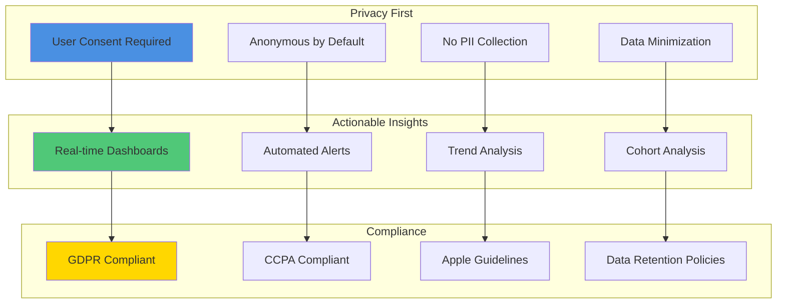
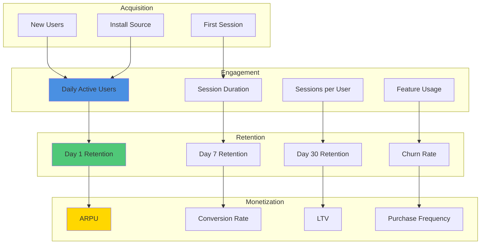
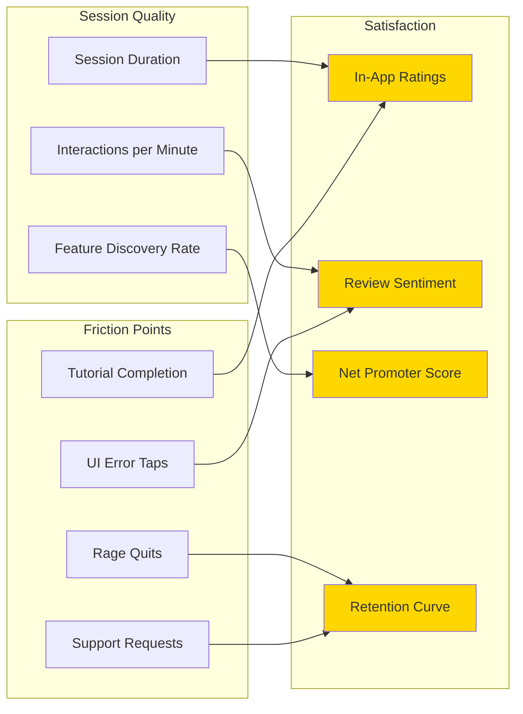
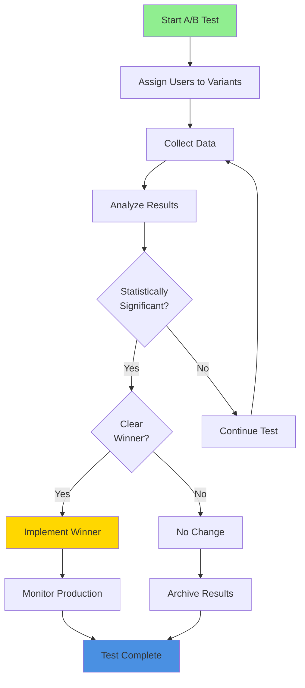
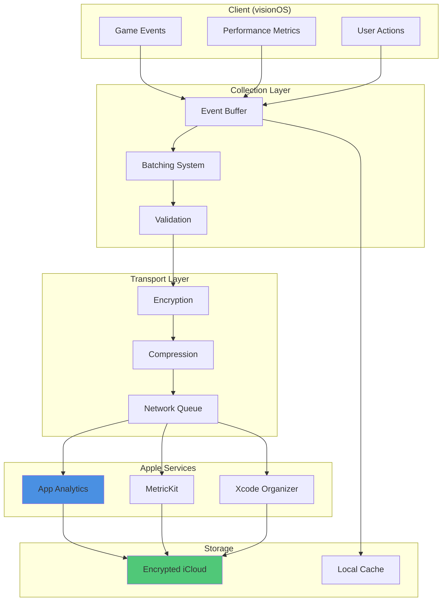
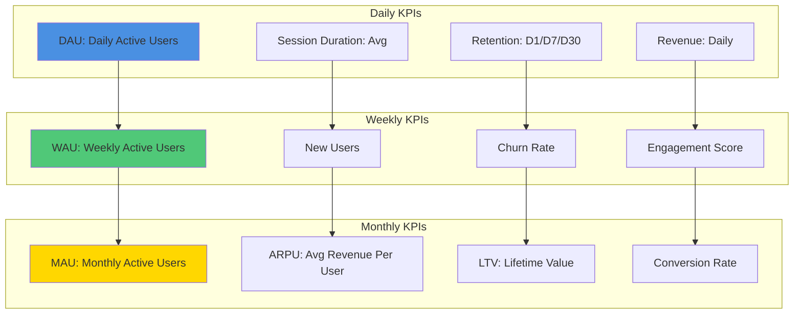

# Reality Realms RPG - Analytics Strategy

## Table of Contents
- [Analytics Overview](#analytics-overview)
- [Privacy-First Approach](#privacy-first-approach)
- [Metrics to Track](#metrics-to-track)
- [Event Taxonomy](#event-taxonomy)
- [A/B Testing Framework](#ab-testing-framework)
- [Analytics Tools](#analytics-tools)
- [Data Pipeline](#data-pipeline)
- [Dashboards and Reporting](#dashboards-and-reporting)
- [Compliance and Privacy](#compliance-and-privacy)

---

## Analytics Overview

Reality Realms RPG implements a privacy-first analytics strategy that respects user data while providing actionable insights to improve the game experience.

### Analytics Goals

1. **Understand Player Behavior**: Learn how players engage with the game
2. **Optimize Game Design**: Data-driven design improvements
3. **Improve Retention**: Identify and fix drop-off points
4. **Monetization Insights**: Understand purchase patterns
5. **Performance Monitoring**: Track technical performance
6. **Content Effectiveness**: Measure content engagement

### Core Principles



---

## Privacy-First Approach

### Consent Management

```swift
class AnalyticsConsentManager {
    enum ConsentStatus {
        case notDetermined
        case denied
        case granted
        case partial(Set<AnalyticsCategory>)
    }

    enum AnalyticsCategory {
        case essential      // Required for game function
        case performance    // Performance monitoring
        case functional     // Feature usage tracking
        case marketing      // A/B testing, campaigns
    }

    @Published private(set) var consentStatus: ConsentStatus = .notDetermined

    func requestConsent() async -> ConsentStatus {
        // Present consent UI to user
        let response = await presentConsentDialog()
        consentStatus = response
        saveConsentPreference(response)
        return response
    }

    func canTrack(category: AnalyticsCategory) -> Bool {
        switch consentStatus {
        case .granted:
            return true
        case .denied:
            return category == .essential
        case .partial(let categories):
            return categories.contains(category) || category == .essential
        case .notDetermined:
            return category == .essential
        }
    }
}
```

### Data Anonymization

```swift
struct AnalyticsEvent {
    let eventName: String
    let timestamp: Date
    let sessionID: UUID      // Anonymous session identifier
    let deviceType: String   // "visionOS" - no device ID
    let appVersion: String
    let properties: [String: Any]

    // Explicitly excluded:
    // - User ID (except anonymous)
    // - Device ID
    // - IP Address
    // - Location (beyond country/region)
    // - Email
    // - Name
    // - Any PII
}
```

### Opt-Out Mechanism

```swift
struct PrivacySettingsView: View {
    @StateObject private var analytics = AnalyticsConsentManager()

    var body: some View {
        Form {
            Section("Analytics Preferences") {
                Toggle("Essential Analytics", isOn: .constant(true))
                    .disabled(true)
                    .help("Required for game functionality")

                Toggle("Performance Analytics", isOn: $performanceEnabled)
                    .help("Help us improve game performance")

                Toggle("Functional Analytics", isOn: $functionalEnabled)
                    .help("Help us understand feature usage")

                Toggle("A/B Testing", isOn: $abTestingEnabled)
                    .help("Participate in feature experiments")
            }

            Section("Your Data") {
                Button("Export My Data") {
                    exportUserData()
                }

                Button("Delete My Data") {
                    deleteUserData()
                }
            }
        }
    }
}
```

---

## Metrics to Track

### Player Engagement Metrics



### Gameplay Metrics

| Category | Metric | Description | Tracking Frequency |
|----------|--------|-------------|-------------------|
| **Combat** | Battles Initiated | Total combat encounters | Per event |
| | Win Rate | Combat victories / total battles | Daily aggregate |
| | Average Battle Duration | Mean time per combat | Daily aggregate |
| | Death Count | Player deaths | Per event |
| | Damage Dealt | Total damage output | Session aggregate |
| **Progression** | Current Level | Player character level | Session start/end |
| | Experience Gained | XP earned per session | Session aggregate |
| | Quests Completed | Completed quests | Per event |
| | Quest Abandonment | Quests started but not finished | Weekly aggregate |
| **Economy** | Gold Earned | Currency obtained | Session aggregate |
| | Gold Spent | Currency used | Per transaction |
| | Items Acquired | New items obtained | Per event |
| | Inventory Full Events | Inventory capacity reached | Per event |
| **Social** | Multiplayer Sessions | Co-op/PvP games | Per session |
| | Friends Added | New connections | Per event |
| | Messages Sent | In-game communication | Daily aggregate |
| **Spatial** | Room Scans | New rooms mapped | Per event |
| | Play Area Size | Room dimensions | Per session |
| | Anchor Persistence | Successful anchor restoration | Per session |

### Technical Performance Metrics

```swift
struct PerformanceMetrics {
    // Frame Rate
    var averageFPS: Float
    var minFPS: Float
    var maxFPS: Float
    var fpsDrops: Int // Drops below 60 FPS

    // Memory
    var averageMemoryUsage: UInt64 // Bytes
    var peakMemoryUsage: UInt64
    var memoryWarnings: Int

    // Battery
    var batteryDrain: Float // Percentage per hour
    var thermalState: String

    // Network
    var averageLatency: TimeInterval
    var packetLoss: Float
    var bandwidth: UInt64

    // Load Times
    var appLaunchTime: TimeInterval
    var sceneLoadTime: TimeInterval
    var assetLoadTime: TimeInterval
}
```

### User Experience Metrics



---

## Event Taxonomy

### Event Naming Convention

```
Format: [Category]_[Action]_[Object]
Example: combat_start_battle
         player_level_up
         ui_click_button
         item_purchase_sword
```

### Core Events

#### Session Events

```swift
// Session Start
analyticsLogger.log(
    event: "session_start",
    properties: [
        "session_id": sessionID,
        "app_version": appVersion,
        "platform": "visionOS",
        "is_first_session": isFirstSession
    ]
)

// Session End
analyticsLogger.log(
    event: "session_end",
    properties: [
        "session_id": sessionID,
        "duration_seconds": sessionDuration,
        "events_count": eventsInSession,
        "exit_reason": "user_quit" // or "background", "crash"
    ]
)
```

#### Player Progression Events

```swift
// Level Up
analyticsLogger.log(
    event: "player_level_up",
    properties: [
        "previous_level": oldLevel,
        "new_level": newLevel,
        "time_to_level": timeSpent,
        "character_class": playerClass
    ]
)

// Quest Events
analyticsLogger.log(
    event: "quest_complete",
    properties: [
        "quest_id": questID,
        "quest_name": questName,
        "completion_time": completionTime,
        "attempts": attemptCount,
        "rewards_earned": rewards
    ]
)
```

#### Combat Events

```swift
// Combat Start
analyticsLogger.log(
    event: "combat_start",
    properties: [
        "enemy_type": enemyType,
        "enemy_count": enemyCount,
        "player_level": playerLevel,
        "location": combatLocation
    ]
)

// Combat End
analyticsLogger.log(
    event: "combat_end",
    properties: [
        "result": "victory", // or "defeat", "fled"
        "duration_seconds": combatDuration,
        "damage_dealt": totalDamage,
        "damage_taken": damageTaken,
        "experience_gained": xpEarned
    ]
)
```

#### Monetization Events

```swift
// Store View
analyticsLogger.log(
    event: "store_view",
    properties: [
        "store_section": "weapons", // or "cosmetics", "bundles"
        "entry_point": "main_menu" // or "in_game", "notification"
    ]
)

// Purchase Initiated
analyticsLogger.log(
    event: "purchase_initiated",
    properties: [
        "item_id": itemID,
        "item_name": itemName,
        "price_usd": price,
        "currency": "USD"
    ]
)

// Purchase Completed
analyticsLogger.log(
    event: "purchase_completed",
    properties: [
        "item_id": itemID,
        "item_name": itemName,
        "price_usd": price,
        "payment_method": "apple_pay",
        "transaction_id": transactionID
    ]
)
```

#### Social Events

```swift
// Multiplayer Session
analyticsLogger.log(
    event: "multiplayer_session_start",
    properties: [
        "session_type": "co_op", // or "pvp", "raid"
        "player_count": playerCount,
        "connection_method": "shareplay" // or "game_center"
    ]
)
```

### Event Properties Schema

```json
{
  "event_name": "combat_end",
  "timestamp": "2025-11-19T10:30:00Z",
  "session_id": "uuid-string",
  "user_id": "anonymous-uuid",
  "app_version": "1.2.0",
  "platform": "visionOS",
  "device_model": "Apple Vision Pro",
  "os_version": "2.2",
  "properties": {
    "result": "victory",
    "duration_seconds": 45,
    "damage_dealt": 250,
    "damage_taken": 80,
    "experience_gained": 150,
    "enemy_type": "goblin",
    "enemy_level": 5
  }
}
```

---

## A/B Testing Framework

### Experiment Structure

```swift
struct ABTestExperiment {
    let id: String
    let name: String
    let variants: [Variant]
    let startDate: Date
    let endDate: Date
    let targetAudience: AudienceSegment
    let successMetric: Metric

    struct Variant {
        let id: String
        let name: String
        let weight: Float // Percentage of users (0.0 - 1.0)
        let configuration: [String: Any]
    }

    enum AudienceSegment {
        case all
        case newUsers
        case returningUsers
        case specificLevel(Int)
        case specificRegion(String)
    }

    enum Metric {
        case retention(day: Int)
        case sessionDuration
        case conversionRate
        case engagementRate
    }
}
```

### Example A/B Tests

```swift
// Test 1: Tutorial Length
let tutorialTest = ABTestExperiment(
    id: "tutorial_length_001",
    name: "Tutorial Length Optimization",
    variants: [
        Variant(
            id: "control",
            name: "Full Tutorial (10 minutes)",
            weight: 0.5,
            configuration: ["tutorial_steps": 10]
        ),
        Variant(
            id: "variant_a",
            name: "Short Tutorial (5 minutes)",
            weight: 0.5,
            configuration: ["tutorial_steps": 5]
        )
    ],
    startDate: Date(),
    endDate: Date().addingTimeInterval(14 * 24 * 60 * 60), // 2 weeks
    targetAudience: .newUsers,
    successMetric: .retention(day: 7)
)

// Test 2: Combat Difficulty
let difficultyTest = ABTestExperiment(
    id: "combat_difficulty_001",
    name: "Initial Combat Difficulty",
    variants: [
        Variant(id: "control", name: "Normal", weight: 0.33,
                configuration: ["enemy_health_multiplier": 1.0]),
        Variant(id: "variant_a", name: "Easy", weight: 0.33,
                configuration: ["enemy_health_multiplier": 0.8]),
        Variant(id: "variant_b", name: "Hard", weight: 0.34,
                configuration: ["enemy_health_multiplier": 1.2])
    ],
    startDate: Date(),
    endDate: Date().addingTimeInterval(7 * 24 * 60 * 60),
    targetAudience: .all,
    successMetric: .engagementRate
)
```

### A/B Test Implementation

```swift
class ABTestManager {
    func getVariant(for experiment: ABTestExperiment) -> ABTestExperiment.Variant {
        // Check if user already assigned
        if let existing = getCachedVariant(experiment.id) {
            return existing
        }

        // Assign new variant based on weights
        let variant = assignVariant(experiment.variants)
        cacheVariant(experiment.id, variant: variant)

        // Track assignment
        analyticsLogger.log(
            event: "ab_test_assigned",
            properties: [
                "experiment_id": experiment.id,
                "experiment_name": experiment.name,
                "variant_id": variant.id,
                "variant_name": variant.name
            ]
        )

        return variant
    }

    private func assignVariant(_ variants: [ABTestExperiment.Variant])
        -> ABTestExperiment.Variant
    {
        let random = Float.random(in: 0..<1)
        var cumulative: Float = 0

        for variant in variants {
            cumulative += variant.weight
            if random < cumulative {
                return variant
            }
        }

        return variants.last!
    }
}
```

### A/B Test Results Analysis



---

## Analytics Tools

### Apple Analytics Only

Reality Realms RPG uses **only Apple-provided analytics tools** to maintain privacy and comply with App Store guidelines:

```yaml
Analytics_Stack:
  primary_tool: App Analytics (App Store Connect)
  features:
    - app_store_metrics
    - user_acquisition_data
    - crashes_and_diagnostics
    - engagement_metrics
    - monetization_data

  supplementary_tools:
    - MetricKit: # Real-time performance metrics
        - battery_usage
        - hang_rate
        - disk_writes
        - network_usage

    - Xcode Organizer: # Detailed crash reports
        - crash_logs
        - energy_reports
        - launch_time_metrics

  data_storage:
    location: iCloud (encrypted)
    retention: 90 days
    export: JSON format
    access: Team admin only
```

### Analytics Implementation

```swift
import MetricKit

class AnalyticsManager: NSObject, MXMetricManagerSubscriber {
    static let shared = AnalyticsManager()

    override init() {
        super.init()
        MXMetricManager.shared.add(self)
    }

    // MetricKit Delegate
    func didReceive(_ payloads: [MXMetricPayload]) {
        for payload in payloads {
            // Process performance metrics
            processMetrics(payload)
        }
    }

    func didReceive(_ payloads: [MXDiagnosticPayload]) {
        for payload in payloads {
            // Process crash and hang diagnostics
            processDiagnostics(payload)
        }
    }

    private func processMetrics(_ payload: MXMetricPayload) {
        // Battery metrics
        if let batteryMetrics = payload.applicationLaunchMetrics {
            logBatteryUsage(batteryMetrics)
        }

        // Performance metrics
        if let hangMetrics = payload.applicationResponsivenessMetrics {
            logHangRate(hangMetrics)
        }

        // Network metrics
        if let networkMetrics = payload.networkTransferMetrics {
            logNetworkUsage(networkMetrics)
        }
    }
}
```

---

## Data Pipeline

### Analytics Flow



### Event Batching

```swift
class EventBatcher {
    private var eventQueue: [AnalyticsEvent] = []
    private let batchSize = 50
    private let batchInterval: TimeInterval = 60 // 60 seconds

    func queueEvent(_ event: AnalyticsEvent) {
        eventQueue.append(event)

        if eventQueue.count >= batchSize {
            flushEvents()
        }
    }

    func flushEvents() {
        guard !eventQueue.isEmpty else { return }

        let batch = eventQueue
        eventQueue.removeAll()

        Task {
            await sendBatch(batch)
        }
    }

    private func sendBatch(_ events: [AnalyticsEvent]) async {
        // Compress events
        let compressed = compress(events)

        // Encrypt
        let encrypted = encrypt(compressed)

        // Send to Apple Analytics
        await uploadToApple(encrypted)
    }

    // Auto-flush timer
    init() {
        Timer.scheduledTimer(
            withTimeInterval: batchInterval,
            repeats: true
        ) { [weak self] _ in
            self?.flushEvents()
        }
    }
}
```

---

## Dashboards and Reporting

### Key Performance Indicators (KPIs)



### Real-Time Dashboard

Key metrics available in App Store Connect:

- **Active Users**: Real-time user count
- **Session Duration**: Current average
- **Crash Rate**: Per app version
- **Engagement**: Features used
- **Revenue**: Real-time purchases
- **Retention**: Daily cohort tracking

### Custom Reports

```swift
struct AnalyticsReport {
    let dateRange: ClosedRange<Date>
    let metrics: [Metric]

    enum Metric {
        case dau(count: Int)
        case sessionDuration(average: TimeInterval)
        case retention(day1: Float, day7: Float, day30: Float)
        case revenue(total: Decimal, arpu: Decimal)
        case engagement(score: Float)
    }

    func generate() -> Report {
        // Fetch data from App Analytics
        let data = fetchAnalyticsData(for: dateRange)

        // Calculate metrics
        let calculatedMetrics = calculateMetrics(from: data)

        // Generate report
        return Report(
            dateRange: dateRange,
            metrics: calculatedMetrics,
            charts: generateCharts(from: data),
            insights: generateInsights(from: data)
        )
    }
}
```

---

## Compliance and Privacy

### GDPR Compliance

```swift
class GDPRCompliance {
    // Right to Access
    func exportUserData() async -> UserDataExport {
        return UserDataExport(
            analyticsEvents: fetchUserEvents(),
            preferences: fetchUserPreferences(),
            consentHistory: fetchConsentHistory()
        )
    }

    // Right to Deletion
    func deleteUserData() async {
        // Delete all user-specific analytics
        await deleteAnalyticsData()

        // Remove from any segmentation
        await removeFromAudiences()

        // Clear consent
        await clearConsent()
    }

    // Right to Restriction
    func restrictProcessing() async {
        // Stop new event collection
        AnalyticsManager.shared.pauseCollection()

        // Mark existing data as restricted
        await markDataAsRestricted()
    }
}
```

### Data Retention

```swift
struct DataRetentionPolicy {
    // Automatic deletion after retention period
    let retentionPeriods: [DataType: TimeInterval] = [
        .sessionEvents: 90 * 24 * 60 * 60,      // 90 days
        .performanceMetrics: 180 * 24 * 60 * 60, // 180 days
        .crashReports: 365 * 24 * 60 * 60,      // 1 year
        .aggregatedMetrics: .infinity            // Kept indefinitely
    ]

    enum DataType {
        case sessionEvents
        case performanceMetrics
        case crashReports
        case aggregatedMetrics
    }

    func cleanupExpiredData() async {
        for (dataType, retention) in retentionPeriods {
            let cutoffDate = Date().addingTimeInterval(-retention)
            await deleteData(ofType: dataType, before: cutoffDate)
        }
    }
}
```

---

## Conclusion

Reality Realms RPG's analytics strategy balances data-driven decision making with user privacy. By using only Apple-provided analytics tools and implementing strict privacy controls, we maintain user trust while gaining insights to improve the game.

### Key Principles

1. **Privacy First**: User consent and anonymization
2. **Apple Ecosystem**: Only Apple analytics tools
3. **Actionable Data**: Focus on metrics that drive decisions
4. **Compliance**: GDPR, CCPA, and App Store guidelines
5. **Transparency**: Users know what we track and why

### Success Metrics

- **Privacy Compliance**: 100% GDPR/CCPA compliant
- **User Trust**: <1% opt-out rate
- **Data Quality**: >95% event delivery success
- **Actionable Insights**: Weekly data-driven improvements
- **Performance Impact**: <0.1% battery drain from analytics

Analytics inform our decisions without compromising player privacy. This is the Reality Realms way.
