# Reality Realms RPG - Architecture Diagrams

## Table of Contents
- [System Architecture Overview](#system-architecture-overview)
- [Component Relationships](#component-relationships)
- [Event Flow Diagrams](#event-flow-diagrams)
- [State Machine Diagrams](#state-machine-diagrams)
- [Data Flow Architecture](#data-flow-architecture)
- [RealityKit Component Hierarchy](#realitykit-component-hierarchy)
- [Network Architecture](#network-architecture)
- [Spatial Computing Architecture](#spatial-computing-architecture)
- [Performance Optimization Pipeline](#performance-optimization-pipeline)

---

## System Architecture Overview

### High-Level System Architecture

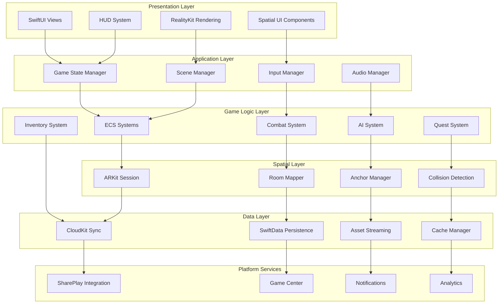

### Layer Dependency Matrix

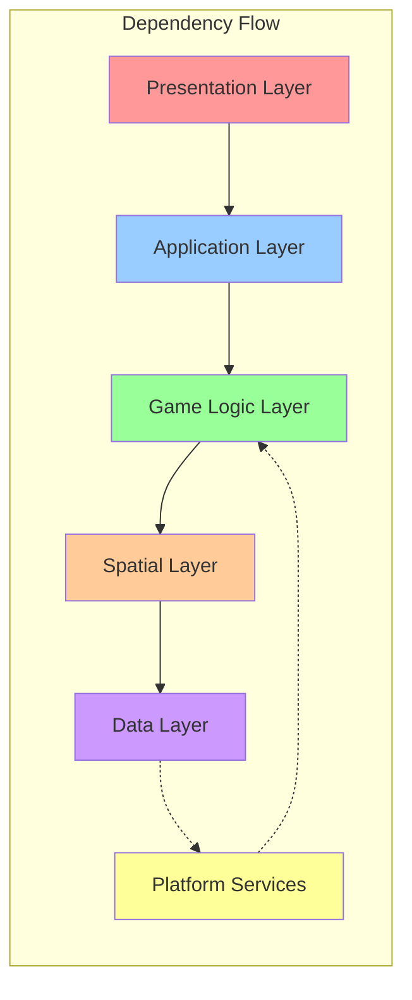

### Module Architecture

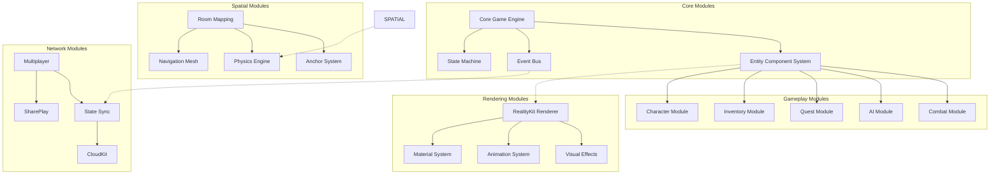

---

## Component Relationships

### Entity Component System Architecture

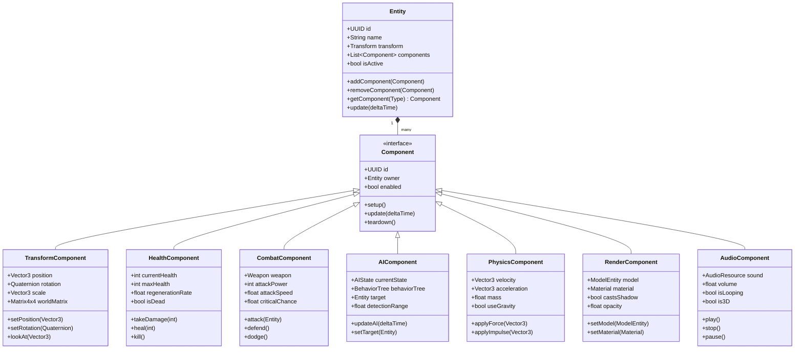

### System Execution Order

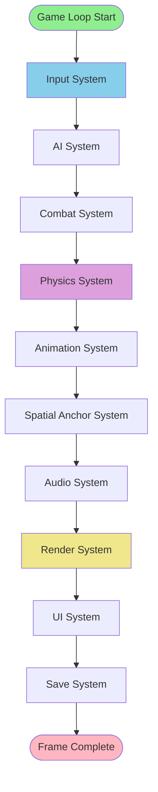

### Component Dependency Graph

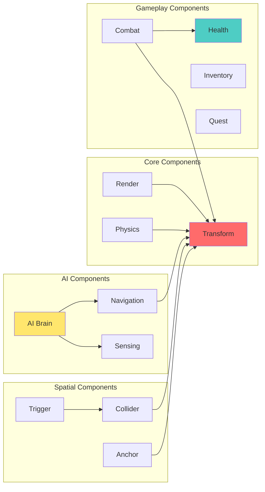

---

## Event Flow Diagrams

### Event Bus Architecture

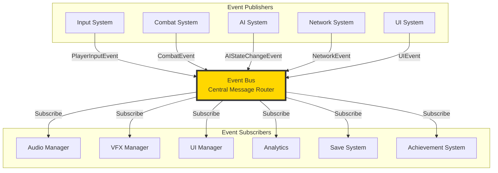

### Combat Event Flow

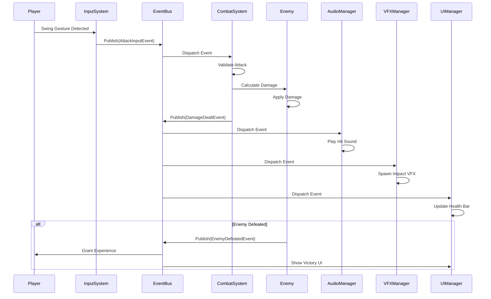

### Multiplayer Event Synchronization

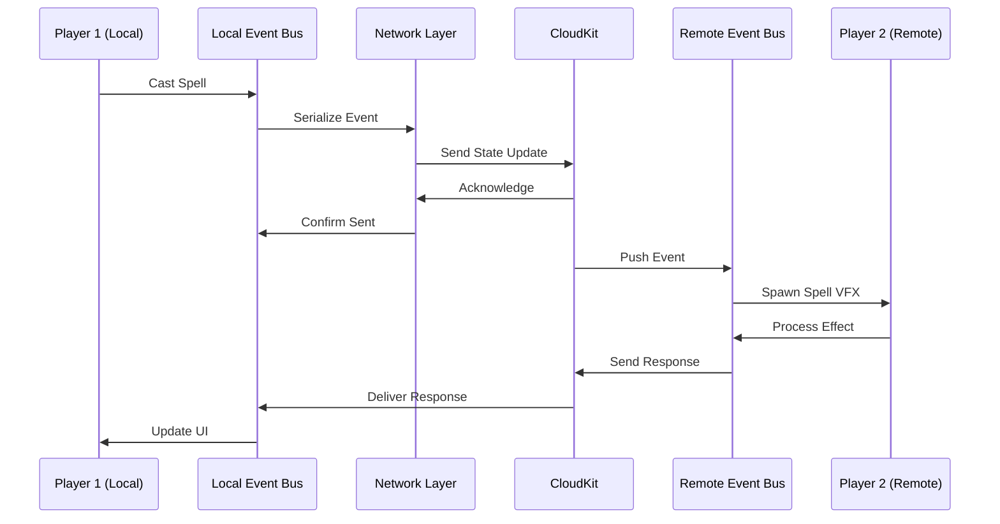

### Quest Event Chain

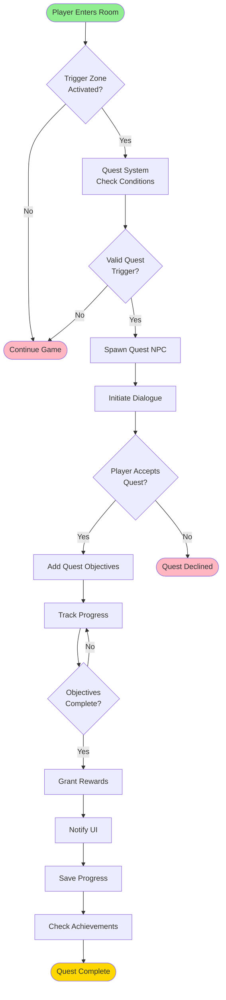

---

## State Machine Diagrams

### Game State Machine

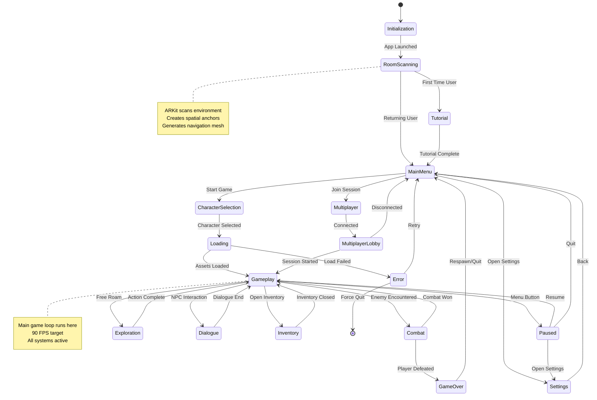

### Combat State Machine

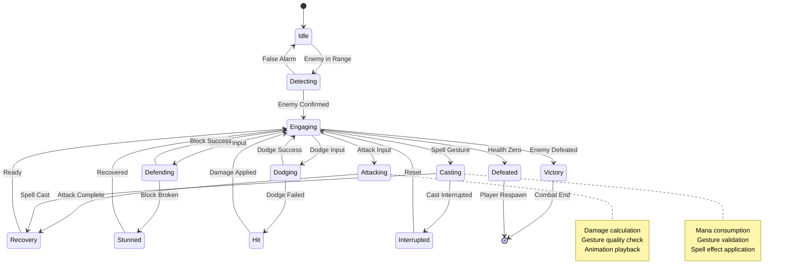

### AI State Machine

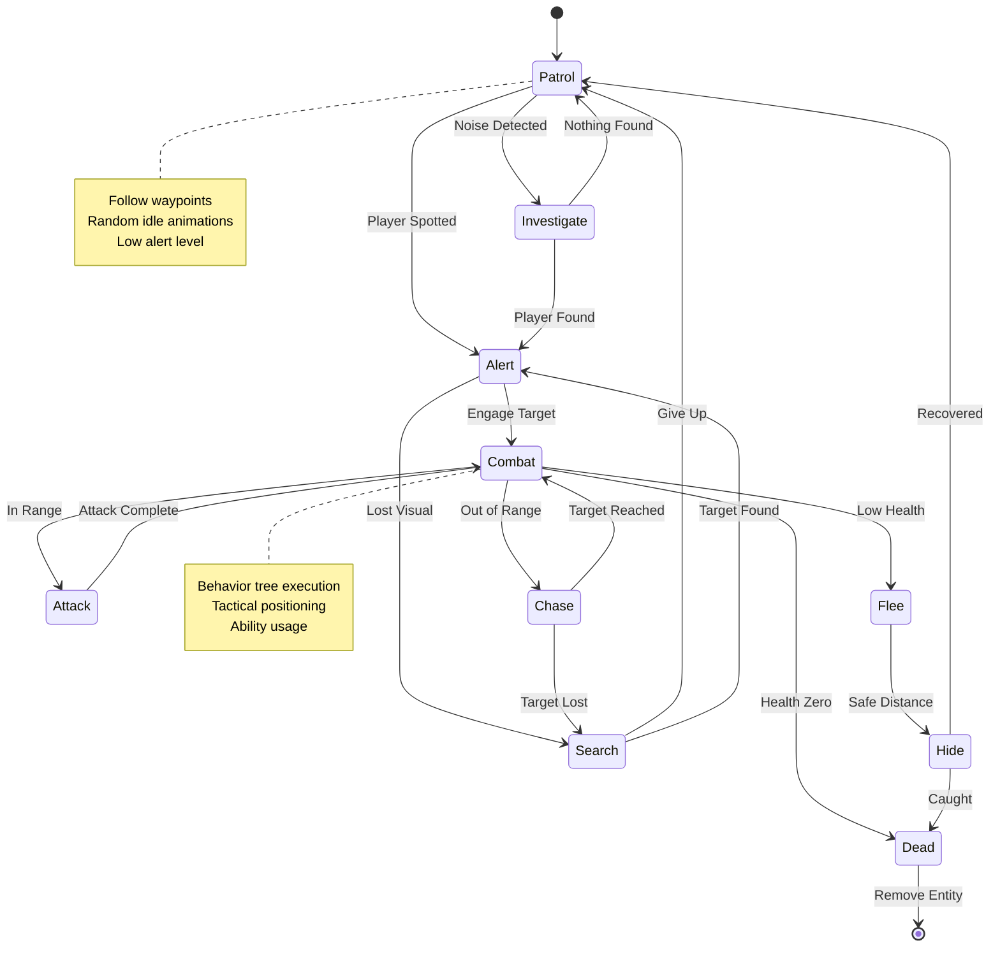

### Player State Machine

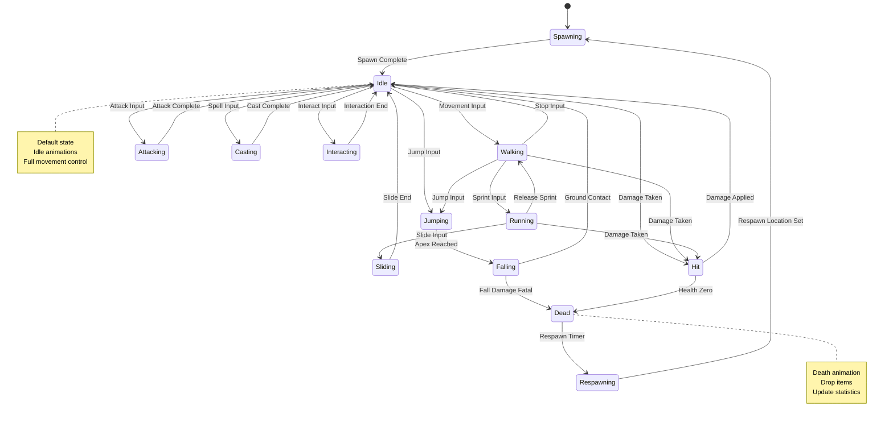

---

## Data Flow Architecture

### Save/Load Data Flow

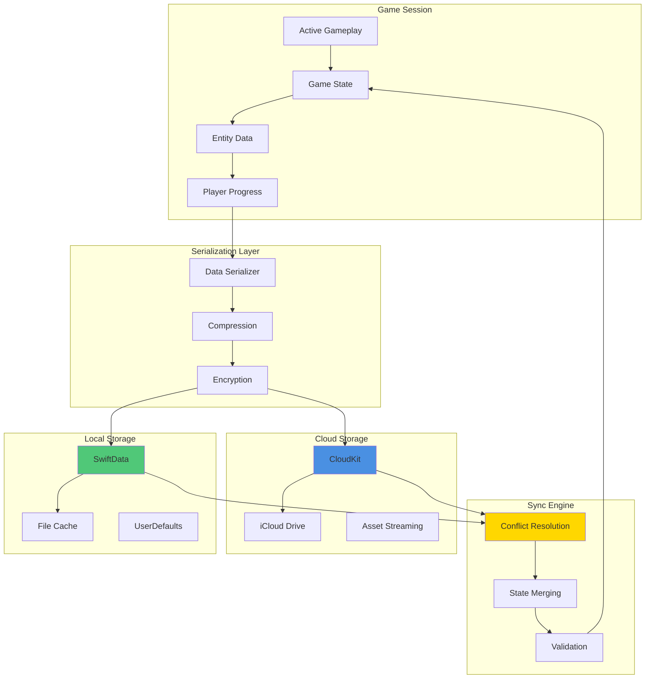

### Asset Loading Pipeline

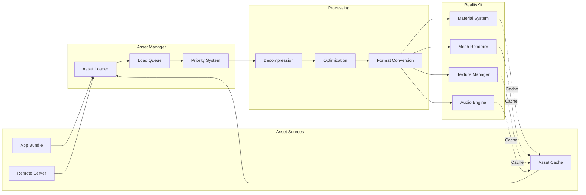

### Network Data Flow

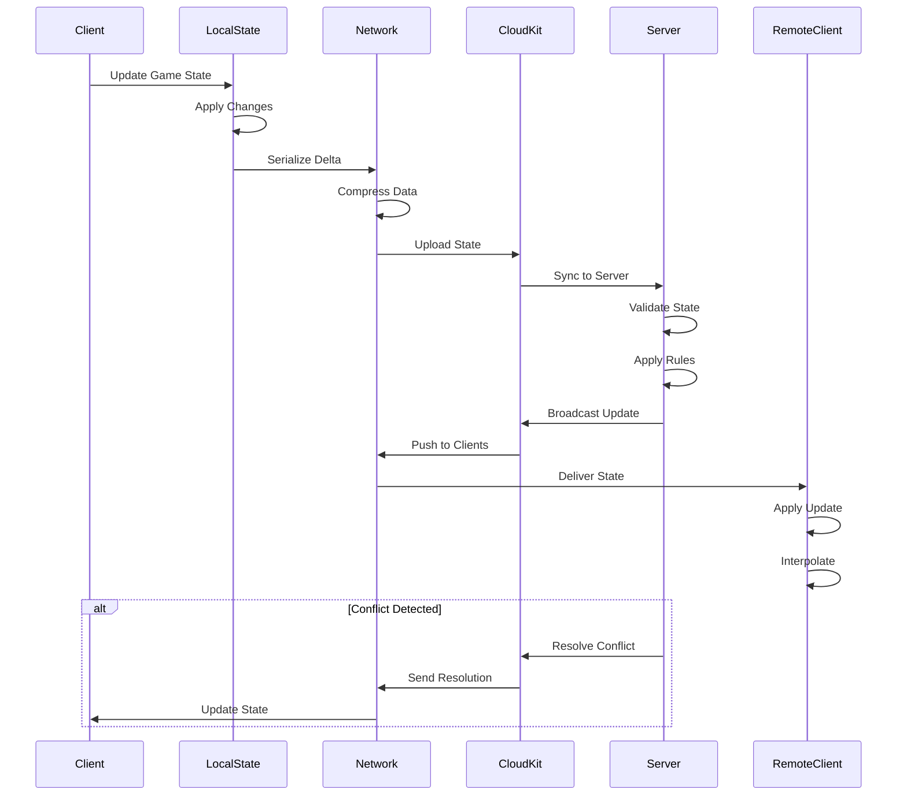

---

## RealityKit Component Hierarchy

### Entity Hierarchy Structure

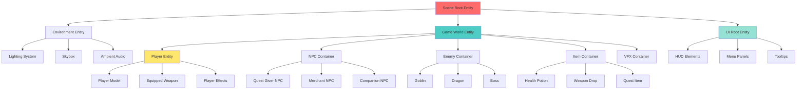

### Component Composition Examples

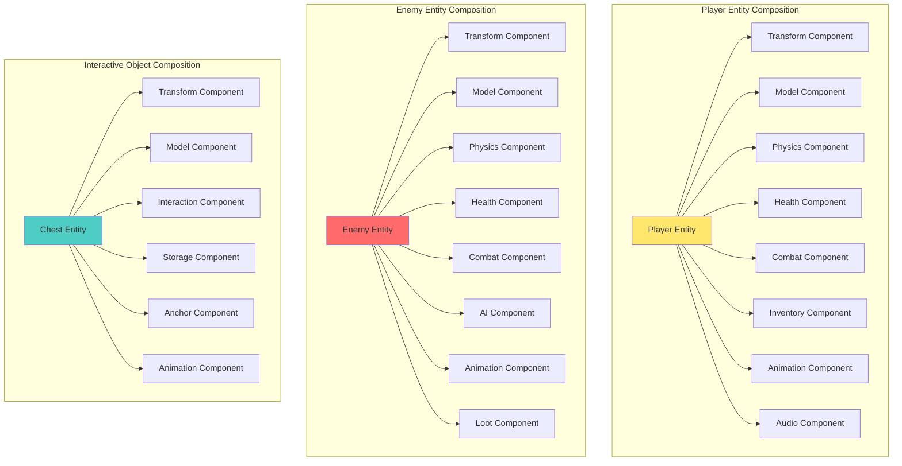

### RealityKit System Integration

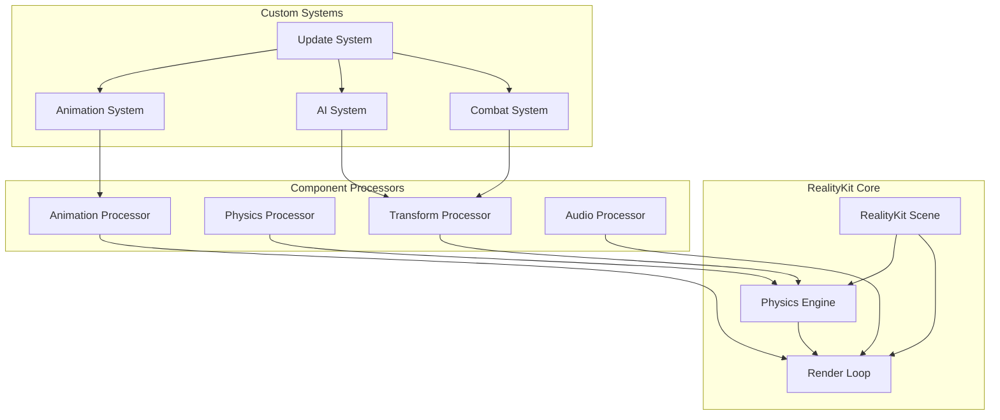

---

## Network Architecture

### Multiplayer Architecture

```mermaid
graph TB
    subgraph "Client Layer"
        C1[Client 1]
        C2[Client 2]
        C3[Client 3]
        C4[Client 4]
    end

    subgraph "Network Layer"
        SP[SharePlay Session]
        GC[Game Center]
        NM[Network Manager]
    end

    subgraph "Sync Layer"
        STATE_SYNC[State Synchronization]
        PRED[Client Prediction]
        RECON[Server Reconciliation]
        INTERP[Interpolation]
    end

    subgraph "Server Layer"
        AUTH[Authority Server]
        LOBBY[Lobby Manager]
        MATCH[Matchmaking]
    end

    subgraph "Cloud Services"
        CK[CloudKit]
        RELAY[Network Relay]
        STORE[Persistent Storage]
    end

    C1 --> SP
    C2 --> SP
    C3 --> SP
    C4 --> SP

    SP --> NM
    GC --> NM

    NM --> STATE_SYNC
    STATE_SYNC --> PRED
    STATE_SYNC --> RECON
    STATE_SYNC --> INTERP

    PRED --> AUTH
    RECON --> AUTH

    AUTH --> LOBBY
    LOBBY --> MATCH

    AUTH --> CK
    MATCH --> RELAY
    CK --> STORE

    style SP fill:#4A90E2
    style AUTH fill:#E94B3C
    style CK fill:#50C878
```

### State Synchronization Flow

```mermaid
sequenceDiagram
    participant C1 as Client 1
    participant Pred as Prediction
    participant Net as Network
    participant Auth as Authority
    participant C2 as Client 2

    C1->>Pred: Player Input
    Pred->>Pred: Predict Movement
    Pred->>C1: Update Local State

    C1->>Net: Send Input + Sequence
    Net->>Auth: Deliver Input

    Auth->>Auth: Process Input
    Auth->>Auth: Simulate Physics
    Auth->>Auth: Validate State

    Auth->>Net: Broadcast State + Sequence

    Net->>C1: Authoritative State
    C1->>C1: Reconcile Prediction

    Net->>C2: Remote Player State
    C2->>C2: Interpolate Movement
    C2->>C2: Update Display
```

### Lobby and Matchmaking

```mermaid
stateDiagram-v2
    [*] --> MainMenu

    MainMenu --> CreateLobby: Host Game
    MainMenu --> JoinLobby: Join Game
    MainMenu --> QuickMatch: Quick Match

    CreateLobby --> LobbyWaiting: Lobby Created
    JoinLobby --> LobbyList: Search Lobbies
    QuickMatch --> Matchmaking: Enter Queue

    LobbyList --> LobbyWaiting: Join Selected

    Matchmaking --> MatchFound: Players Found
    MatchFound --> LobbyWaiting: Join Match

    LobbyWaiting --> Ready: All Ready
    LobbyWaiting --> MainMenu: Leave

    Ready --> Loading: Start Game
    Loading --> InGame: Load Complete

    InGame --> Results: Game End
    Results --> MainMenu: Return

    note right of Matchmaking
        Skill-based matching
        Latency optimization
        Region filtering
    end note
```

---

## Spatial Computing Architecture

### Room Mapping Pipeline

```mermaid
graph TB
    START[Start AR Session] --> INIT[Initialize ARKit]
    INIT --> TRACK[World Tracking]
    TRACK --> SCAN[Scene Reconstruction]

    SCAN --> MESH[Generate Mesh Anchors]
    MESH --> PLANE[Detect Planes]
    PLANE --> FURNITURE[Identify Furniture]

    FURNITURE --> BOUNDS[Calculate Room Bounds]
    BOUNDS --> SAFE[Define Safe Play Area]
    SAFE --> NAV[Generate NavMesh]

    NAV --> SPAWN[Set Spawn Points]
    SPAWN --> ANCHOR[Create World Anchors]
    ANCHOR --> PERSIST[Persist to CloudKit]

    PERSIST --> COMPLETE[Mapping Complete]

    style START fill:#90EE90
    style COMPLETE fill:#FFD700
```

### Spatial Anchor System

```mermaid
graph TB
    subgraph "Anchor Types"
        WORLD[World Anchor]
        IMAGE[Image Anchor]
        PLANE_A[Plane Anchor]
        MESH_A[Mesh Anchor]
    end

    subgraph "Anchor Manager"
        CREATE[Create Anchor]
        UPDATE[Update Anchor]
        REMOVE[Remove Anchor]
        QUERY[Query Anchors]
    end

    subgraph "Persistence"
        LOCAL[Local Storage]
        CLOUD[CloudKit Sync]
        RESTORE[Anchor Restoration]
    end

    subgraph "Game Objects"
        NPC_ANCHOR[NPC Spawn Point]
        ITEM_ANCHOR[Item Location]
        PORTAL_ANCHOR[Portal Anchor]
        DEFENSE_ANCHOR[Defense Structure]
    end

    WORLD --> CREATE
    IMAGE --> CREATE
    PLANE_A --> CREATE
    MESH_A --> CREATE

    CREATE --> UPDATE
    UPDATE --> REMOVE
    UPDATE --> QUERY

    CREATE --> LOCAL
    LOCAL --> CLOUD
    CLOUD --> RESTORE

    RESTORE --> NPC_ANCHOR
    RESTORE --> ITEM_ANCHOR
    RESTORE --> PORTAL_ANCHOR
    RESTORE --> DEFENSE_ANCHOR
```

### Hand Tracking Integration

```mermaid
graph TB
    subgraph "Input Sources"
        HAND_L[Left Hand]
        HAND_R[Right Hand]
        EYE[Eye Tracking]
        HEAD[Head Pose]
    end

    subgraph "Gesture Recognition"
        POSE[Pose Detection]
        GESTURE[Gesture Analysis]
        PINCH[Pinch Detection]
        SWING[Swing Detection]
    end

    subgraph "Action Mapping"
        ATTACK[Attack Action]
        CAST[Spell Casting]
        INTERACT[Interaction]
        NAVIGATE[Navigation]
    end

    subgraph "Game Systems"
        COMBAT[Combat System]
        MAGIC[Magic System]
        UI_SYS[UI System]
        MOVEMENT[Movement System]
    end

    HAND_L --> POSE
    HAND_R --> POSE
    EYE --> GESTURE
    HEAD --> GESTURE

    POSE --> PINCH
    POSE --> SWING
    GESTURE --> PINCH
    GESTURE --> SWING

    SWING --> ATTACK
    PINCH --> CAST
    GESTURE --> INTERACT
    HEAD --> NAVIGATE

    ATTACK --> COMBAT
    CAST --> MAGIC
    INTERACT --> UI_SYS
    NAVIGATE --> MOVEMENT
```

---

## Performance Optimization Pipeline

### Rendering Optimization

```mermaid
graph TB
    subgraph "Visibility Culling"
        FRUSTUM[Frustum Culling]
        OCCLUSION[Occlusion Culling]
        DISTANCE[Distance Culling]
    end

    subgraph "LOD System"
        LOD0[LOD 0 - High Detail]
        LOD1[LOD 1 - Medium Detail]
        LOD2[LOD 2 - Low Detail]
        LOD3[LOD 3 - Billboard]
    end

    subgraph "Batching"
        STATIC[Static Batching]
        DYNAMIC[Dynamic Batching]
        INSTANCING[GPU Instancing]
    end

    subgraph "Quality Scaling"
        TEXTURE_Q[Texture Quality]
        SHADOW_Q[Shadow Quality]
        EFFECT_Q[Effect Quality]
        FPS_TARGET[FPS Monitoring]
    end

    FRUSTUM --> LOD0
    OCCLUSION --> LOD1
    DISTANCE --> LOD2
    DISTANCE --> LOD3

    LOD0 --> STATIC
    LOD1 --> DYNAMIC
    LOD2 --> INSTANCING

    STATIC --> TEXTURE_Q
    DYNAMIC --> SHADOW_Q
    INSTANCING --> EFFECT_Q

    FPS_TARGET --> TEXTURE_Q
    FPS_TARGET --> SHADOW_Q
    FPS_TARGET --> EFFECT_Q

    style FPS_TARGET fill:#E94B3C
    style LOD0 fill:#4A90E2
```

### Memory Management

```mermaid
graph TB
    subgraph "Memory Pools"
        ENTITY_POOL[Entity Pool]
        COMPONENT_POOL[Component Pool]
        PARTICLE_POOL[Particle Pool]
        AUDIO_POOL[Audio Pool]
    end

    subgraph "Asset Streaming"
        PRIORITY[Priority Queue]
        LOAD[Async Loading]
        UNLOAD[Auto Unload]
    end

    subgraph "Cache Management"
        TEXTURE_CACHE[Texture Cache]
        MESH_CACHE[Mesh Cache]
        AUDIO_CACHE[Audio Cache]
        LRU[LRU Eviction]
    end

    subgraph "Memory Monitoring"
        BUDGET[Memory Budget]
        WARNING[Warning Threshold]
        CRITICAL[Critical Threshold]
        CLEANUP[Emergency Cleanup]
    end

    ENTITY_POOL --> PRIORITY
    COMPONENT_POOL --> PRIORITY
    PARTICLE_POOL --> PRIORITY
    AUDIO_POOL --> PRIORITY

    PRIORITY --> LOAD
    LOAD --> UNLOAD

    LOAD --> TEXTURE_CACHE
    LOAD --> MESH_CACHE
    LOAD --> AUDIO_CACHE

    TEXTURE_CACHE --> LRU
    MESH_CACHE --> LRU
    AUDIO_CACHE --> LRU

    LRU --> BUDGET
    BUDGET --> WARNING
    WARNING --> CRITICAL
    CRITICAL --> CLEANUP

    style CRITICAL fill:#E94B3C
    style BUDGET fill:#50C878
```

### Frame Time Budget

```mermaid
graph LR
    FRAME[Frame Start<br/>11.1ms @ 90 FPS]

    INPUT[Input Processing<br/>0.5ms]
    PHYSICS[Physics Simulation<br/>2.0ms]
    GAME_LOGIC[Game Logic<br/>2.0ms]
    AI[AI Update<br/>1.5ms]
    ANIMATION[Animation<br/>1.0ms]
    RENDER[Rendering<br/>3.0ms]
    AUDIO[Audio<br/>0.5ms]
    OVERHEAD[System Overhead<br/>0.6ms]

    FRAME --> INPUT
    INPUT --> PHYSICS
    PHYSICS --> GAME_LOGIC
    GAME_LOGIC --> AI
    AI --> ANIMATION
    ANIMATION --> RENDER
    RENDER --> AUDIO
    AUDIO --> OVERHEAD
    OVERHEAD --> FRAME

    style FRAME fill:#FFD700
    style RENDER fill:#4A90E2
```

---

## Conclusion

These architecture diagrams provide a comprehensive visual reference for the Reality Realms RPG system design. Each diagram illustrates critical relationships, data flows, and system interactions that enable the game to function as a cohesive spatial computing experience.

### Key Architectural Principles

1. **Modularity**: Clear separation of concerns across layers
2. **Event-Driven**: Loose coupling through central event bus
3. **Spatial-First**: ARKit and RealityKit as foundational systems
4. **Performance-Focused**: 90 FPS target with dynamic scaling
5. **Persistence**: CloudKit sync for seamless cross-session experience
6. **Scalability**: Systems designed for future content expansion

### System Interdependencies

The architecture is designed to minimize tight coupling while maintaining efficient communication:

- **Presentation** depends on **Application** layer
- **Application** orchestrates **Game Logic**
- **Game Logic** utilizes **Spatial** capabilities
- **Spatial** persists through **Data** layer
- **Platform Services** integrate horizontally

### Performance Considerations

Every architectural decision prioritizes:
- **90 FPS** rendering on Vision Pro
- **<4GB** memory footprint
- **<2 second** scene load times
- **<100ms** network latency for multiplayer
- **Automatic quality scaling** to maintain performance

These diagrams serve as the blueprint for implementing, maintaining, and extending Reality Realms RPG's technical foundation.
