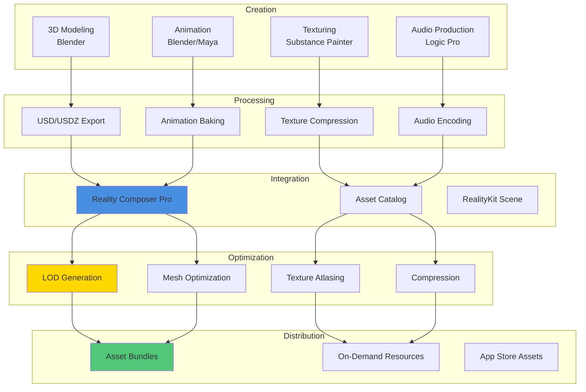
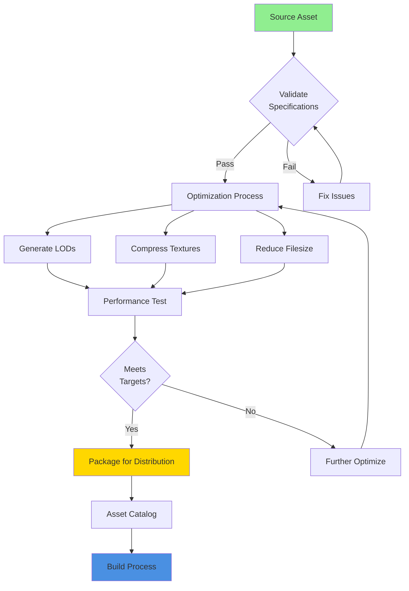

# Reality Realms RPG - Asset Pipeline Documentation

## Table of Contents
- [Asset Pipeline Overview](#asset-pipeline-overview)
- [3D Model Requirements](#3d-model-requirements)
- [Texture Specifications](#texture-specifications)
- [Audio File Formats](#audio-file-formats)
- [Asset Optimization](#asset-optimization)
- [Reality Composer Pro Workflow](#reality-composer-pro-workflow)
- [Asset Management](#asset-management)
- [Version Control](#version-control)
- [Testing and Quality Assurance](#testing-and-quality-assurance)

---

## Asset Pipeline Overview

Reality Realms RPG uses a streamlined asset pipeline optimized for visionOS and RealityKit, ensuring high visual quality while maintaining 90 FPS performance.

### Pipeline Architecture



### Asset Types

| Asset Type | Format | Max Size | LOD Levels | Compression |
|------------|--------|----------|------------|-------------|
| Characters | USDZ | 50MB | 3 | Yes |
| Enemies | USDZ | 30MB | 3 | Yes |
| Props | USDZ | 10MB | 2 | Yes |
| Environment | USDZ | 100MB | 3 | Yes |
| Weapons | USDZ | 5MB | 2 | Yes |
| VFX | USDZ | 20MB | 1 | Yes |
| UI | PNG/SVG | 2MB | 1 | Yes |

---

## 3D Model Requirements

### File Formats

**Primary Format**: USD (Universal Scene Description)
**Delivery Format**: USDZ (USD with ZIPcompression)
**Interchange Format**: FBX (for compatibility)

### Technical Specifications

```yaml
3D_Model_Specs:
  format: USDZ
  version: USD 23.05+

  geometry:
    polygon_type: triangles_only
    quads: convert_to_triangles

  optimization:
    max_vertices_lod0: 50000    # High detail
    max_vertices_lod1: 15000    # Medium detail
    max_vertices_lod2: 5000     # Low detail
    max_vertices_lod3: 1000     # Billboard/impostor

  materials:
    max_per_model: 5
    physically_based: required
    texture_channels:
      - baseColor
      - metallic
      - roughness
      - normal
      - occlusion
      - emissive (optional)

  rigging:
    max_bones: 75
    max_influences_per_vertex: 4
    skeleton_required: true (for animated models)

  naming_conventions:
    mesh: "mesh_name_lod0"
    material: "mat_name"
    texture: "tex_type_name_2k"
    bone: "bone_name"
```

### Mesh Guidelines

```swift
struct MeshRequirements {
    // Polygon Budget (LOD 0)
    static let characterPolygons = 40_000...50_000
    static let enemyPolygons = 20_000...30_000
    static let propPolygons = 1_000...10_000
    static let weaponPolygons = 3_000...5_000

    // Optimization Rules
    static let rules = [
        "No n-gons (>4 sides)",
        "No overlapping vertices",
        "Clean topology (edge loops)",
        "Proper UV unwrapping (no stretching)",
        "All normals facing outward",
        "Scale applied (1:1:1)",
        "Transforms frozen",
        "History deleted"
    ]

    // LOD Reduction Targets
    static func lodReduction(for level: Int) -> Float {
        switch level {
        case 0: return 1.0    // 100% - Full detail
        case 1: return 0.3    // 30% - Medium detail
        case 2: return 0.1    // 10% - Low detail
        case 3: return 0.02   // 2% - Billboard
        default: return 1.0
        }
    }
}
```

### USD Export Settings (Blender)

```python
# Blender USD Export Script
import bpy

def export_usdz(filepath, lod_level=0):
    # Export settings
    bpy.ops.wm.usdz_export(
        filepath=filepath,
        check_existing=False,
        # Geometry
        export_uvmaps=True,
        export_normals=True,
        export_materials='EXPORT',
        # Animation
        export_animation=True,
        export_hair=False,
        # Performance
        use_instancing=True,
        evaluation_mode='RENDER',
        # Materials
        generate_preview_surface=True,
        export_textures=True,
        overwrite_textures=True,
        # Optimization
        relative_paths=True
    )

# Export multiple LODs
for lod in range(4):
    filepath = f"character_goblin_lod{lod}.usdz"
    export_usdz(filepath, lod)
```

### Model Validation Checklist

- [ ] Correct scale (1 unit = 1 meter)
- [ ] Proper orientation (Y-up for RealityKit)
- [ ] Clean geometry (no overlaps, holes, or flipped normals)
- [ ] Optimized polygon count for LOD
- [ ] Valid UV coordinates (0-1 range)
- [ ] Materials assigned correctly
- [ ] Textures embedded or referenced correctly
- [ ] Proper naming conventions
- [ ] No unused vertices/edges
- [ ] Pivot point centered

---

## Texture Specifications

### Texture Requirements

```yaml
Texture_Specs:
  formats:
    - PNG (for source)
    - KTX2 (for delivery)
    - ASTC (GPU compression)

  resolutions:
    character_main: 2048x2048
    character_detail: 1024x1024
    prop_large: 1024x1024
    prop_small: 512x512
    environment: 4096x4096
    ui: 512x512
    vfx: 512x512

  channels:
    baseColor: RGB (sRGB)
    metallic: R (Linear)
    roughness: G (Linear)
    normal: RGB (Linear)
    occlusion: B (Linear)
    emissive: RGB (sRGB)
    opacity: A (Linear)

  compression:
    ios: ASTC 6x6
    macos: BC7
    quality: high

  mipmap: auto_generate
```

### PBR Texture Maps

```mermaid
graph TB
    subgraph "Base Color Map"
        BC[RGB Channels<br/>sRGB Color Space<br/>2048x2048]
    end

    subgraph "Metallic-Roughness-AO"
        MR[R: Metallic<br/>G: Roughness<br/>B: Ambient Occlusion<br/>Linear Color Space<br/>2048x2048]
    end

    subgraph "Normal Map"
        NM[RGB Channels<br/>OpenGL Format (+Y up)<br/>Linear Color Space<br/>2048x2048]
    end

    subgraph "Emissive Map (Optional)"
        EM[RGB Channels<br/>sRGB Color Space<br/>1024x1024]
    end

    BC --> COMBINED[Combined Material]
    MR --> COMBINED
    NM --> COMBINED
    EM --> COMBINED

    COMBINED --> RK[RealityKit Material]

    style BC fill:#E94B3C
    style MR fill:#4A90E2
    style NM fill:#9B59B6
    style EM fill:#FFD700
    style RK fill:#50C878
```

### Texture Optimization

```swift
struct TextureOptimizer {
    func optimizeTexture(
        _ texture: URL,
        targetResolution: Int = 2048,
        compressionQuality: Float = 0.9
    ) throws -> URL {
        // Load source texture
        guard let image = loadImage(from: texture) else {
            throw TextureError.loadFailed
        }

        // Resize if needed
        let resized = resize(image, to: targetResolution)

        // Generate mipmaps
        let withMipmaps = generateMipmaps(resized)

        // Compress to ASTC
        let compressed = compressToASTC(
            withMipmaps,
            quality: compressionQuality
        )

        // Save as KTX2
        let outputURL = texture
            .deletingPathExtension()
            .appendingPathExtension("ktx2")

        try compressed.write(to: outputURL)

        return outputURL
    }

    private func compressToASTC(
        _ image: Image,
        quality: Float
    ) -> Data {
        // ASTC 6x6 for best quality/size balance
        let blockSize = ASTC.BlockSize.sixBySix

        return ASTC.compress(
            image,
            blockSize: blockSize,
            quality: quality
        )
    }

    private func generateMipmaps(_ image: Image) -> Image {
        var mipmaps = [image]
        var current = image

        // Generate mipmaps down to 1x1
        while current.width > 1 || current.height > 1 {
            current = downsample(current, by: 0.5)
            mipmaps.append(current)
        }

        return combineIntoMipmapChain(mipmaps)
    }
}
```

### Texture Atlas Generation

```swift
struct TextureAtlasGenerator {
    func generateAtlas(
        from textures: [URL],
        maxSize: Int = 4096
    ) throws -> TextureAtlas {
        // Load all textures
        let images = try textures.map { try loadImage(from: $0) }

        // Pack using rectangle bin packing
        let packed = binPack(images, maxSize: maxSize)

        // Create atlas texture
        let atlas = createAtlasImage(from: packed, size: maxSize)

        // Generate UV coordinates
        let uvMappings = generateUVMappings(from: packed)

        return TextureAtlas(
            texture: atlas,
            uvMappings: uvMappings
        )
    }

    private func binPack(
        _ images: [Image],
        maxSize: Int
    ) -> [PackedRect] {
        // Implementation of rectangle bin packing algorithm
        // Returns array of rectangles with positions
        // Uses MaxRects or Shelf packing algorithm
        return MaxRectsAlgorithm.pack(images, maxSize: maxSize)
    }
}

struct TextureAtlas {
    let texture: Image
    let uvMappings: [String: CGRect] // Texture name -> UV rect
}
```

---

## Audio File Formats

### Audio Specifications

```yaml
Audio_Specs:
  formats:
    music: AAC (256 kbps)
    sfx: CAF (Apple Core Audio)
    dialogue: AAC (128 kbps)
    ambient: AAC (192 kbps)

  sample_rates:
    music: 48000 Hz
    sfx: 48000 Hz
    dialogue: 44100 Hz

  channels:
    music: Stereo
    sfx: Mono (for 3D positioning)
    dialogue: Mono
    ambient: Stereo/Spatial

  bit_depth: 16-bit minimum, 24-bit preferred

  spatial_audio:
    format: Dolby Atmos (Apple Spatial Audio)
    channels: Object-based, up to 128 objects
    head_tracking: enabled
```

### Audio Asset Types

| Type | Format | Bitrate | Spatial | Looping |
|------|--------|---------|---------|---------|
| Music | AAC | 256 kbps | No | Yes |
| Combat SFX | CAF | Lossless | Yes | No |
| Ambient | AAC | 192 kbps | Yes | Yes |
| UI Sounds | CAF | Lossless | No | No |
| Voice Lines | AAC | 128 kbps | Yes | No |
| Footsteps | CAF | Lossless | Yes | No |

### Audio Processing Pipeline

```swift
import AVFoundation

class AudioProcessor {
    func processAudioAsset(
        _ sourceURL: URL,
        assetType: AudioAssetType
    ) throws -> URL {
        let reader = try AVAssetReader(asset: AVAsset(url: sourceURL))
        let settings = audioSettings(for: assetType)

        // Apply audio processing
        let processed = try applyAudioProcessing(
            reader: reader,
            settings: settings
        )

        // Export with optimal settings
        let exportURL = try exportAudio(
            processed,
            format: assetType.format,
            quality: assetType.quality
        )

        return exportURL
    }

    private func audioSettings(
        for type: AudioAssetType
    ) -> [String: Any] {
        switch type {
        case .music:
            return [
                AVFormatIDKey: kAudioFormatMPEG4AAC,
                AVSampleRateKey: 48000,
                AVNumberOfChannelsKey: 2,
                AVEncoderBitRateKey: 256000
            ]

        case .sfx:
            return [
                AVFormatIDKey: kAudioFormatAppleLossless,
                AVSampleRateKey: 48000,
                AVNumberOfChannelsKey: 1
            ]

        case .dialogue:
            return [
                AVFormatIDKey: kAudioFormatMPEG4AAC,
                AVSampleRateKey: 44100,
                AVNumberOfChannelsKey: 1,
                AVEncoderBitRateKey: 128000
            ]

        default:
            return defaultSettings
        }
    }

    private func applyAudioProcessing(
        reader: AVAssetReader,
        settings: [String: Any]
    ) throws -> AVAudioPCMBuffer {
        // Normalization
        let normalized = normalizeAudio(reader)

        // Noise reduction (for dialogue)
        let cleaned = removeNoise(normalized)

        // Compression/limiting (prevent clipping)
        let limited = applyLimiter(cleaned)

        // EQ (frequency shaping)
        let equalized = applyEQ(limited)

        return equalized
    }
}

enum AudioAssetType {
    case music
    case sfx
    case dialogue
    case ambient
    case ui

    var format: AudioFormat {
        switch self {
        case .music, .dialogue, .ambient: return .aac
        case .sfx, .ui: return .caf
        }
    }

    var quality: AudioQuality {
        switch self {
        case .music: return .high
        case .sfx, .ui: return .lossless
        case .dialogue, .ambient: return .medium
        }
    }
}
```

### Spatial Audio Setup

```swift
import RealityKit
import AVFoundation

class SpatialAudioManager {
    func setupSpatialAudio(
        for entity: Entity,
        audioFile: URL
    ) throws {
        // Load audio resource
        let audioResource = try AudioFileResource.load(
            contentsOf: audioFile,
            options: .spatial
        )

        // Create audio playback component
        let audioComponent = AmbientAudioComponent(
            source: .file(audioResource),
            volume: 1.0,
            loop: false
        )

        // Add to entity
        entity.components[AmbientAudioComponent.self] = audioComponent

        // Configure spatial properties
        audioComponent.directivity = AudioDirectivity(
            pattern: .cone(innerAngle: 45, outerAngle: 180),
            sharpness: 0.7
        )

        audioComponent.reverbSendLevel = 0.3
    }
}
```

---

## Asset Optimization

### Automatic Optimization Pipeline



### LOD Generation

```swift
class LODGenerator {
    func generateLODs(for model: URL, levels: Int = 3) throws -> [URL] {
        var lods: [URL] = []

        for level in 0..<levels {
            let reduction = LODReduction.percentage(for: level)

            let lod = try generateLOD(
                from: model,
                reduction: reduction,
                level: level
            )

            lods.append(lod)
        }

        return lods
    }

    private func generateLOD(
        from model: URL,
        reduction: Float,
        level: Int
    ) throws -> URL {
        // Load model
        let scene = try ModelEntity.load(contentsOf: model)

        // Reduce polygon count
        let simplified = simplifyMesh(
            scene,
            targetReduction: reduction
        )

        // Optimize materials for LOD level
        optimizeMaterialsForLOD(simplified, level: level)

        // Export
        let outputURL = model
            .deletingPathExtension()
            .appendingPathComponent("_lod\(level)")
            .appendingPathExtension("usdz")

        try simplified.write(to: outputURL)

        return outputURL
    }

    private func simplifyMesh(
        _ entity: ModelEntity,
        targetReduction: Float
    ) -> ModelEntity {
        // Quadric Edge Collapse Decimation
        // or other mesh simplification algorithm
        // Preserve UV coordinates and normals

        guard var mesh = entity.model?.mesh else {
            return entity
        }

        let targetVertices = Int(
            Float(mesh.contents.models[0].parts[0].positions.count)
            * (1.0 - targetReduction)
        )

        mesh = decimateMesh(mesh, targetVertexCount: targetVertices)

        entity.model?.mesh = mesh

        return entity
    }
}

enum LODReduction {
    static func percentage(for level: Int) -> Float {
        switch level {
        case 0: return 0.0   // Original
        case 1: return 0.7   // 70% reduction
        case 2: return 0.9   // 90% reduction
        case 3: return 0.98  // 98% reduction (billboard)
        default: return 0.0
        }
    }
}
```

### Compression Strategies

| Asset Type | Compression Method | Size Reduction | Quality Loss |
|------------|-------------------|----------------|--------------|
| Textures | ASTC 6x6 | 70-80% | Minimal |
| Meshes | Vertex quantization | 30-40% | None |
| Animations | Keyframe reduction | 50-60% | Minimal |
| Audio | AAC encoding | 80-90% | Minimal |
| Materials | Shared textures | 40-50% | None |

---

## Reality Composer Pro Workflow

### Project Structure

```
RealityRealms.rkproject/
├── Scenes/
│   ├── Characters/
│   │   ├── Player.usda
│   │   └── Enemies/
│   ├── Environment/
│   │   ├── Forest.usda
│   │   └── Dungeon.usda
│   ├── Props/
│   │   ├── Weapons.usda
│   │   └── Items.usda
│   └── VFX/
│       ├── SpellEffects.usda
│       └── CombatEffects.usda
├── Materials/
│   ├── Character_Materials/
│   ├── Environment_Materials/
│   └── VFX_Materials/
├── Textures/
│   ├── BaseColor/
│   ├── Normal/
│   ├── MetallicRoughness/
│   └── Emissive/
└── Audio/
    ├── Music/
    ├── SFX/
    └── Dialogue/
```

### Scene Setup

```swift
// Reality Composer Pro scene configuration
import RealityKit

class SceneBuilder {
    func createCharacterScene() async throws -> Entity {
        // Load base scene from Reality Composer Pro
        let scene = try await Entity.load(named: "Characters/Player")

        // Configure components
        configureCharacterComponents(scene)

        // Setup animations
        setupAnimations(scene)

        // Configure materials
        configureMaterials(scene)

        return scene
    }

    private func configureCharacterComponents(_ entity: Entity) {
        // Add gameplay components
        entity.components[HealthComponent.self] = HealthComponent(
            maxHealth: 100
        )

        entity.components[CombatComponent.self] = CombatComponent(
            attackPower: 25,
            attackSpeed: 1.5
        )

        // Physics component
        entity.components[PhysicsBodyComponent.self] = PhysicsBodyComponent(
            shapes: [.generateConvex(from: entity.model!.mesh)],
            mass: 70.0,
            mode: .dynamic
        )

        // Collision component
        entity.components[CollisionComponent.self] = CollisionComponent(
            shapes: [.generateConvex(from: entity.model!.mesh)]
        )
    }

    private func setupAnimations(_ entity: Entity) {
        // Load animation resources
        let animations: [String: AnimationResource] = [
            "idle": loadAnimation("character_idle"),
            "walk": loadAnimation("character_walk"),
            "run": loadAnimation("character_run"),
            "attack": loadAnimation("character_attack"),
            "death": loadAnimation("character_death")
        ]

        // Create animation controller
        let controller = AnimationController(animations: animations)
        entity.components[AnimationController.self] = controller
    }
}
```

---

## Asset Management

### Asset Catalog Organization

```
Assets.xcassets/
├── Characters/
│   ├── Player.imageset/
│   └── Enemies.dataset/
├── Environment/
│   ├── Textures.imageset/
│   └── Models.dataset/
├── UI/
│   ├── Icons.imageset/
│   ├── Buttons.imageset/
│   └── HUD.imageset/
├── Audio/
│   ├── Music.dataset/
│   ├── SFX.dataset/
│   └── Dialogue.dataset/
└── Colors/
    └── ColorSets/
```

### On-Demand Resources

```swift
import Foundation

class AssetDownloader {
    func downloadAsset(
        tag: String,
        priority: Float = NSBundleResourceRequestLoadingPriorityUrgent
    ) async throws {
        let request = NSBundleResourceRequest(tags: [tag])
        request.loadingPriority = priority

        // Begin downloading
        try await request.beginAccessingResources()

        // Asset is now available
        print("Asset '\(tag)' downloaded and ready")
    }

    func preloadAssets(tags: [String]) async {
        // Preload assets in background
        for tag in tags {
            try? await downloadAsset(tag, priority: 0.5)
        }
    }

    func releaseAsset(tag: String) {
        let request = NSBundleResourceRequest(tags: [tag])
        request.endAccessingResources()
    }
}

// Usage
let downloader = AssetDownloader()

// Download specific level assets
try await downloader.downloadAsset(tag: "level_1_environment")
try await downloader.downloadAsset(tag: "level_1_enemies")

// Preload next level in background
await downloader.preloadAssets(tags: ["level_2_environment", "level_2_enemies"])
```

---

## Version Control

### Git LFS Setup

```bash
# .gitattributes
*.usdz filter=lfs diff=lfs merge=lfs -text
*.png filter=lfs diff=lfs merge=lfs -text
*.jpg filter=lfs diff=lfs merge=lfs -text
*.ktx2 filter=lfs diff=lfs merge=lfs -text
*.aac filter=lfs diff=lfs merge=lfs -text
*.caf filter=lfs diff=lfs merge=lfs -text
*.mp3 filter=lfs diff=lfs merge=lfs -text
*.fbx filter=lfs diff=lfs merge=lfs -text
*.blend filter=lfs diff=lfs merge=lfs -text
```

### Asset Version Tracking

```yaml
# asset_manifest.yml
version: 1.2.0
assets:
  characters:
    goblin:
      version: 1.3.0
      files:
        - goblin_lod0.usdz
        - goblin_lod1.usdz
        - goblin_lod2.usdz
      textures:
        - goblin_basecolor_2k.ktx2
        - goblin_normal_2k.ktx2
      last_updated: 2025-11-15

  environments:
    forest:
      version: 2.1.0
      files:
        - forest_terrain.usdz
        - forest_props.usdz
      last_updated: 2025-11-18
```

---

## Testing and Quality Assurance

### Asset Validation Pipeline

```swift
class AssetValidator {
    struct ValidationResult {
        let passed: Bool
        let errors: [String]
        let warnings: [String]
    }

    func validate(_ asset: URL) -> ValidationResult {
        var errors: [String] = []
        var warnings: [String] = []

        // Check file format
        if !isValidFormat(asset) {
            errors.append("Invalid file format")
        }

        // Check file size
        let size = asset.fileSize
        if size > maxFileSize(for: asset) {
            errors.append("File size exceeds maximum: \(size) bytes")
        }

        // Check polygon count (for 3D models)
        if asset.isModel {
            let polyCount = getPolygonCount(asset)
            if polyCount > maxPolygons {
                warnings.append("High polygon count: \(polyCount)")
            }
        }

        // Check texture resolution
        if asset.isTexture {
            let resolution = getTextureResolution(asset)
            if !isPowerOfTwo(resolution) {
                warnings.append("Texture resolution not power of 2")
            }
        }

        // Check naming conventions
        if !followsNamingConvention(asset) {
            warnings.append("Non-standard naming convention")
        }

        return ValidationResult(
            passed: errors.isEmpty,
            errors: errors,
            warnings: warnings
        )
    }
}
```

### Performance Testing

```swift
class AssetPerformanceTester {
    func testAssetPerformance(_ asset: URL) async -> PerformanceMetrics {
        let startTime = Date()

        // Load asset
        let loadStart = Date()
        let entity = try? await Entity.load(contentsOf: asset)
        let loadTime = Date().timeIntervalSince(loadStart)

        // Measure memory usage
        let memoryBefore = getMemoryUsage()
        // Keep asset loaded
        let memoryAfter = getMemoryUsage()
        let memoryUsage = memoryAfter - memoryBefore

        // Measure render performance
        let renderMetrics = await testRenderPerformance(entity)

        return PerformanceMetrics(
            loadTime: loadTime,
            memoryUsage: memoryUsage,
            averageFPS: renderMetrics.averageFPS,
            polyCount: entity?.polyCount ?? 0
        )
    }

    private func testRenderPerformance(
        _ entity: Entity?
    ) async -> RenderMetrics {
        guard let entity = entity else {
            return RenderMetrics.empty
        }

        // Add to scene and measure FPS
        let fpssamples = await measureFPS(with: entity, duration: 5.0)

        return RenderMetrics(
            averageFPS: fpssamples.average(),
            minFPS: fpssamples.min() ?? 0,
            maxFPS: fpssamples.max() ?? 0
        )
    }
}

struct PerformanceMetrics {
    let loadTime: TimeInterval
    let memoryUsage: UInt64
    let averageFPS: Float
    let polyCount: Int

    var meetsRequirements: Bool {
        return loadTime < 2.0 &&
               memoryUsage < 100_000_000 && // 100 MB
               averageFPS >= 85.0
    }
}
```

---

## Conclusion

The Reality Realms RPG asset pipeline ensures high-quality assets optimized for visionOS performance while maintaining visual fidelity. By following these guidelines, all assets will integrate seamlessly into the game and deliver an exceptional player experience.

### Asset Pipeline Checklist

- [x] USD/USDZ workflow established
- [x] PBR material pipeline defined
- [x] LOD generation automated
- [x] Texture compression optimized
- [x] Audio processing standardized
- [x] Reality Composer Pro integration
- [x] Asset validation automated
- [x] Performance testing implemented
- [x] Version control with Git LFS
- [x] On-demand resource strategy

### Performance Targets

- Load time: <2s for characters, <5s for environments
- Memory usage: <100MB per character asset
- Polygon budget: <50K per character (LOD0)
- Texture memory: <50MB per material set
- Consistent 90 FPS on Vision Pro

Reality Realms RPG: Beautiful, optimized, and performant.
