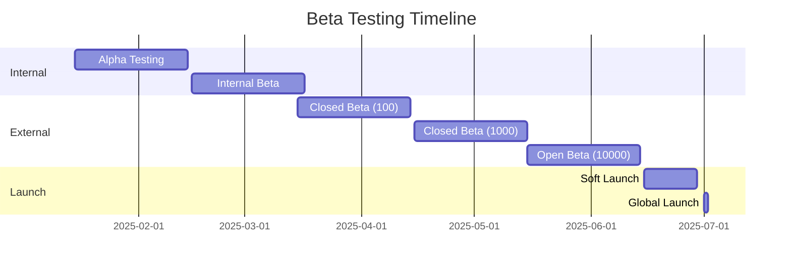
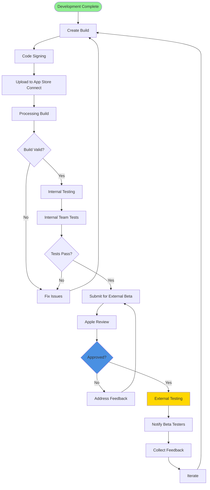
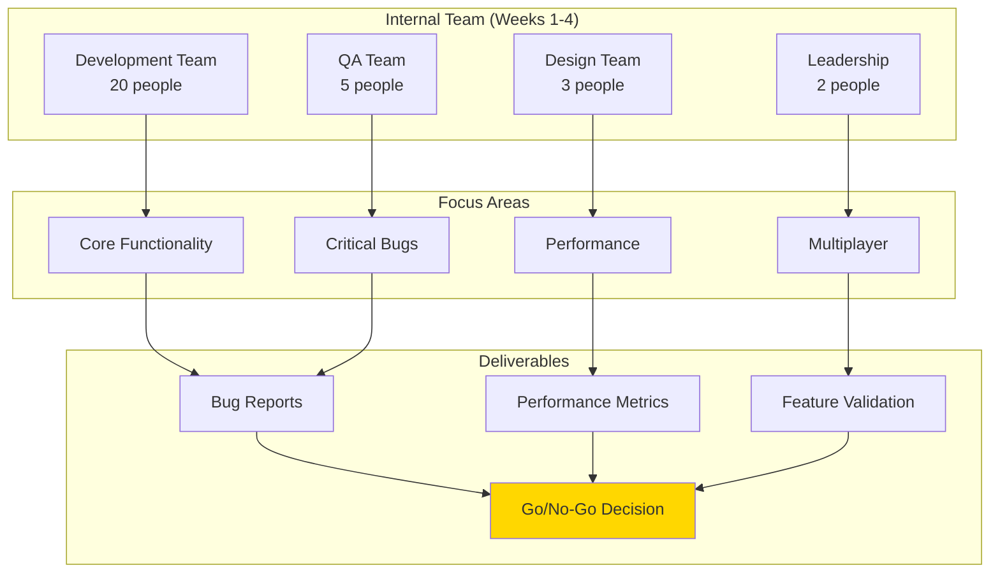
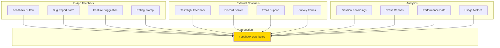
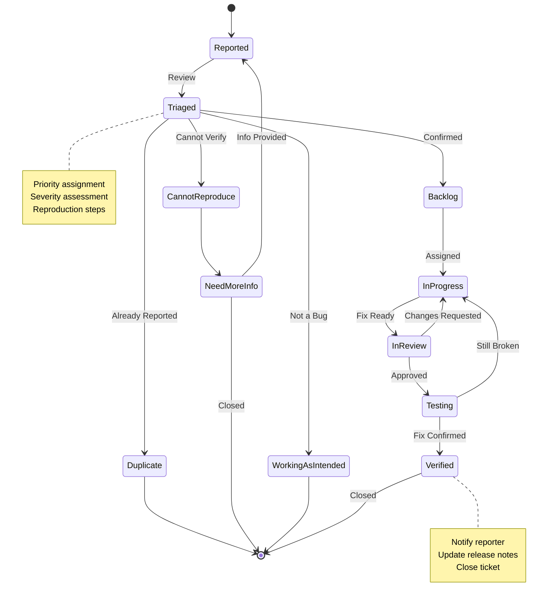
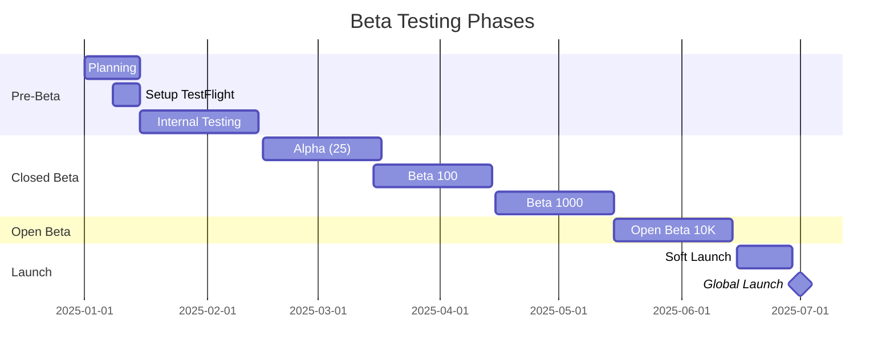
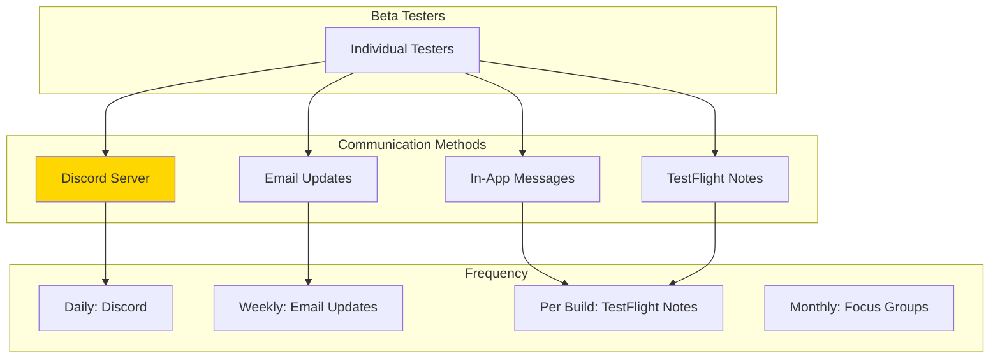
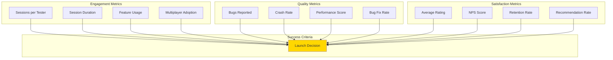

# Reality Realms RPG - Beta Testing Guide

## Table of Contents
- [Beta Program Overview](#beta-program-overview)
- [TestFlight Setup](#testflight-setup)
- [Internal vs External Testing](#internal-vs-external-testing)
- [Feedback Collection](#feedback-collection)
- [Bug Reporting Process](#bug-reporting-process)
- [Beta Tester Onboarding](#beta-tester-onboarding)
- [Beta Phases](#beta-phases)
- [Communication Strategy](#communication-strategy)
- [Metrics and Success Criteria](#metrics-and-success-criteria)

---

## Beta Program Overview

Reality Realms RPG uses a phased beta testing approach to ensure quality, gather feedback, and build community before launch.

### Beta Goals

1. **Quality Assurance**: Identify and fix bugs before release
2. **Performance Testing**: Validate performance across different environments
3. **User Feedback**: Gather insights on gameplay and features
4. **Community Building**: Engage early adopters and create advocates
5. **Load Testing**: Test multiplayer and server infrastructure
6. **Localization Verification**: Validate translations and cultural adaptations

### Beta Timeline



---

## TestFlight Setup

### TestFlight Configuration

```yaml
TestFlight_Setup:
  app_name: "Reality Realms RPG"
  bundle_id: "com.realityrealms.rpg"

  internal_testing:
    max_testers: 100
    distribution: App Store Connect Users
    automatic_distribution: true

  external_testing:
    max_testers: 10000
    submission_required: true
    review_time: "24-48 hours"

  build_settings:
    automatic_upload: true
    version_increment: automatic
    build_expiration: 90_days

  privacy:
    data_collection_notice: required
    export_compliance: required
```

### Build Distribution Process



### TestFlight Groups

```swift
enum BetaGroup {
    case internalTeam        // Developers, QA
    case alphaTesters        // 25 early access users
    case closedBeta100       // 100 selected users
    case closedBeta1000      // 1000 community members
    case openBeta            // Up to 10,000 users

    var maxSize: Int {
        switch self {
        case .internalTeam: return 25
        case .alphaTesters: return 25
        case .closedBeta100: return 100
        case .closedBeta1000: return 1000
        case .openBeta: return 10000
        }
    }

    var accessCriteria: String {
        switch self {
        case .internalTeam:
            return "Company employees and contractors"
        case .alphaTesters:
            return "Influencers and VIP community members"
        case .closedBeta100:
            return "First 100 sign-ups with Vision Pro"
        case .closedBeta1000:
            return "Active community members, diverse demographics"
        case .openBeta:
            return "Public sign-up, first come first served"
        }
    }
}
```

---

## Internal vs External Testing

### Internal Testing Phase



### External Testing Phases

#### Phase 1: Alpha (25 Testers)

- **Duration**: 4 weeks
- **Focus**: Core gameplay loop, major features
- **Requirements**:
  - Vision Pro owners
  - Influencers/content creators
  - High engagement commitment
  - NDA signed
- **Success Criteria**:
  - 80%+ feature completion feedback
  - <5 critical bugs
  - 4+ star average rating

#### Phase 2: Closed Beta 100 (100 Testers)

- **Duration**: 4 weeks
- **Focus**: Broader gameplay testing, localization, multiplayer
- **Requirements**:
  - Vision Pro owners
  - Diverse demographics
  - Regular feedback
- **Success Criteria**:
  - 90%+ feature completion feedback
  - <10 high priority bugs
  - 4.2+ star average rating
  - 70%+ Day 7 retention

#### Phase 3: Closed Beta 1000 (1000 Testers)

- **Duration**: 4 weeks
- **Focus**: Scale testing, performance, edge cases
- **Requirements**:
  - Active community members
  - Diverse play styles
  - Different room configurations
- **Success Criteria**:
  - 95%+ feature completion
  - <20 high priority bugs
  - 4.3+ star average rating
  - 75%+ Day 7 retention
  - <0.5% crash rate

#### Phase 4: Open Beta (10,000 Testers)

- **Duration**: 4 weeks
- **Focus**: Final polish, server load, real-world usage
- **Requirements**:
  - Open to public
  - Vision Pro device
- **Success Criteria**:
  - <50 high priority bugs
  - 4.5+ star average rating
  - 80%+ Day 7 retention
  - <0.1% crash rate
  - 99.9% server uptime

---

## Feedback Collection

### Feedback Channels



### In-App Feedback System

```swift
struct FeedbackView: View {
    @State private var feedbackType: FeedbackType = .bug
    @State private var description: String = ""
    @State private var rating: Int = 5
    @State private var attachScreenshot: Bool = true
    @State private var contactEmail: String = ""

    enum FeedbackType: String, CaseIterable {
        case bug = "Bug Report"
        case feature = "Feature Request"
        case improvement = "Improvement Suggestion"
        case general = "General Feedback"
        case compliment = "Compliment"
    }

    var body: some View {
        Form {
            Section("Feedback Type") {
                Picker("Type", selection: $feedbackType) {
                    ForEach(FeedbackType.allCases, id: \.self) { type in
                        Text(type.rawValue)
                    }
                }
            }

            Section("Details") {
                TextEditor(text: $description)
                    .frame(minHeight: 100)
                    .overlay(
                        Text("Describe your feedback...")
                            .foregroundColor(.gray)
                            .opacity(description.isEmpty ? 1 : 0)
                    )
            }

            if feedbackType == .bug || feedbackType == .improvement {
                Section("Additional Information") {
                    HStack {
                        Text("Rating")
                        Spacer()
                        ForEach(1...5, id: \.self) { star in
                            Image(systemName: star <= rating ? "star.fill" : "star")
                                .foregroundColor(.yellow)
                                .onTapGesture {
                                    rating = star
                                }
                        }
                    }

                    Toggle("Attach Screenshot", isOn: $attachScreenshot)
                }
            }

            Section("Contact (Optional)") {
                TextField("Email", text: $contactEmail)
                    .keyboardType(.emailAddress)
            }

            Section {
                Button("Submit Feedback") {
                    submitFeedback()
                }
            }
        }
        .navigationTitle("Send Feedback")
    }

    func submitFeedback() {
        let feedback = UserFeedback(
            type: feedbackType,
            description: description,
            rating: rating,
            screenshot: attachScreenshot ? captureScreenshot() : nil,
            contactEmail: contactEmail.isEmpty ? nil : contactEmail,
            systemInfo: SystemInfo.current(),
            timestamp: Date()
        )

        FeedbackManager.shared.submit(feedback)
    }
}

struct UserFeedback {
    let type: FeedbackView.FeedbackType
    let description: String
    let rating: Int
    let screenshot: UIImage?
    let contactEmail: String?
    let systemInfo: SystemInfo
    let timestamp: Date
}

struct SystemInfo {
    let appVersion: String
    let osVersion: String
    let deviceModel: String
    let roomConfiguration: String
    let playerLevel: Int
    let sessionDuration: TimeInterval

    static func current() -> SystemInfo {
        // Collect current system information
        return SystemInfo(
            appVersion: Bundle.main.infoDictionary?["CFBundleShortVersionString"] as? String ?? "Unknown",
            osVersion: ProcessInfo.processInfo.operatingSystemVersionString,
            deviceModel: "Apple Vision Pro",
            roomConfiguration: RoomMapper.shared.currentRoomConfiguration,
            playerLevel: GameState.shared.player.level,
            sessionDuration: SessionManager.shared.currentSessionDuration
        )
    }
}
```

### Weekly Surveys

```swift
struct WeeklySurvey {
    static let questions = [
        Question(
            id: "overall_satisfaction",
            text: "How satisfied are you with Reality Realms RPG?",
            type: .scale(1...5),
            required: true
        ),
        Question(
            id: "gameplay_fun",
            text: "How fun is the gameplay?",
            type: .scale(1...5),
            required: true
        ),
        Question(
            id: "performance",
            text: "How would you rate the game performance?",
            type: .scale(1...5),
            required: true
        ),
        Question(
            id: "controls",
            text: "How intuitive are the controls?",
            type: .scale(1...5),
            required: true
        ),
        Question(
            id: "bugs_encountered",
            text: "Did you encounter any bugs this week?",
            type: .yesNo,
            required: true
        ),
        Question(
            id: "favorite_feature",
            text: "What's your favorite feature?",
            type: .openEnded,
            required: false
        ),
        Question(
            id: "improvement_area",
            text: "What needs the most improvement?",
            type: .openEnded,
            required: false
        ),
        Question(
            id: "recommend_likelihood",
            text: "How likely are you to recommend this game? (NPS)",
            type: .scale(0...10),
            required: true
        )
    ]

    struct Question {
        let id: String
        let text: String
        let type: QuestionType
        let required: Bool

        enum QuestionType {
            case scale(ClosedRange<Int>)
            case yesNo
            case multipleChoice([String])
            case openEnded
        }
    }
}
```

---

## Bug Reporting Process

### Bug Report Template

```markdown
# Bug Report

## Summary
Brief description of the bug

## Steps to Reproduce
1. Step one
2. Step two
3. Step three

## Expected Behavior
What should happen

## Actual Behavior
What actually happens

## Frequency
- [ ] Always
- [ ] Often
- [ ] Sometimes
- [ ] Rare
- [ ] Once

## Severity
- [ ] Critical (Game Unplayable)
- [ ] High (Major Feature Broken)
- [ ] Medium (Minor Feature Issue)
- [ ] Low (Cosmetic/Polish)

## System Information
- App Version: 1.0.0 (123)
- visionOS Version: 2.2
- Device: Apple Vision Pro
- Play Area: 3m x 4m

## Additional Context
Screenshots, videos, or other relevant information

## Impact
How does this affect your gameplay experience?
```

### Bug Tracking Workflow



### Bug Priority Matrix

| Severity | Frequency | Priority | Response Time |
|----------|-----------|----------|---------------|
| Critical | Always | P0 | Immediate |
| Critical | Often | P0 | 1 hour |
| Critical | Sometimes | P1 | 4 hours |
| High | Always | P1 | 4 hours |
| High | Often | P1 | 1 day |
| High | Sometimes | P2 | 3 days |
| Medium | Always | P2 | 3 days |
| Medium | Often | P2 | 1 week |
| Low | Any | P3 | Best effort |

---

## Beta Tester Onboarding

### Welcome Email

```
Subject: Welcome to Reality Realms RPG Beta! 🎮

Hi [Name],

Welcome to the Reality Realms RPG beta program! We're excited to have you join us on this journey to create the best spatial RPG experience on Vision Pro.

As a beta tester, you'll get:
✓ Early access to new features
✓ Direct line to the development team
✓ Exclusive beta tester rewards
✓ Opportunity to shape the game

## Getting Started

1. Install TestFlight (if you haven't already)
2. Accept the beta invitation
3. Install Reality Realms RPG
4. Join our Discord server: [link]
5. Complete the welcome survey

## What We Need From You

- Play the game regularly (goal: 3+ sessions per week)
- Report bugs you encounter
- Provide feedback on features
- Complete weekly surveys
- Participate in Discord discussions

## Important Dates

- Beta Start: [Date]
- Weekly Surveys: Every Friday
- Focus Group Call: [Date] (Optional)
- Beta End: [Date]

## Resources

- Discord Server: [link]
- Bug Report Form: [link]
- Feedback Portal: [link]
- FAQ: [link]

Questions? Reply to this email or reach out on Discord.

Happy gaming!
The Reality Realms Team
```

### Onboarding Checklist

- [ ] Send welcome email
- [ ] Add to TestFlight
- [ ] Add to Discord server
- [ ] Send welcome survey
- [ ] Assign tester ID
- [ ] Enable analytics for tester
- [ ] Send weekly update schedule
- [ ] Provide feedback guidelines
- [ ] Share known issues list
- [ ] Schedule check-in (Week 1)

---

## Beta Phases

### Phase Timeline



### Phase Objectives

| Phase | Size | Duration | Objectives |
|-------|------|----------|------------|
| Internal | 30 | 4 weeks | Core functionality, critical bugs, performance baseline |
| Alpha | 25 | 4 weeks | Gameplay loop, major features, influencer feedback |
| Closed 100 | 100 | 4 weeks | Wider testing, localization, multiplayer stability |
| Closed 1000 | 1000 | 4 weeks | Scale testing, edge cases, diverse environments |
| Open Beta | 10,000 | 4 weeks | Final polish, server load, community building |

---

## Communication Strategy

### Communication Channels



### Update Cadence

- **Daily**: Discord announcements, bug fixes, hotfixes
- **Weekly**: Email newsletter, survey invites, build releases
- **Bi-weekly**: Developer Q&A sessions
- **Monthly**: Progress reports, roadmap updates, focus groups

### Sample Update Email

```
Subject: Reality Realms RPG - Beta Update Week 3

Hi Beta Testers,

Here's what's new this week in Reality Realms RPG!

## New in Build 1.0.3 (127)

✨ NEW FEATURES
- Added quest tracking UI
- Implemented voice commands for spells
- New enemy type: Shadow Dragon

🐛 BUG FIXES
- Fixed crash when opening inventory (Issue #42)
- Improved hand tracking accuracy
- Resolved multiplayer sync issues

⚡ IMPROVEMENTS
- 15% performance improvement in combat
- Reduced memory usage
- Better anchor persistence

## Top Issues We're Working On
1. Loading times optimization (P1)
2. Tutorial clarity improvements (P2)
3. Spell gesture recognition (P2)

## This Week's Focus
Please test the new quest system and provide feedback on:
- Quest UI clarity
- Objective tracking
- Reward satisfaction

## By the Numbers
- 47 bugs fixed this week
- 89% of you played at least 3 sessions
- 4.6 average rating (up from 4.4!)
- Your #1 requested feature: Character customization (coming next week!)

Thanks for all your amazing feedback!
The Reality Realms Team

P.S. Don't forget this week's survey!
```

---

## Metrics and Success Criteria

### Beta Success Metrics



### Launch Readiness Criteria

| Category | Metric | Target | Current | Status |
|----------|--------|--------|---------|--------|
| **Stability** | Crash Rate | <0.1% | 0.08% | ✅ |
| | Critical Bugs | 0 | 0 | ✅ |
| | High Priority Bugs | <5 | 3 | ✅ |
| **Performance** | Average FPS | >85 | 87 | ✅ |
| | Load Time (p95) | <2s | 1.8s | ✅ |
| | Memory Usage | <3.5GB | 3.2GB | ✅ |
| **Engagement** | Day 7 Retention | >75% | 78% | ✅ |
| | Session Duration | >30min | 42min | ✅ |
| | Sessions per Week | >3 | 4.2 | ✅ |
| **Satisfaction** | Average Rating | >4.5 | 4.6 | ✅ |
| | NPS Score | >40 | 52 | ✅ |
| | Completion Rate | >60% | 65% | ✅ |

---

## Conclusion

The Reality Realms RPG beta program is designed to deliver a high-quality product through rigorous testing, active community engagement, and rapid iteration. By following this guide, we ensure a successful beta period and strong product launch.

### Beta Program Success Factors

1. **Clear Communication**: Regular updates keep testers engaged
2. **Responsive Development**: Quick bug fixes show we value feedback
3. **Community Building**: Discord creates beta tester community
4. **Data-Driven Decisions**: Metrics guide development priorities
5. **Tester Appreciation**: Rewards and recognition for valuable feedback

### Post-Beta Actions

- [ ] Thank all beta testers
- [ ] Grant exclusive in-game rewards
- [ ] Publish beta retrospective
- [ ] Invite top testers to launch event
- [ ] Continue Discord community post-launch
- [ ] Implement top feature requests
- [ ] Document lessons learned

Reality Realms RPG: Built with player feedback, ready for the world.
