# Reality Realms RPG - Component Hierarchy Documentation

## Table of Contents
- [ECS Architecture Overview](#ecs-architecture-overview)
- [Component Dependency Tree](#component-dependency-tree)
- [System Execution Order](#system-execution-order)
- [Component Composition Examples](#component-composition-examples)
- [Component Categories](#component-categories)
- [Best Practices](#best-practices)
- [Performance Considerations](#performance-considerations)
- [Component Reference](#component-reference)

---

## ECS Architecture Overview

Reality Realms RPG uses a pure Entity-Component-System (ECS) architecture for maximum flexibility, performance, and code reusability.

### Core Principles

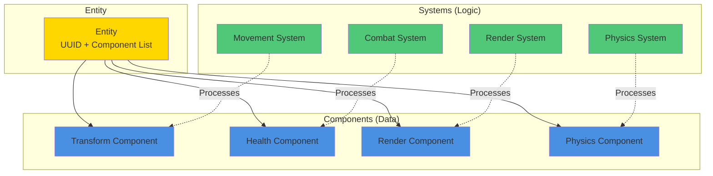

### Entity-Component Relationship

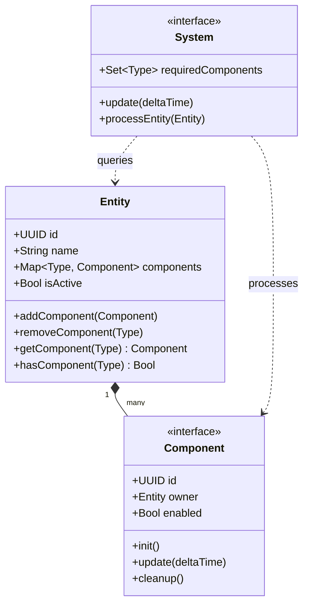

---

## Component Dependency Tree

### Core Component Dependencies

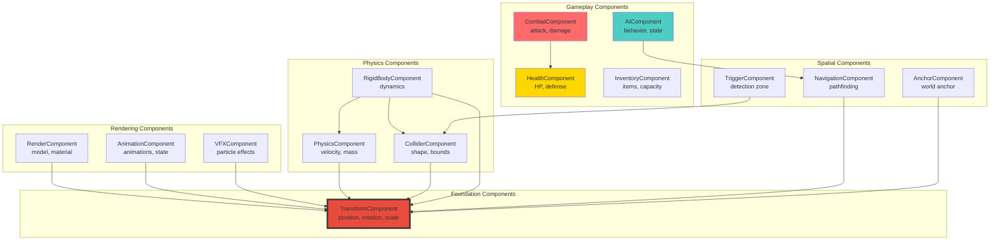

### Detailed Dependency Graph

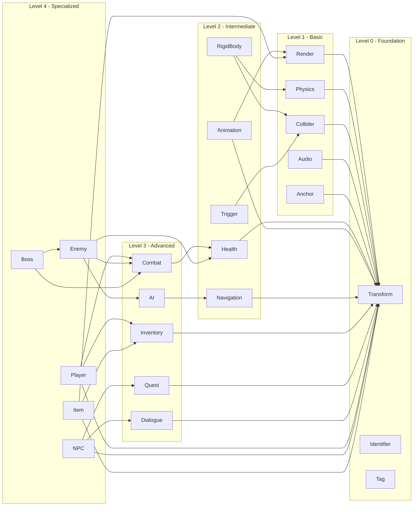

---

## System Execution Order

### Frame Update Pipeline

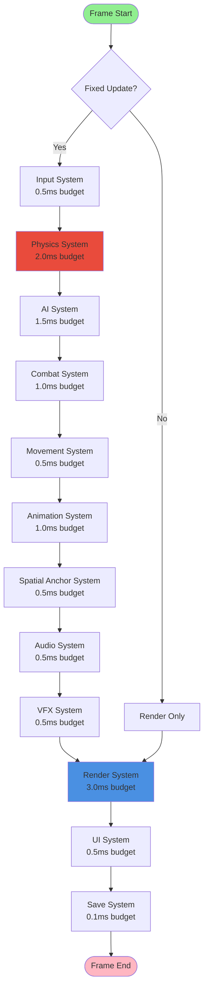

### System Priority Levels

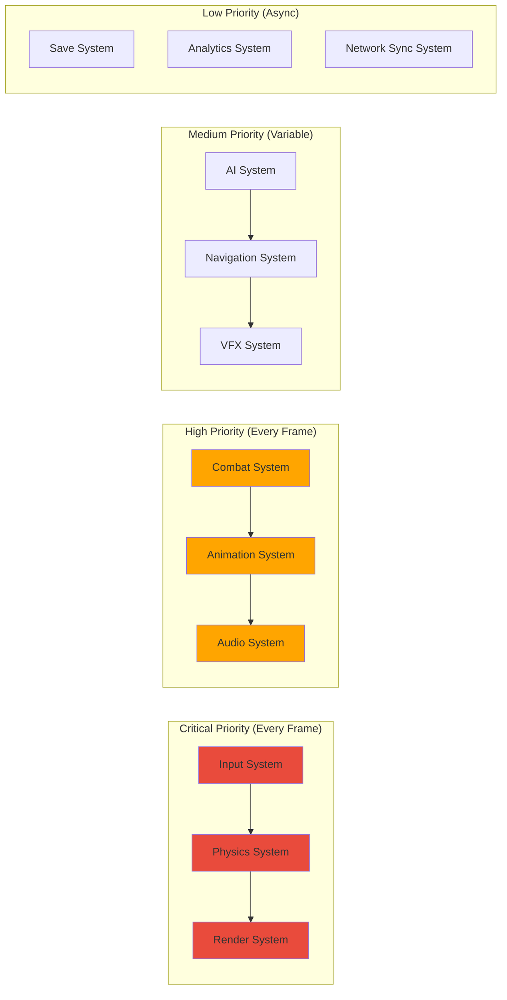

### System Communication Flow

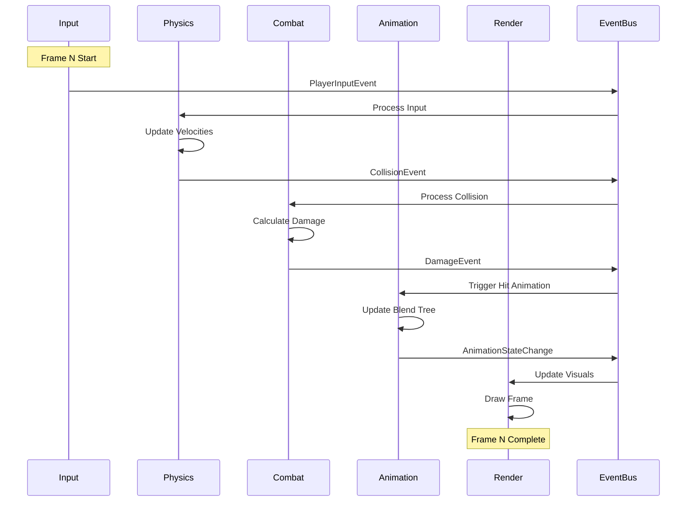

---

## Component Composition Examples

### Player Entity Composition

```mermaid
graph TB
    PLAYER[Player Entity]

    subgraph "Core Components"
        PLAYER --> TRANS[TransformComponent]
        PLAYER --> ID[IdentifierComponent]
        PLAYER --> TAG[TagComponent: 'Player']
    end

    subgraph "Visual Components"
        PLAYER --> RENDER[RenderComponent<br/>Model: PlayerModel<br/>Material: PlayerMaterial]
        PLAYER --> ANIM[AnimationComponent<br/>Controller: PlayerAnimator<br/>State: Idle]
        PLAYER --> VFX_P[VFXComponent<br/>Trail Effect<br/>Spell Auras]
    end

    subgraph "Physics Components"
        PLAYER --> PHYS[PhysicsComponent<br/>Mass: 70kg<br/>Drag: 0.1]
        PLAYER --> COLL[ColliderComponent<br/>Capsule: 0.5m radius]
        PLAYER --> RB[RigidBodyComponent<br/>Type: Dynamic]
    end

    subgraph "Gameplay Components"
        PLAYER --> HEALTH[HealthComponent<br/>Max: 100<br/>Current: 100<br/>Regen: 1/sec]
        PLAYER --> COMBAT_P[CombatComponent<br/>Attack: 25<br/>Defense: 15<br/>Crit: 10%]
        PLAYER --> INV[InventoryComponent<br/>Slots: 50<br/>Weight: 200kg max]
        PLAYER --> EQUIP[EquipmentComponent<br/>Weapon<br/>Armor<br/>Accessories]
    end

    subgraph "Input Components"
        PLAYER --> INPUT[InputComponent<br/>Gesture Recognition<br/>Eye Tracking<br/>Voice Commands]
        PLAYER --> CAMERA[CameraComponent<br/>Follow Camera<br/>Field of View: 90°]
    end

    subgraph "Stats Components"
        PLAYER --> STATS[StatsComponent<br/>Strength: 10<br/>Intelligence: 8<br/>Dexterity: 12]
        PLAYER --> EXP[ExperienceComponent<br/>Level: 1<br/>XP: 0/100]
    end

    subgraph "Spatial Components"
        PLAYER --> ANCHOR_P[AnchorComponent<br/>Persistent World Anchor]
        PLAYER --> NAV_P[NavigationComponent<br/>NavMesh Agent]
    end

    style PLAYER fill:#FFD700,stroke:#333,stroke-width:4px
```

### Enemy Entity Composition

```mermaid
graph TB
    ENEMY[Enemy Entity]

    subgraph "Core Components"
        ENEMY --> E_TRANS[TransformComponent]
        ENEMY --> E_ID[IdentifierComponent]
        ENEMY --> E_TAG[TagComponent: 'Enemy']
    end

    subgraph "Visual Components"
        ENEMY --> E_RENDER[RenderComponent<br/>Model: GoblinModel]
        ENEMY --> E_ANIM[AnimationComponent<br/>State Machine]
        ENEMY --> E_VFX[VFXComponent<br/>Hit Effects]
    end

    subgraph "Physics Components"
        ENEMY --> E_PHYS[PhysicsComponent<br/>Mass: 50kg]
        ENEMY --> E_COLL[ColliderComponent<br/>Capsule Collider]
        ENEMY --> E_RB[RigidBodyComponent<br/>Type: Dynamic]
    end

    subgraph "Gameplay Components"
        ENEMY --> E_HEALTH[HealthComponent<br/>Max: 50<br/>Current: 50]
        ENEMY --> E_COMBAT[CombatComponent<br/>Attack: 15<br/>Defense: 5]
        ENEMY --> E_AI[AIComponent<br/>Behavior Tree<br/>State: Patrol]
        ENEMY --> E_LOOT[LootComponent<br/>Drop Table<br/>Gold: 10-20]
    end

    subgraph "AI Components"
        ENEMY --> E_SENSE[SensingComponent<br/>Sight Range: 10m<br/>Hearing: 5m]
        ENEMY --> E_NAV[NavigationComponent<br/>Pathfinding<br/>Speed: 3m/s]
        ENEMY --> E_TARGET[TargetingComponent<br/>Current Target<br/>Threat List]
    end

    subgraph "Audio Components"
        ENEMY --> E_AUDIO[AudioComponent<br/>Growl Sound<br/>Attack Sound<br/>Death Sound]
    end

    style ENEMY fill:#FF6B6B,stroke:#333,stroke-width:4px
```

### NPC Entity Composition

```mermaid
graph TB
    NPC[NPC Entity]

    subgraph "Core Components"
        NPC --> N_TRANS[TransformComponent]
        NPC --> N_ID[IdentifierComponent]
        NPC --> N_TAG[TagComponent: 'NPC']
    end

    subgraph "Visual Components"
        NPC --> N_RENDER[RenderComponent<br/>Model: MerchantModel]
        NPC --> N_ANIM[AnimationComponent<br/>Idle Animations]
    end

    subgraph "Interaction Components"
        NPC --> N_DIALOGUE[DialogueComponent<br/>Dialogue Trees<br/>Voice Lines]
        NPC --> N_QUEST[QuestComponent<br/>Available Quests<br/>Rewards]
        NPC --> N_MERCHANT[MerchantComponent<br/>Shop Inventory<br/>Prices]
        NPC --> N_INTERACT[InteractionComponent<br/>Interaction Radius: 2m<br/>Prompt: "Talk"]
    end

    subgraph "AI Components"
        NPC --> N_SCHEDULE[ScheduleComponent<br/>Daily Routine<br/>Waypoints]
        NPC --> N_NAV[NavigationComponent<br/>Pathfinding]
    end

    subgraph "Audio Components"
        NPC --> N_AUDIO[AudioComponent<br/>Greeting Sounds<br/>Ambient Dialogue]
    end

    subgraph "Spatial Components"
        NPC --> N_ANCHOR[AnchorComponent<br/>Fixed Location]
    end

    style NPC fill:#4ECDC4,stroke:#333,stroke-width:4px
```

### Interactive Object Composition

```mermaid
graph TB
    CHEST[Chest Entity]

    subgraph "Core Components"
        CHEST --> C_TRANS[TransformComponent]
        CHEST --> C_ID[IdentifierComponent]
        CHEST --> C_TAG[TagComponent: 'Interactive']
    end

    subgraph "Visual Components"
        CHEST --> C_RENDER[RenderComponent<br/>Model: ChestModel<br/>State: Closed]
        CHEST --> C_ANIM[AnimationComponent<br/>Open Animation<br/>Close Animation]
    end

    subgraph "Interaction Components"
        CHEST --> C_STORAGE[StorageComponent<br/>Item Slots<br/>Contents]
        CHEST --> C_INTERACT[InteractionComponent<br/>Type: Container<br/>Radius: 1m]
        CHEST --> C_LOCK[LockComponent<br/>Locked: true<br/>Key Required: GoldKey]
    end

    subgraph "Physics Components"
        CHEST --> C_COLL[ColliderComponent<br/>Box Collider<br/>Static]
    end

    subgraph "Spatial Components"
        CHEST --> C_ANCHOR[AnchorComponent<br/>World Anchor<br/>Persistent]
    end

    subgraph "Audio Components"
        CHEST --> C_AUDIO[AudioComponent<br/>Open Sound<br/>Close Sound<br/>Lock Sound]
    end

    subgraph "State Components"
        CHEST --> C_STATE[StateComponent<br/>Current: Closed<br/>Looted: false]
    end

    style CHEST fill:#95E1D3,stroke:#333,stroke-width:4px
```

### Projectile Entity Composition

```mermaid
graph TB
    PROJ[Projectile Entity<br/>(Fireball)]

    subgraph "Core Components"
        PROJ --> P_TRANS[TransformComponent]
        PROJ --> P_ID[IdentifierComponent]
        PROJ --> P_TAG[TagComponent: 'Projectile']
    end

    subgraph "Visual Components"
        PROJ --> P_RENDER[RenderComponent<br/>Model: FireballModel]
        PROJ --> P_VFX[VFXComponent<br/>Fire Trail<br/>Particles]
        PROJ --> P_LIGHT[LightComponent<br/>Color: Orange<br/>Intensity: 2.0]
    end

    subgraph "Physics Components"
        PROJ --> P_PHYS[PhysicsComponent<br/>Velocity: 20m/s<br/>Mass: 0.1kg]
        PROJ --> P_COLL[ColliderComponent<br/>Sphere: 0.2m<br/>Trigger: true]
        PROJ --> P_RB[RigidBodyComponent<br/>Type: Dynamic<br/>Gravity: false]
    end

    subgraph "Gameplay Components"
        PROJ --> P_DAMAGE[DamageComponent<br/>Amount: 50<br/>Type: Fire<br/>AOE: 2m]
        PROJ --> P_LIFETIME[LifetimeComponent<br/>Duration: 5s<br/>Destroy on Contact]
    end

    subgraph "Audio Components"
        PROJ --> P_AUDIO[AudioComponent<br/>Whoosh Sound<br/>Impact Sound]
    end

    style PROJ fill:#FF9A76,stroke:#333,stroke-width:4px
```

---

## Component Categories

### Transform & Spatial Components

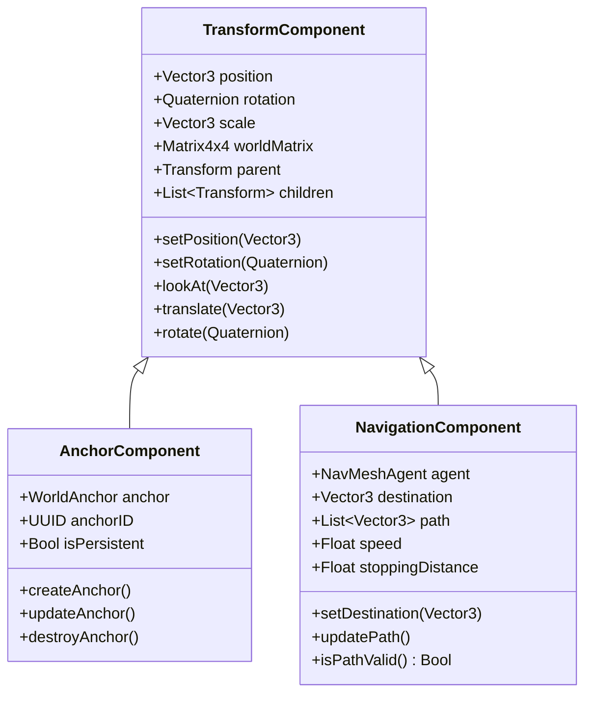

### Rendering Components

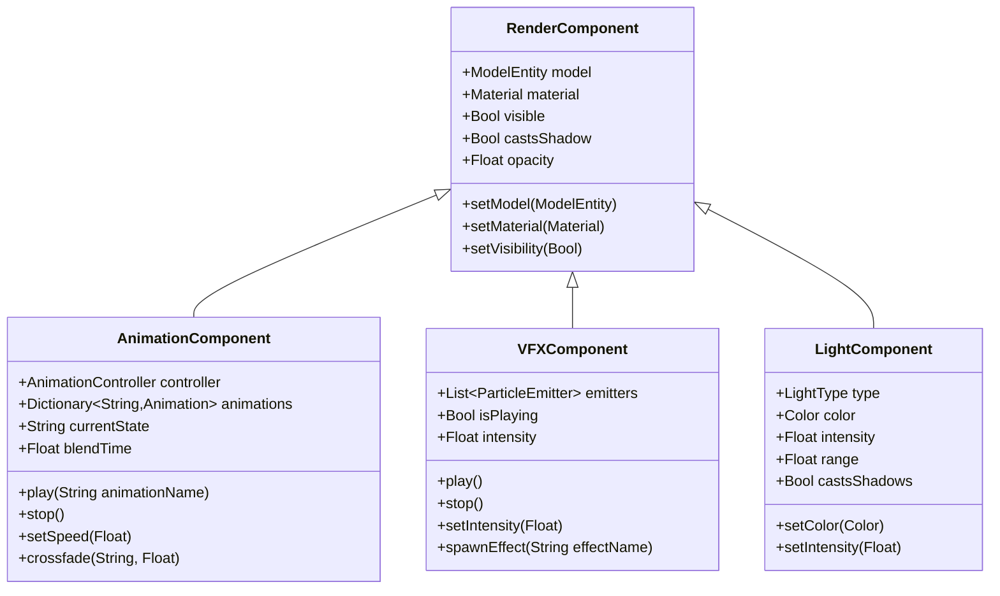

### Physics Components

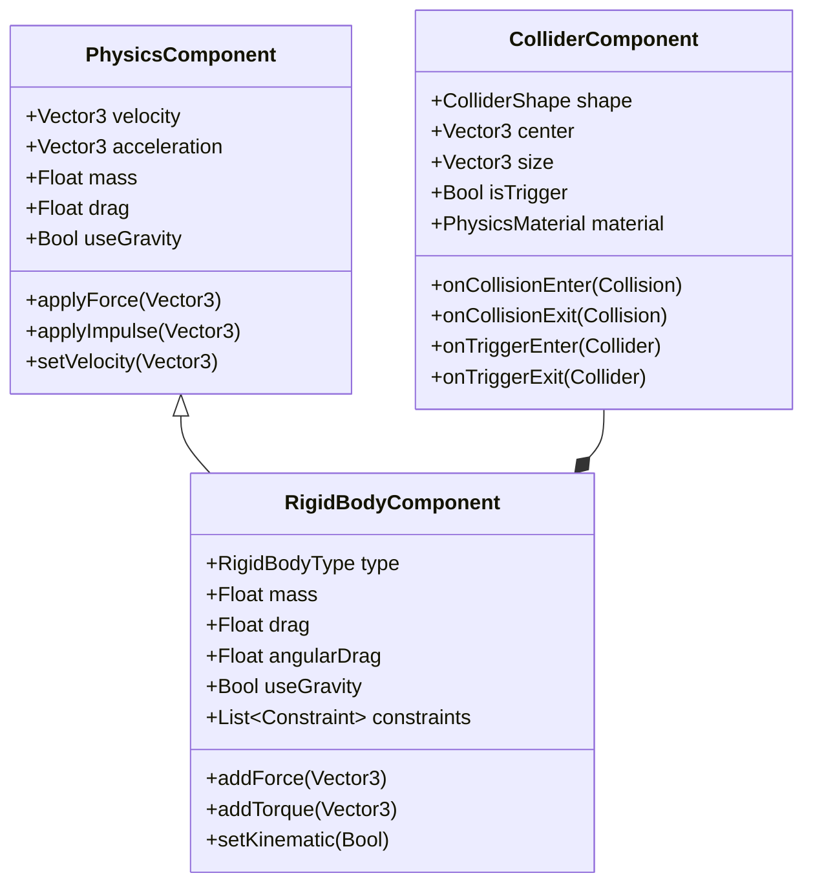

### Gameplay Components

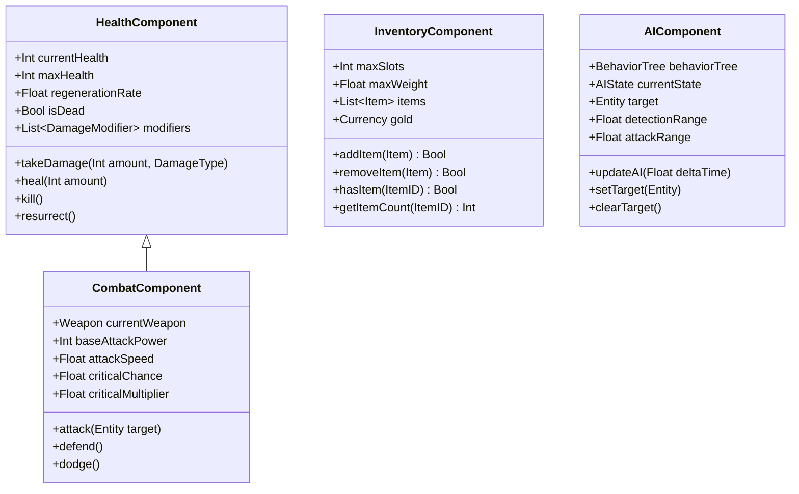

---

## Best Practices

### Component Design Principles

1. **Single Responsibility**
   - Each component should have ONE clear purpose
   - Avoid "god components" with too much functionality
   - Example: `HealthComponent` only manages health, not damage calculation

2. **Data-Oriented Design**
   - Components store DATA, systems contain LOGIC
   - Keep components as simple data containers
   - Minimize component-to-component dependencies

3. **Composition Over Inheritance**
   - Build complex entities by combining simple components
   - Avoid deep component inheritance hierarchies
   - Use interfaces for common functionality

4. **Performance Optimization**
   - Keep components small and cache-friendly
   - Use value types when possible
   - Avoid references to other components when possible

### Component Communication Patterns

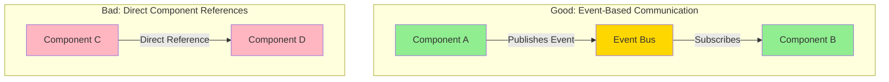

### Component Lifecycle

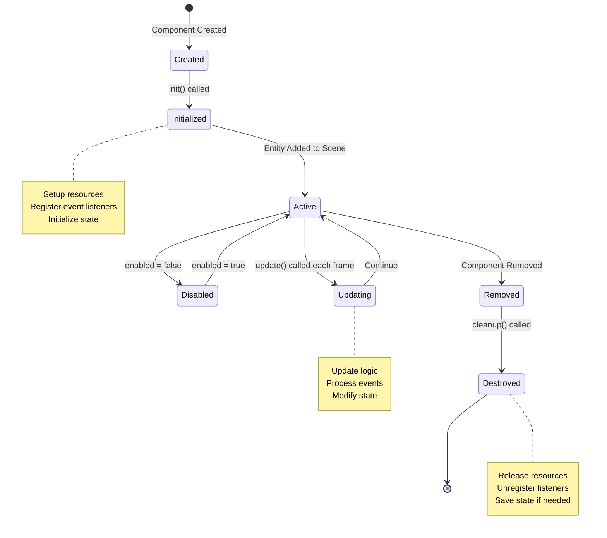

---

## Performance Considerations

### Component Pooling

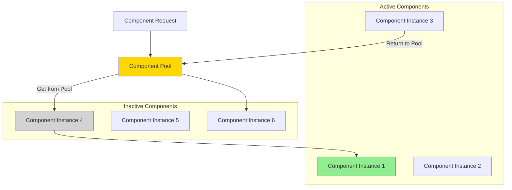

### System Query Optimization

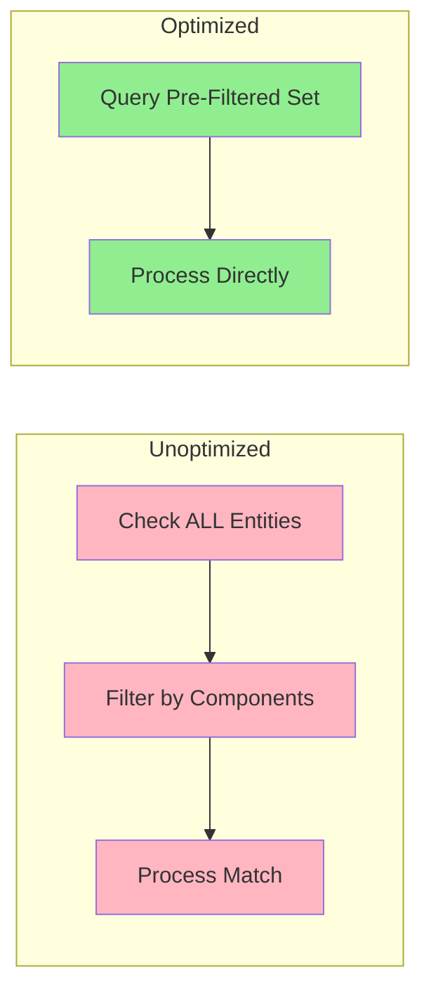

### Memory Layout Optimization

```swift
// Bad: Random access, cache misses
class BadComponent {
    var someData: String        // 8 bytes pointer
    var moreData: [Int]         // 8 bytes pointer
    var evenMore: Dictionary    // 8 bytes pointer
}

// Good: Contiguous memory, cache-friendly
struct GoodComponent {
    var position: SIMD3<Float>  // 12 bytes inline
    var health: Int32           // 4 bytes inline
    var damage: Int32           // 4 bytes inline
    // Total: 20 bytes contiguous
}
```

---

## Component Reference

### Complete Component List

| Component | Dependencies | Systems | Purpose |
|-----------|--------------|---------|---------|
| TransformComponent | None | All | Position, rotation, scale |
| RenderComponent | Transform | Render | Visual representation |
| AnimationComponent | Transform, Render | Animation | Animated models |
| PhysicsComponent | Transform | Physics | Movement physics |
| ColliderComponent | Transform | Physics | Collision detection |
| RigidBodyComponent | Physics, Collider | Physics | Full physics simulation |
| HealthComponent | None | Combat | HP management |
| CombatComponent | Health | Combat | Attack/defense |
| AIComponent | Navigation | AI | NPC behavior |
| NavigationComponent | Transform | AI, Movement | Pathfinding |
| InventoryComponent | None | Inventory | Item storage |
| EquipmentComponent | Inventory | Equipment | Worn items |
| AudioComponent | Transform | Audio | 3D sound |
| VFXComponent | Transform | VFX | Particle effects |
| AnchorComponent | Transform | Spatial | World anchors |
| DialogueComponent | None | Dialogue | NPC conversations |
| QuestComponent | None | Quest | Quest management |
| LootComponent | None | Loot | Item drops |
| InputComponent | None | Input | Player input |
| CameraComponent | Transform | Camera | Camera control |
| LightComponent | Transform | Render | Scene lighting |

---

## Conclusion

The ECS architecture in Reality Realms RPG provides:

### Advantages

1. **Flexibility**: Easy to add/remove components at runtime
2. **Performance**: Cache-friendly data layout
3. **Reusability**: Components work with any entity
4. **Maintainability**: Clear separation of data and logic
5. **Testability**: Systems can be tested independently

### Key Takeaways

- **Components** are pure data containers
- **Systems** contain all game logic
- **Entities** are just component containers
- **Event Bus** handles component communication
- **Dependencies** should be minimized

### Development Workflow

1. Identify entity behavior needed
2. Find existing components that provide features
3. Compose entity from components
4. Create new components only if needed
5. Implement system to process components
6. Test in isolation before integration

This component hierarchy forms the foundation of Reality Realms RPG's flexible and performant architecture.
