# Reality Realms RPG - Data Flow Documentation

## Table of Contents
- [Event Propagation System](#event-propagation-system)
- [State Transition Flows](#state-transition-flows)
- [System Interaction Diagrams](#system-interaction-diagrams)
- [Data Persistence Flows](#data-persistence-flows)
- [Network Data Flows](#network-data-flows)
- [Asset Loading Pipeline](#asset-loading-pipeline)
- [Input Processing Flow](#input-processing-flow)
- [Combat Data Flow](#combat-data-flow)
- [Quest System Data Flow](#quest-system-data-flow)

---

## Event Propagation System

### Event Bus Architecture

The Reality Realms event system uses a centralized event bus with type-safe event handling and automatic subscription management.

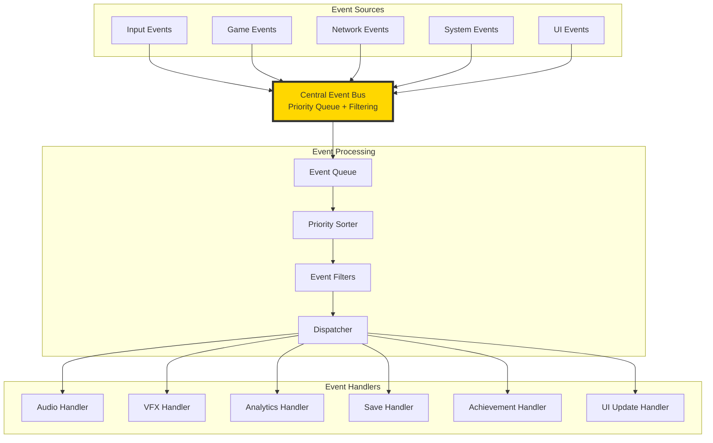
```mermaid
graph TB
    subgraph "Event Sources"
        INPUT[Input Events]
        GAME[Game Events]
        NETWORK[Network Events]
        SYSTEM[System Events]
        UI[UI Events]
    end

    BUS[Central Event Bus<br/>Priority Queue + Filtering]

    subgraph "Event Processing"
        QUEUE[Event Queue]
        PRIORITY[Priority Sorter]
        FILTER[Event Filters]
        DISPATCH[Dispatcher]
    end

    subgraph "Event Handlers"
        AUDIO[Audio Handler]
        VFX[VFX Handler]
        ANALYTICS[Analytics Handler]
        SAVE[Save Handler]
        ACHIEVEMENT[Achievement Handler]
        UI_UPDATE[UI Update Handler]
    end

    INPUT --> BUS
    GAME --> BUS
    NETWORK --> BUS
    SYSTEM --> BUS
    UI --> BUS

    BUS --> QUEUE
    QUEUE --> PRIORITY
    PRIORITY --> FILTER
    FILTER --> DISPATCH

    DISPATCH --> AUDIO
    DISPATCH --> VFX
    DISPATCH --> ANALYTICS
    DISPATCH --> SAVE
    DISPATCH --> ACHIEVEMENT
    DISPATCH --> UI_UPDATE

    style BUS fill:#FFD700,stroke:#333,stroke-width:4px
```

### Event Flow Example: Player Attack

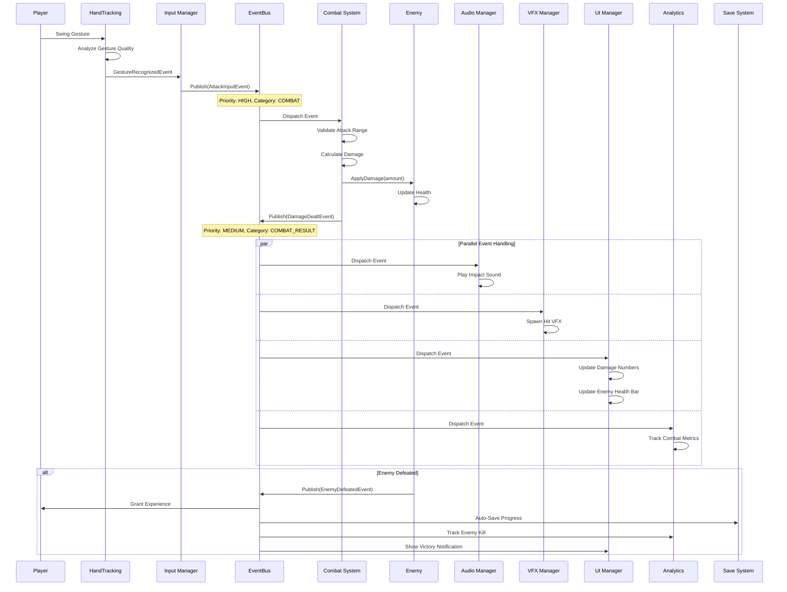
```mermaid
sequenceDiagram
    participant Player
    participant HandTracking
    participant InputMgr as Input Manager
    participant EventBus
    participant CombatSys as Combat System
    participant Enemy
    participant AudioMgr as Audio Manager
    participant VFXMgr as VFX Manager
    participant UIMgr as UI Manager
    participant Analytics
    participant SaveSys as Save System

    Player->>HandTracking: Swing Gesture
    HandTracking->>HandTracking: Analyze Gesture Quality
    HandTracking->>InputMgr: GestureRecognizedEvent

    InputMgr->>EventBus: Publish(AttackInputEvent)
    Note over EventBus: Priority: HIGH, Category: COMBAT

    EventBus->>CombatSys: Dispatch Event
    CombatSys->>CombatSys: Validate Attack Range
    CombatSys->>CombatSys: Calculate Damage
    CombatSys->>Enemy: ApplyDamage(amount)

    Enemy->>Enemy: Update Health
    CombatSys->>EventBus: Publish(DamageDealtEvent)
    Note over EventBus: Priority: MEDIUM, Category: COMBAT_RESULT

    par Parallel Event Handling
        EventBus->>AudioMgr: Dispatch Event
        AudioMgr->>AudioMgr: Play Impact Sound
    and
        EventBus->>VFXMgr: Dispatch Event
        VFXMgr->>VFXMgr: Spawn Hit VFX
    and
        EventBus->>UIMgr: Dispatch Event
        UIMgr->>UIMgr: Update Damage Numbers
        UIMgr->>UIMgr: Update Enemy Health Bar
    and
        EventBus->>Analytics: Dispatch Event
        Analytics->>Analytics: Track Combat Metrics
    end

    alt Enemy Defeated
        Enemy->>EventBus: Publish(EnemyDefeatedEvent)
        EventBus->>Player: Grant Experience
        EventBus->>SaveSys: Auto-Save Progress
        EventBus->>Analytics: Track Enemy Kill
        EventBus->>UIMgr: Show Victory Notification
    end
```

### Event Priority System

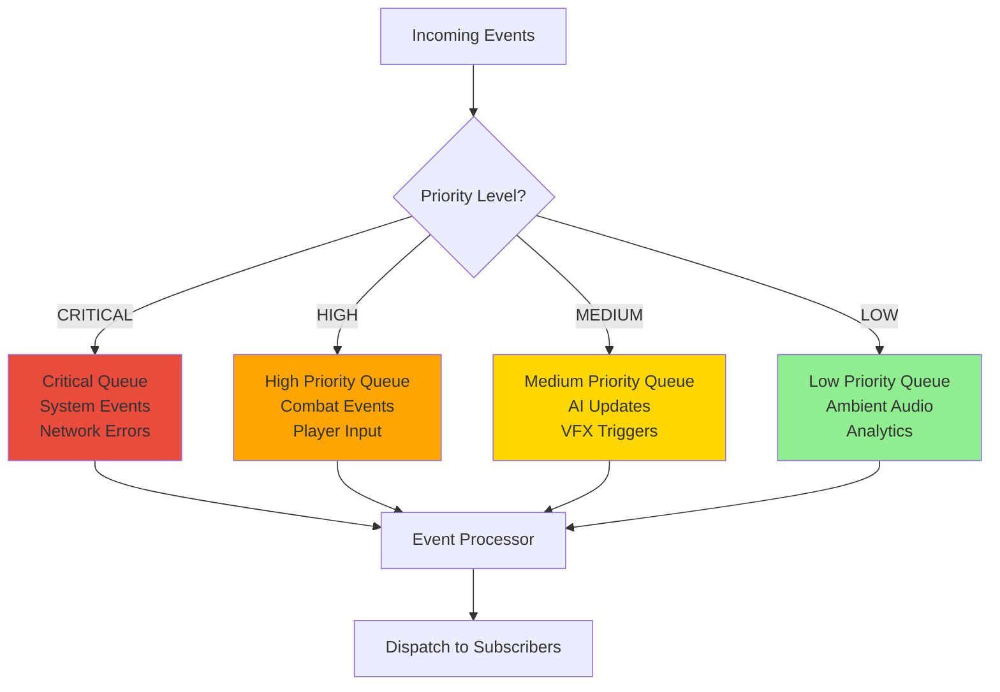
```mermaid
graph TB
    EVENTS[Incoming Events]

    EVENTS --> P1{Priority Level?}

    P1 -->|CRITICAL| Q1[Critical Queue<br/>System Events<br/>Network Errors]
    P1 -->|HIGH| Q2[High Priority Queue<br/>Combat Events<br/>Player Input]
    P1 -->|MEDIUM| Q3[Medium Priority Queue<br/>AI Updates<br/>VFX Triggers]
    P1 -->|LOW| Q4[Low Priority Queue<br/>Ambient Audio<br/>Analytics]

    Q1 --> PROCESS[Event Processor]
    Q2 --> PROCESS
    Q3 --> PROCESS
    Q4 --> PROCESS

    PROCESS --> DISPATCH[Dispatch to Subscribers]

    style Q1 fill:#E94B3C
    style Q2 fill:#FFA500
    style Q3 fill:#FFD700
    style Q4 fill:#90EE90
```

### Event Categories and Flow

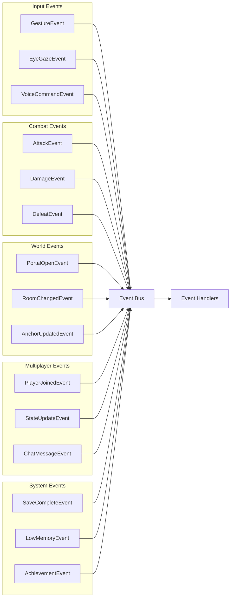
```mermaid
graph LR
    subgraph "Input Events"
        I1[GestureEvent]
        I2[EyeGazeEvent]
        I3[VoiceCommandEvent]
    end

    subgraph "Combat Events"
        C1[AttackEvent]
        C2[DamageEvent]
        C3[DefeatEvent]
    end

    subgraph "World Events"
        W1[PortalOpenEvent]
        W2[RoomChangedEvent]
        W3[AnchorUpdatedEvent]
    end

    subgraph "Multiplayer Events"
        M1[PlayerJoinedEvent]
        M2[StateUpdateEvent]
        M3[ChatMessageEvent]
    end

    subgraph "System Events"
        S1[SaveCompleteEvent]
        S2[LowMemoryEvent]
        S3[AchievementEvent]
    end

    I1 --> BUS[Event Bus]
    I2 --> BUS
    I3 --> BUS
    C1 --> BUS
    C2 --> BUS
    C3 --> BUS
    W1 --> BUS
    W2 --> BUS
    W3 --> BUS
    M1 --> BUS
    M2 --> BUS
    M3 --> BUS
    S1 --> BUS
    S2 --> BUS
    S3 --> BUS

    BUS --> HANDLERS[Event Handlers]
```

---

## State Transition Flows

### Game State Transitions

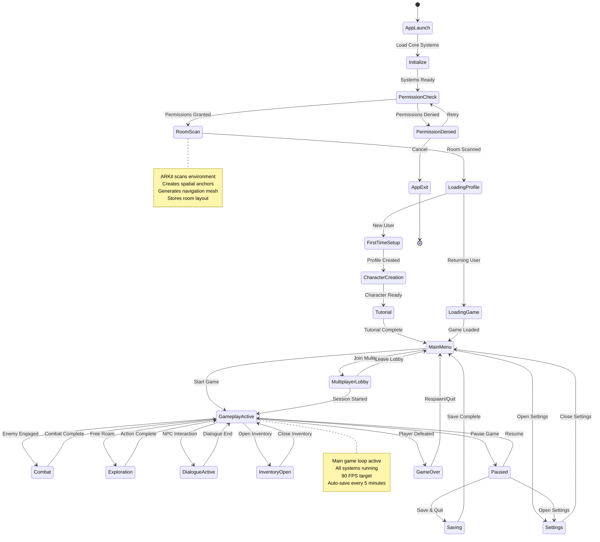
```mermaid
stateDiagram-v2
    [*] --> AppLaunch

    AppLaunch --> Initialize: Load Core Systems
    Initialize --> PermissionCheck: Systems Ready

    PermissionCheck --> RoomScan: Permissions Granted
    PermissionCheck --> PermissionDenied: Permissions Denied

    PermissionDenied --> PermissionCheck: Retry
    PermissionDenied --> AppExit: Cancel

    RoomScan --> LoadingProfile: Room Scanned
    LoadingProfile --> FirstTimeSetup: New User
    LoadingProfile --> LoadingGame: Returning User

    FirstTimeSetup --> CharacterCreation: Profile Created
    CharacterCreation --> Tutorial: Character Ready

    Tutorial --> MainMenu: Tutorial Complete
    LoadingGame --> MainMenu: Game Loaded

    MainMenu --> GameplayActive: Start Game
    MainMenu --> MultiplayerLobby: Join Multiplayer
    MainMenu --> Settings: Open Settings

    Settings --> MainMenu: Close Settings

    MultiplayerLobby --> GameplayActive: Session Started
    MultiplayerLobby --> MainMenu: Leave Lobby

    GameplayActive --> Combat: Enemy Engaged
    GameplayActive --> Exploration: Free Roam
    GameplayActive --> DialogueActive: NPC Interaction
    GameplayActive --> InventoryOpen: Open Inventory
    GameplayActive --> Paused: Pause Game

    Combat --> GameplayActive: Combat Complete
    Exploration --> GameplayActive: Action Complete
    DialogueActive --> GameplayActive: Dialogue End
    InventoryOpen --> GameplayActive: Close Inventory

    Paused --> GameplayActive: Resume
    Paused --> Saving: Save & Quit
    Paused --> Settings: Open Settings

    Saving --> MainMenu: Save Complete

    GameplayActive --> GameOver: Player Defeated
    GameOver --> MainMenu: Respawn/Quit

    AppExit --> [*]

    note right of RoomScan
        ARKit scans environment
        Creates spatial anchors
        Generates navigation mesh
        Stores room layout
    end note

    note right of GameplayActive
        Main game loop active
        All systems running
        90 FPS target
        Auto-save every 5 minutes
    end note
```

### Combat State Flow

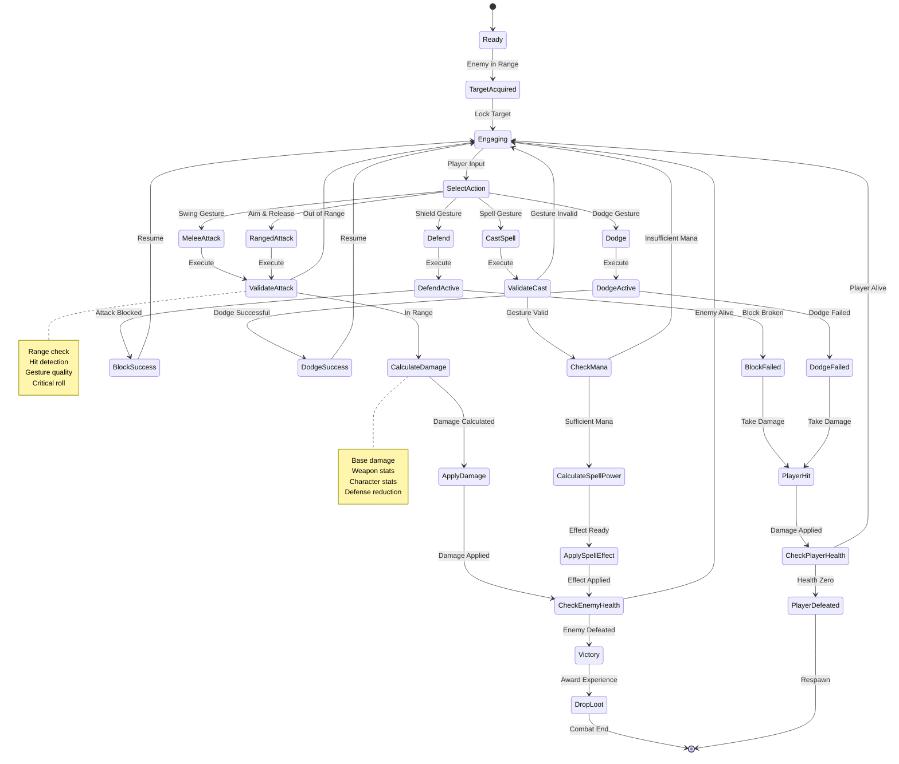
```mermaid
stateDiagram-v2
    [*] --> Ready

    Ready --> TargetAcquired: Enemy in Range
    TargetAcquired --> Engaging: Lock Target

    Engaging --> SelectAction: Player Input

    SelectAction --> MeleeAttack: Swing Gesture
    SelectAction --> RangedAttack: Aim & Release
    SelectAction --> CastSpell: Spell Gesture
    SelectAction --> Defend: Shield Gesture
    SelectAction --> Dodge: Dodge Gesture

    MeleeAttack --> ValidateAttack: Execute
    RangedAttack --> ValidateAttack: Execute
    CastSpell --> ValidateCast: Execute
    Defend --> DefendActive: Execute
    Dodge --> DodgeActive: Execute

    ValidateAttack --> CalculateDamage: In Range
    ValidateAttack --> Engaging: Out of Range

    ValidateCast --> CheckMana: Gesture Valid
    ValidateCast --> Engaging: Gesture Invalid

    CheckMana --> CalculateSpellPower: Sufficient Mana
    CheckMana --> Engaging: Insufficient Mana

    CalculateDamage --> ApplyDamage: Damage Calculated
    CalculateSpellPower --> ApplySpellEffect: Effect Ready

    ApplyDamage --> CheckEnemyHealth: Damage Applied
    ApplySpellEffect --> CheckEnemyHealth: Effect Applied

    DefendActive --> BlockSuccess: Attack Blocked
    DefendActive --> BlockFailed: Block Broken
    DodgeActive --> DodgeSuccess: Dodge Successful
    DodgeActive --> DodgeFailed: Dodge Failed

    BlockSuccess --> Engaging: Resume
    BlockFailed --> PlayerHit: Take Damage
    DodgeSuccess --> Engaging: Resume
    DodgeFailed --> PlayerHit: Take Damage

    PlayerHit --> CheckPlayerHealth: Damage Applied

    CheckPlayerHealth --> Engaging: Player Alive
    CheckPlayerHealth --> PlayerDefeated: Health Zero

    CheckEnemyHealth --> Victory: Enemy Defeated
    CheckEnemyHealth --> Engaging: Enemy Alive

    Victory --> DropLoot: Award Experience
    DropLoot --> [*]: Combat End

    PlayerDefeated --> [*]: Respawn

    note right of ValidateAttack
        Range check
        Hit detection
        Gesture quality
        Critical roll
    end note

    note right of CalculateDamage
        Base damage
        Weapon stats
        Character stats
        Defense reduction
    end note
```

### Save State Transitions

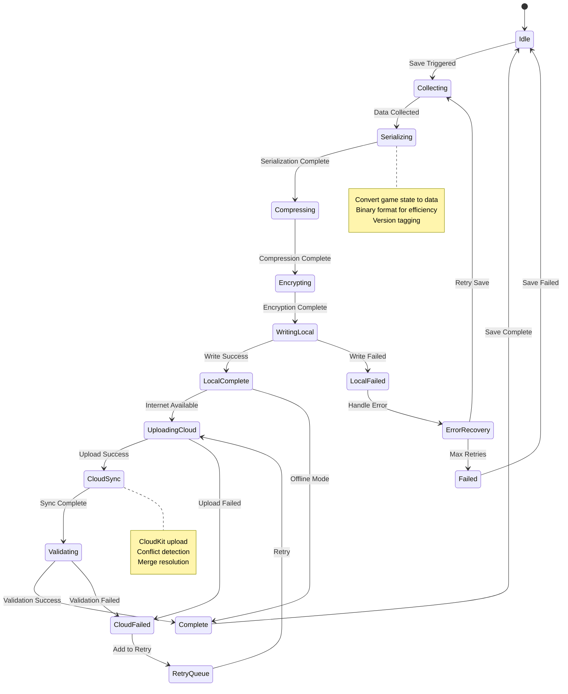
```mermaid
stateDiagram-v2
    [*] --> Idle

    Idle --> Collecting: Save Triggered
    Collecting --> Serializing: Data Collected

    Serializing --> Compressing: Serialization Complete
    Compressing --> Encrypting: Compression Complete
    Encrypting --> WritingLocal: Encryption Complete

    WritingLocal --> LocalComplete: Write Success
    WritingLocal --> LocalFailed: Write Failed

    LocalComplete --> UploadingCloud: Internet Available
    LocalComplete --> Complete: Offline Mode

    UploadingCloud --> CloudSync: Upload Success
    UploadingCloud --> CloudFailed: Upload Failed

    CloudFailed --> RetryQueue: Add to Retry
    RetryQueue --> UploadingCloud: Retry

    CloudSync --> Validating: Sync Complete
    Validating --> Complete: Validation Success
    Validating --> CloudFailed: Validation Failed

    LocalFailed --> ErrorRecovery: Handle Error
    ErrorRecovery --> Collecting: Retry Save
    ErrorRecovery --> Failed: Max Retries

    Complete --> Idle: Save Complete
    Failed --> Idle: Save Failed

    note right of Serializing
        Convert game state to data
        Binary format for efficiency
        Version tagging
    end note

    note right of CloudSync
        CloudKit upload
        Conflict detection
        Merge resolution
    end note
```

---

## System Interaction Diagrams

### Frame Update Cycle

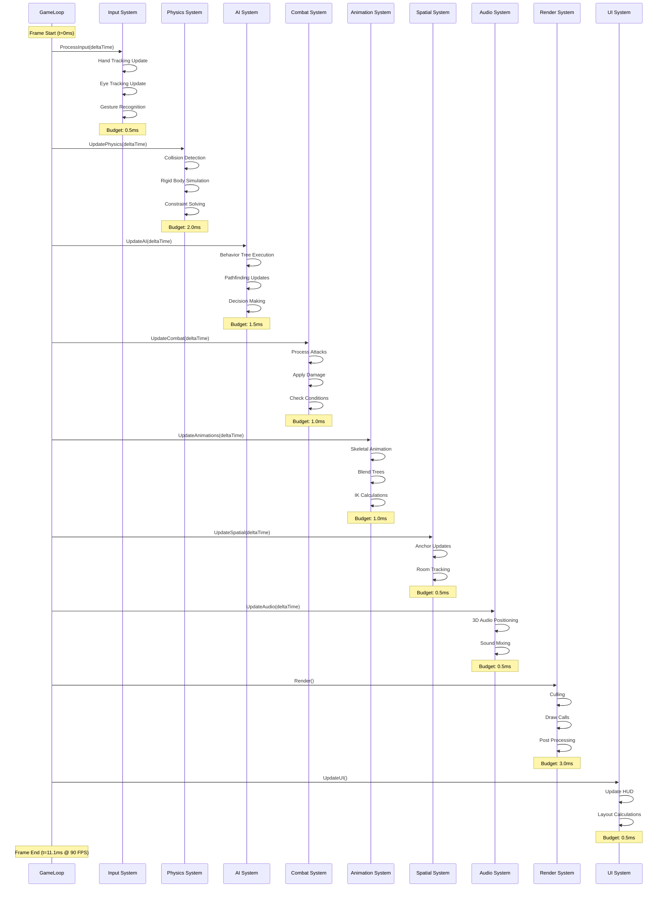
```mermaid
sequenceDiagram
    participant GameLoop
    participant InputSys as Input System
    participant PhysicsSys as Physics System
    participant AISys as AI System
    participant CombatSys as Combat System
    participant AnimSys as Animation System
    participant SpatialSys as Spatial System
    participant AudioSys as Audio System
    participant RenderSys as Render System
    participant UISys as UI System

    Note over GameLoop: Frame Start (t=0ms)

    GameLoop->>InputSys: ProcessInput(deltaTime)
    InputSys->>InputSys: Hand Tracking Update
    InputSys->>InputSys: Eye Tracking Update
    InputSys->>InputSys: Gesture Recognition
    Note over InputSys: Budget: 0.5ms

    GameLoop->>PhysicsSys: UpdatePhysics(deltaTime)
    PhysicsSys->>PhysicsSys: Collision Detection
    PhysicsSys->>PhysicsSys: Rigid Body Simulation
    PhysicsSys->>PhysicsSys: Constraint Solving
    Note over PhysicsSys: Budget: 2.0ms

    GameLoop->>AISys: UpdateAI(deltaTime)
    AISys->>AISys: Behavior Tree Execution
    AISys->>AISys: Pathfinding Updates
    AISys->>AISys: Decision Making
    Note over AISys: Budget: 1.5ms

    GameLoop->>CombatSys: UpdateCombat(deltaTime)
    CombatSys->>CombatSys: Process Attacks
    CombatSys->>CombatSys: Apply Damage
    CombatSys->>CombatSys: Check Conditions
    Note over CombatSys: Budget: 1.0ms

    GameLoop->>AnimSys: UpdateAnimations(deltaTime)
    AnimSys->>AnimSys: Skeletal Animation
    AnimSys->>AnimSys: Blend Trees
    AnimSys->>AnimSys: IK Calculations
    Note over AnimSys: Budget: 1.0ms

    GameLoop->>SpatialSys: UpdateSpatial(deltaTime)
    SpatialSys->>SpatialSys: Anchor Updates
    SpatialSys->>SpatialSys: Room Tracking
    Note over SpatialSys: Budget: 0.5ms

    GameLoop->>AudioSys: UpdateAudio(deltaTime)
    AudioSys->>AudioSys: 3D Audio Positioning
    AudioSys->>AudioSys: Sound Mixing
    Note over AudioSys: Budget: 0.5ms

    GameLoop->>RenderSys: Render()
    RenderSys->>RenderSys: Culling
    RenderSys->>RenderSys: Draw Calls
    RenderSys->>RenderSys: Post Processing
    Note over RenderSys: Budget: 3.0ms

    GameLoop->>UISys: UpdateUI()
    UISys->>UISys: Update HUD
    UISys->>UISys: Layout Calculations
    Note over UISys: Budget: 0.5ms

    Note over GameLoop: Frame End (t=11.1ms @ 90 FPS)
```

### Multiplayer Interaction Flow

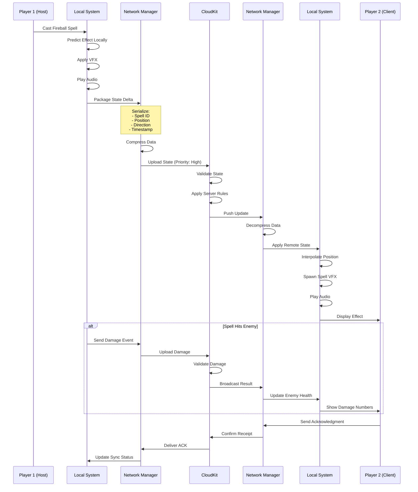
```mermaid
sequenceDiagram
    participant P1 as Player 1 (Host)
    participant LocalSys1 as Local System
    participant NetMgr1 as Network Manager
    participant CloudKit
    participant NetMgr2 as Network Manager
    participant LocalSys2 as Local System
    participant P2 as Player 2 (Client)

    P1->>LocalSys1: Cast Fireball Spell
    LocalSys1->>LocalSys1: Predict Effect Locally
    LocalSys1->>LocalSys1: Apply VFX
    LocalSys1->>LocalSys1: Play Audio

    LocalSys1->>NetMgr1: Package State Delta
    Note over NetMgr1: Serialize:<br/>- Spell ID<br/>- Position<br/>- Direction<br/>- Timestamp

    NetMgr1->>NetMgr1: Compress Data
    NetMgr1->>CloudKit: Upload State (Priority: High)

    CloudKit->>CloudKit: Validate State
    CloudKit->>CloudKit: Apply Server Rules
    CloudKit->>NetMgr2: Push Update

    NetMgr2->>NetMgr2: Decompress Data
    NetMgr2->>LocalSys2: Apply Remote State

    LocalSys2->>LocalSys2: Interpolate Position
    LocalSys2->>LocalSys2: Spawn Spell VFX
    LocalSys2->>LocalSys2: Play Audio
    LocalSys2->>P2: Display Effect

    alt Spell Hits Enemy
        LocalSys1->>NetMgr1: Send Damage Event
        NetMgr1->>CloudKit: Upload Damage
        CloudKit->>CloudKit: Validate Damage
        CloudKit->>NetMgr2: Broadcast Result
        NetMgr2->>LocalSys2: Update Enemy Health
        LocalSys2->>P2: Show Damage Numbers
    end

    P2->>NetMgr2: Send Acknowledgment
    NetMgr2->>CloudKit: Confirm Receipt
    CloudKit->>NetMgr1: Deliver ACK
    NetMgr1->>LocalSys1: Update Sync Status
```

### Quest System Interaction

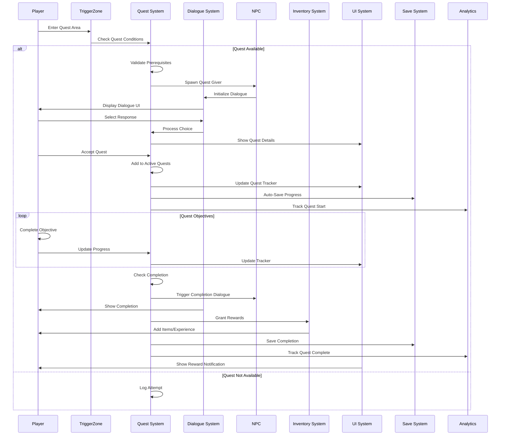
```mermaid
sequenceDiagram
    participant Player
    participant TriggerZone
    participant QuestSys as Quest System
    participant DialogueSys as Dialogue System
    participant NPC
    participant InventorySys as Inventory System
    participant UISys as UI System
    participant SaveSys as Save System
    participant Analytics

    Player->>TriggerZone: Enter Quest Area
    TriggerZone->>QuestSys: Check Quest Conditions

    alt Quest Available
        QuestSys->>QuestSys: Validate Prerequisites
        QuestSys->>NPC: Spawn Quest Giver
        NPC->>DialogueSys: Initialize Dialogue

        DialogueSys->>Player: Display Dialogue UI
        Player->>DialogueSys: Select Response
        DialogueSys->>QuestSys: Process Choice

        QuestSys->>UISys: Show Quest Details
        Player->>QuestSys: Accept Quest

        QuestSys->>QuestSys: Add to Active Quests
        QuestSys->>UISys: Update Quest Tracker
        QuestSys->>SaveSys: Auto-Save Progress
        QuestSys->>Analytics: Track Quest Start

        loop Quest Objectives
            Player->>Player: Complete Objective
            Player->>QuestSys: Update Progress
            QuestSys->>UISys: Update Tracker
        end

        QuestSys->>QuestSys: Check Completion
        QuestSys->>NPC: Trigger Completion Dialogue
        DialogueSys->>Player: Show Completion

        QuestSys->>InventorySys: Grant Rewards
        InventorySys->>Player: Add Items/Experience
        QuestSys->>SaveSys: Save Completion
        QuestSys->>Analytics: Track Quest Complete

        UISys->>Player: Show Reward Notification
    else Quest Not Available
        QuestSys->>QuestSys: Log Attempt
    end
```

---

## Data Persistence Flows

### Save System Architecture

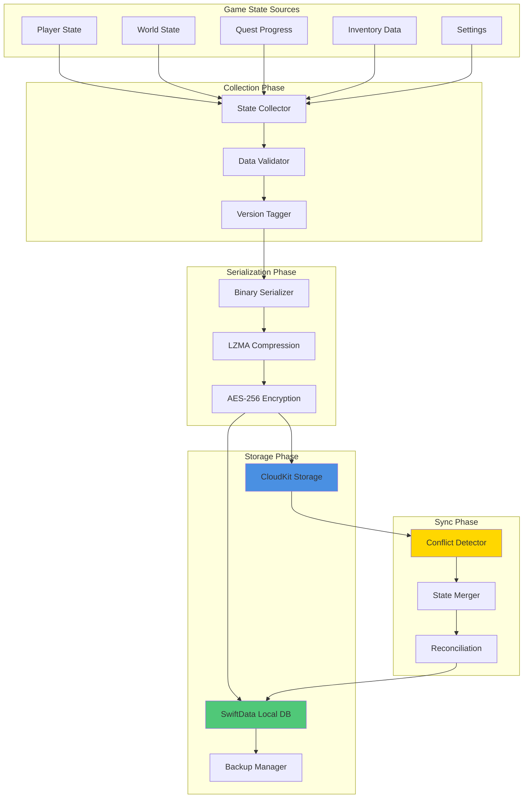
```mermaid
graph TB
    subgraph "Game State Sources"
        PLAYER[Player State]
        WORLD[World State]
        QUEST[Quest Progress]
        INV[Inventory Data]
        SETTINGS[Settings]
    end

    subgraph "Collection Phase"
        COLLECT[State Collector]
        VALIDATE[Data Validator]
        VERSION[Version Tagger]
    end

    subgraph "Serialization Phase"
        SERIALIZE[Binary Serializer]
        COMPRESS[LZMA Compression]
        ENCRYPT[AES-256 Encryption]
    end

    subgraph "Storage Phase"
        LOCAL[SwiftData Local DB]
        CLOUD[CloudKit Storage]
        BACKUP[Backup Manager]
    end

    subgraph "Sync Phase"
        CONFLICT[Conflict Detector]
        MERGE[State Merger]
        RECONCILE[Reconciliation]
    end

    PLAYER --> COLLECT
    WORLD --> COLLECT
    QUEST --> COLLECT
    INV --> COLLECT
    SETTINGS --> COLLECT

    COLLECT --> VALIDATE
    VALIDATE --> VERSION

    VERSION --> SERIALIZE
    SERIALIZE --> COMPRESS
    COMPRESS --> ENCRYPT

    ENCRYPT --> LOCAL
    ENCRYPT --> CLOUD

    LOCAL --> BACKUP
    CLOUD --> CONFLICT

    CONFLICT --> MERGE
    MERGE --> RECONCILE
    RECONCILE --> LOCAL

    style CLOUD fill:#4A90E2
    style LOCAL fill:#50C878
    style CONFLICT fill:#FFD700
```

### Load System Flow

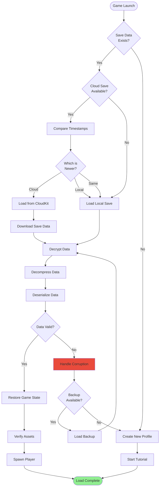
```mermaid
graph TB
    START([Game Launch]) --> CHECK{Save Data<br/>Exists?}

    CHECK -->|Yes| SOURCE{Cloud Save<br/>Available?}
    CHECK -->|No| NEW[Create New Profile]

    SOURCE -->|Yes| COMPARE[Compare Timestamps]
    SOURCE -->|No| LOAD_LOCAL[Load Local Save]

    COMPARE --> NEWER{Which is<br/>Newer?}
    NEWER -->|Cloud| LOAD_CLOUD[Load from CloudKit]
    NEWER -->|Local| LOAD_LOCAL
    NEWER -->|Same| LOAD_LOCAL

    LOAD_CLOUD --> DOWNLOAD[Download Save Data]
    DOWNLOAD --> DECRYPT[Decrypt Data]

    LOAD_LOCAL --> DECRYPT

    DECRYPT --> DECOMPRESS[Decompress Data]
    DECOMPRESS --> DESERIALIZE[Deserialize Data]

    DESERIALIZE --> VALIDATE{Data Valid?}
    VALIDATE -->|Yes| RESTORE[Restore Game State]
    VALIDATE -->|No| CORRUPT[Handle Corruption]

    CORRUPT --> BACKUP{Backup<br/>Available?}
    BACKUP -->|Yes| LOAD_BACKUP[Load Backup]
    BACKUP -->|No| NEW

    LOAD_BACKUP --> DECRYPT

    RESTORE --> VERIFY[Verify Assets]
    VERIFY --> SPAWN[Spawn Player]
    SPAWN --> COMPLETE([Load Complete])

    NEW --> TUTORIAL[Start Tutorial]
    TUTORIAL --> COMPLETE

    style COMPLETE fill:#90EE90
    style CORRUPT fill:#E94B3C
```

### Auto-Save Trigger Flow

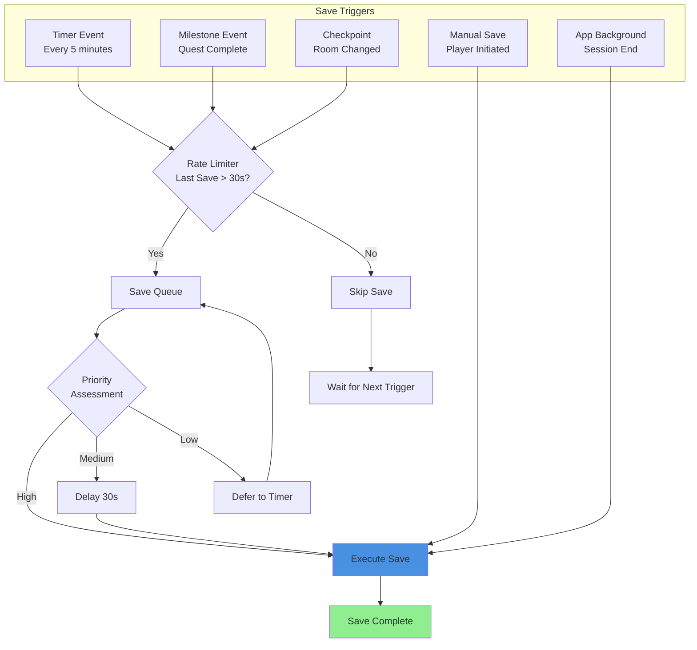
```mermaid
graph TB
    subgraph "Save Triggers"
        TIMER[Timer Event<br/>Every 5 minutes]
        MILESTONE[Milestone Event<br/>Quest Complete]
        CHECKPOINT[Checkpoint<br/>Room Changed]
        MANUAL[Manual Save<br/>Player Initiated]
        EXIT[App Background<br/>Session End]
    end

    GATE{Rate Limiter<br/>Last Save > 30s?}

    TIMER --> GATE
    MILESTONE --> GATE
    CHECKPOINT --> GATE
    MANUAL --> SAVE
    EXIT --> SAVE

    GATE -->|Yes| QUEUE[Save Queue]
    GATE -->|No| SKIP[Skip Save]

    QUEUE --> PRIORITY{Priority<br/>Assessment}

    PRIORITY -->|High| SAVE[Execute Save]
    PRIORITY -->|Medium| DELAYED[Delay 30s]
    PRIORITY -->|Low| DEFERRED[Defer to Timer]

    DELAYED --> SAVE
    DEFERRED --> QUEUE

    SAVE --> COMPLETE[Save Complete]
    SKIP --> WAIT[Wait for Next Trigger]

    style SAVE fill:#4A90E2
    style COMPLETE fill:#90EE90
```

---

## Network Data Flows

### Multiplayer State Synchronization

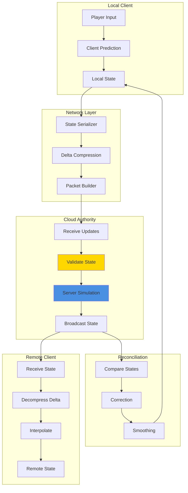
```mermaid
graph TB
    subgraph "Local Client"
        INPUT[Player Input]
        PREDICT[Client Prediction]
        LOCAL_STATE[Local State]
    end

    subgraph "Network Layer"
        SERIALIZE[State Serializer]
        DELTA[Delta Compression]
        PACKET[Packet Builder]
    end

    subgraph "Cloud Authority"
        RECEIVE[Receive Updates]
        VALIDATE[Validate State]
        SIMULATE[Server Simulation]
        BROADCAST[Broadcast State]
    end

    subgraph "Remote Client"
        REMOTE_RECEIVE[Receive State]
        DECOMPRESS[Decompress Delta]
        INTERPOLATE[Interpolate]
        REMOTE_STATE[Remote State]
    end

    subgraph "Reconciliation"
        COMPARE[Compare States]
        CORRECT[Correction]
        SMOOTH[Smoothing]
    end

    INPUT --> PREDICT
    PREDICT --> LOCAL_STATE
    LOCAL_STATE --> SERIALIZE

    SERIALIZE --> DELTA
    DELTA --> PACKET
    PACKET --> RECEIVE

    RECEIVE --> VALIDATE
    VALIDATE --> SIMULATE
    SIMULATE --> BROADCAST

    BROADCAST --> REMOTE_RECEIVE
    BROADCAST --> COMPARE

    REMOTE_RECEIVE --> DECOMPRESS
    DECOMPRESS --> INTERPOLATE
    INTERPOLATE --> REMOTE_STATE

    COMPARE --> CORRECT
    CORRECT --> SMOOTH
    SMOOTH --> LOCAL_STATE

    style VALIDATE fill:#FFD700
    style SIMULATE fill:#4A90E2
```

### SharePlay Integration Flow

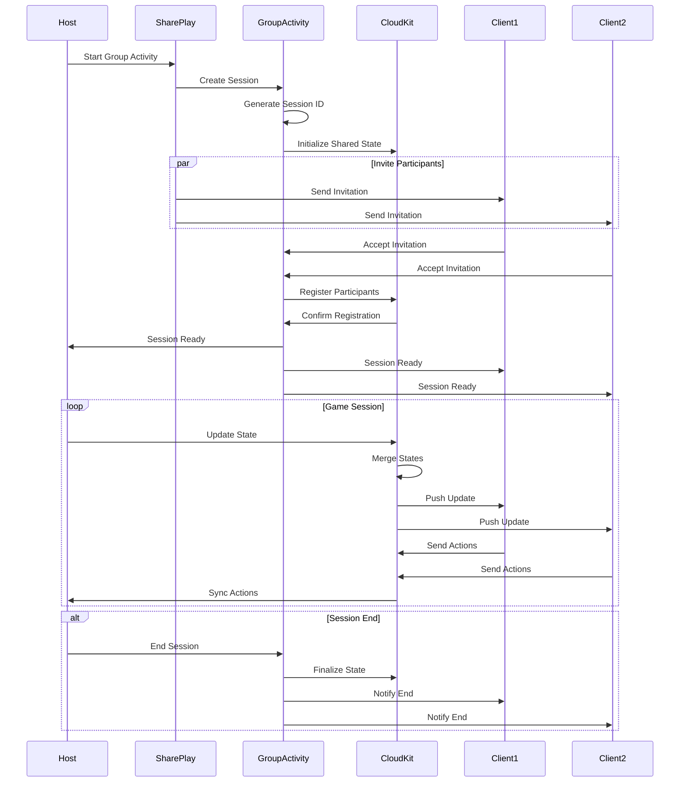
```mermaid
sequenceDiagram
    participant Host
    participant SharePlay
    participant GroupActivity
    participant CloudKit
    participant Client1
    participant Client2

    Host->>SharePlay: Start Group Activity
    SharePlay->>GroupActivity: Create Session

    GroupActivity->>GroupActivity: Generate Session ID
    GroupActivity->>CloudKit: Initialize Shared State

    par Invite Participants
        SharePlay->>Client1: Send Invitation
        SharePlay->>Client2: Send Invitation
    end

    Client1->>GroupActivity: Accept Invitation
    Client2->>GroupActivity: Accept Invitation

    GroupActivity->>CloudKit: Register Participants
    CloudKit->>GroupActivity: Confirm Registration

    GroupActivity->>Host: Session Ready
    GroupActivity->>Client1: Session Ready
    GroupActivity->>Client2: Session Ready

    loop Game Session
        Host->>CloudKit: Update State
        CloudKit->>CloudKit: Merge States
        CloudKit->>Client1: Push Update
        CloudKit->>Client2: Push Update

        Client1->>CloudKit: Send Actions
        Client2->>CloudKit: Send Actions
        CloudKit->>Host: Sync Actions
    end

    alt Session End
        Host->>GroupActivity: End Session
        GroupActivity->>CloudKit: Finalize State
        GroupActivity->>Client1: Notify End
        GroupActivity->>Client2: Notify End
    end
```

### Network Packet Structure

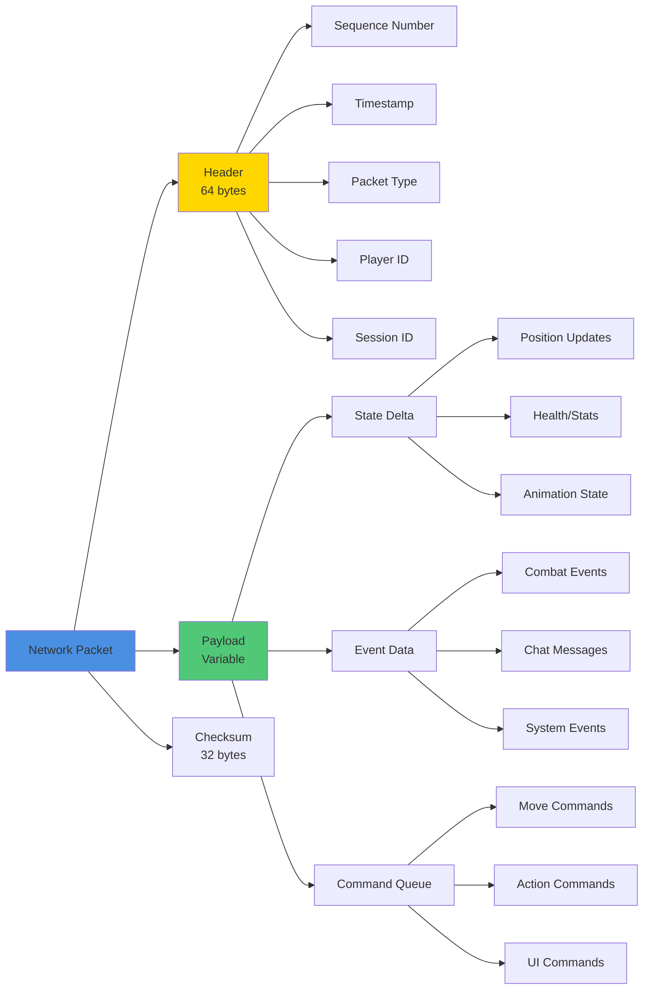
```mermaid
graph LR
    PACKET[Network Packet]

    PACKET --> HEADER[Header<br/>64 bytes]
    PACKET --> PAYLOAD[Payload<br/>Variable]
    PACKET --> CHECKSUM[Checksum<br/>32 bytes]

    HEADER --> SEQ[Sequence Number]
    HEADER --> TIMESTAMP[Timestamp]
    HEADER --> TYPE[Packet Type]
    HEADER --> PLAYER[Player ID]
    HEADER --> SESSION[Session ID]

    PAYLOAD --> STATE[State Delta]
    PAYLOAD --> EVENTS[Event Data]
    PAYLOAD --> COMMANDS[Command Queue]

    STATE --> POS[Position Updates]
    STATE --> HEALTH[Health/Stats]
    STATE --> ANIM[Animation State]

    EVENTS --> COMBAT[Combat Events]
    EVENTS --> CHAT[Chat Messages]
    EVENTS --> SYSTEM[System Events]

    COMMANDS --> MOVE[Move Commands]
    COMMANDS --> ACTION[Action Commands]
    COMMANDS --> UI[UI Commands]

    style PACKET fill:#4A90E2
    style HEADER fill:#FFD700
    style PAYLOAD fill:#50C878
```

---

## Asset Loading Pipeline

### Progressive Asset Loading

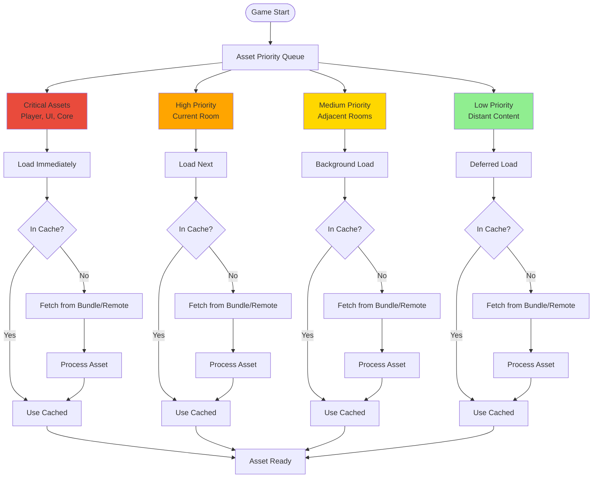
```mermaid
graph TB
    START([Game Start]) --> PRIORITY[Asset Priority Queue]

    PRIORITY --> CRITICAL[Critical Assets<br/>Player, UI, Core]
    PRIORITY --> HIGH[High Priority<br/>Current Room]
    PRIORITY --> MEDIUM[Medium Priority<br/>Adjacent Rooms]
    PRIORITY --> LOW[Low Priority<br/>Distant Content]

    CRITICAL --> LOAD_C[Load Immediately]
    HIGH --> LOAD_H[Load Next]
    MEDIUM --> LOAD_M[Background Load]
    LOW --> LOAD_L[Deferred Load]

    LOAD_C --> CACHE_C{In Cache?}
    LOAD_H --> CACHE_H{In Cache?}
    LOAD_M --> CACHE_M{In Cache?}
    LOAD_L --> CACHE_L{In Cache?}

    CACHE_C -->|Yes| USE_C[Use Cached]
    CACHE_C -->|No| FETCH_C[Fetch from Bundle/Remote]

    CACHE_H -->|Yes| USE_H[Use Cached]
    CACHE_H -->|No| FETCH_H[Fetch from Bundle/Remote]

    CACHE_M -->|Yes| USE_M[Use Cached]
    CACHE_M -->|No| FETCH_M[Fetch from Bundle/Remote]

    CACHE_L -->|Yes| USE_L[Use Cached]
    CACHE_L -->|No| FETCH_L[Fetch from Bundle/Remote]

    FETCH_C --> PROCESS_C[Process Asset]
    FETCH_H --> PROCESS_H[Process Asset]
    FETCH_M --> PROCESS_M[Process Asset]
    FETCH_L --> PROCESS_L[Process Asset]

    PROCESS_C --> USE_C
    PROCESS_H --> USE_H
    PROCESS_M --> USE_M
    PROCESS_L --> USE_L

    USE_C --> READY[Asset Ready]
    USE_H --> READY
    USE_M --> READY
    USE_L --> READY

    style CRITICAL fill:#E94B3C
    style HIGH fill:#FFA500
    style MEDIUM fill:#FFD700
    style LOW fill:#90EE90
```

### Asset Caching Strategy

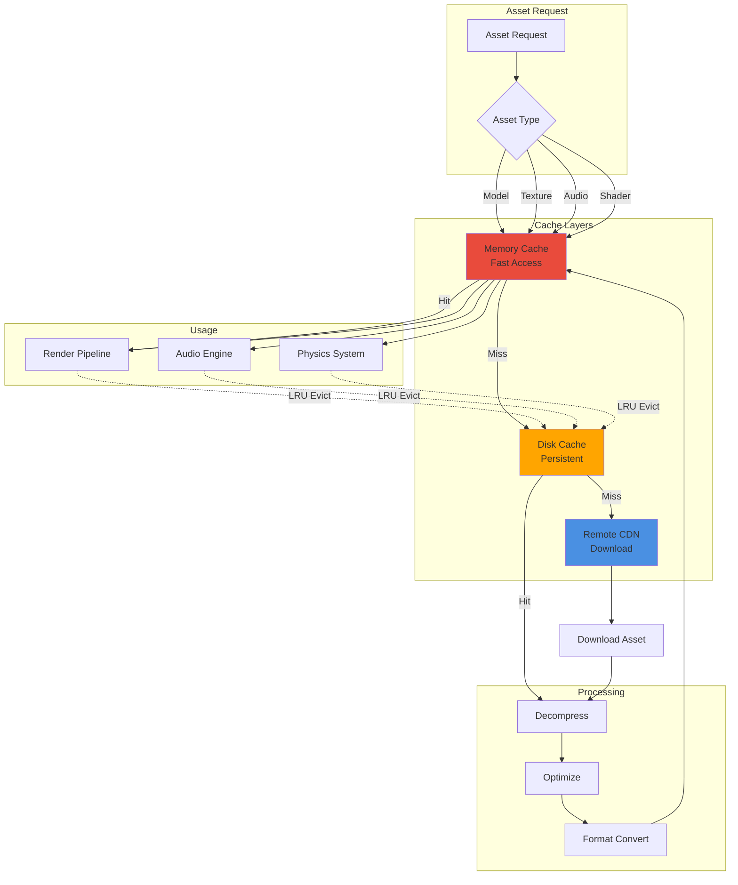
```mermaid
graph TB
    subgraph "Asset Request"
        REQUEST[Asset Request]
        TYPE{Asset Type}
    end

    subgraph "Cache Layers"
        L1[Memory Cache<br/>Fast Access]
        L2[Disk Cache<br/>Persistent]
        L3[Remote CDN<br/>Download]
    end

    subgraph "Processing"
        DECOMPRESS[Decompress]
        OPTIMIZE[Optimize]
        FORMAT[Format Convert]
    end

    subgraph "Usage"
        RENDER[Render Pipeline]
        AUDIO[Audio Engine]
        PHYSICS[Physics System]
    end

    REQUEST --> TYPE
    TYPE -->|Model| L1
    TYPE -->|Texture| L1
    TYPE -->|Audio| L1
    TYPE -->|Shader| L1

    L1 -->|Hit| RENDER
    L1 -->|Miss| L2

    L2 -->|Hit| DECOMPRESS
    L2 -->|Miss| L3

    L3 --> DOWNLOAD[Download Asset]
    DOWNLOAD --> DECOMPRESS

    DECOMPRESS --> OPTIMIZE
    OPTIMIZE --> FORMAT
    FORMAT --> L1

    L1 --> RENDER
    L1 --> AUDIO
    L1 --> PHYSICS

    RENDER -.LRU Evict.-> L2
    AUDIO -.LRU Evict.-> L2
    PHYSICS -.LRU Evict.-> L2

    style L1 fill:#E94B3C
    style L2 fill:#FFA500
    style L3 fill:#4A90E2
```

---

## Input Processing Flow

### Hand Tracking Pipeline

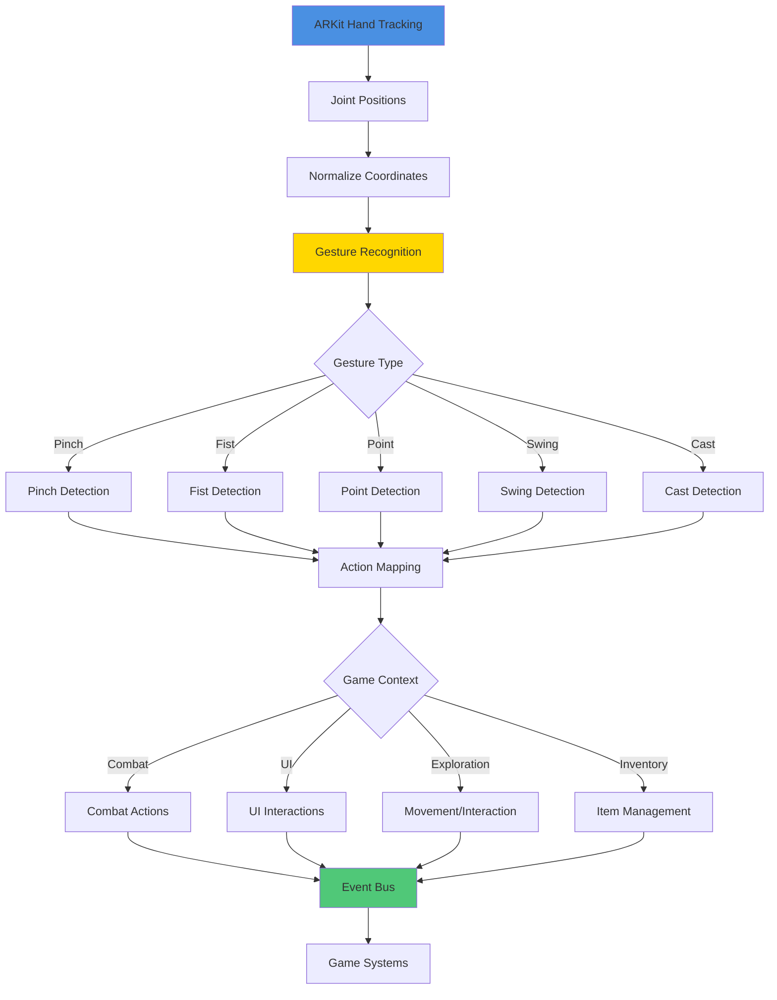
```mermaid
graph TB
    HANDS[ARKit Hand Tracking] --> JOINTS[Joint Positions]
    JOINTS --> NORMALIZE[Normalize Coordinates]

    NORMALIZE --> GESTURE[Gesture Recognition]
    GESTURE --> CLASSIFY{Gesture Type}

    CLASSIFY -->|Pinch| PINCH_DETECT[Pinch Detection]
    CLASSIFY -->|Fist| FIST_DETECT[Fist Detection]
    CLASSIFY -->|Point| POINT_DETECT[Point Detection]
    CLASSIFY -->|Swing| SWING_DETECT[Swing Detection]
    CLASSIFY -->|Cast| CAST_DETECT[Cast Detection]

    PINCH_DETECT --> ACTION_MAP[Action Mapping]
    FIST_DETECT --> ACTION_MAP
    POINT_DETECT --> ACTION_MAP
    SWING_DETECT --> ACTION_MAP
    CAST_DETECT --> ACTION_MAP

    ACTION_MAP --> CONTEXT{Game Context}

    CONTEXT -->|Combat| COMBAT_INPUT[Combat Actions]
    CONTEXT -->|UI| UI_INPUT[UI Interactions]
    CONTEXT -->|Exploration| EXPLORE_INPUT[Movement/Interaction]
    CONTEXT -->|Inventory| INV_INPUT[Item Management]

    COMBAT_INPUT --> EVENT_BUS[Event Bus]
    UI_INPUT --> EVENT_BUS
    EXPLORE_INPUT --> EVENT_BUS
    INV_INPUT --> EVENT_BUS

    EVENT_BUS --> SYSTEMS[Game Systems]

    style HANDS fill:#4A90E2
    style GESTURE fill:#FFD700
    style EVENT_BUS fill:#50C878
```

### Gesture Quality Assessment

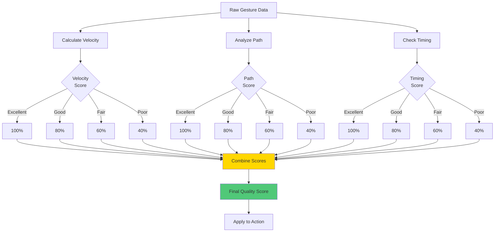
```mermaid
graph TB
    GESTURE_DATA[Raw Gesture Data] --> VELOCITY[Calculate Velocity]
    GESTURE_DATA --> PATH[Analyze Path]
    GESTURE_DATA --> TIMING[Check Timing]

    VELOCITY --> VEL_SCORE{Velocity<br/>Score}
    PATH --> PATH_SCORE{Path<br/>Score}
    TIMING --> TIME_SCORE{Timing<br/>Score}

    VEL_SCORE -->|Excellent| V_100[100%]
    VEL_SCORE -->|Good| V_80[80%]
    VEL_SCORE -->|Fair| V_60[60%]
    VEL_SCORE -->|Poor| V_40[40%]

    PATH_SCORE -->|Excellent| P_100[100%]
    PATH_SCORE -->|Good| P_80[80%]
    PATH_SCORE -->|Fair| P_60[60%]
    PATH_SCORE -->|Poor| P_40[40%]

    TIME_SCORE -->|Excellent| T_100[100%]
    TIME_SCORE -->|Good| T_80[80%]
    TIME_SCORE -->|Fair| T_60[60%]
    TIME_SCORE -->|Poor| T_40[40%]

    V_100 --> COMBINE[Combine Scores]
    V_80 --> COMBINE
    V_60 --> COMBINE
    V_40 --> COMBINE
    P_100 --> COMBINE
    P_80 --> COMBINE
    P_60 --> COMBINE
    P_40 --> COMBINE
    T_100 --> COMBINE
    T_80 --> COMBINE
    T_60 --> COMBINE
    T_40 --> COMBINE

    COMBINE --> FINAL[Final Quality Score]
    FINAL --> APPLY[Apply to Action]

    style COMBINE fill:#FFD700
    style FINAL fill:#50C878
```

---

## Combat Data Flow

### Damage Calculation Pipeline

```mermaid
graph TB
    ATTACK[Attack Initiated] --> BASE[Base Damage<br/>Weapon Stat]

    BASE --> ATTACKER[Attacker Stats]
    ATTACKER --> STR[Strength Bonus]
    ATTACKER --> CRIT[Critical Check]

    STR --> GESTURE[Gesture Quality]
    GESTURE --> TOTAL_ATK[Total Attack Power]

    CRIT -->|Success| CRIT_MULT[x2 Damage]
    CRIT -->|Fail| TOTAL_ATK
    CRIT_MULT --> TOTAL_ATK

    TOTAL_ATK --> DEFENDER[Defender Stats]
    DEFENDER --> DEF[Defense Value]
    DEFENDER --> RESIST[Resistance]

    DEF --> REDUCTION[Damage Reduction]
    RESIST --> REDUCTION

    REDUCTION --> FINAL[Final Damage]
    FINAL --> MIN{Minimum<br/>Damage}

    MIN -->|< 1| ONE[Set to 1]
    MIN -->|>= 1| APPLY[Apply Damage]
    ONE --> APPLY

    APPLY --> HEALTH[Update Health]
    HEALTH --> CHECK{Health > 0?}

    CHECK -->|Yes| CONTINUE[Continue Combat]
    CHECK -->|No| DEFEAT[Enemy Defeated]

    DEFEAT --> LOOT[Drop Loot]
    DEFEAT --> EXP[Grant Experience]

    style FINAL fill:#FFD700
    style DEFEAT fill:#E94B3C
```

### Combat Event Chain

```mermaid
sequenceDiagram
    participant Attacker
    participant CombatSys
    participant Defender
    participant EventBus
    participant VFXSys
    participant AudioSys
    participant UISys
    participant QuestSys

    Attacker->>CombatSys: Initiate Attack
    CombatSys->>CombatSys: Validate Attack
    CombatSys->>CombatSys: Calculate Damage

    CombatSys->>Defender: Apply Damage
    Defender->>Defender: Update Health

    CombatSys->>EventBus: Publish DamageDealtEvent

    par Parallel Processing
        EventBus->>VFXSys: Trigger Hit VFX
        VFXSys->>VFXSys: Spawn Blood/Impact Effect
    and
        EventBus->>AudioSys: Trigger Hit Sound
        AudioSys->>AudioSys: Play Impact Audio
    and
        EventBus->>UISys: Update UI
        UISys->>UISys: Show Damage Numbers
        UISys->>UISys: Update Health Bar
    end

    alt Defender Defeated
        Defender->>EventBus: Publish EnemyDefeatedEvent

        par Victory Processing
            EventBus->>Attacker: Grant Experience
            Attacker->>Attacker: Add to Total XP
        and
            EventBus->>QuestSys: Check Quest Progress
            QuestSys->>QuestSys: Update Kill Count
        and
            EventBus->>VFXSys: Victory Effects
            VFXSys->>VFXSys: Spawn Death Animation
        and
            EventBus->>AudioSys: Victory Sound
            AudioSys->>AudioSys: Play Defeat Audio
        end

        Defender->>Defender: Drop Loot
        UISys->>UISys: Show Victory Notification
    end
```

---

## Quest System Data Flow

### Quest Lifecycle

```mermaid
stateDiagram-v2
    [*] --> Available

    Available --> Offered: Trigger Condition Met
    Offered --> Active: Player Accepts
    Offered --> Declined: Player Declines

    Declined --> Available: Cooldown Expired

    Active --> InProgress: Objectives Tracked
    InProgress --> InProgress: Objective Updated

    InProgress --> Failed: Fail Condition Met
    InProgress --> Complete: All Objectives Met

    Failed --> Available: Retry Allowed
    Failed --> Locked: Max Attempts Reached

    Complete --> Rewarded: Rewards Granted
    Rewarded --> [*]

    Locked --> [*]

    note right of InProgress
        Track objectives
        Update UI
        Auto-save progress
        Trigger events
    end note

    note right of Rewarded
        Grant items
        Grant experience
        Update statistics
        Check achievements
    end note
```

### Quest Progress Tracking

```mermaid
graph TB
    QUEST[Active Quest] --> OBJECTIVES[Quest Objectives]

    OBJECTIVES --> OBJ1[Objective 1:<br/>Kill 5 Goblins]
    OBJECTIVES --> OBJ2[Objective 2:<br/>Collect 3 Items]
    OBJECTIVES --> OBJ3[Objective 3:<br/>Talk to NPC]

    OBJ1 --> TRACK1[Progress Tracker]
    OBJ2 --> TRACK2[Progress Tracker]
    OBJ3 --> TRACK3[Progress Tracker]

    TRACK1 --> EVENT1[Listen: EnemyDefeatedEvent]
    TRACK2 --> EVENT2[Listen: ItemCollectedEvent]
    TRACK3 --> EVENT3[Listen: DialogueCompleteEvent]

    EVENT1 -->|Goblin Killed| UPDATE1[Update Count: 1/5]
    EVENT2 -->|Item Found| UPDATE2[Update Count: 1/3]
    EVENT3 -->|NPC Talked| UPDATE3[Complete: 1/1]

    UPDATE1 --> CHECK1{Complete?}
    UPDATE2 --> CHECK2{Complete?}
    UPDATE3 --> CHECK3{Complete?}

    CHECK1 -->|No| WAIT1[Continue]
    CHECK1 -->|Yes| COMPLETE1[Mark Complete]

    CHECK2 -->|No| WAIT2[Continue]
    CHECK2 -->|Yes| COMPLETE2[Mark Complete]

    CHECK3 -->|Yes| COMPLETE3[Mark Complete]

    COMPLETE1 --> ALL_CHECK{All Objectives<br/>Complete?}
    COMPLETE2 --> ALL_CHECK
    COMPLETE3 --> ALL_CHECK

    ALL_CHECK -->|Yes| QUEST_COMPLETE[Quest Complete]
    ALL_CHECK -->|No| CONTINUE[Continue Quest]

    QUEST_COMPLETE --> NOTIFY[Notify Player]
    NOTIFY --> REWARD[Grant Rewards]

    style QUEST_COMPLETE fill:#50C878
    style REWARD fill:#FFD700
```

---

## Conclusion

This comprehensive data flow documentation provides detailed insights into how information moves through Reality Realms RPG. Understanding these flows is critical for:

### Development
- Implementing new features with proper data handling
- Debugging issues by tracing data paths
- Optimizing performance bottlenecks

### Debugging
- Identifying where data transformation occurs
- Understanding event propagation timing
- Locating state inconsistencies

### Optimization
- Reducing redundant data transfers
- Implementing efficient caching strategies
- Minimizing network bandwidth usage

### Key Principles

1. **Event-Driven Architecture**: Central event bus enables loose coupling
2. **State Synchronization**: Client prediction with server reconciliation
3. **Progressive Loading**: Priority-based asset streaming
4. **Persistent State**: CloudKit sync with local caching
5. **Performance First**: Every data flow optimized for 90 FPS

All data flows are designed to maintain the strict performance budgets required for smooth visionOS gameplay while providing robust multiplayer synchronization and persistent world state.
