# Reality Realms RPG - Localization Strategy

## Table of Contents
- [Localization Overview](#localization-overview)
- [Supported Languages](#supported-languages)
- [Translation Workflow](#translation-workflow)
- [String Externalization](#string-externalization)
- [Testing Localized Content](#testing-localized-content)
- [RTL Language Support](#rtl-language-support)
- [Cultural Considerations](#cultural-considerations)
- [Asset Localization](#asset-localization)
- [Voice Acting](#voice-acting)
- [Quality Assurance](#quality-assurance)

---

## Localization Overview

Reality Realms RPG is designed from the ground up with international audiences in mind. Our localization strategy ensures players worldwide can enjoy the game in their native language with culturally appropriate content.

### Localization Goals

1. **Accessibility**: Make the game accessible to players worldwide
2. **Quality**: Maintain narrative quality across all languages
3. **Cultural Sensitivity**: Adapt content appropriately for different regions
4. **Performance**: No performance impact from localization
5. **Maintainability**: Easy updates across all languages

### Technical Architecture

```mermaid
graph TB
    subgraph "Source Content"
        EN[English (Source)]
        STRINGS[String Tables]
        ASSETS[Localizable Assets]
    end

    subgraph "Translation Pipeline"
        EXTRACT[String Extraction]
        TMS[Translation Management System]
        REVIEW[Quality Review]
    end

    subgraph "Localized Content"
        ES[Spanish]
        FR[French]
        DE[German]
        JA[Japanese]
        ZH[Chinese]
        KO[Korean]
        AR[Arabic]
        PT[Portuguese]
        IT[Italian]
        RU[Russian]
    end

    subgraph "Integration"
        BUILD[Build Process]
        TEST[Localization Testing]
        DEPLOY[Deployment]
    end

    EN --> EXTRACT
    STRINGS --> EXTRACT
    ASSETS --> EXTRACT

    EXTRACT --> TMS
    TMS --> REVIEW
    REVIEW --> ES
    REVIEW --> FR
    REVIEW --> DE
    REVIEW --> JA
    REVIEW --> ZH
    REVIEW --> KO
    REVIEW --> AR
    REVIEW --> PT
    REVIEW --> IT
    REVIEW --> RU

    ES --> BUILD
    FR --> BUILD
    DE --> BUILD
    JA --> BUILD
    ZH --> BUILD
    KO --> BUILD
    AR --> BUILD
    PT --> BUILD
    IT --> BUILD
    RU --> BUILD

    BUILD --> TEST
    TEST --> DEPLOY

    style EN fill:#FFD700
    style TMS fill:#4A90E2
    style TEST fill:#50C878
```

---

## Supported Languages

### Launch Languages (Phase 1)

| Language | Region | Priority | Completion Target |
|----------|--------|----------|-------------------|
| English (US) | North America | Source | 100% (Launch) |
| English (UK) | United Kingdom | High | 100% (Launch) |
| Spanish (ES) | Spain | High | 100% (Launch) |
| Spanish (LATAM) | Latin America | High | 100% (Launch) |
| French | France/Canada | High | 100% (Launch) |
| German | Germany/Austria | High | 100% (Launch) |
| Japanese | Japan | High | 100% (Launch) |

### Expansion Languages (Phase 2 - Month 3)

| Language | Region | Priority | Completion Target |
|----------|--------|----------|-------------------|
| Chinese (Simplified) | Mainland China | High | 100% (Month 3) |
| Chinese (Traditional) | Taiwan/Hong Kong | Medium | 100% (Month 3) |
| Korean | South Korea | High | 100% (Month 3) |
| Portuguese (BR) | Brazil | Medium | 100% (Month 3) |
| Italian | Italy | Medium | 100% (Month 4) |
| Russian | Russia | Medium | 100% (Month 4) |

### Future Languages (Phase 3 - Month 6+)

| Language | Region | Priority | Completion Target |
|----------|--------|----------|-------------------|
| Arabic | Middle East | Medium | 100% (Month 6) |
| Turkish | Turkey | Low | 100% (Month 6) |
| Dutch | Netherlands | Low | 100% (Month 7) |
| Polish | Poland | Low | 100% (Month 7) |
| Thai | Thailand | Low | 100% (Month 8) |
| Vietnamese | Vietnam | Low | 100% (Month 8) |

### Language Coverage Goals

```mermaid
pie title Language Coverage by Region
    "North America" : 30
    "Europe" : 25
    "Asia" : 35
    "Latin America" : 7
    "Middle East" : 3
```



---

## Translation Workflow

### Development Process


### String Tagging Best Practices

```swift
// Good: Localized with context
Text(NSLocalizedString(
    "QUEST_COMPLETE_TITLE",
    comment: "Title shown when player completes a quest"
))

// Good: With parameters
String(format: NSLocalizedString(
    "DAMAGE_DEALT",
    comment: "Shows damage number. %d is damage amount."
), damageAmount)

// Bad: Hardcoded string
Text("Quest Complete!") // Never hardcode!

// Bad: No context
NSLocalizedString("OK", comment: "") // Ambiguous!
```

### Context Guidelines

Every localizable string must include:

1. **Key**: Unique identifier (UPPERCASE_SNAKE_CASE)
2. **Comment**: Description of where/how the string is used
3. **Character Limit**: Maximum length constraints (if any)
4. **Variables**: Description of any placeholders
5. **Context**: Game state, tone, formality level
6. **Screenshot**: UI location when applicable

### Translation Management System

We use **Lokalise** for translation management:

```yaml
TMS_Configuration:
  platform: Lokalise
  features:
    - version_control_integration
    - context_screenshots
    - translation_memory
    - glossary_management
    - quality_checks
    - api_integration

  workflow:
    - developer_uploads_strings
    - translator_translates
    - reviewer_approves
    - automated_pull_to_repository
    - ci_cd_integration
```

---

## String Externalization

### File Structure

```
RealityRealms.xcodeproj/
├── Resources/
│   ├── Localizations/
│   │   ├── en.lproj/
│   │   │   ├── Localizable.strings
│   │   │   ├── Localizable.stringsdict
│   │   │   ├── UI.strings
│   │   │   ├── Dialogue.strings
│   │   │   ├── Items.strings
│   │   │   ├── Quests.strings
│   │   │   └── Errors.strings
│   │   ├── es.lproj/
│   │   │   └── ... (same structure)
│   │   ├── fr.lproj/
│   │   │   └── ... (same structure)
│   │   └── ... (other languages)
```

### String Categories

#### 1. UI Strings (UI.strings)

```
/* Main Menu */
"MENU_START_GAME" = "Start Game";
"MENU_CONTINUE" = "Continue";
"MENU_MULTIPLAYER" = "Multiplayer";
"MENU_SETTINGS" = "Settings";
"MENU_QUIT" = "Quit";

/* Settings */
"SETTINGS_GRAPHICS" = "Graphics";
"SETTINGS_AUDIO" = "Audio";
"SETTINGS_CONTROLS" = "Controls";
"SETTINGS_LANGUAGE" = "Language";

/* HUD */
"HUD_HEALTH" = "Health";
"HUD_MANA" = "Mana";
"HUD_LEVEL" = "Level %d"; // %d = player level
```

#### 2. Dialogue Strings (Dialogue.strings)

```
/* Quest Giver - Merchant */
"NPC_MERCHANT_GREETING" = "Welcome, traveler! What can I do for you?";
"NPC_MERCHANT_SHOP" = "Take a look at my wares!";
"NPC_MERCHANT_QUEST_AVAILABLE" = "I have a task for you, if you're interested.";
"NPC_MERCHANT_FAREWELL" = "Safe travels, friend!";

/* Quest Giver - Guard */
"NPC_GUARD_GREETING" = "Halt! State your business.";
"NPC_GUARD_QUEST_COMPLETE" = "You've done well. The realm is safer thanks to you.";
```

#### 3. Item Strings (Items.strings)

```
/* Weapons */
"ITEM_SWORD_IRON_NAME" = "Iron Sword";
"ITEM_SWORD_IRON_DESC" = "A basic but reliable sword forged from iron.";

"ITEM_STAFF_FIRE_NAME" = "Staff of Flames";
"ITEM_STAFF_FIRE_DESC" = "A magical staff imbued with the power of fire.";

/* Potions */
"ITEM_POTION_HEALTH_NAME" = "Health Potion";
"ITEM_POTION_HEALTH_DESC" = "Restores 50 health points.";
```

#### 4. Quest Strings (Quests.strings)

```
/* Main Quest Line */
"QUEST_MAIN_001_TITLE" = "The Awakening";
"QUEST_MAIN_001_DESC" = "Investigate the strange portal that appeared in your home.";
"QUEST_MAIN_001_OBJ_1" = "Examine the portal";
"QUEST_MAIN_001_OBJ_2" = "Speak to the Guardian";
"QUEST_MAIN_001_COMPLETE" = "The portal is more than it seems. Your journey has just begun.";
```

### Pluralization Support

Use `.stringsdict` for proper pluralization:

```xml
<?xml version="1.0" encoding="UTF-8"?>
<plist version="1.0">
<dict>
    <key>ENEMIES_DEFEATED</key>
    <dict>
        <key>NSStringLocalizedFormatKey</key>
        <string>%#@enemies@</string>
        <key>enemies</key>
        <dict>
            <key>NSStringFormatSpecTypeKey</key>
            <string>NSStringPluralRuleType</string>
            <key>NSStringFormatValueTypeKey</key>
            <string>d</string>
            <key>zero</key>
            <string>No enemies defeated</string>
            <key>one</key>
            <string>1 enemy defeated</string>
            <key>other</key>
            <string>%d enemies defeated</string>
        </dict>
    </dict>
</dict>
</plist>
```

### Variable Substitution

```swift
// Numbers
String(format: NSLocalizedString("GOLD_AMOUNT", comment: ""), goldCount)
// "You have %d gold" → "You have 100 gold"

// Names
String(format: NSLocalizedString("GREETING_PLAYER", comment: ""), playerName)
// "Welcome, %@!" → "Welcome, Hero!"

// Multiple variables
String(format: NSLocalizedString("DAMAGE_TO_ENEMY", comment: ""), damage, enemyName)
// "Dealt %d damage to %@" → "Dealt 50 damage to Goblin"
```

---

## Testing Localized Content

### Automated Testing

```swift
class LocalizationTests: XCTestCase {
    func testAllKeysExistInAllLanguages() {
        let languages = ["en", "es", "fr", "de", "ja", "zh", "ko"]
        let baseKeys = getKeysForLanguage("en")

        for language in languages {
            let keys = getKeysForLanguage(language)
            XCTAssertEqual(baseKeys.count, keys.count,
                "Language \(language) has different number of keys")

            for key in baseKeys {
                XCTAssertTrue(keys.contains(key),
                    "Language \(language) missing key: \(key)")
            }
        }
    }

    func testNoHardcodedStrings() {
        // Scan codebase for hardcoded strings in UI
        let violations = findHardcodedStrings()
        XCTAssertEqual(violations.count, 0,
            "Found hardcoded strings: \(violations)")
    }

    func testStringLengths() {
        let keys = ["MENU_START_GAME", "MENU_CONTINUE", "MENU_SETTINGS"]
        let maxLength = 20 // UI constraint

        for language in ["en", "es", "fr", "de"] {
            for key in keys {
                let string = NSLocalizedString(key, preferredLanguages: [language])
                XCTAssertLessThanOrEqual(string.count, maxLength,
                    "\(language).\(key) exceeds max length")
            }
        }
    }
}
```

### Manual Testing Checklist

- [ ] All UI text displays correctly
- [ ] No truncation or overflow
- [ ] Proper text alignment
- [ ] Correct font rendering
- [ ] Appropriate character spacing
- [ ] Pluralization works correctly
- [ ] Variable substitution displays properly
- [ ] Date/time formats are locale-specific
- [ ] Currency formats are correct
- [ ] Number formats use locale separators
- [ ] Sort order is appropriate for language

### Pseudolocalization

For testing UI flexibility before translation:

```swift
func pseudolocalize(_ string: String) -> String {
    // Add prefix/suffix to spot non-localized strings
    let marked = "[ψ \(string) ψ]"

    // Expand length by 30% to test UI constraints
    let expanded = marked + String(repeating: "~", count: string.count / 3)

    // Add special characters to test encoding
    return expanded.applyingTransform(.toLatin, reverse: false) ?? expanded
}

// "Start Game" → "[ψ Śtärt Gämé ψ]~~~~~~~~~~"
```

---

## RTL Language Support

### Right-to-Left Languages

For Arabic, Hebrew, and other RTL languages:

```swift
// Automatic RTL support
struct GameUI: View {
    @Environment(\.layoutDirection) var layoutDirection

    var body: some View {
        HStack {
            // Automatically flips for RTL
            Image(systemName: "arrow.right")
            Text("Next")
        }
        .environment(\.layoutDirection, layoutDirection)
    }
}
```

### RTL Considerations


### Assets for RTL

Some assets need mirroring:

```swift
// Images that should mirror in RTL
let mirroredImages = [
    "arrow_right",
    "chevron_forward",
    "back_button",
    "menu_icon"
]

// Images that should NOT mirror
let staticImages = [
    "character_avatar",
    "item_icon",
    "enemy_portrait",
    "logo"
]
```

### Text Alignment

```swift
// Use natural alignment (auto RTL)
Text("Welcome")
    .multilineTextAlignment(.leading) // Becomes .trailing in RTL

// Force specific alignment if needed
Text("12345") // Numbers
    .multilineTextAlignment(.trailing) // Always right-aligned
```

---

## Cultural Considerations

### Content Adaptation

| Element | Consideration | Example |
|---------|---------------|---------|
| Colors | Cultural meanings vary | Red = luck (China), danger (US) |
| Numbers | Unlucky numbers | 4 in East Asia, 13 in West |
| Gestures | Hand gestures differ | Thumbs up offensive in some regions |
| Symbols | Religious/cultural sensitivity | Crosses, crescents, stars |
| Food | Dietary restrictions | Pork, beef, alcohol references |
| Animals | Cultural significance | Dogs, cats, owls have different meanings |
| Names | Appropriate naming | Character names culturally appropriate |

### Regional Variants

```swift
enum GameRegion {
    case global           // Default version
    case china            // Censorship compliance
    case germany          // Violence restrictions
    case middleEast       // Cultural adaptations
    case japan            // CERO rating compliance

    var contentFilter: ContentFilter {
        switch self {
        case .global:
            return .standard
        case .china:
            return .chinaCensorship
        case .germany:
            return .germanyUSK
        case .middleEast:
            return .culturalAdaptation
        case .japan:
            return .ceroz
        }
    }
}
```

### Censorship Compliance

For regions with content restrictions:

```swift
struct ContentManager {
    func getLocalizedAsset(_ assetName: String) -> Asset {
        let region = detectRegion()

        switch region {
        case .china:
            // Replace skulls with alternative symbols
            return assetName.contains("skull") ?
                loadAsset("\(assetName)_china") :
                loadAsset(assetName)

        case .germany:
            // Reduce blood effects
            return assetName.contains("blood") ?
                loadAsset("\(assetName)_reduced") :
                loadAsset(assetName)

        default:
            return loadAsset(assetName)
        }
    }
}
```

---

## Asset Localization

### Localizable Assets

1. **Images with Text**
   - UI buttons with labels
   - Tutorial images
   - Marketing screenshots
   - Achievement badges

2. **Audio**
   - Voice acting
   - NPC dialogue
   - Tutorial narration
   - Cutscene audio

3. **Video**
   - Cutscenes with subtitles
   - Tutorial videos
   - Trailer localization

### Asset Organization

```
Assets/
├── Textures/
│   ├── UI/
│   │   ├── Buttons/
│   │   │   ├── en/
│   │   │   │   ├── start_button.png
│   │   │   │   └── quit_button.png
│   │   │   ├── es/
│   │   │   ├── fr/
│   │   │   └── ja/
│   ├── Tutorial/
│   │   ├── en/
│   │   ├── es/
│   │   └── ... (other languages)
├── Audio/
│   ├── Dialogue/
│   │   ├── en/
│   │   ├── es/
│   │   ├── fr/
│   │   ├── ja/
│   │   └── ... (other languages)
│   ├── UI/
│   │   └── ... (same structure)
├── Videos/
│   ├── Cutscenes/
│   │   ├── en/
│   │   └── ... (with subtitles)
```

---

## Voice Acting

### Language-Specific Voice Casting

| Language | Voice Actors | Recording Studio | Status |
|----------|--------------|------------------|--------|
| English | 25 actors | Los Angeles, CA | ✅ Complete |
| Spanish | 25 actors | Mexico City, MX | ✅ Complete |
| French | 25 actors | Paris, FR | ✅ Complete |
| German | 25 actors | Berlin, DE | ✅ Complete |
| Japanese | 30 actors | Tokyo, JP | 🔄 In Progress |
| Chinese | 25 actors | Beijing, CN | 📅 Planned |
| Korean | 20 actors | Seoul, KR | 📅 Planned |

### Voice Direction Guidelines

```yaml
Voice_Recording_Standards:
  audio_format: WAV 48kHz 24-bit
  background_noise: < -60dB
  dynamic_range: -6dB to -20dB
  mouth_clicks: Remove
  breath_sounds: Keep natural

  direction:
    tone: Matches character personality
    emotion: Appropriate for scene context
    pacing: Natural for language
    pronunciation: Clear and accurate

  delivery:
    multiple_takes: Minimum 3 per line
    emotional_variations: Happy, sad, angry, neutral
    intensity_variations: Calm, excited, urgent
```

### Lip Sync Considerations

```swift
// Phoneme-based lip sync for multiple languages
struct LipSyncManager {
    func generateLipSync(for audioFile: String, language: String) -> [Viseme] {
        let phonemes = extractPhonemes(from: audioFile, language: language)
        return phonemes.map { phoneme in
            Viseme(phoneme: phoneme, duration: phoneme.duration)
        }
    }

    // Language-specific phoneme sets
    let phonemeSets: [String: [Phoneme]] = [
        "en": englishPhonemes,
        "es": spanishPhonemes,
        "fr": frenchPhonemes,
        "ja": japanesePhonemes
    ]
}
```

---

## Quality Assurance

### Translation Quality Metrics


### Quality Checklist

- [ ] **Accuracy**: Translation matches source meaning
- [ ] **Completeness**: No missing strings
- [ ] **Consistency**: Terms used consistently
- [ ] **Grammar**: Proper grammar and spelling
- [ ] **Context**: Appropriate for game context
- [ ] **Culture**: Culturally appropriate
- [ ] **Style**: Matches game tone and style
- [ ] **Technical**: Variables and formatting correct
- [ ] **Length**: Fits UI constraints
- [ ] **Accessibility**: Screen reader compatible

### Glossary Management

Maintain consistent terminology:

| English | Spanish | French | German | Japanese | Notes |
|---------|---------|--------|--------|----------|-------|
| Health | Salud | Santé | Gesundheit | 体力 | Player HP |
| Mana | Maná | Mana | Mana | マナ | Magic points |
| Quest | Misión | Quête | Quest | クエスト | Player task |
| Portal | Portal | Portail | Portal | ポータル | Dimensional gateway |
| Guardian | Guardián | Gardien | Wächter | 守護者 | Player title |

---

## Continuous Localization

### Update Process


### Version Control

```
translations/
├── version_1.0/
│   ├── en.strings
│   ├── es.strings
│   └── ... (other languages)
├── version_1.1/
│   ├── en.strings (updated)
│   ├── es.strings (updated)
│   └── ... (other languages)
├── CHANGELOG.md
└── translation_memory.tmx
```

---

## Conclusion

Localization is a critical component of Reality Realms RPG's global success strategy. By following these guidelines, we ensure:

### Success Metrics

- **Coverage**: 10+ languages covering 85% of global Vision Pro market
- **Quality**: 95%+ translation accuracy rating
- **Speed**: New content translated within 2 weeks
- **Cost**: Optimized through translation memory and automation
- **Satisfaction**: 4.5+ star rating in all language markets

### Best Practices Summary

1. Design with localization in mind from day one
2. Never hardcode strings
3. Provide context for translators
4. Test in multiple languages continuously
5. Respect cultural differences
6. Use professional translators
7. Implement proper RTL support
8. Maintain glossary consistency
9. Automate where possible
10. Listen to player feedback

Reality Realms RPG is a global game for a global audience. Quality localization is not optional—it's essential to our success.
