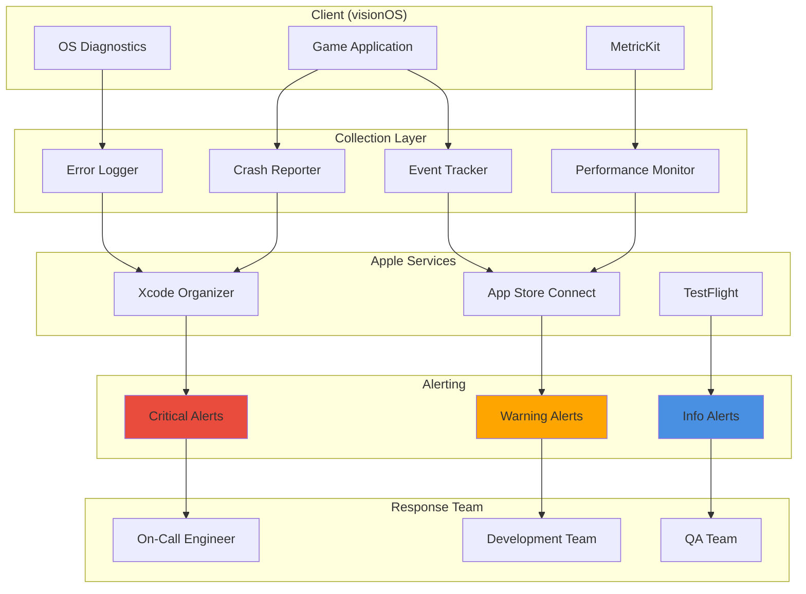
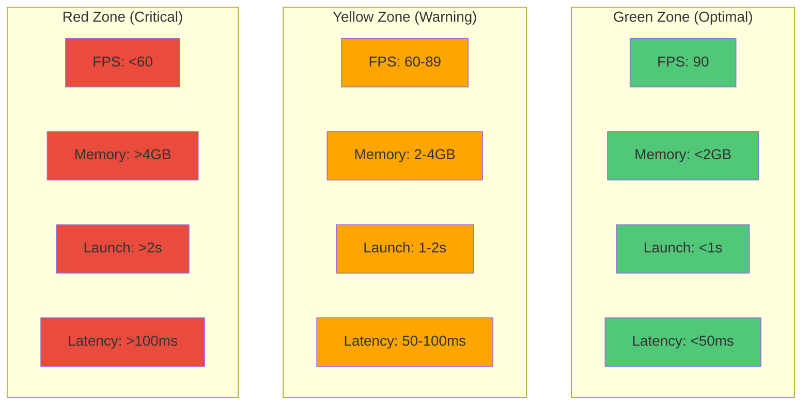
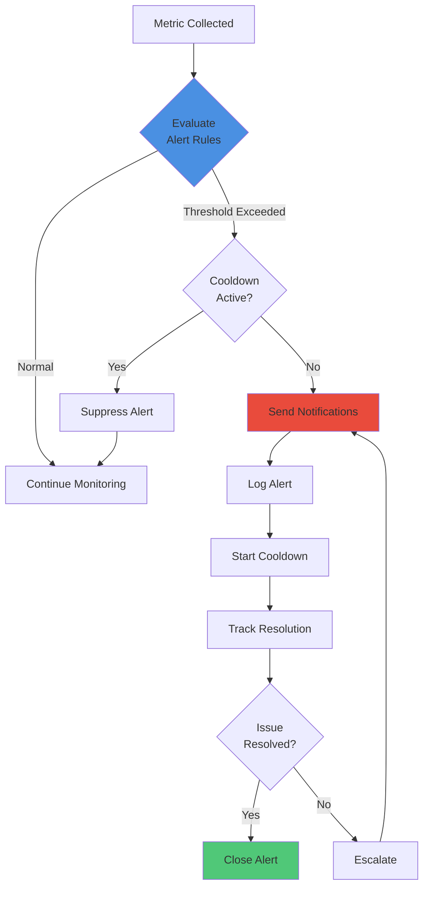
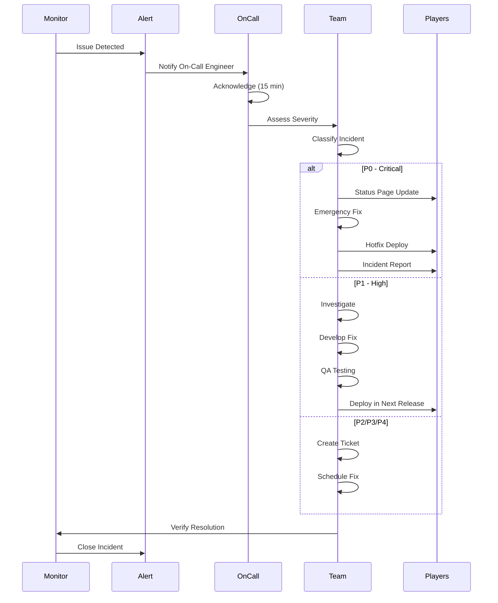

# Reality Realms RPG - Production Monitoring

## Table of Contents
- [Monitoring Overview](#monitoring-overview)
- [Crash Reporting Setup](#crash-reporting-setup)
- [Performance Monitoring](#performance-monitoring)
- [Error Tracking](#error-tracking)
- [User Behavior Tracking](#user-behavior-tracking)
- [Alerting System](#alerting-system)
- [Incident Response](#incident-response)
- [Monitoring Dashboard](#monitoring-dashboard)
- [SLA and SLO](#sla-and-slo)

---

## Monitoring Overview

Reality Realms RPG implements comprehensive production monitoring to ensure optimal player experience, quickly identify issues, and maintain high availability.

### Monitoring Goals

1. **Proactive Issue Detection**: Identify problems before users are affected
2. **Fast Incident Response**: Rapid detection and resolution
3. **Performance Optimization**: Continuous performance improvements
4. **User Experience**: Monitor and improve player satisfaction
5. **System Health**: Ensure infrastructure reliability

### Monitoring Architecture



---

## Crash Reporting Setup

### MetricKit Integration

```swift
import MetricKit
import OSLog

class CrashReporter: NSObject, MXMetricManagerSubscriber {
    static let shared = CrashReporter()
    private let logger = Logger(subsystem: "com.realityrealms.rpg", category: "crash")

    override init() {
        super.init()
        MXMetricManager.shared.add(self)
    }

    // Receive crash diagnostics
    func didReceive(_ payloads: [MXDiagnosticPayload]) {
        for payload in payloads {
            processCrashPayload(payload)
        }
    }

    private func processCrashPayload(_ payload: MXDiagnosticPayload) {
        // Process crash reports
        if let crashDiagnostics = payload.crashDiagnostics {
            for crash in crashDiagnostics {
                logCrash(crash)
                uploadCrashReport(crash)
            }
        }

        // Process hang reports
        if let hangDiagnostics = payload.hangDiagnostics {
            for hang in hangDiagnostics {
                logHang(hang)
            }
        }

        // Process CPU exceptions
        if let cpuExceptions = payload.cpuExceptionDiagnostics {
            for exception in cpuExceptions {
                logCPUException(exception)
            }
        }

        // Process disk write exceptions
        if let diskExceptions = payload.diskWriteExceptionDiagnostics {
            for exception in diskExceptions {
                logDiskException(exception)
            }
        }
    }

    private func logCrash(_ crash: MXCrashDiagnostic) {
        logger.critical("""
            Crash detected:
            Exception: \(crash.exceptionType?.rawValue ?? "Unknown")
            Signal: \(crash.signal?.rawValue ?? "Unknown")
            Termination: \(crash.terminationReason ?? "Unknown")
            Stack trace available: \(crash.callStackTree != nil)
            """)

        // Create detailed crash report
        let report = CrashReport(
            timestamp: Date(),
            exceptionType: crash.exceptionType?.rawValue,
            signal: crash.signal?.rawValue,
            terminationReason: crash.terminationReason,
            callStack: crash.callStackTree?.jsonRepresentation(),
            metaData: crash.metaData?.jsonRepresentation()
        )

        // Upload to Xcode Organizer automatically
        // Manual review in App Store Connect
    }
}

struct CrashReport: Codable {
    let timestamp: Date
    let exceptionType: String?
    let signal: String?
    let terminationReason: String?
    let callStack: String?
    let metaData: String?
    let appVersion: String
    let osVersion: String
    let deviceModel: String

    init(timestamp: Date, exceptionType: String?, signal: String?,
         terminationReason: String?, callStack: String?, metaData: String?) {
        self.timestamp = timestamp
        self.exceptionType = exceptionType
        self.signal = signal
        self.terminationReason = terminationReason
        self.callStack = callStack
        self.metaData = metaData
        self.appVersion = Bundle.main.infoDictionary?["CFBundleShortVersionString"] as? String ?? "Unknown"
        self.osVersion = ProcessInfo.processInfo.operatingSystemVersionString
        self.deviceModel = "Apple Vision Pro"
    }
}
```

### Crash Symbolication

```mermaid
graph LR
    CRASH[Crash Occurs] --> REPORT[Generate Report]
    REPORT --> UPLOAD[Upload to Apple]
    UPLOAD --> SYMBOL[Symbolication]
    SYMBOL --> REVIEW[Human Review]
    REVIEW --> CLASSIFY[Classify Crash]
    CLASSIFY --> PRIORITY[Set Priority]
    PRIORITY --> FIX[Develop Fix]
    FIX --> TEST[Test Fix]
    TEST --> DEPLOY[Deploy Update]

    style CRASH fill:#E94B3C
    style FIX fill:#FFD700
    style DEPLOY fill:#50C878
```



### Crash Categorization

| Category | Severity | Response Time | Priority |
|----------|----------|---------------|----------|
| Startup Crash | Critical | 1 hour | P0 |
| Frequent Crash (>1%) | High | 4 hours | P1 |
| Feature Crash | Medium | 24 hours | P2 |
| Rare Crash (<0.1%) | Low | 1 week | P3 |
| Edge Case | Very Low | Best effort | P4 |

---

## Performance Monitoring

### Real-Time Performance Metrics

```swift
import MetricKit

class PerformanceMonitor: NSObject, MXMetricManagerSubscriber {
    static let shared = PerformanceMonitor()

    func didReceive(_ payloads: [MXMetricPayload]) {
        for payload in payloads {
            processPerformanceMetrics(payload)
        }
    }

    private func processPerformanceMetrics(_ payload: MXMetricPayload) {
        // Application Launch Metrics
        if let launchMetrics = payload.applicationLaunchMetrics {
            monitorLaunchTime(launchMetrics)
        }

        // Application Responsiveness
        if let responsivenessMetrics = payload.applicationResponsivenessMetrics {
            monitorResponsiveness(responsivenessMetrics)
        }

        // Memory Usage
        if let memoryMetrics = payload.memoryMetrics {
            monitorMemoryUsage(memoryMetrics)
        }

        // CPU Usage
        if let cpuMetrics = payload.cpuMetrics {
            monitorCPUUsage(cpuMetrics)
        }

        // Display Metrics (Frame Rate)
        if let displayMetrics = payload.displayMetrics {
            monitorFrameRate(displayMetrics)
        }

        // Network Transfer
        if let networkMetrics = payload.networkTransferMetrics {
            monitorNetworkUsage(networkMetrics)
        }

        // Battery Usage
        if let locationMetrics = payload.locationActivityMetrics {
            monitorBatteryImpact(locationMetrics)
        }
    }

    private func monitorLaunchTime(_ metrics: MXAppLaunchMetric) {
        let launchTime = metrics.histogrammedTimeToFirstDraw.averageValue

        if launchTime > 2.0 { // 2 second threshold
            triggerAlert(
                level: .warning,
                message: "App launch time above threshold: \(launchTime)s"
            )
        }

        logMetric(
            name: "app_launch_time",
            value: launchTime,
            unit: "seconds"
        )
    }

    private func monitorResponsiveness(_ metrics: MXAppResponsivenessMetric) {
        let hangTime = metrics.histogrammedApplicationHangTime

        logMetric(
            name: "app_hang_time",
            value: hangTime.averageValue,
            unit: "seconds"
        )

        // Alert on excessive hangs
        if hangTime.averageValue > 0.25 { // 250ms threshold
            triggerAlert(
                level: .critical,
                message: "App experiencing hangs: \(hangTime.averageValue)s"
            )
        }
    }

    private func monitorFrameRate(_ metrics: MXDisplayMetric) {
        let averageFPS = 1.0 / metrics.averagePixelLuminance.averageValue

        if averageFPS < 60.0 { // Below 60 FPS target
            triggerAlert(
                level: .warning,
                message: "Frame rate below target: \(averageFPS) FPS"
            )
        }

        logMetric(
            name: "average_fps",
            value: averageFPS,
            unit: "fps"
        )
    }

    private func monitorMemoryUsage(_ metrics: MXMemoryMetric) {
        let peakMemory = metrics.peakMemoryUsage.value
        let averageMemory = metrics.averageSuspendedMemory?.averageValue

        let memoryGB = Double(peakMemory) / 1_073_741_824 // Convert to GB

        if memoryGB > 4.0 { // 4GB threshold
            triggerAlert(
                level: .critical,
                message: "Memory usage exceeded: \(memoryGB) GB"
            )
        }

        logMetric(
            name: "peak_memory_usage",
            value: memoryGB,
            unit: "GB"
        )
    }
}
```

### Performance Thresholds



---

## Error Tracking

### Error Logging System

```swift
import OSLog

enum ErrorSeverity: String {
    case debug = "DEBUG"
    case info = "INFO"
    case warning = "WARNING"
    case error = "ERROR"
    case critical = "CRITICAL"
}

class ErrorTracker {
    static let shared = ErrorTracker()
    private let logger = Logger(subsystem: "com.realityrealms.rpg", category: "error")

    func track(
        error: Error,
        severity: ErrorSeverity,
        context: [String: Any] = [:],
        file: String = #file,
        function: String = #function,
        line: Int = #line
    ) {
        let errorReport = ErrorReport(
            error: error,
            severity: severity,
            context: context,
            file: file,
            function: function,
            line: line
        )

        log(errorReport)
        uploadIfCritical(errorReport)
    }

    private func log(_ report: ErrorReport) {
        let message = """
            [\(report.severity.rawValue)] \(report.error.localizedDescription)
            File: \(report.file)
            Function: \(report.function)
            Line: \(report.line)
            Context: \(report.context)
            """

        switch report.severity {
        case .debug:
            logger.debug("\(message)")
        case .info:
            logger.info("\(message)")
        case .warning:
            logger.warning("\(message)")
        case .error:
            logger.error("\(message)")
        case .critical:
            logger.critical("\(message)")
        }
    }

    private func uploadIfCritical(_ report: ErrorReport) {
        if report.severity == .critical {
            // Upload immediately to monitoring service
            Task {
                await uploadErrorReport(report)
                triggerAlert(report)
            }
        }
    }
}

struct ErrorReport {
    let error: Error
    let severity: ErrorSeverity
    let context: [String: Any]
    let file: String
    let function: String
    let line: Int
    let timestamp: Date
    let appVersion: String
    let osVersion: String

    init(error: Error, severity: ErrorSeverity, context: [String: Any],
         file: String, function: String, line: Int) {
        self.error = error
        self.severity = severity
        self.context = context
        self.file = file
        self.function = function
        self.line = line
        self.timestamp = Date()
        self.appVersion = Bundle.main.infoDictionary?["CFBundleShortVersionString"] as? String ?? "Unknown"
        self.osVersion = ProcessInfo.processInfo.operatingSystemVersionString
    }
}
```

### Common Error Categories

| Category | Examples | Severity | Auto-Recover |
|----------|----------|----------|--------------|
| Network | Connection timeout, API error | Warning | Yes |
| Storage | Save failed, disk full | Error | Partial |
| Rendering | Texture load failed, shader error | Warning | Yes |
| Physics | Collision error, simulation divergence | Warning | Yes |
| Game Logic | Invalid state, null reference | Error | No |
| Memory | Out of memory, allocation failed | Critical | No |
| ARKit | Tracking lost, anchor failed | Warning | Yes |
| Multiplayer | Sync failed, disconnection | Warning | Yes |

---

## User Behavior Tracking

### Anomaly Detection

```swift
class AnomalyDetector {
    func detectAnomalies(in metrics: [Metric]) -> [Anomaly] {
        var anomalies: [Anomaly] = []

        // Sudden drop in DAU
        if detectDAUDrop(metrics) {
            anomalies.append(.dauDrop)
        }

        // Spike in crash rate
        if detectCrashSpike(metrics) {
            anomalies.append(.crashSpike)
        }

        // Unusual session duration
        if detectSessionAnomaly(metrics) {
            anomalies.append(.sessionAnomaly)
        }

        // Revenue anomaly
        if detectRevenueAnomaly(metrics) {
            anomalies.append(.revenueAnomaly)
        }

        return anomalies
    }

    private func detectDAUDrop(_ metrics: [Metric]) -> Bool {
        guard let current = metrics.last?.dau,
              let average = calculateAverage(metrics.map { $0.dau }) else {
            return false
        }

        // Alert if DAU drops more than 20% from average
        return Double(current) < average * 0.8
    }

    private func detectCrashSpike(_ metrics: [Metric]) -> Bool {
        guard let current = metrics.last?.crashRate,
              let average = calculateAverage(metrics.map { $0.crashRate }) else {
            return false
        }

        // Alert if crash rate doubles
        return current > average * 2.0
    }
}

enum Anomaly {
    case dauDrop
    case crashSpike
    case sessionAnomaly
    case revenueAnomaly
    case performanceDegradation
}
```

### Health Checks

```swift
class HealthCheckMonitor {
    func performHealthCheck() async -> HealthStatus {
        var checks: [String: Bool] = [:]

        // Check critical systems
        checks["api_connection"] = await checkAPIConnection()
        checks["cloudkit_sync"] = await checkCloudKitSync()
        checks["asset_loading"] = await checkAssetLoading()
        checks["arkit_session"] = await checkARKitSession()
        checks["memory_available"] = checkMemoryAvailable()
        checks["storage_available"] = checkStorageAvailable()

        let allHealthy = checks.values.allSatisfy { $0 }

        return HealthStatus(
            isHealthy: allHealthy,
            checks: checks,
            timestamp: Date()
        )
    }

    private func checkAPIConnection() async -> Bool {
        // Test API endpoint
        do {
            let _ = try await URLSession.shared.data(from: apiHealthEndpoint)
            return true
        } catch {
            return false
        }
    }

    private func checkMemoryAvailable() -> Bool {
        let memoryInfo = ProcessInfo.processInfo.physicalMemory
        let availableMemory = memoryInfo // Simplified

        // Ensure at least 1GB available
        return availableMemory > 1_073_741_824
    }
}

struct HealthStatus {
    let isHealthy: Bool
    let checks: [String: Bool]
    let timestamp: Date
}
```

---

## Alerting System

### Alert Configuration

```swift
struct AlertRule {
    let id: String
    let name: String
    let condition: AlertCondition
    let severity: AlertSeverity
    let notificationChannels: [NotificationChannel]
    let cooldownPeriod: TimeInterval // Prevent spam

    enum AlertCondition {
        case crashRateAbove(percentage: Float)
        case dauDropBelow(count: Int)
        case fpsBelow(fps: Float)
        case memoryAbove(gigabytes: Float)
        case latencyAbove(milliseconds: Float)
        case errorRateAbove(percentage: Float)
    }

    enum AlertSeverity {
        case critical   // Immediate action required
        case high       // Action within 1 hour
        case medium     // Action within 24 hours
        case low        // Action within 1 week
        case info       // For information only
    }

    enum NotificationChannel {
        case pushNotification
        case email(address: String)
        case slack(webhook: String)
        case pagerDuty(serviceKey: String)
    }
}
```

### Alert Rules

```swift
let alertRules: [AlertRule] = [
    // Critical: Crash rate spike
    AlertRule(
        id: "crash_rate_critical",
        name: "Critical Crash Rate",
        condition: .crashRateAbove(percentage: 2.0),
        severity: .critical,
        notificationChannels: [
            .pushNotification,
            .email(address: "oncall@realityrealms.com"),
            .pagerDuty(serviceKey: "critical_key")
        ],
        cooldownPeriod: 300 // 5 minutes
    ),

    // High: Performance degradation
    AlertRule(
        id: "fps_degradation",
        name: "Frame Rate Below Target",
        condition: .fpsBelow(fps: 60.0),
        severity: .high,
        notificationChannels: [
            .pushNotification,
            .slack(webhook: "performance_webhook")
        ],
        cooldownPeriod: 900 // 15 minutes
    ),

    // Medium: Memory warning
    AlertRule(
        id: "memory_warning",
        name: "High Memory Usage",
        condition: .memoryAbove(gigabytes: 3.5),
        severity: .medium,
        notificationChannels: [
            .email(address: "dev@realityrealms.com")
        ],
        cooldownPeriod: 1800 // 30 minutes
    ),

    // High: DAU drop
    AlertRule(
        id: "dau_drop",
        name: "Significant DAU Drop",
        condition: .dauDropBelow(count: 1000),
        severity: .high,
        notificationChannels: [
            .pushNotification,
            .email(address: "team@realityrealms.com")
        ],
        cooldownPeriod: 3600 // 1 hour
    )
]
```

### Alert Flow



---

## Incident Response

### Incident Classification

| Level | Description | Response Time | Team |
|-------|-------------|---------------|------|
| P0 | Game unplayable, crashes on launch | 15 minutes | All hands |
| P1 | Major feature broken, high crash rate | 1 hour | On-call + Lead |
| P2 | Minor feature issues, performance degraded | 4 hours | On-call |
| P3 | Cosmetic issues, rare bugs | 24 hours | Assigned dev |
| P4 | Enhancement requests | Best effort | Backlog |

### Incident Response Process



### Post-Mortem Template

```markdown
# Incident Post-Mortem

## Incident Summary
- **Date**: 2025-11-19
- **Duration**: 2 hours 15 minutes
- **Severity**: P1
- **Impact**: 15% of users affected

## Timeline
- 10:00 AM: Alert triggered - crash rate spike
- 10:15 AM: On-call engineer acknowledged
- 10:30 AM: Root cause identified
- 11:00 AM: Fix developed
- 11:30 AM: QA tested
- 12:00 PM: Hotfix deployed
- 12:15 PM: Incident resolved

## Root Cause
Detailed explanation of what caused the incident...

## Resolution
Steps taken to resolve the issue...

## Impact
- Users affected: 1,500
- Sessions impacted: 3,200
- Revenue lost: $500 (estimated)

## Action Items
- [ ] Add unit test for this scenario
- [ ] Implement additional monitoring
- [ ] Update alerting thresholds
- [ ] Document fix in knowledge base

## Lessons Learned
What we learned and how to prevent recurrence...
```

---

## Monitoring Dashboard

### Key Metrics Display

```swift
struct MonitoringDashboard: View {
    @StateObject private var monitor = SystemMonitor.shared

    var body: some View {
        ScrollView {
            VStack(spacing: 20) {
                // System Health
                HealthCard(status: monitor.systemHealth)

                // Active Users
                MetricCard(
                    title: "Active Users",
                    value: "\(monitor.activeUsers)",
                    trend: monitor.userTrend,
                    status: monitor.userStatus
                )

                // Performance
                MetricCard(
                    title: "Average FPS",
                    value: String(format: "%.1f", monitor.averageFPS),
                    trend: monitor.fpsTrend,
                    status: monitor.fpsStatus
                )

                // Crash Rate
                MetricCard(
                    title: "Crash Rate",
                    value: String(format: "%.2f%%", monitor.crashRate),
                    trend: monitor.crashTrend,
                    status: monitor.crashStatus
                )

                // Memory Usage
                MetricCard(
                    title: "Memory Usage",
                    value: String(format: "%.1f GB", monitor.memoryUsage),
                    trend: monitor.memoryTrend,
                    status: monitor.memoryStatus
                )

                // Recent Alerts
                AlertsList(alerts: monitor.recentAlerts)
            }
            .padding()
        }
        .navigationTitle("System Monitoring")
    }
}
```

---

## SLA and SLO

### Service Level Agreements

| Service | Availability Target | Response Time | Error Rate |
|---------|---------------------|---------------|------------|
| Game Launch | 99.9% | <2s (p95) | <0.1% |
| Multiplayer | 99.5% | <100ms (p95) | <1.0% |
| Cloud Save | 99.9% | <5s (p95) | <0.5% |
| Asset Loading | 99.0% | <3s (p95) | <2.0% |
| API Calls | 99.9% | <500ms (p95) | <0.1% |

### Service Level Objectives

```yaml
SLOs:
  availability:
    target: 99.9%
    measurement_window: 30_days
    error_budget: 43_minutes_per_month

  latency:
    p50: 50ms
    p95: 100ms
    p99: 200ms

  error_rate:
    target: 0.1%
    measurement_window: 24_hours

  crash_free_rate:
    target: 99.5%
    measurement_window: 7_days
```

---

## Conclusion

Comprehensive monitoring ensures Reality Realms RPG maintains high quality and player satisfaction. By proactively detecting and resolving issues, we deliver a smooth, reliable gaming experience.

### Monitoring Checklist

- [x] Crash reporting enabled (MetricKit)
- [x] Performance monitoring active
- [x] Error tracking implemented
- [x] Alert rules configured
- [x] On-call rotation established
- [x] Incident response plan documented
- [x] Dashboards accessible to team
- [x] SLA/SLO targets defined
- [x] Post-mortem process in place
- [x] Health checks automated

### Success Metrics

- **Crash Rate**: <0.5%
- **Response Time**: <15 minutes for P0
- **Resolution Time**: <1 hour for P0, <4 hours for P1
- **Uptime**: 99.9%
- **Mean Time to Detect**: <5 minutes
- **Mean Time to Resolve**: <1 hour

Reality Realms RPG: Monitored, reliable, and always improving.
