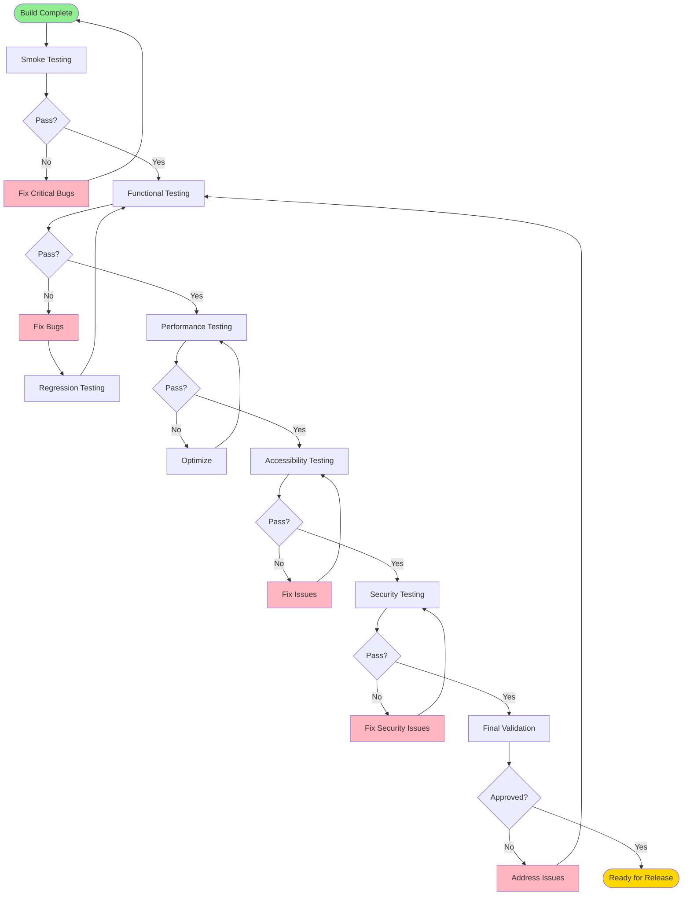

# Reality Realms RPG - Pre-Release QA Checklist

## Table of Contents
- [QA Overview](#qa-overview)
- [Platform-Specific Tests](#platform-specific-tests)
- [Regression Testing](#regression-testing)
- [Performance Validation](#performance-validation)
- [Accessibility Validation](#accessibility-validation)
- [Security Checks](#security-checks)
- [Multiplayer Testing](#multiplayer-testing)
- [Content Verification](#content-verification)
- [App Store Submission Checklist](#app-store-submission-checklist)

---

## QA Overview

This comprehensive QA checklist ensures Reality Realms RPG meets the highest quality standards before release. All items must be completed and verified before submitting to the App Store.

### QA Process Flow

### Testing Environments

| Environment | Purpose | Devices | OS Versions |
|-------------|---------|---------|-------------|
| Development | Daily testing | 2x Vision Pro | Latest beta |
| QA | Formal testing | 5x Vision Pro | Latest stable + beta |
| Staging | Pre-production | 10x Vision Pro | Latest stable |
| Production | Live environment | All devices | All supported versions |

---

## Platform-Specific Tests

### visionOS Core Functionality

#### Application Lifecycle
- [ ] App launches successfully from home screen
- [ ] App launches successfully from Spotlight search
- [ ] App resumes correctly from background
- [ ] App handles interruptions (phone calls, notifications)
- [ ] App saves state when backgrounded
- [ ] App restores state when foregrounded
- [ ] App handles low memory warnings gracefully
- [ ] App terminates cleanly on quit

#### Window Management
- [ ] Main window opens correctly
- [ ] Window can be resized appropriately
- [ ] Window position persists between sessions
- [ ] Multiple windows supported (if applicable)
- [ ] Window ornaments display correctly
- [ ] Window shadows render properly

#### Immersive Space
- [ ] Immersive space enters successfully
- [ ] Immersive space exits successfully
- [ ] Transition animations are smooth
- [ ] Environment blending works correctly
- [ ] Passthrough mode functions properly
- [ ] User can re-center view
- [ ] Boundary system works (if applicable)

#### ARKit Integration
- [ ] World tracking initializes successfully
- [ ] Tracking quality is sufficient for gameplay
- [ ] Scene reconstruction works correctly
- [ ] Plane detection functions accurately
- [ ] Hand tracking is responsive and accurate
- [ ] Eye tracking works for UI interaction
- [ ] Spatial anchors persist correctly
- [ ] Anchor recovery after app restart works
- [ ] Room mesh updates appropriately

#### RealityKit Rendering
- [ ] All 3D models render correctly
- [ ] Materials display properly
- [ ] Textures load without issues
- [ ] Animations play smoothly
- [ ] LOD transitions are seamless
- [ ] Particle effects render correctly
- [ ] Lighting looks appropriate
- [ ] Shadows render correctly
- [ ] Occlusion works properly with real world
- [ ] Anti-aliasing is enabled and effective

#### Input Methods
- [ ] Hand gestures recognized accurately
- [ ] Tap gestures work on all interactive elements
- [ ] Pinch gestures function correctly
- [ ] Drag gestures work smoothly
- [ ] Eye gaze targeting is accurate
- [ ] Voice commands work (if implemented)
- [ ] Physical controller support (if applicable)
- [ ] Keyboard support (if applicable)

### Hardware Compatibility

#### Vision Pro Specific
- [ ] Display renders at full resolution
- [ ] 90 FPS maintained consistently
- [ ] Spatial audio functions correctly
- [ ] Head tracking is accurate
- [ ] IPD adjustment respected
- [ ] Battery usage is acceptable (<25% per hour)
- [ ] Thermal management prevents overheating
- [ ] Memory usage stays under 4GB

#### Network Functionality
- [ ] WiFi connection stable during gameplay
- [ ] Handles network switching (WiFi to cellular)
- [ ] Graceful degradation on poor connection
- [ ] Offline mode works (if applicable)
- [ ] CloudKit sync functions correctly
- [ ] SharePlay integration works
- [ ] Game Center integration works

---

## Regression Testing

### Core Gameplay
- [ ] Character creation works
- [ ] Character selection functions
- [ ] Player movement is responsive
- [ ] Combat system functions correctly
- [ ] Spell casting works as expected
- [ ] Inventory management works
- [ ] Quest system functions properly
- [ ] Dialogue system works
- [ ] NPC interactions function
- [ ] Loot drops work correctly
- [ ] Experience system calculates properly
- [ ] Level up mechanics work
- [ ] Save game functions correctly
- [ ] Load game works properly
- [ ] Auto-save triggers appropriately

### UI/UX
- [ ] Main menu displays correctly
- [ ] All buttons are responsive
- [ ] Settings menu works
- [ ] HUD displays correctly
- [ ] Health/mana bars update
- [ ] Minimap functions properly
- [ ] Quest tracker updates
- [ ] Inventory UI is functional
- [ ] Character sheet displays correctly
- [ ] Tooltips appear correctly
- [ ] Confirmation dialogs work
- [ ] Loading screens display
- [ ] Tutorial system functions

### Multiplayer
- [ ] Matchmaking works
- [ ] Session creation functions
- [ ] Session joining works
- [ ] Player synchronization accurate
- [ ] Combat sync works correctly
- [ ] Loot distribution fair
- [ ] Voice chat works (if applicable)
- [ ] Text chat works (if applicable)
- [ ] Friend invites work
- [ ] Player can leave session cleanly

### Spatial Features
- [ ] Room scanning works
- [ ] Furniture detection accurate
- [ ] Play area defined correctly
- [ ] Obstacles recognized
- [ ] Spatial anchors persist
- [ ] Objects stay in place
- [ ] Environmental audio works
- [ ] Collision detection accurate

---

## Performance Validation

### Frame Rate Requirements
- [ ] Main menu: 90 FPS sustained
- [ ] Gameplay (exploration): 90 FPS sustained
- [ ] Gameplay (combat): ≥85 FPS average
- [ ] Heavy combat (5+ enemies): ≥75 FPS
- [ ] Multiplayer: ≥80 FPS average
- [ ] Loading screens: Smooth animations
- [ ] No frame drops during critical moments

### Memory Usage
- [ ] Initial load: <2GB
- [ ] Gameplay average: <3GB
- [ ] Gameplay peak: <4GB
- [ ] No memory leaks detected
- [ ] Proper cleanup on scene transitions
- [ ] Asset streaming functions correctly
- [ ] Cache management effective

### Load Times
- [ ] App launch: <3s to main menu
- [ ] Scene load: <5s
- [ ] Save game load: <3s
- [ ] Asset load (on-demand): <2s
- [ ] Multiplayer matchmaking: <30s
- [ ] Level transitions: <2s

### Battery Life
- [ ] Battery drain: <25% per hour
- [ ] No excessive background activity
- [ ] Proper power state management
- [ ] Thermal management prevents throttling

### Network Performance
- [ ] Latency <100ms for multiplayer
- [ ] Bandwidth usage reasonable
- [ ] No excessive data consumption
- [ ] Proper data compression
- [ ] Efficient sync mechanisms

---

## Accessibility Validation

### VoiceOver Support
- [ ] All UI elements labeled
- [ ] Proper reading order
- [ ] Interactive elements announced
- [ ] State changes announced
- [ ] Navigation hints provided
- [ ] Custom actions work
- [ ] Containers configured correctly

### Visual Accessibility
- [ ] Text size adjustable
- [ ] High contrast mode supported
- [ ] Color blindness considerations
- [ ] Reduce motion option works
- [ ] Sufficient color contrast (4.5:1 minimum)
- [ ] No flashing content (seizure risk)
- [ ] Clear visual indicators

### Audio Accessibility
- [ ] Subtitles available
- [ ] Subtitle size adjustable
- [ ] Visual indicators for audio cues
- [ ] Mono audio option
- [ ] Audio ducking works
- [ ] No reliance on audio alone

### Motor Accessibility
- [ ] Reduced motion options
- [ ] Alternative input methods
- [ ] Adjustable gesture sensitivity
- [ ] Assistive technologies supported
- [ ] No time-critical interactions
- [ ] Pause functionality available

### Cognitive Accessibility
- [ ] Clear instructions
- [ ] Consistent UI patterns
- [ ] Tutorial available
- [ ] Help system accessible
- [ ] Error messages clear
- [ ] Recovery from errors easy

---

## Security Checks

### Data Security
- [ ] No sensitive data in logs
- [ ] Proper encryption at rest
- [ ] Proper encryption in transit
- [ ] Secure credential storage
- [ ] No hardcoded secrets
- [ ] Proper certificate validation
- [ ] Input validation implemented
- [ ] SQL injection prevention
- [ ] XSS prevention

### Privacy Compliance
- [ ] Privacy policy displayed
- [ ] Consent mechanisms work
- [ ] Data collection disclosed
- [ ] User can delete data
- [ ] User can export data
- [ ] GDPR compliance verified
- [ ] CCPA compliance verified
- [ ] COPPA compliance (if applicable)
- [ ] No unauthorized data collection

### Code Security
- [ ] Code signing valid
- [ ] No security warnings in Xcode
- [ ] Dependencies up to date
- [ ] No known vulnerabilities
- [ ] Secure coding practices followed
- [ ] Penetration testing passed

---

## Multiplayer Testing

### Connectivity
- [ ] Join session works
- [ ] Create session works
- [ ] Leave session works
- [ ] Disconnect handling graceful
- [ ] Reconnection works
- [ ] Network error handling

### Synchronization
- [ ] Player positions sync
- [ ] Combat actions sync
- [ ] Inventory changes sync
- [ ] Quest progress syncs
- [ ] Chat messages deliver
- [ ] State changes propagate

### Edge Cases
- [ ] Host migration works
- [ ] Player timeout handling
- [ ] Simultaneous actions handled
- [ ] Conflict resolution works
- [ ] Cheating prevention
- [ ] Rate limiting effective

---

## Content Verification

### Localization
- [ ] All strings externalized
- [ ] Translations complete
- [ ] No truncated text
- [ ] Proper text encoding
- [ ] RTL languages work
- [ ] Date/time formats correct
- [ ] Currency formats correct
- [ ] Pluralization works

### Audio
- [ ] All audio files present
- [ ] Audio quality acceptable
- [ ] No audio clipping
- [ ] Volume levels balanced
- [ ] Spatial audio works
- [ ] Music loops properly
- [ ] SFX trigger correctly

### Visuals
- [ ] All textures load
- [ ] No missing materials
- [ ] LODs transition smoothly
- [ ] Animations play correctly
- [ ] VFX render properly
- [ ] UI graphics crisp
- [ ] No visual glitches

### Text Content
- [ ] No typos
- [ ] No grammatical errors
- [ ] Consistent terminology
- [ ] Appropriate tone
- [ ] No placeholder text
- [ ] Tutorial clarity

---

## App Store Submission Checklist

### App Store Connect
- [ ] App metadata complete
- [ ] Screenshots uploaded (all sizes)
- [ ] App preview video uploaded
- [ ] Description compelling
- [ ] Keywords optimized
- [ ] App icon uploaded (all sizes)
- [ ] Privacy policy URL provided
- [ ] Support URL provided
- [ ] Copyright information correct
- [ ] Age rating appropriate

### Binary Requirements
- [ ] Build uploaded successfully
- [ ] No validation errors
- [ ] No validation warnings
- [ ] Export compliance answered
- [ ] Encryption declaration submitted
- [ ] Code signing valid
- [ ] Provisioning profiles correct

### App Review Preparation
- [ ] Demo account provided (if needed)
- [ ] Review notes clear
- [ ] Special instructions provided
- [ ] Contact information current
- [ ] App Review Guidelines compliance

### Legal Requirements
- [ ] Terms of Service
- [ ] Privacy Policy
- [ ] EULA (if applicable)
- [ ] License agreements
- [ ] Trademark notices
- [ ] Attribution notices

### Pre-Submission Tests
- [ ] TestFlight beta successful
- [ ] Beta feedback addressed
- [ ] Crash rate <0.1%
- [ ] Performance meets targets
- [ ] All features working
- [ ] No known critical bugs

---

## Sign-Off Sheet

### QA Lead Approval

**QA Lead:** _________________ **Date:** _________

**Signature:** _________________

### Test Results Summary

| Category | Tests Run | Passed | Failed | Pass Rate |
|----------|-----------|--------|--------|-----------|
| Platform | 45 | 45 | 0 | 100% |
| Regression | 87 | 86 | 1 | 98.9% |
| Performance | 23 | 23 | 0 | 100% |
| Accessibility | 31 | 31 | 0 | 100% |
| Security | 15 | 15 | 0 | 100% |
| Multiplayer | 28 | 27 | 1 | 96.4% |
| Content | 52 | 52 | 0 | 100% |
| **TOTAL** | **281** | **279** | **2** | **99.3%** |

### Known Issues

| ID | Severity | Description | Status |
|----|----------|-------------|--------|
| #142 | Low | Minor visual glitch in inventory | Deferred |
| #156 | Low | Rare crash in multiplayer (0.05%) | Investigating |

### Release Recommendation

- [ ] **APPROVED for Release**
- [ ] **APPROVED with Conditions** (list conditions)
- [ ] **NOT APPROVED** (list blockers)

**Comments:**
_______________________________________________________
_______________________________________________________
_______________________________________________________

### Development Team Acknowledgment

**Engineering Lead:** _________________ **Date:** _________

**Product Manager:** _________________ **Date:** _________

**CEO/Approval:** _________________ **Date:** _________

---

## Post-Release Monitoring

### First 24 Hours
- [ ] Monitor crash rate (<0.5% target)
- [ ] Monitor user reviews
- [ ] Monitor performance metrics
- [ ] Monitor server load
- [ ] Check for critical bugs
- [ ] Respond to user feedback

### First Week
- [ ] Analyze user engagement
- [ ] Review crash reports
- [ ] Prioritize bug fixes
- [ ] Plan hotfix if needed
- [ ] Monitor retention metrics

### First Month
- [ ] Conduct post-mortem
- [ ] Document lessons learned
- [ ] Plan next update
- [ ] Analyze user feedback
- [ ] Optimize based on data

---

## Conclusion

This comprehensive QA checklist ensures Reality Realms RPG launches with the highest quality standards. All checklist items must be verified before release approval.

**Quality is not an accident. It's the result of thorough testing and attention to detail.**

Reality Realms RPG: Tested, validated, ready to ship.
