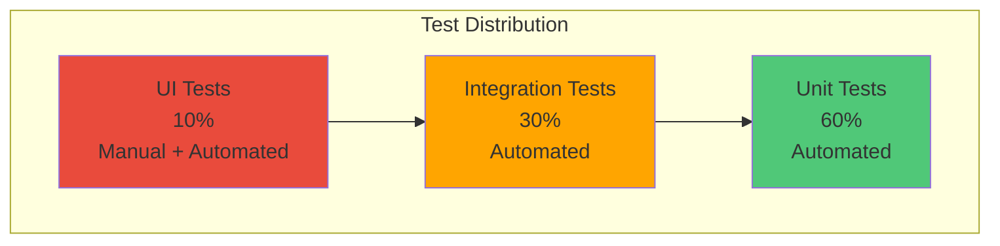
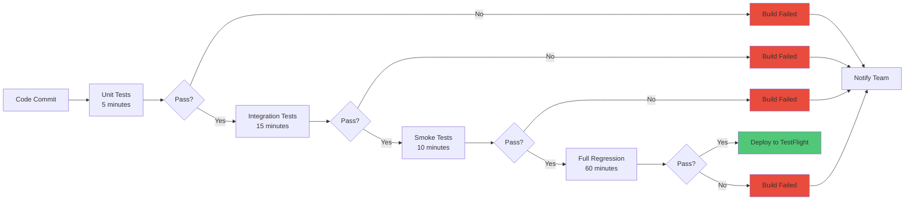
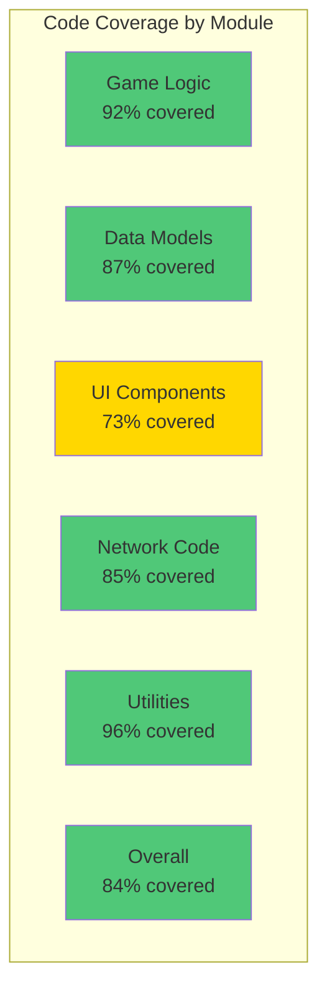
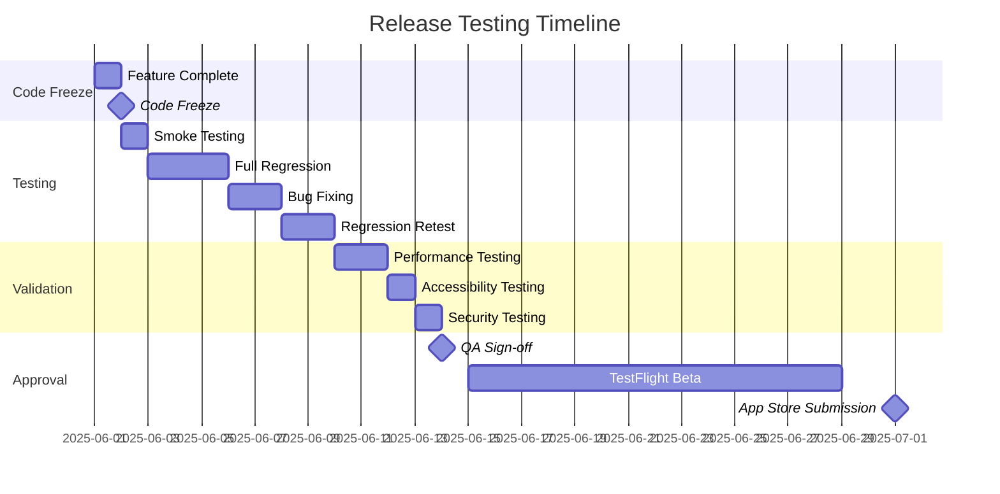

# Reality Realms RPG - Regression Testing

## Table of Contents
- [Regression Testing Overview](#regression-testing-overview)
- [Test Case Management](#test-case-management)
- [Automated vs Manual Testing](#automated-vs-manual-testing)
- [Test Coverage Tracking](#test-coverage-tracking)
- [Release Testing Process](#release-testing-process)
- [Test Automation Framework](#test-automation-framework)
- [Continuous Integration Testing](#continuous-integration-testing)
- [Bug Regression Prevention](#bug-regression-prevention)

---

## Regression Testing Overview

Regression testing ensures that new code changes don't break existing functionality. Reality Realms RPG implements a comprehensive regression testing strategy combining automated and manual testing.

### Regression Testing Goals

1. **Prevent Regressions**: Ensure fixes don't break working features
2. **Maintain Quality**: Consistent quality across releases
3. **Fast Feedback**: Quick detection of issues
4. **Complete Coverage**: Test all critical paths
5. **Efficiency**: Automate repetitive tests

### Testing Pyramid



### Test Execution Strategy



---

## Test Case Management

### Test Suite Organization

```
Tests/
├── UnitTests/
│   ├── GameLogicTests/
│   │   ├── CombatSystemTests.swift
│   │   ├── InventorySystemTests.swift
│   │   ├── QuestSystemTests.swift
│   │   └── LevelingSystemTests.swift
│   ├── DataModelTests/
│   │   ├── PlayerTests.swift
│   │   ├── EnemyTests.swift
│   │   └── ItemTests.swift
│   └── UtilityTests/
│       ├── MathUtilsTests.swift
│       └── StringUtilsTests.swift
├── IntegrationTests/
│   ├── SaveLoadTests.swift
│   ├── NetworkSyncTests.swift
│   ├── CloudKitTests.swift
│   └── ARKitIntegrationTests.swift
├── UITests/
│   ├── MainMenuUITests.swift
│   ├── GameplayUITests.swift
│   ├── InventoryUITests.swift
│   └── SettingsUITests.swift
├── PerformanceTests/
│   ├── RenderPerformanceTests.swift
│   ├── MemoryTests.swift
│   └── LoadTimeTests.swift
└── ManualTests/
    ├── TestPlans/
    │   ├── SmokeTest.md
    │   ├── FullRegression.md
    │   └── ReleaseTest.md
    └── TestCases/
        ├── Gameplay.md
        ├── Multiplayer.md
        └── Spatial.md
```

### Test Case Template

```swift
import XCTest
@testable import RealityRealmsRPG

class CombatSystemTests: XCTestCase {
    var combatSystem: CombatSystem!
    var player: Player!
    var enemy: Enemy!

    override func setUp() {
        super.setUp()

        // Setup test environment
        combatSystem = CombatSystem()
        player = Player.createTestPlayer()
        enemy = Enemy.createTestEnemy(type: .goblin)
    }

    override func tearDown() {
        // Cleanup
        combatSystem = nil
        player = nil
        enemy = nil

        super.tearDown()
    }

    // MARK: - Damage Calculation Tests

    func testDamageCalculation_BasicAttack() {
        // Given
        let expectedDamage = 25 - enemy.defense

        // When
        let actualDamage = combatSystem.calculateDamage(
            attacker: player,
            target: enemy,
            attackType: .basic
        )

        // Then
        XCTAssertEqual(actualDamage, expectedDamage,
            "Basic attack damage should equal attack power minus defense")
    }

    func testDamageCalculation_CriticalHit() {
        // Given
        player.stats.criticalChance = 1.0 // 100% crit for testing

        // When
        let damage = combatSystem.calculateDamage(
            attacker: player,
            target: enemy,
            attackType: .basic
        )

        // Then
        XCTAssertGreaterThan(damage, player.stats.attackPower,
            "Critical hit should deal more damage than base attack")
    }

    func testDamageCalculation_MinimumDamage() {
        // Given
        enemy.stats.defense = 999 // Very high defense

        // When
        let damage = combatSystem.calculateDamage(
            attacker: player,
            target: enemy,
            attackType: .basic
        )

        // Then
        XCTAssertGreaterThanOrEqual(damage, 1,
            "Damage should never be less than 1")
    }

    // MARK: - Combat Flow Tests

    func testCombatFlow_PlayerVictory() {
        // Given
        enemy.stats.currentHealth = 10 // Low health

        // When
        combatSystem.executeCombat(player: player, enemy: enemy)

        // Then
        XCTAssertTrue(enemy.isDead, "Enemy should be dead")
        XCTAssertGreaterThan(player.experience, 0, "Player should gain experience")
    }

    func testCombatFlow_PlayerDefeat() {
        // Given
        player.stats.currentHealth = 1
        enemy.stats.attackPower = 100

        // When
        combatSystem.executeCombat(player: player, enemy: enemy)

        // Then
        XCTAssertTrue(player.isDead, "Player should be dead")
        XCTAssertEqual(player.experience, 0, "Player should not gain experience")
    }

    // MARK: - Performance Tests

    func testPerformance_CombatCalculation() {
        measure {
            for _ in 0..<1000 {
                _ = combatSystem.calculateDamage(
                    attacker: player,
                    target: enemy,
                    attackType: .basic
                )
            }
        }
    }
}
```

### Test Case Prioritization

| Priority | Category | Frequency | Execution Time |
|----------|----------|-----------|----------------|
| P0 | Critical path, core gameplay | Every commit | <10 minutes |
| P1 | Important features | Every PR | <30 minutes |
| P2 | Secondary features | Daily | <60 minutes |
| P3 | Edge cases, nice-to-have | Weekly | <120 minutes |

---

## Automated vs Manual Testing

### Automated Testing

#### Unit Tests (60% of total tests)

```swift
// Example: Inventory System Unit Tests
class InventorySystemTests: XCTestCase {
    func testAddItem_WithSpace() {
        // Setup
        let inventory = Inventory(maxSlots: 10)
        let item = Item.createTestItem()

        // Execute
        let success = inventory.addItem(item)

        // Verify
        XCTAssertTrue(success)
        XCTAssertEqual(inventory.items.count, 1)
        XCTAssertTrue(inventory.contains(item))
    }

    func testAddItem_InventoryFull() {
        // Setup
        let inventory = Inventory(maxSlots: 1)
        _ = inventory.addItem(Item.createTestItem())

        // Execute
        let success = inventory.addItem(Item.createTestItem())

        // Verify
        XCTAssertFalse(success)
        XCTAssertEqual(inventory.items.count, 1)
    }

    func testRemoveItem_Exists() {
        // Setup
        let inventory = Inventory(maxSlots: 10)
        let item = Item.createTestItem()
        _ = inventory.addItem(item)

        // Execute
        let removed = inventory.removeItem(item)

        // Verify
        XCTAssertTrue(removed)
        XCTAssertEqual(inventory.items.count, 0)
    }

    func testStackableItems() {
        // Setup
        let inventory = Inventory(maxSlots: 10)
        let potion1 = Item.healthPotion()
        let potion2 = Item.healthPotion()

        // Execute
        _ = inventory.addItem(potion1)
        _ = inventory.addItem(potion2)

        // Verify
        XCTAssertEqual(inventory.items.count, 1)
        XCTAssertEqual(inventory.items[0].quantity, 2)
    }
}
```

#### Integration Tests (30% of total tests)

```swift
class SaveLoadIntegrationTests: XCTestCase {
    func testSaveAndLoad_PlayerProgress() async throws {
        // Setup
        let saveSystem = SaveSystem()
        let player = Player.createTestPlayer()
        player.level = 10
        player.experience = 5000

        // Save
        try await saveSystem.save(player)

        // Load
        let loadedPlayer = try await saveSystem.loadPlayer()

        // Verify
        XCTAssertEqual(loadedPlayer.level, player.level)
        XCTAssertEqual(loadedPlayer.experience, player.experience)
    }

    func testCloudKitSync() async throws {
        // Setup
        let syncManager = CloudKitSyncManager()
        let localData = GameState.current()

        // Sync to cloud
        try await syncManager.upload(localData)

        // Sync from cloud
        let cloudData = try await syncManager.download()

        // Verify
        XCTAssertEqual(localData.playerLevel, cloudData.playerLevel)
        XCTAssertEqual(localData.questProgress, cloudData.questProgress)
    }
}
```

#### UI Tests (10% of total tests)

```swift
class MainMenuUITests: XCTestCase {
    func testMainMenu_StartGame() throws {
        let app = XCUIApplication()
        app.launch()

        // Verify main menu appears
        let startButton = app.buttons["Start Game"]
        XCTAssertTrue(startButton.exists)

        // Tap start button
        startButton.tap()

        // Verify character selection appears
        let characterSelection = app.otherElements["Character Selection"]
        XCTAssertTrue(characterSelection.waitForExistence(timeout: 5))
    }

    func testSettings_ChangeVolume() throws {
        let app = XCUIApplication()
        app.launch()

        // Open settings
        app.buttons["Settings"].tap()

        // Adjust volume slider
        let volumeSlider = app.sliders["Volume"]
        volumeSlider.adjust(toNormalizedSliderPosition: 0.5)

        // Verify change persisted
        app.buttons["Back"].tap()
        app.buttons["Settings"].tap()

        let newValue = volumeSlider.normalizedSliderPosition
        XCTAssertEqual(newValue, 0.5, accuracy: 0.1)
    }
}
```

### Manual Testing

#### Smoke Test Suite (30 minutes)

1. **Application Launch**
   - [ ] App launches successfully
   - [ ] No crash on startup
   - [ ] Main menu appears

2. **Core Gameplay Loop**
   - [ ] Start new game
   - [ ] Complete tutorial
   - [ ] Engage in combat
   - [ ] Complete a quest
   - [ ] Save game
   - [ ] Load game

3. **Critical Features**
   - [ ] Character movement
   - [ ] Inventory access
   - [ ] Combat system
   - [ ] Multiplayer connection

#### Full Regression Test Suite (4 hours)

Complete test plan available in `/Tests/ManualTests/TestPlans/FullRegression.md`

Key areas:
- All game modes
- All character classes
- All quest types
- All combat scenarios
- All UI screens
- All settings combinations
- Multiplayer scenarios
- Edge cases

---

## Test Coverage Tracking

### Code Coverage Metrics

```swift
// Target coverage goals
let coverageGoals: [String: Float] = [
    "Game Logic": 0.90,      // 90% coverage
    "Data Models": 0.85,     // 85% coverage
    "UI Components": 0.70,   // 70% coverage
    "Network Code": 0.80,    // 80% coverage
    "Utilities": 0.95        // 95% coverage
]

// Overall target: 80% code coverage
```

### Coverage Visualization



### Coverage Tracking

```bash
# Generate coverage report
xcodebuild test \
    -scheme RealityRealmsRPG \
    -destination 'platform=visionOS Simulator,name=Apple Vision Pro' \
    -enableCodeCoverage YES

# Extract coverage data
xcrun xccov view \
    --report \
    ~/Library/Developer/Xcode/DerivedData/RealityRealmsRPG-*/Logs/Test/*.xcresult

# Check coverage threshold
xcrun xccov view \
    --report \
    --json \
    ~/Library/Developer/Xcode/DerivedData/RealityRealmsRPG-*/Logs/Test/*.xcresult \
    | jq '.targets[] | select(.name=="RealityRealmsRPG") | .lineCoverage'
```

---

## Release Testing Process

### Pre-Release Test Cycle



### Release Checklist

#### Pre-Testing Phase
- [ ] Code freeze enforced
- [ ] Release branch created
- [ ] Build number incremented
- [ ] Version number updated
- [ ] Release notes drafted
- [ ] Test environment prepared

#### Testing Phase
- [ ] Smoke tests passed
- [ ] Full regression passed
- [ ] Performance tests passed
- [ ] Security tests passed
- [ ] Accessibility tests passed
- [ ] Localization tests passed
- [ ] All P0 bugs fixed
- [ ] All P1 bugs fixed or deferred

#### Validation Phase
- [ ] Test coverage ≥80%
- [ ] Crash rate <0.1%
- [ ] Performance benchmarks met
- [ ] QA sign-off obtained
- [ ] Product manager approval
- [ ] Engineering lead approval

#### Deployment Phase
- [ ] TestFlight build uploaded
- [ ] Beta testing completed
- [ ] Beta feedback addressed
- [ ] App Store submission prepared
- [ ] Final approval obtained

---

## Test Automation Framework

### XCTest Setup

```swift
// Base test class
class RealityRealmsTestCase: XCTestCase {
    // Common setup
    override func setUp() {
        super.setUp()
        continueAfterFailure = false

        // Reset game state
        GameState.reset()

        // Clear persistent storage
        clearTestData()
    }

    override func tearDown() {
        // Cleanup
        cleanupTestResources()
        super.tearDown()
    }

    // Helper methods
    func clearTestData() {
        UserDefaults.standard.removePersistentDomain(
            forName: Bundle.main.bundleIdentifier!
        )
    }

    func createTestPlayer() -> Player {
        return Player(
            name: "Test Player",
            class: .warrior,
            level: 1
        )
    }

    func createTestEnemy(type: EnemyType) -> Enemy {
        return Enemy(
            type: type,
            level: 1
        )
    }
}
```

### UI Testing Framework

```swift
class RealityRealmsUITest: XCTestCase {
    var app: XCUIApplication!

    override func setUp() {
        super.setUp()

        app = XCUIApplication()
        app.launchArguments = ["--uitesting"]
        app.launchEnvironment = [
            "SKIP_ANIMATIONS": "1",
            "MOCK_NETWORK": "1"
        ]

        app.launch()
    }

    // Helper methods
    func waitForElement(
        _ element: XCUIElement,
        timeout: TimeInterval = 10
    ) -> Bool {
        return element.waitForExistence(timeout: timeout)
    }

    func takeScreenshot(_ name: String) {
        let screenshot = app.screenshot()
        let attachment = XCTAttachment(screenshot: screenshot)
        attachment.name = name
        attachment.lifetime = .keepAlways
        add(attachment)
    }
}
```

---

## Continuous Integration Testing

### Xcode Cloud Configuration

```yaml
# ci_workflows/regression_tests.yml
name: Regression Tests
on:
  push:
    branches: [main, develop]
  pull_request:
    branches: [main]

jobs:
  test:
    runs-on: [macOS, visionOS]
    steps:
      - checkout

      - name: Run Unit Tests
        run: |
          xcodebuild test \
            -scheme RealityRealmsRPG \
            -destination 'platform=visionOS Simulator,name=Apple Vision Pro' \
            -resultBundlePath TestResults

      - name: Generate Coverage Report
        run: |
          xcrun xccov view \
            --report \
            --json TestResults.xcresult > coverage.json

      - name: Check Coverage Threshold
        run: |
          coverage=$(jq '.lineCoverage' coverage.json)
          if (( $(echo "$coverage < 0.80" | bc -l) )); then
            echo "Coverage $coverage below 80% threshold"
            exit 1
          fi

      - name: Upload Test Results
        uses: actions/upload-artifact@v2
        with:
          name: test-results
          path: TestResults.xcresult

      - name: Notify Team
        if: failure()
        run: |
          # Send notification to Slack/Email
          echo "Tests failed - notifying team"
```

### Automated Test Reports

```swift
class TestReporter {
    func generateReport(from results: TestResults) -> TestReport {
        let report = TestReport()

        report.totalTests = results.totalTests
        report.passedTests = results.passedTests
        report.failedTests = results.failedTests
        report.skippedTests = results.skippedTests

        report.duration = results.duration
        report.coverage = results.coverage

        report.failedTestDetails = results.failures.map { failure in
            FailureDetail(
                testName: failure.testName,
                reason: failure.failureReason,
                stackTrace: failure.stackTrace
            )
        }

        return report
    }

    func sendReport(_ report: TestReport) {
        // Send to team via Slack/Email
        // Upload to reporting dashboard
    }
}

struct TestReport {
    var totalTests: Int = 0
    var passedTests: Int = 0
    var failedTests: Int = 0
    var skippedTests: Int = 0
    var duration: TimeInterval = 0
    var coverage: Float = 0
    var failedTestDetails: [FailureDetail] = []

    var passRate: Float {
        guard totalTests > 0 else { return 0 }
        return Float(passedTests) / Float(totalTests)
    }
}
```

---

## Bug Regression Prevention

### Regression Bug Tracking

```swift
struct RegressionBug {
    let id: String
    let title: String
    let severity: Severity
    let fixedInVersion: String
    let testCase: String
    let preventionMeasure: String

    enum Severity {
        case critical
        case high
        case medium
        case low
    }
}

// Maintain regression bug database
let regressionBugs: [RegressionBug] = [
    RegressionBug(
        id: "RB-001",
        title: "Save game corruption on low memory",
        severity: .critical,
        fixedInVersion: "1.2.0",
        testCase: "testSaveUnderLowMemory",
        preventionMeasure: "Added automated low memory test"
    ),
    RegressionBug(
        id: "RB-002",
        title: "Combat freeze with 10+ enemies",
        severity: .high,
        fixedInVersion: "1.1.5",
        testCase: "testCombatWithManyEnemies",
        preventionMeasure: "Added performance test for high enemy count"
    )
]
```

### Test-Driven Bug Fixes

```swift
// 1. Write failing test that reproduces bug
func testBugFix_InventoryDuplication() {
    // Given: Bug scenario
    let inventory = Inventory(maxSlots: 10)
    let item = Item.createTestItem()

    // When: Actions that caused bug
    inventory.addItem(item)
    inventory.save()
    inventory.load()

    // Then: Bug behavior
    XCTAssertEqual(inventory.items.count, 1,
        "Items should not duplicate after save/load")
}

// 2. Fix the bug

// 3. Verify test passes

// 4. Add to regression suite
```

---

## Conclusion

Comprehensive regression testing ensures Reality Realms RPG maintains quality across all releases. By combining automated and manual testing with continuous integration, we catch bugs early and prevent regressions.

### Testing Metrics Goals

- **Test Coverage**: ≥80%
- **Automated Tests**: ≥250 test cases
- **CI Execution Time**: <20 minutes
- **Bug Detection Rate**: ≥95% before release
- **Regression Rate**: <2% per release
- **Test Reliability**: ≥98% (minimal flaky tests)

Reality Realms RPG: Rigorously tested, regression-free, production-ready.
