# Reality Realms RPG - State Machine Diagrams

## Table of Contents
- [Game State Machine](#game-state-machine)
- [Combat State Machine](#combat-state-machine)
- [AI State Machines](#ai-state-machines)
- [Player State Machine](#player-state-machine)
- [UI State Machines](#ui-state-machines)
- [Network State Machine](#network-state-machine)
- [Room Mapping State Machine](#room-mapping-state-machine)
- [Animation State Machines](#animation-state-machines)
- [Quest State Machine](#quest-state-machine)

---

## Game State Machine

### Main Game State Flow

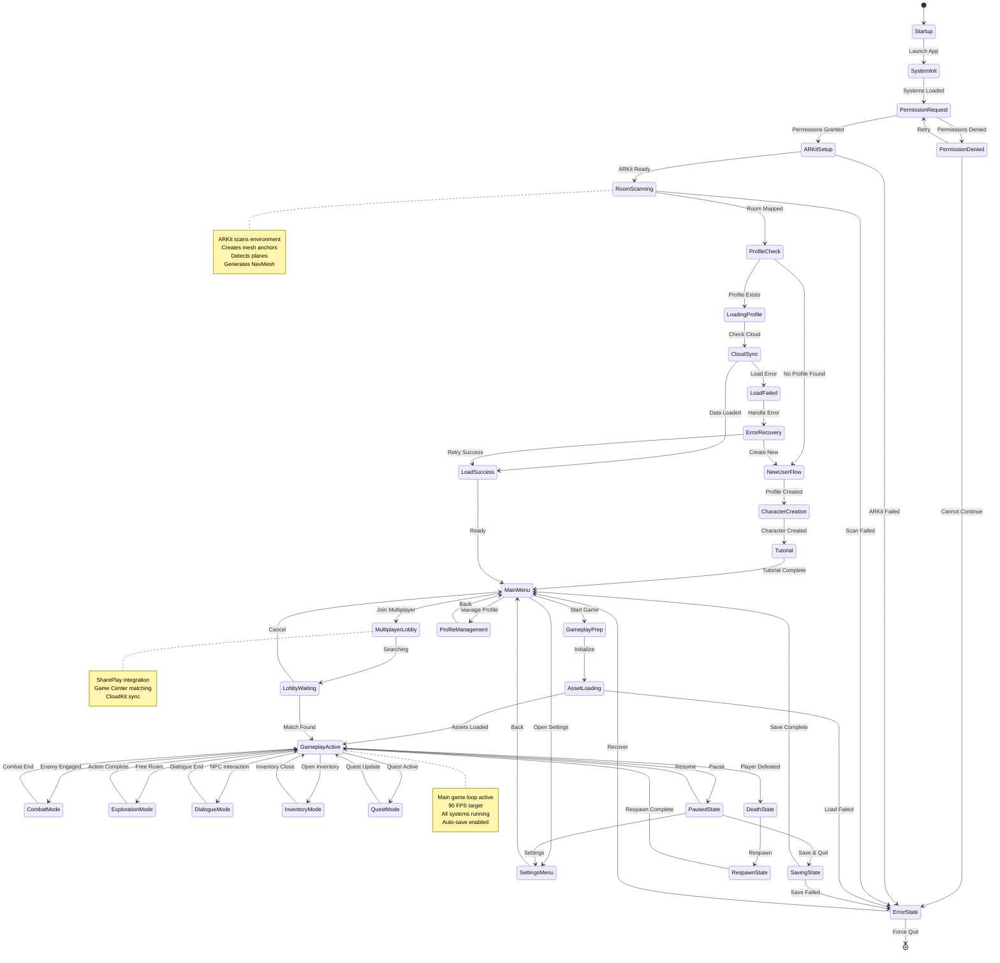
```mermaid
stateDiagram-v2
    [*] --> Startup

    Startup --> SystemInit: Launch App
    SystemInit --> PermissionRequest: Systems Loaded

    PermissionRequest --> ARKitSetup: Permissions Granted
    PermissionRequest --> PermissionDenied: Permissions Denied

    PermissionDenied --> ErrorState: Cannot Continue
    PermissionDenied --> PermissionRequest: Retry

    ARKitSetup --> RoomScanning: ARKit Ready
    ARKitSetup --> ErrorState: ARKit Failed

    RoomScanning --> ProfileCheck: Room Mapped
    RoomScanning --> ErrorState: Scan Failed

    ProfileCheck --> NewUserFlow: No Profile Found
    ProfileCheck --> LoadingProfile: Profile Exists

    NewUserFlow --> CharacterCreation: Profile Created
    CharacterCreation --> Tutorial: Character Created
    Tutorial --> MainMenu: Tutorial Complete

    LoadingProfile --> CloudSync: Check Cloud
    CloudSync --> LoadSuccess: Data Loaded
    CloudSync --> LoadFailed: Load Error

    LoadSuccess --> MainMenu: Ready
    LoadFailed --> ErrorRecovery: Handle Error
    ErrorRecovery --> LoadSuccess: Retry Success
    ErrorRecovery --> NewUserFlow: Create New

    MainMenu --> GameplayPrep: Start Game
    MainMenu --> MultiplayerLobby: Join Multiplayer
    MainMenu --> SettingsMenu: Open Settings
    MainMenu --> ProfileManagement: Manage Profile

    SettingsMenu --> MainMenu: Back
    ProfileManagement --> MainMenu: Back

    GameplayPrep --> AssetLoading: Initialize
    AssetLoading --> GameplayActive: Assets Loaded
    AssetLoading --> ErrorState: Load Failed

    GameplayActive --> CombatMode: Enemy Engaged
    GameplayActive --> ExplorationMode: Free Roam
    GameplayActive --> DialogueMode: NPC Interaction
    GameplayActive --> InventoryMode: Open Inventory
    GameplayActive --> QuestMode: Quest Active
    GameplayActive --> PausedState: Pause

    CombatMode --> GameplayActive: Combat End
    ExplorationMode --> GameplayActive: Action Complete
    DialogueMode --> GameplayActive: Dialogue End
    InventoryMode --> GameplayActive: Inventory Close
    QuestMode --> GameplayActive: Quest Update

    PausedState --> GameplayActive: Resume
    PausedState --> SavingState: Save & Quit
    PausedState --> SettingsMenu: Settings

    SavingState --> MainMenu: Save Complete
    SavingState --> ErrorState: Save Failed

    GameplayActive --> DeathState: Player Defeated
    DeathState --> RespawnState: Respawn
    RespawnState --> GameplayActive: Respawn Complete

    MultiplayerLobby --> LobbyWaiting: Searching
    LobbyWaiting --> GameplayActive: Match Found
    LobbyWaiting --> MainMenu: Cancel

    ErrorState --> MainMenu: Recover
    ErrorState --> [*]: Force Quit

    note right of GameplayActive
        Main game loop active
        90 FPS target
        All systems running
        Auto-save enabled
    end note

    note right of RoomScanning
        ARKit scans environment
        Creates mesh anchors
        Detects planes
        Generates NavMesh
    end note

    note right of MultiplayerLobby
        SharePlay integration
        Game Center matching
        CloudKit sync
    end note
```

### Gameplay Mode Sub-States

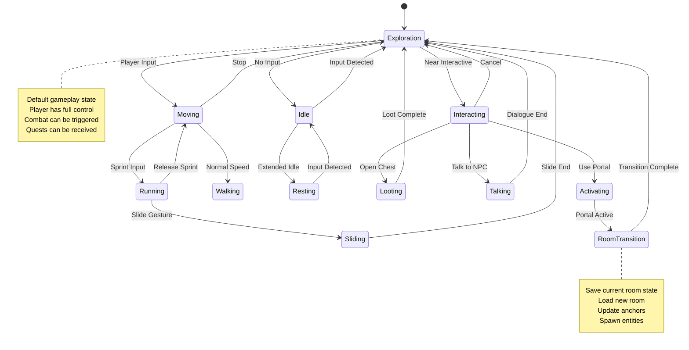
```mermaid
stateDiagram-v2
    [*] --> Exploration

    Exploration --> Moving: Player Input
    Exploration --> Idle: No Input
    Exploration --> Interacting: Near Interactive

    Moving --> Running: Sprint Input
    Moving --> Walking: Normal Speed
    Moving --> Exploration: Stop

    Running --> Sliding: Slide Gesture
    Running --> Moving: Release Sprint

    Sliding --> Exploration: Slide End

    Idle --> Exploration: Input Detected
    Idle --> Resting: Extended Idle

    Resting --> Idle: Input Detected

    Interacting --> Looting: Open Chest
    Interacting --> Talking: Talk to NPC
    Interacting --> Activating: Use Portal
    Interacting --> Exploration: Cancel

    Looting --> Exploration: Loot Complete
    Talking --> Exploration: Dialogue End
    Activating --> RoomTransition: Portal Active

    RoomTransition --> Exploration: Transition Complete

    note right of Exploration
        Default gameplay state
        Player has full control
        Combat can be triggered
        Quests can be received
    end note

    note right of RoomTransition
        Save current room state
        Load new room
        Update anchors
        Spawn entities
    end note
```

---

## Combat State Machine

### Combat Flow

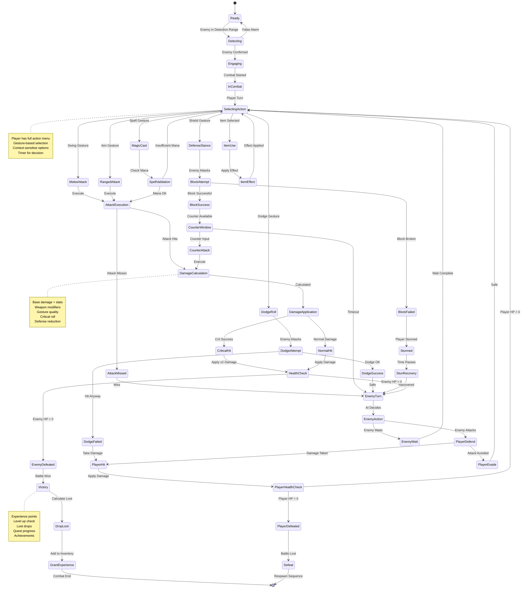
```mermaid
stateDiagram-v2
    [*] --> Ready

    Ready --> Detecting: Enemy in Detection Range
    Detecting --> Engaging: Enemy Confirmed
    Detecting --> Ready: False Alarm

    Engaging --> InCombat: Combat Started
    InCombat --> SelectingAction: Player Turn

    SelectingAction --> MeleeAttack: Swing Gesture
    SelectingAction --> RangedAttack: Aim Gesture
    SelectingAction --> MagicCast: Spell Gesture
    SelectingAction --> DefenseStance: Shield Gesture
    SelectingAction --> DodgeRoll: Dodge Gesture
    SelectingAction --> ItemUse: Item Selected

    MeleeAttack --> AttackExecution: Execute
    RangedAttack --> AttackExecution: Execute
    MagicCast --> SpellValidation: Check Mana

    SpellValidation --> AttackExecution: Mana OK
    SpellValidation --> SelectingAction: Insufficient Mana

    AttackExecution --> DamageCalculation: Attack Hits
    AttackExecution --> AttackMissed: Attack Misses

    AttackMissed --> EnemyTurn: Miss
    DamageCalculation --> DamageApplication: Calculated

    DamageApplication --> CriticalHit: Crit Success
    DamageApplication --> NormalHit: Normal Damage

    CriticalHit --> HealthCheck: Apply x2 Damage
    NormalHit --> HealthCheck: Apply Damage

    DefenseStance --> BlockAttempt: Enemy Attacks
    BlockAttempt --> BlockSuccess: Block Successful
    BlockAttempt --> BlockFailed: Block Broken

    BlockSuccess --> CounterWindow: Counter Available
    BlockFailed --> Stunned: Player Stunned

    CounterWindow --> CounterAttack: Counter Input
    CounterWindow --> EnemyTurn: Timeout

    CounterAttack --> DamageCalculation: Execute

    DodgeRoll --> DodgeAttempt: Enemy Attacks
    DodgeAttempt --> DodgeSuccess: Dodge OK
    DodgeAttempt --> DodgeFailed: Hit Anyway

    DodgeSuccess --> EnemyTurn: Safe
    DodgeFailed --> PlayerHit: Take Damage

    Stunned --> StunRecovery: Time Passes
    StunRecovery --> EnemyTurn: Recovered

    ItemUse --> ItemEffect: Apply Effect
    ItemEffect --> SelectingAction: Effect Applied

    HealthCheck --> EnemyDefeated: Enemy HP = 0
    HealthCheck --> EnemyTurn: Enemy HP > 0

    EnemyTurn --> EnemyAction: AI Decides
    EnemyAction --> PlayerDefend: Enemy Attacks
    EnemyAction --> EnemyWait: Enemy Waits

    PlayerDefend --> PlayerHit: Damage Taken
    PlayerDefend --> PlayerEvade: Attack Avoided

    PlayerHit --> PlayerHealthCheck: Apply Damage
    PlayerEvade --> SelectingAction: Safe

    PlayerHealthCheck --> PlayerDefeated: Player HP = 0
    PlayerHealthCheck --> SelectingAction: Player HP > 0

    EnemyWait --> SelectingAction: Wait Complete

    EnemyDefeated --> Victory: Battle Won
    PlayerDefeated --> Defeat: Battle Lost

    Victory --> DropLoot: Calculate Loot
    DropLoot --> GrantExperience: Add to Inventory
    GrantExperience --> [*]: Combat End

    Defeat --> [*]: Respawn Sequence

    note right of SelectingAction
        Player has full action menu
        Gesture-based selection
        Context-sensitive options
        Timer for decision
    end note

    note right of DamageCalculation
        Base damage + stats
        Weapon modifiers
        Gesture quality
        Critical roll
        Defense reduction
    end note

    note right of Victory
        Experience points
        Level up check
        Loot drops
        Quest progress
        Achievements
    end note
```

### Combat Stance System

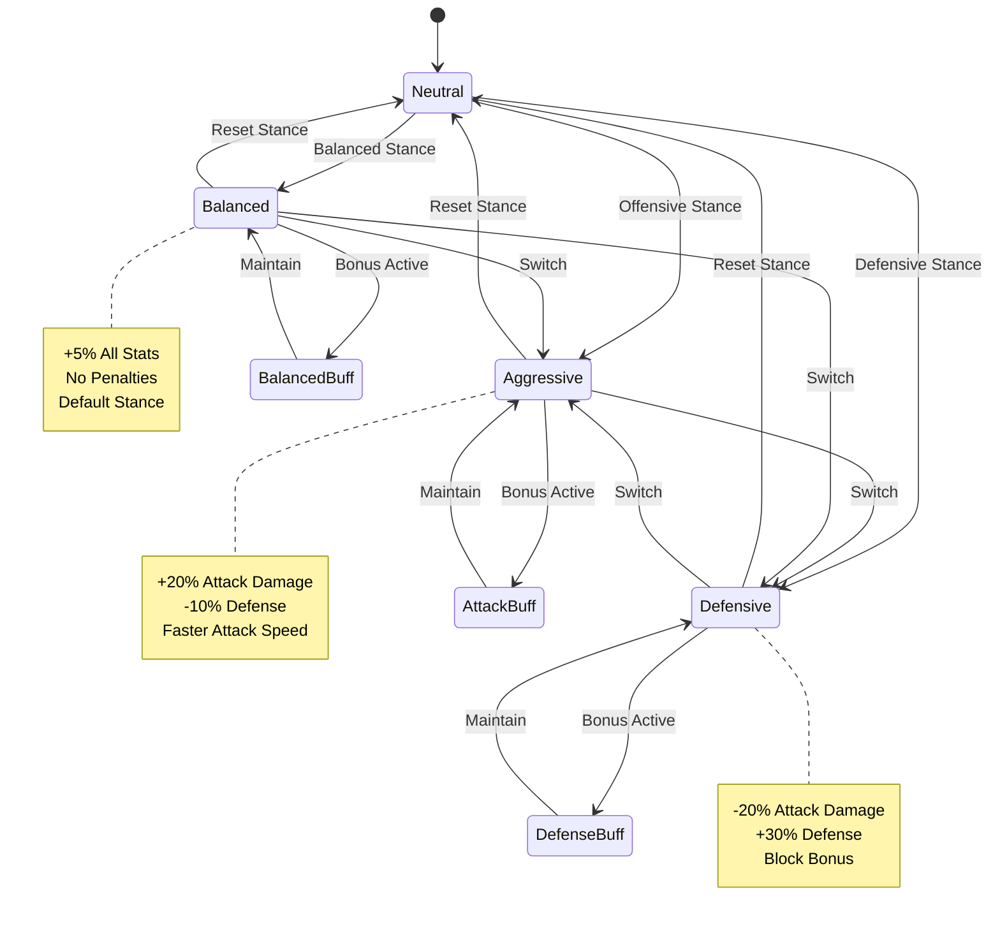
```mermaid
stateDiagram-v2
    [*] --> Neutral

    Neutral --> Aggressive: Offensive Stance
    Neutral --> Defensive: Defensive Stance
    Neutral --> Balanced: Balanced Stance

    Aggressive --> AttackBuff: Bonus Active
    AttackBuff --> Aggressive: Maintain

    Aggressive --> Neutral: Reset Stance
    Aggressive --> Defensive: Switch

    Defensive --> DefenseBuff: Bonus Active
    DefenseBuff --> Defensive: Maintain

    Defensive --> Neutral: Reset Stance
    Defensive --> Aggressive: Switch

    Balanced --> BalancedBuff: Bonus Active
    BalancedBuff --> Balanced: Maintain

    Balanced --> Neutral: Reset Stance
    Balanced --> Aggressive: Switch
    Balanced --> Defensive: Switch

    note right of Aggressive
        +20% Attack Damage
        -10% Defense
        Faster Attack Speed
    end note

    note right of Defensive
        -20% Attack Damage
        +30% Defense
        Block Bonus
    end note

    note right of Balanced
        +5% All Stats
        No Penalties
        Default Stance
    end note
```

---

## AI State Machines

### Enemy AI State Machine

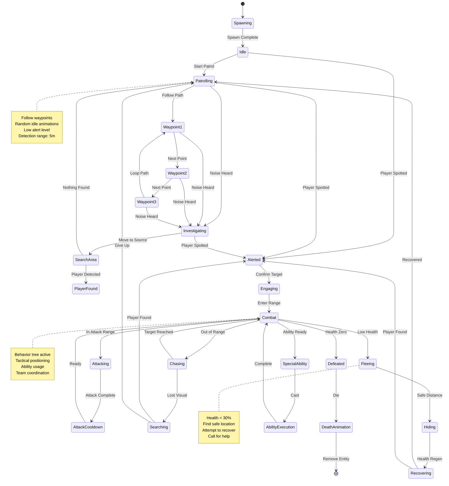
```mermaid
stateDiagram-v2
    [*] --> Spawning

    Spawning --> Idle: Spawn Complete
    Idle --> Patrolling: Start Patrol

    Patrolling --> Waypoint1: Follow Path
    Waypoint1 --> Waypoint2: Next Point
    Waypoint2 --> Waypoint3: Next Point
    Waypoint3 --> Waypoint1: Loop Path

    Patrolling --> Investigating: Noise Heard
    Waypoint1 --> Investigating: Noise Heard
    Waypoint2 --> Investigating: Noise Heard
    Waypoint3 --> Investigating: Noise Heard

    Investigating --> SearchArea: Move to Source
    SearchArea --> PlayerFound: Player Detected
    SearchArea --> Patrolling: Nothing Found

    Idle --> Alerted: Player Spotted
    Patrolling --> Alerted: Player Spotted
    Investigating --> Alerted: Player Spotted

    Alerted --> Engaging: Confirm Target
    Engaging --> Combat: Enter Range

    Combat --> Attacking: In Attack Range
    Combat --> Chasing: Out of Range
    Combat --> Fleeing: Low Health
    Combat --> SpecialAbility: Ability Ready

    Attacking --> AttackCooldown: Attack Complete
    AttackCooldown --> Combat: Ready

    Chasing --> Combat: Target Reached
    Chasing --> Searching: Lost Visual

    Searching --> Alerted: Player Found
    Searching --> Patrolling: Give Up

    Fleeing --> Hiding: Safe Distance
    Hiding --> Recovering: Health Regen
    Recovering --> Patrolling: Recovered
    Recovering --> Alerted: Player Found

    SpecialAbility --> AbilityExecution: Cast
    AbilityExecution --> Combat: Complete

    Combat --> Defeated: Health Zero
    Defeated --> DeathAnimation: Die
    DeathAnimation --> [*]: Remove Entity

    note right of Patrolling
        Follow waypoints
        Random idle animations
        Low alert level
        Detection range: 5m
    end note

    note right of Combat
        Behavior tree active
        Tactical positioning
        Ability usage
        Team coordination
    end note

    note right of Fleeing
        Health < 30%
        Find safe location
        Attempt to recover
        Call for help
    end note
```

### Boss AI State Machine

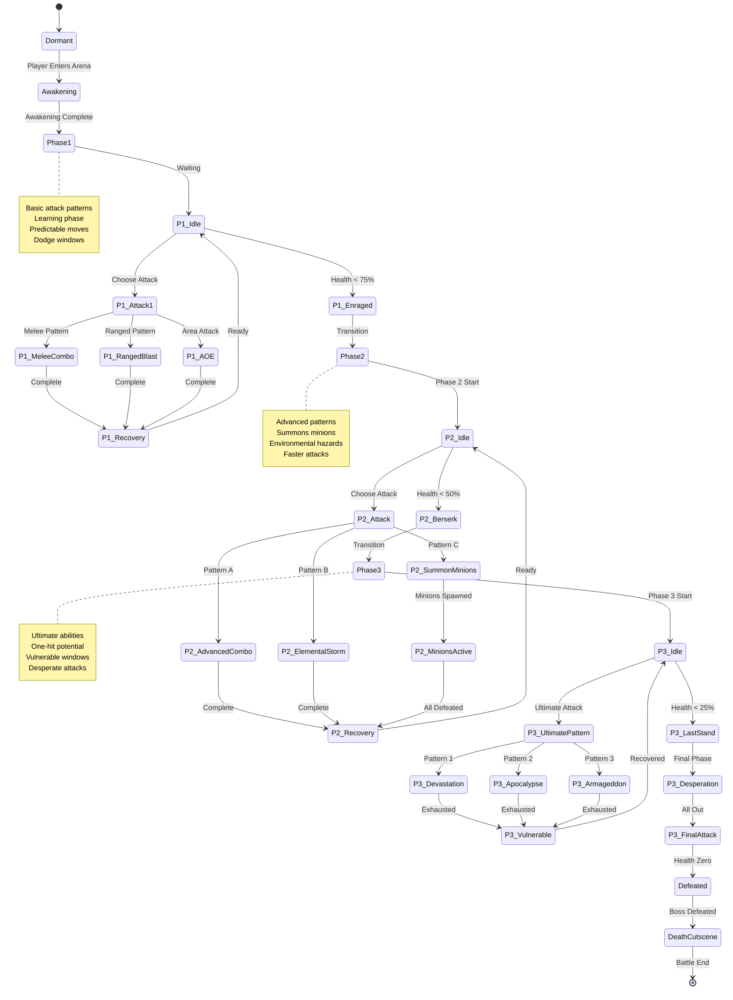
```mermaid
stateDiagram-v2
    [*] --> Dormant

    Dormant --> Awakening: Player Enters Arena
    Awakening --> Phase1: Awakening Complete

    Phase1 --> P1_Idle: Waiting
    P1_Idle --> P1_Attack1: Choose Attack

    P1_Attack1 --> P1_MeleeCombo: Melee Pattern
    P1_Attack1 --> P1_RangedBlast: Ranged Pattern
    P1_Attack1 --> P1_AOE: Area Attack

    P1_MeleeCombo --> P1_Recovery: Complete
    P1_RangedBlast --> P1_Recovery: Complete
    P1_AOE --> P1_Recovery: Complete

    P1_Recovery --> P1_Idle: Ready
    P1_Idle --> P1_Enraged: Health < 75%

    P1_Enraged --> Phase2: Transition
    Phase2 --> P2_Idle: Phase 2 Start

    P2_Idle --> P2_Attack: Choose Attack
    P2_Attack --> P2_AdvancedCombo: Pattern A
    P2_Attack --> P2_ElementalStorm: Pattern B
    P2_Attack --> P2_SummonMinions: Pattern C

    P2_AdvancedCombo --> P2_Recovery: Complete
    P2_ElementalStorm --> P2_Recovery: Complete
    P2_SummonMinions --> P2_MinionsActive: Minions Spawned

    P2_MinionsActive --> P2_Recovery: All Defeated
    P2_Recovery --> P2_Idle: Ready

    P2_Idle --> P2_Berserk: Health < 50%
    P2_Berserk --> Phase3: Transition

    Phase3 --> P3_Idle: Phase 3 Start
    P3_Idle --> P3_UltimatePattern: Ultimate Attack

    P3_UltimatePattern --> P3_Devastation: Pattern 1
    P3_UltimatePattern --> P3_Apocalypse: Pattern 2
    P3_UltimatePattern --> P3_Armageddon: Pattern 3

    P3_Devastation --> P3_Vulnerable: Exhausted
    P3_Apocalypse --> P3_Vulnerable: Exhausted
    P3_Armageddon --> P3_Vulnerable: Exhausted

    P3_Vulnerable --> P3_Idle: Recovered
    P3_Idle --> P3_LastStand: Health < 25%

    P3_LastStand --> P3_Desperation: Final Phase
    P3_Desperation --> P3_FinalAttack: All Out

    P3_FinalAttack --> Defeated: Health Zero
    Defeated --> DeathCutscene: Boss Defeated
    DeathCutscene --> [*]: Battle End

    note right of Phase1
        Basic attack patterns
        Learning phase
        Predictable moves
        Dodge windows
    end note

    note right of Phase2
        Advanced patterns
        Summons minions
        Environmental hazards
        Faster attacks
    end note

    note right of Phase3
        Ultimate abilities
        One-hit potential
        Vulnerable windows
        Desperate attacks
    end note
```

### NPC Behavior State Machine

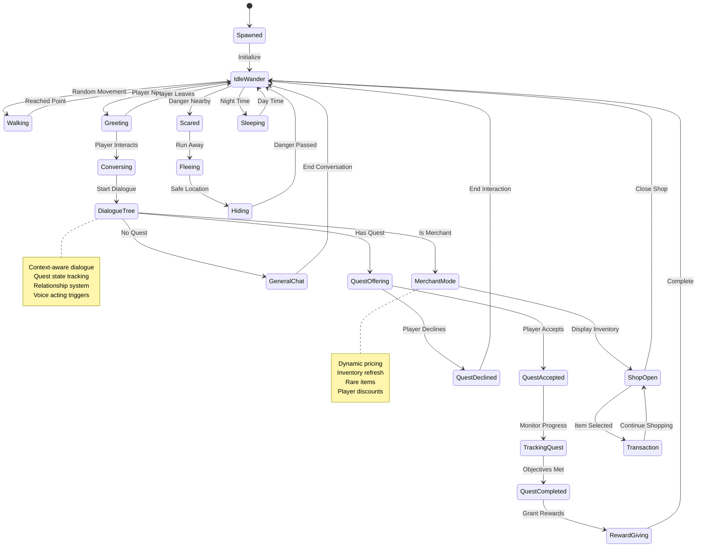
```mermaid
stateDiagram-v2
    [*] --> Spawned

    Spawned --> IdleWander: Initialize
    IdleWander --> Walking: Random Movement
    Walking --> IdleWander: Reached Point

    IdleWander --> Greeting: Player Nearby
    Greeting --> Conversing: Player Interacts
    Greeting --> IdleWander: Player Leaves

    Conversing --> DialogueTree: Start Dialogue
    DialogueTree --> QuestOffering: Has Quest
    DialogueTree --> GeneralChat: No Quest
    DialogueTree --> MerchantMode: Is Merchant

    QuestOffering --> QuestAccepted: Player Accepts
    QuestOffering --> QuestDeclined: Player Declines

    QuestAccepted --> TrackingQuest: Monitor Progress
    TrackingQuest --> QuestCompleted: Objectives Met
    QuestCompleted --> RewardGiving: Grant Rewards
    RewardGiving --> IdleWander: Complete

    QuestDeclined --> IdleWander: End Interaction
    GeneralChat --> IdleWander: End Conversation

    MerchantMode --> ShopOpen: Display Inventory
    ShopOpen --> Transaction: Item Selected
    Transaction --> ShopOpen: Continue Shopping
    ShopOpen --> IdleWander: Close Shop

    IdleWander --> Scared: Danger Nearby
    Scared --> Fleeing: Run Away
    Fleeing --> Hiding: Safe Location
    Hiding --> IdleWander: Danger Passed

    IdleWander --> Sleeping: Night Time
    Sleeping --> IdleWander: Day Time

    note right of DialogueTree
        Context-aware dialogue
        Quest state tracking
        Relationship system
        Voice acting triggers
    end note

    note right of MerchantMode
        Dynamic pricing
        Inventory refresh
        Rare items
        Player discounts
    end note
```

---

## Player State Machine

### Player Movement State

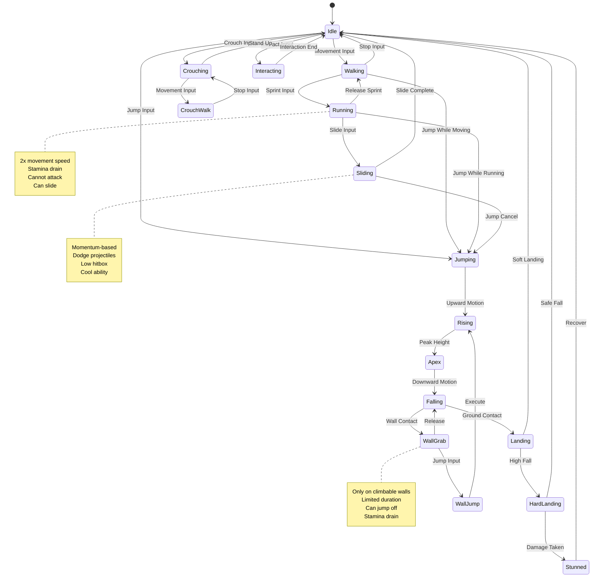
```mermaid
stateDiagram-v2
    [*] --> Idle

    Idle --> Walking: Movement Input
    Idle --> Jumping: Jump Input
    Idle --> Crouching: Crouch Input
    Idle --> Interacting: Interact Input

    Walking --> Running: Sprint Input
    Walking --> Idle: Stop Input
    Walking --> Jumping: Jump While Moving

    Running --> Walking: Release Sprint
    Running --> Sliding: Slide Input
    Running --> Jumping: Jump While Running

    Sliding --> Idle: Slide Complete
    Sliding --> Jumping: Jump Cancel

    Jumping --> Rising: Upward Motion
    Rising --> Apex: Peak Height
    Apex --> Falling: Downward Motion

    Falling --> Landing: Ground Contact
    Falling --> WallGrab: Wall Contact

    Landing --> Idle: Soft Landing
    Landing --> HardLanding: High Fall

    HardLanding --> Stunned: Damage Taken
    HardLanding --> Idle: Safe Fall

    Stunned --> Idle: Recover

    WallGrab --> WallJump: Jump Input
    WallGrab --> Falling: Release

    WallJump --> Rising: Execute

    Crouching --> CrouchWalk: Movement Input
    Crouching --> Idle: Stand Up
    CrouchWalk --> Crouching: Stop Input

    Interacting --> Idle: Interaction End

    note right of Running
        2x movement speed
        Stamina drain
        Cannot attack
        Can slide
    end note

    note right of Sliding
        Momentum-based
        Dodge projectiles
        Low hitbox
        Cool ability
    end note

    note right of WallGrab
        Only on climbable walls
        Limited duration
        Can jump off
        Stamina drain
    end note
```

### Player Action State

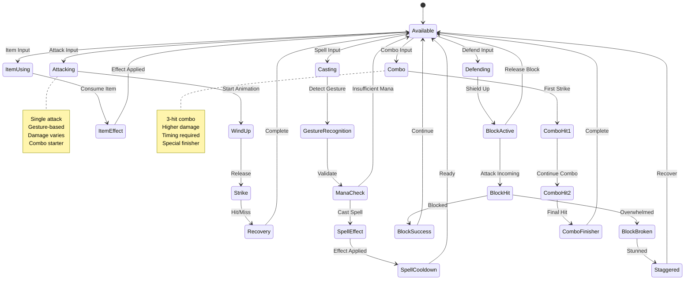
```mermaid
stateDiagram-v2
    [*] --> Available

    Available --> Attacking: Attack Input
    Available --> Casting: Spell Input
    Available --> Defending: Defend Input
    Available --> ItemUsing: Item Input

    Attacking --> WindUp: Start Animation
    WindUp --> Strike: Release
    Strike --> Recovery: Hit/Miss
    Recovery --> Available: Complete

    Casting --> GestureRecognition: Detect Gesture
    GestureRecognition --> ManaCheck: Validate
    ManaCheck --> SpellEffect: Cast Spell
    ManaCheck --> Available: Insufficient Mana
    SpellEffect --> SpellCooldown: Effect Applied
    SpellCooldown --> Available: Ready

    Defending --> BlockActive: Shield Up
    BlockActive --> BlockHit: Attack Incoming
    BlockActive --> Available: Release Block

    BlockHit --> BlockSuccess: Blocked
    BlockHit --> BlockBroken: Overwhelmed

    BlockSuccess --> Available: Continue
    BlockBroken --> Staggered: Stunned

    Staggered --> Available: Recover

    ItemUsing --> ItemEffect: Consume Item
    ItemEffect --> Available: Effect Applied

    Available --> Combo: Combo Input
    Combo --> ComboHit1: First Strike
    ComboHit1 --> ComboHit2: Continue Combo
    ComboHit2 --> ComboFinisher: Final Hit
    ComboFinisher --> Available: Complete

    note right of Attacking
        Single attack
        Gesture-based
        Damage varies
        Combo starter
    end note

    note right of Combo
        3-hit combo
        Higher damage
        Timing required
        Special finisher
    end note
```

### Player Health State

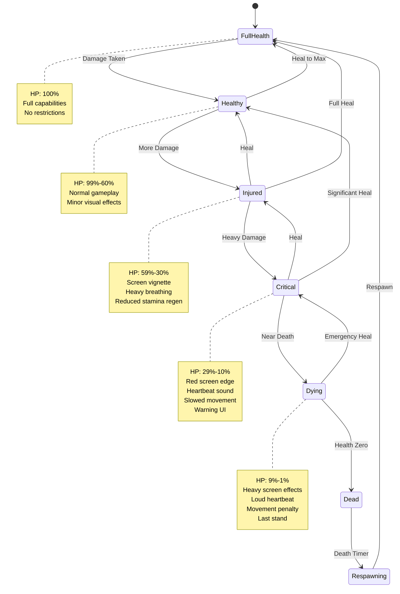
```mermaid
stateDiagram-v2
    [*] --> FullHealth

    FullHealth --> Healthy: Damage Taken
    Healthy --> FullHealth: Heal to Max

    Healthy --> Injured: More Damage
    Injured --> Healthy: Heal
    Injured --> FullHealth: Full Heal

    Injured --> Critical: Heavy Damage
    Critical --> Injured: Heal
    Critical --> Healthy: Significant Heal

    Critical --> Dying: Near Death
    Dying --> Critical: Emergency Heal

    Dying --> Dead: Health Zero
    Dead --> Respawning: Death Timer

    Respawning --> FullHealth: Respawn

    note right of FullHealth
        HP: 100%
        Full capabilities
        No restrictions
    end note

    note right of Healthy
        HP: 99%-60%
        Normal gameplay
        Minor visual effects
    end note

    note right of Injured
        HP: 59%-30%
        Screen vignette
        Heavy breathing
        Reduced stamina regen
    end note

    note right of Critical
        HP: 29%-10%
        Red screen edge
        Heartbeat sound
        Slowed movement
        Warning UI
    end note

    note right of Dying
        HP: 9%-1%
        Heavy screen effects
        Loud heartbeat
        Movement penalty
        Last stand
    end note
```

---

## UI State Machines

### Menu Navigation State

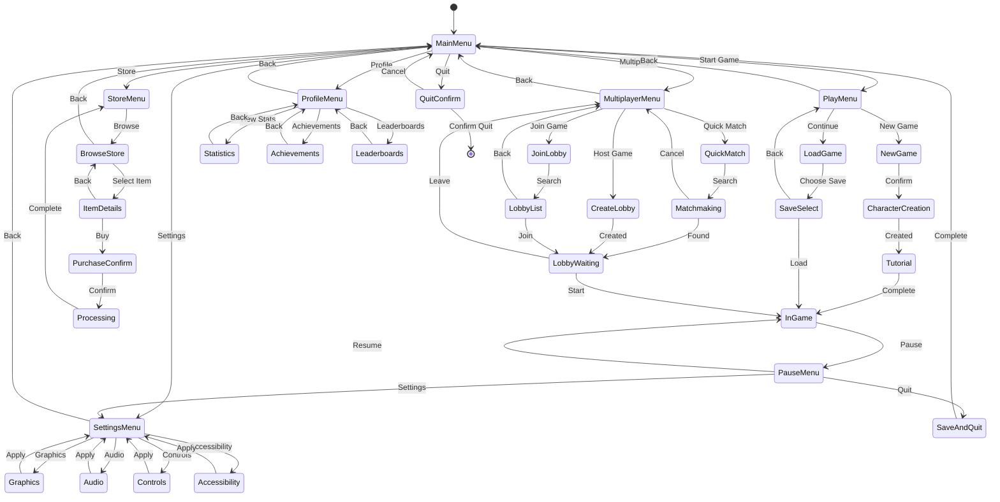
```mermaid
stateDiagram-v2
    [*] --> MainMenu

    MainMenu --> PlayMenu: Start Game
    MainMenu --> MultiplayerMenu: Multiplayer
    MainMenu --> SettingsMenu: Settings
    MainMenu --> ProfileMenu: Profile
    MainMenu --> StoreMenu: Store
    MainMenu --> QuitConfirm: Quit

    PlayMenu --> NewGame: New Game
    PlayMenu --> LoadGame: Continue
    PlayMenu --> MainMenu: Back

    NewGame --> CharacterCreation: Confirm
    CharacterCreation --> Tutorial: Created
    Tutorial --> InGame: Complete

    LoadGame --> SaveSelect: Choose Save
    SaveSelect --> InGame: Load
    SaveSelect --> PlayMenu: Back

    MultiplayerMenu --> QuickMatch: Quick Match
    MultiplayerMenu --> CreateLobby: Host Game
    MultiplayerMenu --> JoinLobby: Join Game
    MultiplayerMenu --> MainMenu: Back

    QuickMatch --> Matchmaking: Search
    Matchmaking --> LobbyWaiting: Found
    Matchmaking --> MultiplayerMenu: Cancel

    CreateLobby --> LobbyWaiting: Created
    JoinLobby --> LobbyList: Search
    LobbyList --> LobbyWaiting: Join
    LobbyList --> MultiplayerMenu: Back

    LobbyWaiting --> InGame: Start
    LobbyWaiting --> MultiplayerMenu: Leave

    SettingsMenu --> Graphics: Graphics
    SettingsMenu --> Audio: Audio
    SettingsMenu --> Controls: Controls
    SettingsMenu --> Accessibility: Accessibility
    SettingsMenu --> MainMenu: Back

    Graphics --> SettingsMenu: Apply
    Audio --> SettingsMenu: Apply
    Controls --> SettingsMenu: Apply
    Accessibility --> SettingsMenu: Apply

    ProfileMenu --> Statistics: View Stats
    ProfileMenu --> Achievements: Achievements
    ProfileMenu --> Leaderboards: Leaderboards
    ProfileMenu --> MainMenu: Back

    Statistics --> ProfileMenu: Back
    Achievements --> ProfileMenu: Back
    Leaderboards --> ProfileMenu: Back

    StoreMenu --> BrowseStore: Browse
    BrowseStore --> ItemDetails: Select Item
    ItemDetails --> PurchaseConfirm: Buy
    PurchaseConfirm --> Processing: Confirm
    Processing --> StoreMenu: Complete
    ItemDetails --> BrowseStore: Back
    BrowseStore --> MainMenu: Back

    QuitConfirm --> [*]: Confirm Quit
    QuitConfirm --> MainMenu: Cancel

    InGame --> PauseMenu: Pause
    PauseMenu --> InGame: Resume
    PauseMenu --> SettingsMenu: Settings
    PauseMenu --> SaveAndQuit: Quit
    SaveAndQuit --> MainMenu: Complete
```

### HUD State Machine

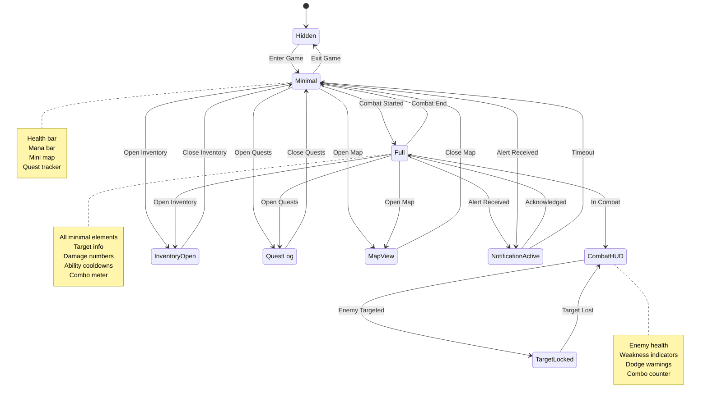
```mermaid
stateDiagram-v2
    [*] --> Hidden

    Hidden --> Minimal: Enter Game
    Minimal --> Full: Combat Started
    Minimal --> Hidden: Exit Game

    Full --> CombatHUD: In Combat
    Full --> Minimal: Combat End

    CombatHUD --> TargetLocked: Enemy Targeted
    TargetLocked --> CombatHUD: Target Lost

    Minimal --> InventoryOpen: Open Inventory
    Full --> InventoryOpen: Open Inventory
    InventoryOpen --> Minimal: Close Inventory

    Minimal --> QuestLog: Open Quests
    Full --> QuestLog: Open Quests
    QuestLog --> Minimal: Close Quests

    Minimal --> MapView: Open Map
    Full --> MapView: Open Map
    MapView --> Minimal: Close Map

    Full --> NotificationActive: Alert Received
    Minimal --> NotificationActive: Alert Received
    NotificationActive --> Full: Acknowledged
    NotificationActive --> Minimal: Timeout

    note right of Minimal
        Health bar
        Mana bar
        Mini map
        Quest tracker
    end note

    note right of Full
        All minimal elements
        Target info
        Damage numbers
        Ability cooldowns
        Combo meter
    end note

    note right of CombatHUD
        Enemy health
        Weakness indicators
        Dodge warnings
        Combo counter
    end note
```

---

## Network State Machine

### Connection State

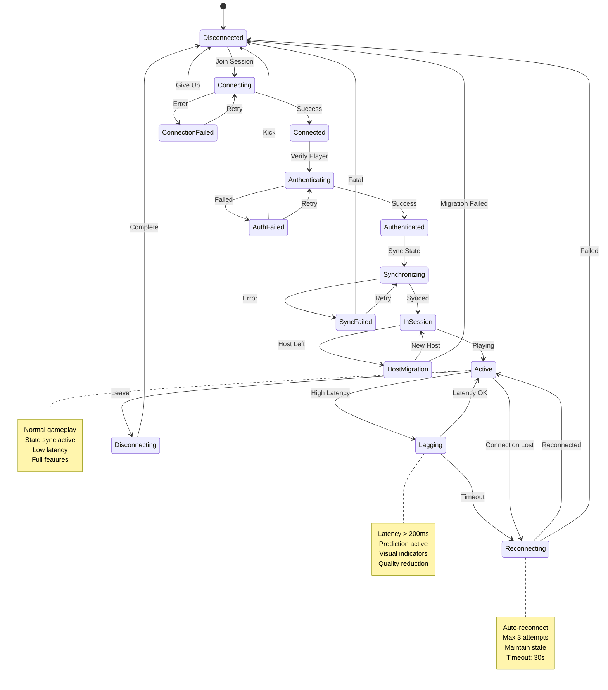
```mermaid
stateDiagram-v2
    [*] --> Disconnected

    Disconnected --> Connecting: Join Session
    Connecting --> Connected: Success
    Connecting --> ConnectionFailed: Error

    ConnectionFailed --> Disconnected: Give Up
    ConnectionFailed --> Connecting: Retry

    Connected --> Authenticating: Verify Player
    Authenticating --> Authenticated: Success
    Authenticating --> AuthFailed: Failed

    AuthFailed --> Disconnected: Kick
    AuthFailed --> Authenticating: Retry

    Authenticated --> Synchronizing: Sync State
    Synchronizing --> InSession: Synced
    Synchronizing --> SyncFailed: Error

    SyncFailed --> Disconnected: Fatal
    SyncFailed --> Synchronizing: Retry

    InSession --> Active: Playing
    Active --> Lagging: High Latency
    Lagging --> Active: Latency OK
    Lagging --> Reconnecting: Timeout

    Active --> Disconnecting: Leave
    Disconnecting --> Disconnected: Complete

    Active --> Reconnecting: Connection Lost
    Reconnecting --> Active: Reconnected
    Reconnecting --> Disconnected: Failed

    InSession --> HostMigration: Host Left
    HostMigration --> InSession: New Host
    HostMigration --> Disconnected: Migration Failed

    note right of Active
        Normal gameplay
        State sync active
        Low latency
        Full features
    end note

    note right of Lagging
        Latency > 200ms
        Prediction active
        Visual indicators
        Quality reduction
    end note

    note right of Reconnecting
        Auto-reconnect
        Max 3 attempts
        Maintain state
        Timeout: 30s
    end note
```

### Multiplayer Session State

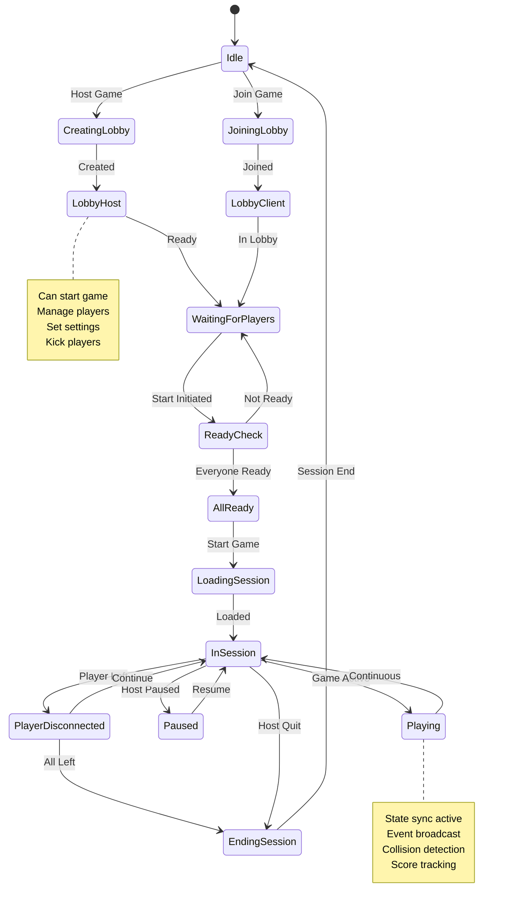
```mermaid
stateDiagram-v2
    [*] --> Idle

    Idle --> CreatingLobby: Host Game
    Idle --> JoiningLobby: Join Game

    CreatingLobby --> LobbyHost: Created
    JoiningLobby --> LobbyClient: Joined

    LobbyHost --> WaitingForPlayers: Ready
    LobbyClient --> WaitingForPlayers: In Lobby

    WaitingForPlayers --> ReadyCheck: Start Initiated
    ReadyCheck --> AllReady: Everyone Ready
    ReadyCheck --> WaitingForPlayers: Not Ready

    AllReady --> LoadingSession: Start Game
    LoadingSession --> InSession: Loaded

    InSession --> Playing: Game Active
    Playing --> InSession: Continuous

    InSession --> Paused: Host Paused
    Paused --> InSession: Resume

    InSession --> PlayerDisconnected: Player Left
    PlayerDisconnected --> InSession: Continue
    PlayerDisconnected --> EndingSession: All Left

    InSession --> EndingSession: Host Quit
    EndingSession --> Idle: Session End

    note right of LobbyHost
        Can start game
        Manage players
        Set settings
        Kick players
    end note

    note right of Playing
        State sync active
        Event broadcast
        Collision detection
        Score tracking
    end note
```

---

## Room Mapping State Machine

### AR Scanning State

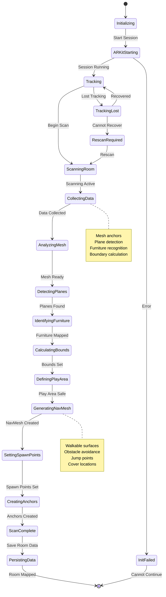
```mermaid
stateDiagram-v2
    [*] --> Initializing

    Initializing --> ARKitStarting: Start Session
    ARKitStarting --> Tracking: Session Running
    ARKitStarting --> InitFailed: Error

    InitFailed --> [*]: Cannot Continue

    Tracking --> ScanningRoom: Begin Scan
    ScanningRoom --> CollectingData: Scanning Active

    CollectingData --> AnalyzingMesh: Data Collected
    AnalyzingMesh --> DetectingPlanes: Mesh Ready
    DetectingPlanes --> IdentifyingFurniture: Planes Found
    IdentifyingFurniture --> CalculatingBounds: Furniture Mapped

    CalculatingBounds --> DefiningPlayArea: Bounds Set
    DefiningPlayArea --> GeneratingNavMesh: Play Area Safe

    GeneratingNavMesh --> SettingSpawnPoints: NavMesh Created
    SettingSpawnPoints --> CreatingAnchors: Spawn Points Set

    CreatingAnchors --> ScanComplete: Anchors Created
    ScanComplete --> PersistingData: Save Room Data

    PersistingData --> [*]: Room Mapped

    Tracking --> TrackingLost: Lost Tracking
    TrackingLost --> Tracking: Recovered
    TrackingLost --> RescanRequired: Cannot Recover

    RescanRequired --> ScanningRoom: Rescan

    note right of CollectingData
        Mesh anchors
        Plane detection
        Furniture recognition
        Boundary calculation
    end note

    note right of GeneratingNavMesh
        Walkable surfaces
        Obstacle avoidance
        Jump points
        Cover locations
    end note
```

---

## Animation State Machines

### Character Animation State

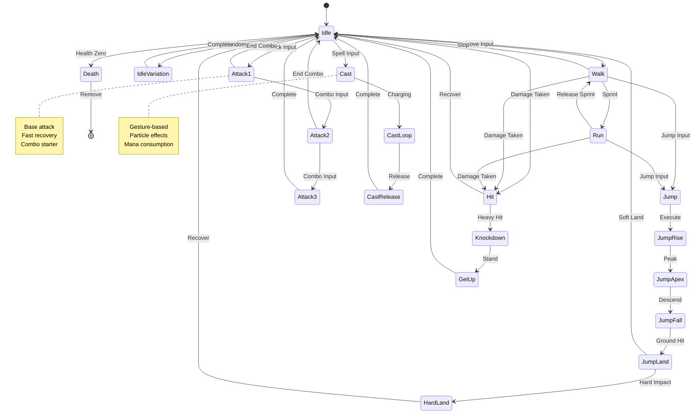
```mermaid
stateDiagram-v2
    [*] --> Idle

    Idle --> Walk: Move Input
    Idle --> IdleVariation: Random

    IdleVariation --> Idle: Complete

    Walk --> Run: Sprint
    Walk --> Idle: Stop
    Walk --> Jump: Jump Input

    Run --> Walk: Release Sprint
    Run --> Jump: Jump Input

    Jump --> JumpRise: Execute
    JumpRise --> JumpApex: Peak
    JumpApex --> JumpFall: Descend
    JumpFall --> JumpLand: Ground Hit

    JumpLand --> Idle: Soft Land
    JumpLand --> HardLand: Hard Impact

    HardLand --> Idle: Recover

    Idle --> Attack1: Attack Input
    Attack1 --> Attack2: Combo Input
    Attack2 --> Attack3: Combo Input
    Attack3 --> Idle: Complete

    Attack1 --> Idle: End Combo
    Attack2 --> Idle: End Combo

    Idle --> Cast: Spell Input
    Cast --> CastLoop: Charging
    CastLoop --> CastRelease: Release
    CastRelease --> Idle: Complete

    Idle --> Hit: Damage Taken
    Walk --> Hit: Damage Taken
    Run --> Hit: Damage Taken

    Hit --> Idle: Recover
    Hit --> Knockdown: Heavy Hit

    Knockdown --> GetUp: Stand
    GetUp --> Idle: Complete

    Idle --> Death: Health Zero
    Death --> [*]: Remove

    note right of Attack1
        Base attack
        Fast recovery
        Combo starter
    end note

    note right of Cast
        Gesture-based
        Particle effects
        Mana consumption
    end note
```

---

## Quest State Machine

### Quest Progress State

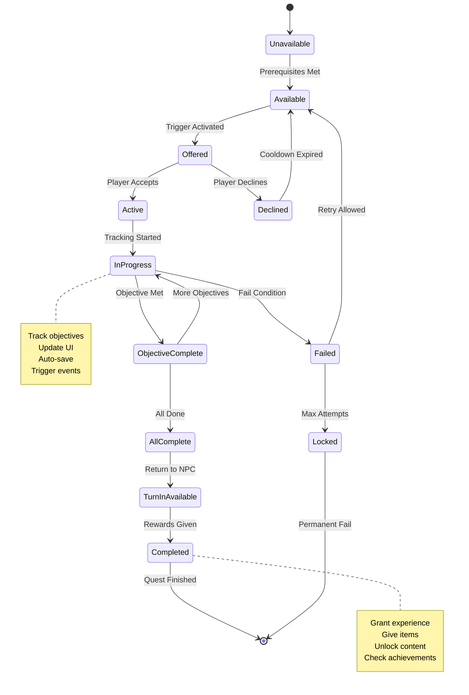
```mermaid
stateDiagram-v2
    [*] --> Unavailable

    Unavailable --> Available: Prerequisites Met
    Available --> Offered: Trigger Activated
    Offered --> Active: Player Accepts
    Offered --> Declined: Player Declines

    Declined --> Available: Cooldown Expired

    Active --> InProgress: Tracking Started
    InProgress --> ObjectiveComplete: Objective Met
    ObjectiveComplete --> InProgress: More Objectives
    ObjectiveComplete --> AllComplete: All Done

    AllComplete --> TurnInAvailable: Return to NPC
    TurnInAvailable --> Completed: Rewards Given

    InProgress --> Failed: Fail Condition
    Failed --> Available: Retry Allowed
    Failed --> Locked: Max Attempts

    Completed --> [*]: Quest Finished
    Locked --> [*]: Permanent Fail

    note right of InProgress
        Track objectives
        Update UI
        Auto-save
        Trigger events
    end note

    note right of Completed
        Grant experience
        Give items
        Unlock content
        Check achievements
    end note
```

---

## Conclusion

These state machine diagrams provide comprehensive visualization of all major state transitions in Reality Realms RPG. Each state machine is designed to:

### Design Principles

1. **Clear State Definitions**: Every state has explicit entry/exit conditions
2. **Predictable Transitions**: State changes follow logical gameplay flow
3. **Error Handling**: Failure states with recovery paths
4. **Performance**: Minimal state checks per frame
5. **Debuggability**: State history tracking for debugging

### Implementation Guidelines

- States should be mutually exclusive
- Transitions should be atomic operations
- State changes should trigger events
- Each state should validate preconditions
- Invalid transitions should be logged

### Integration Points

- Event system triggers state transitions
- Save system persists critical states
- Network system syncs multiplayer states
- UI system reflects current states
- Analytics tracks state durations

These state machines form the backbone of Reality Realms RPG's gameplay logic, ensuring consistent and predictable behavior across all game systems.
