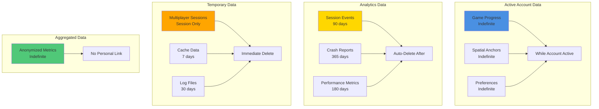
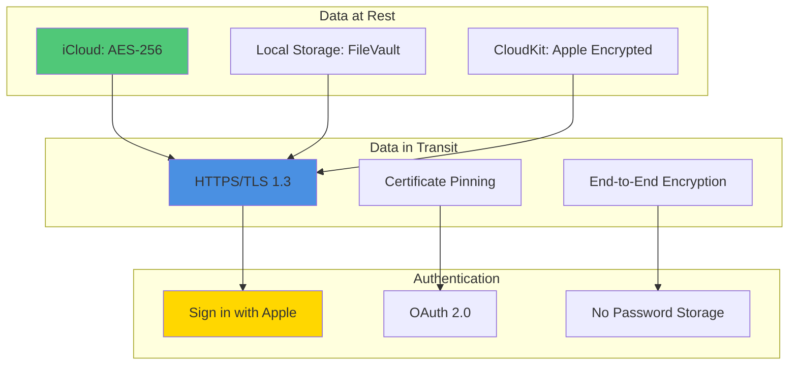

# Reality Realms RPG - User Privacy Policy and Data Handling

## Table of Contents
- [Privacy Overview](#privacy-overview)
- [What Data is Collected](#what-data-is-collected)
- [What Data is NOT Collected](#what-data-is-not-collected)
- [User Rights (GDPR, CCPA)](#user-rights-gdpr-ccpa)
- [Data Retention](#data-retention)
- [Privacy Controls](#privacy-controls)
- [Children's Privacy](#childrens-privacy)
- [Data Security](#data-security)
- [Third-Party Services](#third-party-services)
- [Contact Information](#contact-information)

---

## Privacy Overview

Reality Realms RPG is committed to protecting user privacy. We follow privacy-by-design principles and comply with all applicable privacy laws including GDPR, CCPA, and Apple's App Store guidelines.

### Privacy Principles

1. **Transparency**: Clear about what we collect and why
2. **Consent**: User permission required for data collection
3. **Minimization**: Collect only what's necessary
4. **Security**: Protect data with industry-standard encryption
5. **User Control**: Easy-to-use privacy settings
6. **No Sale**: We never sell user data

### Privacy-First Architecture

```mermaid
graph TB
    subgraph "User Device"
        U1[Game Data]
        U2[Spatial Anchors]
        U3[Preferences]
    end

    subgraph "Apple Services (Encrypted)"
        A1[iCloud Sync<br/>End-to-End Encrypted]
        A2[CloudKit<br/>Apple Managed]
        A3[GameCenter<br/>Anonymized]
    end

    subgraph "Anonymous Data"
        AN1[Analytics<br/>No PII]
        AN2[Crash Reports<br/>Anonymized]
        AN3[Performance Metrics<br/>Aggregated]
    end

    subgraph "NOT Collected"
        NC1[❌ Location<br/>(beyond country)]
        NC2[❌ Device IDs]
        NC3[❌ Personal Info]
        NC4[❌ Contacts]
    end

    U1 --> A1
    U2 --> A2
    U3 --> A1

    U1 -.Optional.-> AN1
    U1 -.Optional.-> AN2
    U1 -.Optional.-> AN3

    style A1 fill:#4A90E2
    style AN1 fill:#FFD700
    style NC1 fill:#E94B3C
    style NC2 fill:#E94B3C
    style NC3 fill:#E94B3C
    style NC4 fill:#E94B3C
```

---

## What Data is Collected

### Game Progress Data

**Purpose**: Save your game progress and enable cross-device play

| Data Type | What We Store | How It's Used | Storage Location |
|-----------|---------------|---------------|------------------|
| Player Profile | Character name, class, level | Save game state | iCloud (Encrypted) |
| Inventory | Items, equipment, currency | Restore player inventory | iCloud (Encrypted) |
| Quest Progress | Completed quests, objectives | Track game progress | iCloud (Encrypted) |
| Achievements | Unlocked achievements | Display accomplishments | GameCenter |
| Preferences | Settings, controls, audio | Personalize experience | Local + iCloud |

**Storage Duration**: Until account deletion
**User Control**: Full export/delete available

### Spatial Data

**Purpose**: Remember room layout and persistent game objects

| Data Type | What We Store | How It's Used | Storage Location |
|-----------|---------------|---------------|------------------|
| Room Dimensions | Width, length, height (meters) | Adapt gameplay to space | Local + iCloud |
| Spatial Anchors | Anchor positions (relative) | Persist objects in space | CloudKit |
| Furniture Detection | Object type (table, chair, etc.) | Gameplay mechanics | Local Only |
| Play Area | Safe play boundaries | Player safety | Local Only |

**Storage Duration**: Until room is re-scanned or deleted
**User Control**: Delete room data anytime
**Privacy Note**: No photos/video captured, only 3D mesh data

### Analytics Data (Optional - Requires Consent)

**Purpose**: Improve game performance and experience

| Data Type | What We Store | How It's Used | Storage Location |
|-----------|---------------|---------------|------------------|
| Session Duration | Play time per session | Engagement metrics | Apple Analytics |
| Feature Usage | Which features used | Feature popularity | Apple Analytics |
| Performance Metrics | FPS, memory, load times | Optimize performance | MetricKit |
| Crash Reports | Crash logs (anonymized) | Fix bugs | Xcode Organizer |
| Game Events | Quest completion, combat stats | Balance gameplay | Apple Analytics |

**Storage Duration**: 90 days, then aggregated/anonymized
**User Control**: Opt-in/opt-out anytime
**Privacy Note**: No personal identifiers, anonymous session IDs only

### Network Data (Multiplayer Only)

**Purpose**: Enable multiplayer gameplay

| Data Type | What We Store | How It's Used | Storage Location |
|-----------|---------------|---------------|------------------|
| Player Name | Display name (chosen by user) | Show to other players | CloudKit |
| Game Center ID | Anonymous Apple ID | Matchmaking | GameCenter |
| Session Data | Multiplayer game state | Sync gameplay | CloudKit (Temporary) |
| Friend Connections | GameCenter friends list | Social features | GameCenter |

**Storage Duration**: Session duration only, deleted after
**User Control**: Multiplayer entirely optional
**Privacy Note**: Real identity never shared

---

## What Data is NOT Collected

### We Explicitly Do NOT Collect:

#### ❌ Personal Information
- Full name (only game character name)
- Email address (except for support requests)
- Phone number
- Physical address
- Date of birth
- Gender
- Race/ethnicity
- Payment information (handled by Apple)

#### ❌ Device Identifiers
- Device serial numbers
- UDID
- MAC address
- Advertising identifiers
- Device fingerprints

#### ❌ Location Data
- GPS coordinates
- Precise location
- Location history
- We only collect country/region (from App Store, not GPS)

#### ❌ Camera/Microphone
- No photos or videos
- No audio recordings
- No room images
- Only 3D spatial mesh (no visual data)

#### ❌ Contacts & Social
- Contact list
- Phone contacts
- Social media accounts (except GameCenter)
- Calendar data
- Photo library

#### ❌ Biometric Data
- No face scans
- No eye tracking data storage
- No hand tracking data storage
- (Hand/eye tracking processed locally, never stored)

#### ❌ Health Data
- No health information
- No fitness data
- No medical information

### Privacy Comparison

```mermaid
graph LR
    subgraph "What We Collect"
        C1[✅ Game Progress]
        C2[✅ Room Dimensions]
        C3[✅ Anonymous Analytics<br/>(with consent)]
    end

    subgraph "What We DON'T Collect"
        NC1[❌ Personal Info]
        NC2[❌ Location]
        NC3[❌ Device IDs]
        NC4[❌ Photos/Video]
        NC5[❌ Contacts]
        NC6[❌ Biometric Data]
    end

    style C1 fill:#50C878
    style C2 fill:#50C878
    style C3 fill:#50C878
    style NC1 fill:#E94B3C
    style NC2 fill:#E94B3C
    style NC3 fill:#E94B3C
    style NC4 fill:#E94B3C
    style NC5 fill:#E94B3C
    style NC6 fill:#E94B3C
```

---

## User Rights (GDPR, CCPA)

### Your Rights

Under GDPR (EU) and CCPA (California), you have the right to:

#### 1. Right to Access
**What it means**: View all data we have about you
**How to exercise**: Settings → Privacy → Export My Data
**Response time**: Within 30 days

```swift
struct DataExportView: View {
    func exportUserData() async {
        let export = await PrivacyManager.shared.exportAllUserData()

        // Export includes:
        // - Game progress data
        // - Spatial anchor data
        // - Preferences
        // - Analytics data (if consented)
        // - Account information

        // Delivered as encrypted ZIP file
        shareExport(export)
    }
}
```

#### 2. Right to Deletion
**What it means**: Delete all your data permanently
**How to exercise**: Settings → Privacy → Delete My Account
**Response time**: Immediate
**Effect**: Account and all data deleted within 24 hours

```swift
func deleteUserAccount() async {
    // Confirm deletion
    let confirmed = await showDeleteConfirmation()

    guard confirmed else { return }

    // Delete from all sources
    await CloudKitManager.shared.deleteAllUserData()
    await iCloudManager.shared.deleteAllUserData()
    await GameCenterManager.shared.signOut()
    await LocalStorage.deleteAllData()

    // Confirm deletion
    showDeletionComplete()
}
```

#### 3. Right to Rectification
**What it means**: Correct inaccurate data
**How to exercise**: Edit in Settings → Profile
**Response time**: Immediate

#### 4. Right to Portability
**What it means**: Export data in machine-readable format
**How to exercise**: Settings → Privacy → Export Data
**Format**: JSON with comprehensive documentation

#### 5. Right to Restrict Processing
**What it means**: Limit how we use your data
**How to exercise**: Settings → Privacy → Restrict Analytics
**Effect**: Analytics disabled, minimal data collection

#### 6. Right to Object
**What it means**: Object to data processing
**How to exercise**: Settings → Privacy → Opt Out
**Effect**: Analytics and optional features disabled

#### 7. Right to Withdraw Consent
**What it means**: Revoke previously given consent
**How to exercise**: Settings → Privacy → Manage Consent
**Effect**: Immediate, can re-enable anytime

### GDPR Compliance Checklist

- [x] Data processing lawful basis documented
- [x] Privacy policy clear and accessible
- [x] Consent mechanism implemented
- [x] Easy opt-out available
- [x] Data minimization practiced
- [x] Encryption at rest and in transit
- [x] Data retention policies defined
- [x] User rights mechanisms implemented
- [x] Data breach procedures established
- [x] Privacy by design architecture

### CCPA Compliance

```swift
struct CCPACompliance {
    // Do Not Sell My Personal Information
    static var doNotSellEnabled: Bool {
        get { UserDefaults.standard.bool(forKey: "ccpa_do_not_sell") }
        set {
            UserDefaults.standard.set(newValue, forKey: "ccpa_do_not_sell")

            if newValue {
                // We don't sell data anyway, but ensure complete opt-out
                AnalyticsManager.shared.disable()
            }
        }
    }

    // California residents have additional rights
    static func isCalifornia Resident() -> Bool {
        // Check based on App Store region
        let region = Locale.current.regionCode
        return region == "US" // Further refinement possible
    }

    static func showCCPAOptions() {
        // Show CCPA-specific privacy options
        // - Do Not Sell toggle
        // - Data deletion
        // - Data access
        // - Opt-out of analytics
    }
}
```

---

## Data Retention

### Retention Periods



### Data Lifecycle

```swift
class DataRetentionManager {
    struct RetentionPolicy {
        let dataType: DataType
        let retentionPeriod: TimeInterval
        let deleteWhen: DeleteCondition

        enum DataType {
            case gameProgress
            case spatialAnchors
            case analytics
            case crashReports
            case cache
            case logs
        }

        enum DeleteCondition {
            case afterPeriod(TimeInterval)
            case onAccountDeletion
            case onSessionEnd
            case manual
        }
    }

    let policies: [RetentionPolicy] = [
        RetentionPolicy(
            dataType: .gameProgress,
            retentionPeriod: .infinity,
            deleteWhen: .onAccountDeletion
        ),
        RetentionPolicy(
            dataType: .analytics,
            retentionPeriod: 90 * 24 * 60 * 60, // 90 days
            deleteWhen: .afterPeriod(90 * 24 * 60 * 60)
        ),
        RetentionPolicy(
            dataType: .cache,
            retentionPeriod: 7 * 24 * 60 * 60, // 7 days
            deleteWhen: .afterPeriod(7 * 24 * 60 * 60)
        )
    ]

    func cleanupExpiredData() async {
        for policy in policies {
            await enforceRetention(policy)
        }
    }
}
```

---

## Privacy Controls

### In-App Privacy Settings

```swift
struct PrivacySettingsView: View {
    @StateObject private var privacyManager = PrivacyManager.shared

    var body: some View {
        Form {
            Section("Data Collection") {
                Toggle("Analytics", isOn: $privacyManager.analyticsEnabled)
                    .help("Help us improve by sharing anonymous usage data")

                Toggle("Crash Reports", isOn: $privacyManager.crashReportsEnabled)
                    .help("Automatically send crash reports to fix bugs")

                Toggle("Performance Metrics", isOn: $privacyManager.performanceMetricsEnabled)
                    .help("Share performance data to optimize the game")
            }

            Section("Your Data") {
                Button("View Privacy Policy") {
                    showPrivacyPolicy()
                }

                Button("Export My Data") {
                    exportData()
                }

                Button("Delete My Account") {
                    deleteAccount()
                }
                .foregroundColor(.red)
            }

            Section("Multiplayer Privacy") {
                Toggle("Show Online Status", isOn: $privacyManager.showOnlineStatus)

                Toggle("Allow Friend Requests", isOn: $privacyManager.allowFriendRequests)

                Picker("Profile Visibility", selection: $privacyManager.profileVisibility) {
                    Text("Everyone").tag(ProfileVisibility.everyone)
                    Text("Friends Only").tag(ProfileVisibility.friendsOnly)
                    Text("Private").tag(ProfileVisibility.private)
                }
            }

            Section("Spatial Data") {
                Toggle("Save Room Layout", isOn: $privacyManager.saveRoomLayout)
                    .help("Remember room configuration between sessions")

                Button("Delete Room Data") {
                    deleteRoomData()
                }

                Button("Reset Spatial Anchors") {
                    resetAnchors()
                }
            }

            Section("GDPR/CCPA Rights") {
                if privacyManager.isEUResident {
                    Button("Exercise GDPR Rights") {
                        showGDPROptions()
                    }
                }

                if privacyManager.isCaliforniaResident {
                    Toggle("Do Not Sell My Information", isOn: $privacyManager.doNotSell)
                }
            }
        }
        .navigationTitle("Privacy Settings")
    }
}
```

### Privacy Dashboard

```swift
struct PrivacyDashboardView: View {
    @StateObject private var privacyManager = PrivacyManager.shared

    var body: some View {
        List {
            Section("Data Summary") {
                DataSummaryRow(
                    title: "Game Save Data",
                    size: privacyManager.gameSaveSize,
                    lastUpdated: privacyManager.gameSaveLastUpdate
                )

                DataSummaryRow(
                    title: "Spatial Anchor Data",
                    size: privacyManager.spatialDataSize,
                    lastUpdated: privacyManager.spatialDataLastUpdate
                )

                DataSummaryRow(
                    title: "Analytics Data",
                    size: privacyManager.analyticsDataSize,
                    lastUpdated: privacyManager.analyticsLastUpdate
                )
            }

            Section("Data Flow") {
                Text("✅ Local Device: \(privacyManager.localDataSize)")
                Text("☁️ iCloud: \(privacyManager.iCloudDataSize)")
                Text("📊 Analytics: \(privacyManager.analyticsEnabled ? "Enabled" : "Disabled")")
                Text("🔒 Encryption: End-to-End")
            }

            Section("Quick Actions") {
                Button("Download All My Data") {
                    downloadData()
                }

                Button("View Data Usage Timeline") {
                    showTimeline()
                }

                Button("Manage Permissions") {
                    showPermissions()
                }
            }
        }
        .navigationTitle("Privacy Dashboard")
    }
}
```

---

## Children's Privacy

### COPPA Compliance

Reality Realms RPG is rated 12+ and complies with COPPA (Children's Online Privacy Protection Act).

#### Age Verification

```swift
struct AgeGateView: View {
    @State private var birthYear: Int = 2010

    var body: some View {
        VStack {
            Text("What year were you born?")
                .font(.title)

            Picker("Birth Year", selection: $birthYear) {
                ForEach(1900...2025, id: \.self) { year in
                    Text(String(year))
                }
            }
            .pickerStyle(.wheel)

            Button("Continue") {
                verifyAge()
            }
        }
    }

    func verifyAge() {
        let age = Calendar.current.component(.year, from: Date()) - birthYear

        if age < 13 {
            // Require parental consent
            showParentalConsentFlow()
        } else if age < 18 {
            // Teen account with restrictions
            setupTeenAccount()
        } else {
            // Full account
            setupAdultAccount()
        }
    }
}
```

#### Parental Controls

- [ ] Restrict multiplayer (kids only see parent-approved friends)
- [ ] Disable chat (no text/voice communication)
- [ ] Limit in-app purchases (require approval)
- [ ] No third-party advertising
- [ ] No data collection without parental consent
- [ ] Parent dashboard to view child's activity

```swift
struct ParentalControlsView: View {
    @State private var allowMultiplayer = false
    @State private var allowChat = false
    @State private var requirePurchaseApproval = true
    @State private var playTimeLimit: TimeInterval = 3600 // 1 hour

    var body: some View {
        Form {
            Section("Multiplayer") {
                Toggle("Allow Multiplayer", isOn: $allowMultiplayer)
                Toggle("Allow Chat", isOn: $allowChat)
            }

            Section("Purchases") {
                Toggle("Require Approval", isOn: $requirePurchaseApproval)
            }

            Section("Screen Time") {
                Picker("Daily Limit", selection: $playTimeLimit) {
                    Text("30 minutes").tag(1800.0)
                    Text("1 hour").tag(3600.0)
                    Text("2 hours").tag(7200.0)
                    Text("Unlimited").tag(TimeInterval.infinity)
                }
            }

            Section("Activity") {
                Button("View Play History") {
                    showPlayHistory()
                }

                Button("View Purchase History") {
                    showPurchases()
                }
            }
        }
        .navigationTitle("Parental Controls")
    }
}
```

---

## Data Security

### Encryption



### Security Measures

| Layer | Security Measure | Implementation |
|-------|------------------|----------------|
| **Authentication** | Sign in with Apple | No passwords stored |
| **Transport** | TLS 1.3 | All network traffic encrypted |
| **Storage** | AES-256 | iCloud end-to-end encryption |
| **Code** | Code Signing | Apple Developer Certificate |
| **API** | Certificate Pinning | Prevent MITM attacks |
| **Validation** | Input Sanitization | Prevent injection attacks |
| **Access Control** | Least Privilege | Minimal permissions requested |

### Security Best Practices

```swift
class SecurityManager {
    // Secure data storage
    func secureStore(_ data: Data, key: String) throws {
        let query: [String: Any] = [
            kSecClass as String: kSecClassGenericPassword,
            kSecAttrAccount as String: key,
            kSecValueData as String: data,
            kSecAttrAccessible as String: kSecAttrAccessibleAfterFirstUnlock
        ]

        let status = SecItemAdd(query as CFDictionary, nil)
        guard status == errSecSuccess else {
            throw SecurityError.storageFailed
        }
    }

    // Network security
    func configureURLSession() -> URLSession {
        let config = URLSessionConfiguration.default
        config.tlsMinimumSupportedProtocolVersion = .TLSv13
        config.timeoutIntervalForRequest = 30
        config.waitsForConnectivity = true

        // Certificate pinning
        let delegate = SecurityDelegate()

        return URLSession(configuration: config, delegate: delegate, delegateQueue: nil)
    }

    // Data validation
    func sanitizeInput(_ input: String) -> String {
        // Remove potentially dangerous characters
        let allowedCharacters = CharacterSet.alphanumerics.union(.whitespaces)
        return input.components(separatedBy: allowedCharacters.inverted).joined()
    }
}
```

---

## Third-Party Services

### Services We Use

| Service | Purpose | Data Shared | Privacy Policy |
|---------|---------|-------------|----------------|
| **Apple iCloud** | Game save sync | Game progress, encrypted | [Apple Privacy](https://www.apple.com/privacy/) |
| **Apple CloudKit** | Multiplayer, anchors | Spatial data, game state | [Apple Privacy](https://www.apple.com/privacy/) |
| **Apple GameCenter** | Social features | Anonymous player ID | [Apple Privacy](https://www.apple.com/privacy/) |
| **Apple App Analytics** | Usage metrics | Anonymous analytics | [Apple Privacy](https://www.apple.com/privacy/) |

### No Third-Party Trackers

We do NOT use:
- ❌ Google Analytics
- ❌ Facebook SDK
- ❌ Ad networks
- ❌ Third-party crash reporting (Crashlytics, etc.)
- ❌ Third-party analytics platforms
- ❌ Social media tracking pixels

All analytics and services are provided by Apple only.

---

## Contact Information

### Privacy Questions?

**Email**: privacy@realityrealms.com
**Response Time**: Within 48 hours

**Data Protection Officer**
Email: dpo@realityrealms.com
Phone: +1 (555) 123-4567

**Address**:
Reality Realms Inc.
123 Gaming Street
San Francisco, CA 94102
United States

### Report Privacy Concerns

If you believe we've mishandled your data:
1. Email privacy@realityrealms.com
2. We investigate within 7 days
3. Resolution within 30 days
4. If unresolved, contact your data protection authority

### Updates to This Policy

Last Updated: November 19, 2025

We may update this privacy policy. We'll notify you of significant changes via:
- In-app notification
- Email (if provided)
- App Store update notes

---

## Summary

Reality Realms RPG Privacy Commitment:

✅ **Transparent**: Clear about data collection
✅ **Minimal**: Only collect what's needed
✅ **Secure**: Industry-standard encryption
✅ **Controlled**: Easy privacy settings
✅ **Compliant**: GDPR, CCPA, COPPA adherence
✅ **Respectful**: Your data, your rights

**We believe privacy is a fundamental right. We built Reality Realms RPG with that principle at its core.**
