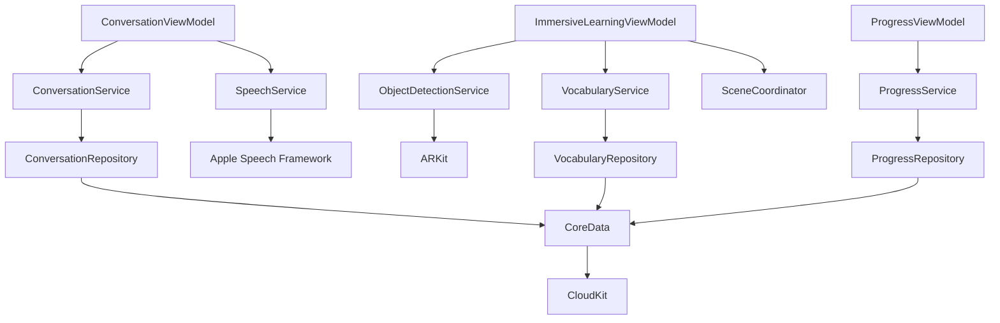

# Language Immersion Rooms - System Architecture

**Version**: 1.0.0
**Last Updated**: November 24, 2025
**Platform**: visionOS 2.0+

## Table of Contents

1. [Overview](#overview)
2. [Architecture Principles](#architecture-principles)
3. [System Layers](#system-layers)
4. [Component Architecture](#component-architecture)
5. [Data Flow](#data-flow)
6. [State Management](#state-management)
7. [Dependency Graph](#dependency-graph)
8. [RealityKit Scene Architecture](#realitykit-scene-architecture)
9. [Design Patterns](#design-patterns)
10. [Concurrency Model](#concurrency-model)
11. [Security Architecture](#security-architecture)
12. [Testing Architecture](#testing-architecture)
13. [Scalability Considerations](#scalability-considerations)

---

## Overview

Language Immersion Rooms is a native visionOS application built using Swift 6.0+ with a clean, layered architecture. The app follows MVVM (Model-View-ViewModel) pattern with protocol-oriented design and modern Swift concurrency.

### High-Level Architecture

```
┌─────────────────────────────────────────────────────────────┐
│                        Presentation Layer                    │
│  (SwiftUI Views + ViewModels + RealityKit Immersive Space)  │
└────────────────────────┬────────────────────────────────────┘
                         │
┌────────────────────────┴────────────────────────────────────┐
│                      Application Layer                       │
│         (AppState, Navigation, Session Management)           │
└────────────────────────┬────────────────────────────────────┘
                         │
┌────────────────────────┴────────────────────────────────────┐
│                       Service Layer                          │
│  (Conversation, Speech, Vocabulary, Object Detection, etc.)  │
└────────────────────────┬────────────────────────────────────┘
                         │
┌────────────────────────┴────────────────────────────────────┐
│                        Data Layer                            │
│          (CoreData, UserDefaults, CloudKit Sync)             │
└────────────────────────┬────────────────────────────────────┘
                         │
┌────────────────────────┴────────────────────────────────────┐
│                      Foundation Layer                        │
│       (Core Models, Protocols, Extensions, Utilities)        │
└─────────────────────────────────────────────────────────────┘
```

---

## Architecture Principles

### 1. Separation of Concerns
- **Views**: Display UI and handle user interaction
- **ViewModels**: Business logic and state transformation
- **Services**: Domain logic and external integrations
- **Models**: Data structures and core domain entities
- **Repositories**: Data access abstraction

### 2. Protocol-Oriented Design
All services are protocol-based for:
- Testability (easy mocking)
- Flexibility (implementation swapping)
- Dependency injection
- Clear contracts

### 3. Unidirectional Data Flow
- State changes flow from ViewModels → Views
- User actions flow from Views → ViewModels → Services
- No circular dependencies

### 4. Immutability Where Possible
- Value types (structs) for models
- Observable state for mutable state
- Clear ownership of mutable state

### 5. Async/Await Throughout
- Modern Swift concurrency
- Actor isolation where needed
- Structured concurrency with tasks

---

## System Layers

### Layer 1: Foundation (Core)

**Location**: `LanguageImmersionRooms/Core/`

**Purpose**: Fundamental types, protocols, and utilities used across all layers.

**Components**:

```
Core/
├── Models/
│   ├── Language.swift          # Language enum (en, es, fr, ja, de)
│   ├── VocabularyWord.swift    # Word domain model
│   ├── AICharacter.swift       # Character definitions (Maria, Jean, Yuki)
│   ├── User.swift              # User profile model
│   ├── UserProgress.swift      # Progress tracking model
│   └── DetectedObject.swift    # Object detection result model
├── Protocols/
│   ├── ConversationServiceProtocol.swift
│   ├── SpeechServiceProtocol.swift
│   ├── VocabularyServiceProtocol.swift
│   └── ObjectDetectionServiceProtocol.swift
└── Extensions/
    └── View+Extensions.swift   # SwiftUI view modifiers
```

**Key Models**:

```swift
// Language enum
public enum Language: String, Codable, CaseIterable {
    case english = "en"
    case spanish = "es"
    case french = "fr"
    case japanese = "ja"
    case german = "de"
}

// VocabularyWord
public struct VocabularyWord: Identifiable, Codable {
    public let id: UUID
    public let word: String
    public let translation: String
    public let category: VocabularyCategory
    public let language: Language
    public var timesEncountered: Int
}

// AICharacter
public struct AICharacter: Identifiable, Codable {
    public let id: UUID
    public let name: String
    public let language: Language
    public let personality: String
    public let avatarImageName: String

    // Predefined characters
    public static let maria = AICharacter(...)  // Spanish
    public static let jean = AICharacter(...)   // French
    public static let yuki = AICharacter(...)   // Japanese
}
```

### Layer 2: Data

**Location**: `LanguageImmersionRooms/Data/`

**Purpose**: Data persistence, caching, and external data access.

**Components**:

```
Data/
├── CoreData/
│   ├── PersistenceController.swift     # CoreData stack setup
│   ├── LanguageImmersionRooms.xcdatamodeld  # Data model
│   └── Entities/
│       ├── UserEntity+CoreDataClass.swift
│       ├── VocabularyWordEntity+CoreDataClass.swift
│       └── ConversationEntity+CoreDataClass.swift
└── Repositories/
    ├── UserRepository.swift            # User data access
    ├── VocabularyRepository.swift      # Vocabulary data access
    └── ProgressRepository.swift        # Progress data access
```

**CoreData Schema**:

```
User
├── id: UUID
├── appleId: String
├── username: String
├── currentLanguage: String
├── difficultyLevel: String
├── createdAt: Date
└── Relationships:
    ├── progress: UserProgress (1:1)
    ├── vocabularyWords: [VocabularyWord] (1:N)
    └── conversations: [Conversation] (1:N)

VocabularyWord
├── id: UUID
├── word: String
├── translation: String
├── category: String
├── language: String
├── timesEncountered: Int
├── lastEncounteredAt: Date
└── Relationships:
    └── user: User (N:1)

Conversation
├── id: UUID
├── characterId: UUID
├── messages: [Message] (JSON)
├── startedAt: Date
├── endedAt: Date
└── Relationships:
    └── user: User (N:1)
```

**Repository Pattern**:

```swift
protocol UserRepositoryProtocol {
    func saveUser(_ user: User) async throws
    func fetchUser(byId id: UUID) async throws -> User?
    func deleteUser(_ user: User) async throws
}

class UserRepository: UserRepositoryProtocol {
    private let persistenceController: PersistenceController

    init(persistenceController: PersistenceController = .shared) {
        self.persistenceController = persistenceController
    }

    func saveUser(_ user: User) async throws {
        // CoreData save logic with background context
    }
}
```

### Layer 3: Services

**Location**: `LanguageImmersionRooms/Services/`

**Purpose**: Business logic, external API integration, and domain operations.

**Components**:

```
Services/
├── ConversationService.swift        # OpenAI GPT-4 integration
├── SpeechService.swift              # Speech recognition + TTS
├── VocabularyService.swift          # Vocabulary lookup
├── ObjectDetectionService.swift     # ARKit object detection
├── GrammarService.swift             # Grammar checking
└── ProgressService.swift            # Progress calculation
```

**Service Architecture**:

Each service follows this pattern:

```swift
// Protocol definition
protocol ConversationServiceProtocol {
    func generateResponse(
        to message: String,
        history: [ConversationMessage],
        character: AICharacter
    ) async throws -> String
}

// Implementation
class ConversationService: ConversationServiceProtocol {
    private let apiKey: String
    private let repository: ConversationRepository?

    init(apiKey: String, repository: ConversationRepository? = nil) {
        self.apiKey = apiKey
        self.repository = repository
    }

    func generateResponse(...) async throws -> String {
        // 1. Prepare request
        // 2. Call OpenAI API
        // 3. Parse response
        // 4. Save to repository (if available)
        // 5. Return result
    }
}
```

**Service Dependencies**:

```
ConversationService
  └── depends on: OpenAI API, ConversationRepository

SpeechService
  └── depends on: Apple Speech Framework, AVFoundation

VocabularyService
  └── depends on: VocabularyRepository

ObjectDetectionService
  └── depends on: ARKit, VisionKit

GrammarService
  └── depends on: Pattern matching rules

ProgressService
  └── depends on: ProgressRepository, UserRepository
```

### Layer 4: Application

**Location**: `LanguageImmersionRooms/App/`

**Purpose**: Application-wide state, navigation, and lifecycle management.

**Components**:

```
App/
├── LanguageImmersionRoomsApp.swift  # App entry point
├── AppState.swift                   # Global app state (@Observable)
└── NavigationCoordinator.swift      # Navigation logic
```

**AppState Architecture**:

```swift
@Observable
class AppState {
    // MARK: - Authentication
    var currentUser: User?
    var isAuthenticated: Bool { currentUser != nil }

    // MARK: - Learning State
    var currentLanguage: Language = .spanish
    var currentCharacter: AICharacter = .maria
    var currentSession: LearningSession?

    // MARK: - Progress
    var wordsEncounteredToday: Int = 0
    var conversationMinutesToday: Int = 0
    var currentStreak: Int = 0

    // MARK: - Settings
    var labelSize: LabelSize = .medium
    var showLabels: Bool = true
    var autoPlayPronunciation: Bool = true
    var showGrammarCorrections: Bool = true

    // MARK: - Session Management
    func startLearningSession() { ... }
    func endLearningSession() { ... }
    func incrementWordsEncountered() { ... }
}
```

**Observation Framework**:

The app uses Swift's `@Observable` macro (iOS 17+) for reactive state:

```swift
struct MainMenuView: View {
    @Environment(AppState.self) private var appState

    var body: some View {
        @Bindable var appState = appState

        VStack {
            Text("Streak: \(appState.currentStreak) days")
            // UI automatically updates when appState.currentStreak changes
        }
    }
}
```

### Layer 5: Presentation

**Location**: `LanguageImmersionRooms/Features/`

**Purpose**: User interface, user interactions, and presentation logic.

**Components**:

```
Features/
├── Authentication/
│   ├── AuthenticationView.swift
│   └── AuthenticationViewModel.swift
├── Onboarding/
│   ├── OnboardingView.swift
│   ├── LanguageSelectionView.swift
│   ├── DifficultySelectionView.swift
│   └── GoalsSetupView.swift
├── MainMenu/
│   ├── MainMenuView.swift
│   └── MainMenuViewModel.swift
├── ImmersiveLearning/
│   ├── ImmersiveLearningView.swift        # RealityKit immersive space
│   ├── ImmersiveLearningViewModel.swift
│   ├── SceneCoordinator.swift             # RealityKit entity manager
│   ├── ObjectLabelEntity.swift            # 3D label entity
│   └── AICharacterEntity.swift            # 3D character entity
├── Conversation/
│   ├── ConversationView.swift
│   ├── ConversationViewModel.swift
│   └── Components/
│       ├── MessageBubble.swift
│       └── GrammarCorrectionCard.swift
├── Progress/
│   ├── ProgressView.swift
│   └── ProgressViewModel.swift
└── Settings/
    ├── SettingsView.swift
    └── SettingsViewModel.swift
```

**MVVM Pattern**:

```swift
// ViewModel
@Observable
class ConversationViewModel {
    // Dependencies (injected)
    private let conversationService: ConversationServiceProtocol
    private let speechService: SpeechServiceProtocol

    // State
    var messages: [ConversationMessage] = []
    var isLoading: Bool = false
    var errorMessage: String?

    // Actions
    func sendMessage(_ text: String) async {
        isLoading = true
        do {
            let response = try await conversationService.generateResponse(
                to: text,
                history: messages,
                character: .maria
            )
            messages.append(ConversationMessage(text: text, isUser: true))
            messages.append(ConversationMessage(text: response, isUser: false))
        } catch {
            errorMessage = error.localizedDescription
        }
        isLoading = false
    }
}

// View
struct ConversationView: View {
    @State private var viewModel: ConversationViewModel

    var body: some View {
        VStack {
            ScrollView {
                ForEach(viewModel.messages) { message in
                    MessageBubble(message: message)
                }
            }

            if viewModel.isLoading {
                ProgressView()
            }
        }
    }
}
```

---

## RealityKit Scene Architecture

### SceneCoordinator

The `SceneCoordinator` is the central entity manager for the RealityKit immersive space.

```swift
@Observable
class SceneCoordinator {
    // Root entity hierarchy
    private(set) var rootEntity = Entity()

    // Entity collections
    private var labelEntities: [UUID: ObjectLabelEntity] = [:]
    private var characterEntity: AICharacterEntity?

    // State
    var areLabelsVisible: Bool = true

    // MARK: - Label Management
    func addLabel(
        text: String,
        translation: String,
        at position: SIMD3<Float>
    ) {
        let label = ObjectLabelEntity(
            text: text,
            translation: translation,
            position: position
        )
        labelEntities[label.id] = label
        rootEntity.addChild(label)
    }

    func removeLabel(withId id: UUID) {
        guard let label = labelEntities[id] else { return }
        label.removeFromParent()
        labelEntities.removeValue(forKey: id)
    }

    func toggleLabelsVisibility() {
        areLabelsVisible.toggle()
        labelEntities.values.forEach { $0.isEnabled = areLabelsVisible }
    }

    // MARK: - Character Management
    func showCharacter(at position: SIMD3<Float>) {
        let character = AICharacterEntity(position: position)
        characterEntity = character
        rootEntity.addChild(character)
    }
}
```

### Entity Hierarchy

```
RealityKit Scene Hierarchy:

RealityViewContent.entities
  └── SceneCoordinator.rootEntity
      ├── ObjectLabelEntity (ID: uuid1)
      │   ├── TextEntity (3D text)
      │   ├── BackgroundEntity (panel)
      │   └── GestureComponents (tap recognizer)
      ├── ObjectLabelEntity (ID: uuid2)
      ├── ObjectLabelEntity (ID: uuid3)
      ├── ...
      └── AICharacterEntity
          ├── CharacterModel (3D model or sphere)
          ├── SpeechBubble (optional)
          └── AnimationComponents
```

### ObjectLabelEntity

```swift
class ObjectLabelEntity: Entity {
    let id: UUID
    let wordText: String
    let translation: String

    private var textEntity: ModelEntity?
    private var backgroundEntity: ModelEntity?

    init(text: String, translation: String, position: SIMD3<Float>) {
        self.id = UUID()
        self.wordText = text
        self.translation = translation
        super.init()

        self.position = position
        setupComponents()
    }

    private func setupComponents() {
        // 1. Create 3D text mesh
        textEntity = createTextMesh(wordText)

        // 2. Create background panel
        backgroundEntity = createBackgroundPanel()

        // 3. Add tap gesture
        let inputComponent = InputTargetComponent()
        components.set(inputComponent)

        // 4. Add collision for raycasting
        let collision = CollisionComponent(shapes: [.generateBox(size: [0.2, 0.1, 0.01])])
        components.set(collision)

        // 5. Add to hierarchy
        addChild(backgroundEntity!)
        addChild(textEntity!)
    }

    func handleTap() {
        // Play pronunciation
        NotificationCenter.default.post(
            name: .labelTapped,
            object: nil,
            userInfo: ["word": wordText]
        )
    }
}
```

---

## Data Flow

### User Action Flow

```
User Interaction → View → ViewModel → Service → Data Layer

Example: User sends message in conversation

1. User types message and taps Send
   ↓
2. ConversationView captures action
   ↓
3. ConversationViewModel.sendMessage() called
   ↓
4. ConversationService.generateResponse() called
   ↓
5. OpenAI API request sent
   ↓
6. Response parsed and saved to ConversationRepository
   ↓
7. ViewModel updates messages array
   ↓
8. View automatically re-renders (Observation framework)
```

### Data Update Flow

```
External Event → Service → ViewModel → View

Example: Object detected in room

1. ARKit detects object (table)
   ↓
2. ObjectDetectionService.detectObjects() returns [DetectedObject]
   ↓
3. ImmersiveLearningViewModel processes objects
   ↓
4. VocabularyService.translate("table", to: .spanish) returns "mesa"
   ↓
5. SceneCoordinator.addLabel("mesa", at: position)
   ↓
6. RealityKit renders 3D label in space
   ↓
7. User sees "mesa" floating above table
```

### State Synchronization

```
Local State ←→ CoreData ←→ CloudKit (optional)

1. User completes learning session
   ↓
2. AppState.endLearningSession() updates local state
   ↓
3. ProgressRepository.saveProgress() writes to CoreData
   ↓
4. CoreData sync to CloudKit (if enabled)
   ↓
5. Other devices receive update via CloudKit push
   ↓
6. Remote device's AppState updates automatically
```

---

## Dependency Graph

### Service Dependencies



### Dependency Injection

Dependencies are injected through initializers:

```swift
// ViewModels receive services
class ConversationViewModel {
    init(
        conversationService: ConversationServiceProtocol,
        speechService: SpeechServiceProtocol
    ) {
        self.conversationService = conversationService
        self.speechService = speechService
    }
}

// Services receive repositories
class ConversationService: ConversationServiceProtocol {
    init(
        apiKey: String,
        repository: ConversationRepository? = nil
    ) {
        self.apiKey = apiKey
        self.repository = repository
    }
}

// App-level setup
@main
struct LanguageImmersionRoomsApp: App {
    @State private var appState = AppState()

    var body: some Scene {
        WindowGroup {
            MainMenuView()
                .environment(appState)
        }
    }
}
```

---

## Design Patterns

### 1. MVVM (Model-View-ViewModel)

**Used for**: All UI components

**Structure**:
- **Model**: Core domain models (VocabularyWord, User, etc.)
- **View**: SwiftUI views (ConversationView, ProgressView, etc.)
- **ViewModel**: Observable objects that transform model data for views

**Benefits**:
- Testable business logic
- Clear separation of concerns
- Reactive UI updates

### 2. Repository Pattern

**Used for**: Data access abstraction

**Structure**:
```swift
protocol UserRepositoryProtocol {
    func saveUser(_ user: User) async throws
    func fetchUser(byId id: UUID) async throws -> User?
}

class CoreDataUserRepository: UserRepositoryProtocol {
    // CoreData implementation
}

class InMemoryUserRepository: UserRepositoryProtocol {
    // In-memory implementation for testing
}
```

**Benefits**:
- Data source abstraction
- Easy to mock for testing
- Can swap implementations (CoreData → SQLite, etc.)

### 3. Protocol-Oriented Programming

**Used for**: All services and repositories

**Structure**:
```swift
// Define contract
protocol VocabularyServiceProtocol {
    func translate(_ word: String, to language: Language) -> String?
    func getWords(for category: VocabularyCategory, language: Language) -> [VocabularyWord]
}

// Implement contract
class VocabularyService: VocabularyServiceProtocol { ... }

// Mock for testing
class MockVocabularyService: VocabularyServiceProtocol { ... }
```

**Benefits**:
- Testability via mocking
- Flexibility to swap implementations
- Clear API contracts

### 4. Coordinator Pattern (for RealityKit)

**Used for**: RealityKit entity management

**Structure**:
```swift
class SceneCoordinator {
    private(set) var rootEntity = Entity()
    private var entities: [UUID: Entity] = [:]

    func addEntity(_ entity: Entity) { ... }
    func removeEntity(withId id: UUID) { ... }
    func updateEntity(withId id: UUID, ...) { ... }
}
```

**Benefits**:
- Centralized entity lifecycle management
- Easier debugging
- Consistent entity hierarchy

### 5. Singleton (Sparingly)

**Used for**: PersistenceController only

**Structure**:
```swift
class PersistenceController {
    static let shared = PersistenceController()

    let container: NSPersistentCloudKitContainer

    private init() {
        container = NSPersistentCloudKitContainer(name: "LanguageImmersionRooms")
        container.loadPersistentStores { ... }
    }
}
```

**Rationale**: CoreData stack should be initialized once per app lifecycle.

### 6. Strategy Pattern

**Used for**: Grammar checking rules

**Structure**:
```swift
protocol GrammarRule {
    func check(_ text: String) -> [GrammarError]
}

class VerbConjugationRule: GrammarRule { ... }
class ArticleGenderRule: GrammarRule { ... }

class GrammarService {
    private let rules: [GrammarRule]

    func checkGrammar(_ text: String) -> [GrammarError] {
        rules.flatMap { $0.check(text) }
    }
}
```

**Benefits**:
- Easy to add new rules
- Each rule is independently testable
- Clear single responsibility

---

## Concurrency Model

### Async/Await

All async operations use Swift's native async/await:

```swift
// Service layer
func generateResponse(to message: String) async throws -> String {
    let request = buildRequest(message)
    let (data, _) = try await URLSession.shared.data(for: request)
    return parseResponse(data)
}

// ViewModel layer
func sendMessage(_ text: String) async {
    do {
        let response = try await conversationService.generateResponse(to: text)
        messages.append(ConversationMessage(text: response, isUser: false))
    } catch {
        errorMessage = error.localizedDescription
    }
}

// View layer
Button("Send") {
    Task {
        await viewModel.sendMessage(userInput)
    }
}
```

### Actor Isolation

For thread-safe state:

```swift
actor ConversationCache {
    private var cache: [UUID: [ConversationMessage]] = [:]

    func store(messages: [ConversationMessage], forSession id: UUID) {
        cache[id] = messages
    }

    func retrieve(forSession id: UUID) -> [ConversationMessage]? {
        cache[id]
    }
}
```

### Main Actor

UI updates are isolated to main thread:

```swift
@MainActor
class ConversationViewModel {
    var messages: [ConversationMessage] = []

    func sendMessage(_ text: String) async {
        // This method runs on main thread
        // Safe to update @Published properties
        messages.append(...)
    }
}
```

### Task Groups

For parallel operations:

```swift
func detectAndTranslateAllObjects() async throws -> [TranslatedObject] {
    let detectedObjects = try await objectDetectionService.detectObjects()

    return try await withThrowingTaskGroup(of: TranslatedObject?.self) { group in
        for object in detectedObjects {
            group.addTask {
                guard let translation = self.vocabularyService.translate(
                    object.label,
                    to: .spanish
                ) else { return nil }

                return TranslatedObject(
                    original: object,
                    translation: translation
                )
            }
        }

        var results: [TranslatedObject] = []
        for try await result in group {
            if let result = result {
                results.append(result)
            }
        }
        return results
    }
}
```

---

## Security Architecture

### Data Encryption

```
User Data Flow:

Input → In-Memory Processing → CoreData (Encrypted) → CloudKit (Encrypted)

- At Rest: CoreData file-level encryption (iOS default)
- In Transit: HTTPS/TLS for all network calls
- CloudKit: End-to-end encryption
```

### API Key Management

```swift
// Never in code
// ❌ BAD: let apiKey = "sk-..."

// Environment variable
// ✅ GOOD:
guard let apiKey = ProcessInfo.processInfo.environment["OPENAI_API_KEY"] else {
    fatalError("Missing OPENAI_API_KEY environment variable")
}

// Production: Keychain storage
class KeychainManager {
    func store(apiKey: String) throws {
        let query: [String: Any] = [
            kSecClass as String: kSecClassGenericPassword,
            kSecAttrAccount as String: "OpenAI_API_Key",
            kSecValueData as String: apiKey.data(using: .utf8)!
        ]
        SecItemAdd(query as CFDictionary, nil)
    }
}
```

### Authentication Flow

```
Sign in with Apple Flow:

1. User taps "Sign in with Apple"
   ↓
2. AuthenticationServices framework shows system UI
   ↓
3. User authenticates with Face ID / Passcode
   ↓
4. Apple returns ASAuthorizationAppleIDCredential
   ↓
5. Extract user ID and email (optional)
   ↓
6. Create User model, save to CoreData
   ↓
7. Update AppState.currentUser
   ↓
8. Navigate to main menu
```

### Permissions

```swift
// Microphone permission (for speech recognition)
func requestMicrophonePermission() async -> Bool {
    await withCheckedContinuation { continuation in
        AVAudioSession.sharedInstance().requestRecordPermission { granted in
            continuation.resume(returning: granted)
        }
    }
}

// World sensing permission (for ARKit)
func requestWorldSensingPermission() async -> Bool {
    // visionOS automatically requests via Info.plist
    // NSCameraUsageDescription: "Detect objects in your room for vocabulary labels"
    return true
}
```

---

## Testing Architecture

### Test Pyramid

```
        /\
       /E2E\ ← 10 End-to-end tests (full user journeys)
      /------\
     /  UI   \ ← 20 UI tests (navigation flows)
    /----------\
   /Performance\ ← 25 Performance tests (benchmarks)
  /--------------\
 / Integration   \ ← 15 Integration tests (service workflows)
/------------------\
|   Unit Tests    | ← 78 Unit tests (models, services, ViewModels)
--------------------
```

### Test Organization

```
LanguageImmersionRoomsTests/
├── Unit/
│   ├── Models/
│   │   └── CoreModelsTests.swift (25 tests)
│   ├── Services/
│   │   ├── VocabularyServiceTests.swift (23 tests)
│   │   └── ObjectDetectionServiceTests.swift (12 tests)
│   └── ViewModels/
│       └── AppStateTests.swift (18 tests)
├── Integration/
│   └── ServiceIntegrationTests.swift (15 tests)
├── UI/
│   └── NavigationFlowTests.swift (20 tests)
├── Performance/
│   └── PerformanceTests.swift (25 tests)
└── EndToEnd/
    └── UserJourneyTests.swift (10 tests)
```

### Mocking Strategy

```swift
// Mock service for testing
class MockConversationService: ConversationServiceProtocol {
    var mockResponse: String = "Hola, ¿cómo estás?"
    var generateResponseCalled = false

    func generateResponse(
        to message: String,
        history: [ConversationMessage],
        character: AICharacter
    ) async throws -> String {
        generateResponseCalled = true
        return mockResponse
    }
}

// Test using mock
func testSendMessage() async {
    let mockService = MockConversationService()
    let viewModel = ConversationViewModel(
        conversationService: mockService,
        speechService: MockSpeechService()
    )

    await viewModel.sendMessage("Hola")

    XCTAssertTrue(mockService.generateResponseCalled)
    XCTAssertEqual(viewModel.messages.count, 2)
}
```

---

## Scalability Considerations

### Multi-Language Support

Current architecture supports adding new languages:

```swift
// 1. Add language to enum
enum Language: String, CaseIterable {
    case english = "en"
    case spanish = "es"
    case french = "fr"      // ← Add here
    case japanese = "ja"
    case german = "de"
}

// 2. Add vocabulary words to VocabularyService
private let frenchKitchenWords = [
    VocabularyWord(word: "table", translation: "table", category: .kitchen, language: .french),
    // ... 100 words
]

// 3. Add AI character
extension AICharacter {
    static let jean = AICharacter(
        name: "Jean",
        language: .french,
        personality: "Friendly Parisian tutor",
        avatarImageName: "jean_avatar"
    )
}

// 4. Update speech synthesis
case .french:
    utterance.voice = AVSpeechSynthesisVoice(language: "fr-FR")
```

### Horizontal Feature Expansion

Adding new scenarios (restaurant, airport, etc.):

```swift
// 1. Add scenario enum
enum LearningScenario: String, CaseIterable {
    case home
    case restaurant    // ← New
    case airport       // ← New
    case doctor        // ← New
}

// 2. Create scenario-specific vocabulary
private let restaurantWords = [
    VocabularyWord(word: "menu", translation: "menú", ...),
    VocabularyWord(word: "waiter", translation: "camarero", ...),
]

// 3. Create scenario-specific environment
class RestaurantSceneCoordinator: SceneCoordinator {
    func setupRestaurantEnvironment() {
        // Add restaurant-specific 3D assets
        // Add menu items
        // Add waiter character
    }
}
```

### Performance Optimization Points

1. **Vocabulary Loading**: Lazy load vocabulary by category
2. **CoreData**: Use batch fetching for large datasets
3. **RealityKit**: LOD (Level of Detail) for distant entities
4. **API Calls**: Implement request debouncing and caching
5. **CloudKit**: Differential sync only changed records

### Database Migration Strategy

```swift
// CoreData migration
let container = NSPersistentCloudKitContainer(name: "LanguageImmersionRooms")

// Enable automatic lightweight migration
let description = container.persistentStoreDescriptions.first
description?.setOption(true as NSNumber, forKey: NSMigratePersistentStoresAutomaticallyOption)
description?.setOption(true as NSNumber, forKey: NSInferMappingModelAutomaticallyOption)

// For complex migrations, create mapping models:
// LanguageImmersionRooms_v1_to_v2.xcmappingmodel
```

---

## Technology Stack Summary

| Layer | Technologies |
|-------|-------------|
| **Language** | Swift 6.0+ |
| **UI Framework** | SwiftUI |
| **3D/Spatial** | RealityKit, ARKit |
| **State Management** | Observation Framework (@Observable) |
| **Persistence** | CoreData |
| **Sync** | CloudKit |
| **Networking** | URLSession, async/await |
| **AI** | OpenAI GPT-4 API |
| **Speech** | Apple Speech Framework, AVSpeechSynthesizer |
| **Authentication** | AuthenticationServices (Sign in with Apple) |
| **Testing** | XCTest |
| **CI/CD** | GitHub Actions |
| **Code Quality** | SwiftLint |

---

## Diagrams

### Component Interaction Diagram

```
┌─────────────────────────────────────────────────────────────────┐
│                          User Interface                          │
│  ┌───────────┐  ┌──────────┐  ┌─────────┐  ┌────────────────┐  │
│  │   Auth    │  │Onboarding│  │  Main   │  │   Immersive    │  │
│  │   View    │  │   View   │  │  Menu   │  │ Learning View  │  │
│  └─────┬─────┘  └────┬─────┘  └────┬────┘  └───────┬────────┘  │
└────────┼─────────────┼─────────────┼────────────────┼───────────┘
         │             │             │                │
         ▼             ▼             ▼                ▼
┌─────────────────────────────────────────────────────────────────┐
│                       ViewModels Layer                           │
│  ┌──────────────┐  ┌──────────────┐  ┌───────────────────────┐ │
│  │    Auth      │  │  Onboarding  │  │ ImmersiveLearning VM  │ │
│  │  ViewModel   │  │   ViewModel  │  │   + SceneCoordinator  │ │
│  └──────┬───────┘  └──────┬───────┘  └───────────┬───────────┘ │
└─────────┼──────────────────┼──────────────────────┼─────────────┘
          │                  │                      │
          ▼                  ▼                      ▼
┌─────────────────────────────────────────────────────────────────┐
│                        Services Layer                            │
│  ┌─────────────┐ ┌──────────────┐ ┌────────────┐ ┌───────────┐ │
│  │Conversation │ │    Speech    │ │ Vocabulary │ │  Object   │ │
│  │   Service   │ │   Service    │ │  Service   │ │ Detection │ │
│  └──────┬──────┘ └──────┬───────┘ └─────┬──────┘ └─────┬─────┘ │
└─────────┼───────────────┼────────────────┼──────────────┼───────┘
          │               │                │              │
          ▼               ▼                ▼              ▼
┌─────────────────────────────────────────────────────────────────┐
│                      Data/External Layer                         │
│  ┌──────────┐  ┌───────────────┐  ┌──────────┐  ┌───────────┐  │
│  │ OpenAI   │  │ Apple Speech  │  │ CoreData │  │   ARKit   │  │
│  │   API    │  │   Framework   │  │Repository│  │   Scene   │  │
│  └──────────┘  └───────────────┘  └──────────┘  └───────────┘  │
└─────────────────────────────────────────────────────────────────┘
```

---

## File Structure Overview

```
LanguageImmersionRooms/
├── App/
│   ├── LanguageImmersionRoomsApp.swift       # App entry point
│   └── AppState.swift                         # Global state (@Observable)
├── Core/
│   ├── Models/                                # Domain models
│   ├── Protocols/                             # Service protocols
│   └── Extensions/                            # Utility extensions
├── Data/
│   ├── CoreData/                              # Persistence layer
│   └── Repositories/                          # Data access layer
├── Services/
│   ├── ConversationService.swift              # OpenAI integration
│   ├── SpeechService.swift                    # Speech + TTS
│   ├── VocabularyService.swift                # Vocabulary database
│   ├── ObjectDetectionService.swift           # ARKit detection
│   ├── GrammarService.swift                   # Grammar checking
│   └── ProgressService.swift                  # Progress tracking
├── Features/
│   ├── Authentication/                        # Sign in with Apple
│   ├── Onboarding/                            # 3-screen onboarding
│   ├── MainMenu/                              # Home screen
│   ├── ImmersiveLearning/                     # RealityKit immersive space
│   ├── Conversation/                          # AI chat interface
│   ├── Progress/                              # Progress dashboard
│   └── Settings/                              # App settings
└── Resources/
    ├── Assets.xcassets/                       # Images, colors
    └── Info.plist                             # App configuration
```

---

## Decision Log

### Why MVVM?
- **Decision**: Use MVVM pattern for all UI components
- **Rationale**:
  - Clear separation between UI and logic
  - Testable business logic without UI
  - SwiftUI's reactive nature pairs well with observable ViewModels
- **Alternatives Considered**: MVC (too coupled), VIPER (too complex for MVP)

### Why Protocol-Oriented Services?
- **Decision**: All services implement protocols
- **Rationale**:
  - Easy mocking for unit tests
  - Can swap implementations (e.g., mock API during development)
  - Clear API contracts
- **Trade-off**: Slightly more boilerplate, but worth it for testability

### Why Observation Framework vs. Combine?
- **Decision**: Use @Observable macro instead of Combine publishers
- **Rationale**:
  - Modern Swift approach (iOS 17+)
  - Less boilerplate than @Published properties
  - Better performance (only re-renders changed views)
  - visionOS 2.0+ already requires iOS 17+
- **Migration Path**: Can add Combine later if needed for complex reactive chains

### Why CoreData + CloudKit?
- **Decision**: Use CoreData with CloudKit sync
- **Rationale**:
  - Native iOS persistence
  - Automatic iCloud sync
  - Mature, battle-tested
  - Good performance for our data size
- **Alternatives Considered**: Realm (extra dependency), SwiftData (too new, less mature)

### Why Simulated Object Detection?
- **Decision**: Use simulated object detection in MVP, ARKit-ready architecture
- **Rationale**:
  - Can't test ARKit in simulator
  - Can develop and test UI without device
  - Easy to swap to real ARKit on device
- **Implementation**: Protocol-based, can switch at initialization

---

## Future Architecture Considerations

### Offline Mode
- Cache vocabulary and recent conversations
- Queue API requests when offline
- Sync when back online

### Multi-User Support
- Separate user profiles with Sign in with Apple
- Per-user progress and vocabulary tracking
- Family sharing support

### Advanced AI Features
- On-device ML models for grammar checking (CoreML)
- Speech emotion detection
- Pronunciation scoring with ML

### Accessibility
- VoiceOver support for all UI
- Larger text sizes
- High contrast mode
- Spatial audio cues

---

**Last Updated**: November 24, 2025
**Document Version**: 1.0.0
**Next Review**: Before version 2.0.0 release
