# Business Operating System - Entity-Relationship Diagram (ERD)

**Version:** 1.0.0
**Database:** PostgreSQL 15+
**Last Updated:** 2025-01-20

---

## Table of Contents

1. [Overview](#overview)
2. [Entity Relationship Diagram](#entity-relationship-diagram)
3. [Core Entities](#core-entities)
4. [Relationships](#relationships)
5. [Indexes & Optimization](#indexes--optimization)
6. [Partitioning Strategy](#partitioning-strategy)
7. [Security & Multi-tenancy](#security--multi-tenancy)

---

## Overview

The Business Operating System database is designed with the following principles:

- **Multi-tenant Architecture**: Organization-level data isolation
- **Hierarchical Data**: Support for department hierarchies using ltree
- **Time-series Optimization**: Partitioned tables for KPI history and analytics
- **Audit Trail**: Comprehensive logging of all data changes
- **Soft Deletes**: Data recovery capability with deleted_at timestamps
- **Spatial Data**: Support for 3D positions (x, y, z coordinates)
- **Flexible Metadata**: JSONB columns for extensibility

### Database Statistics (Estimated)

| Category | Count | Notes |
|----------|-------|-------|
| **Tables** | 16 | Core business tables |
| **Partitioned Tables** | 3 | kpi_history, analytics_events, audit_logs |
| **Views** | 3 | Materialized aggregations |
| **Indexes** | 80+ | Optimized for read-heavy workloads |
| **Triggers** | 15+ | Automated timestamp and audit updates |
| **Custom Types** | 12 | Enums for type safety |

---

## Entity-Relationship Diagram

### High-Level Architecture

```
┌─────────────────────────────────────────────────────────────────────┐
│                         ORGANIZATIONS                                │
│  (Multi-tenant root entity)                                         │
└────────────┬────────────────────────────────────────────────────────┘
             │
             │ 1:N
             ▼
┌────────────────────┬───────────────────┬────────────────┬───────────┐
│                    │                   │                │           │
▼                    ▼                   ▼                ▼           ▼
USERS            DEPARTMENTS          REPORTS       INTEGRATIONS  AI_INSIGHTS
  │                  │                   │                │           │
  │ 1:N              │ 1:N               │ 1:N            │ 1:N       │
  ▼                  ▼                   ▼                ▼           │
COLLABORATION    EMPLOYEES           VISUALIZATIONS  SYNC_EVENTS     │
SESSIONS            │                                                 │
  │                 │ 1:N                                             │
  │ 1:N             ▼                                                 │
  ▼               KPIs                                                │
SPATIAL             │                                                 │
ANNOTATIONS         │ 1:N                                             │
                    ▼                                                 │
                KPI_HISTORY ◄────────────────────────────────────────┘
                (Partitioned)
```

### Detailed ERD

```mermaid
erDiagram
    ORGANIZATIONS ||--o{ USERS : has
    ORGANIZATIONS ||--o{ DEPARTMENTS : contains
    ORGANIZATIONS ||--o{ REPORTS : owns
    ORGANIZATIONS ||--o{ INTEGRATIONS : configures
    ORGANIZATIONS ||--o{ AI_INSIGHTS : generates
    ORGANIZATIONS ||--o{ COLLABORATION_SESSIONS : hosts

    USERS ||--o{ REPORTS : creates
    USERS ||--o{ COLLABORATION_SESSIONS : hosts
    USERS ||--o{ SPATIAL_ANNOTATIONS : authors
    USERS }o--|| DEPARTMENTS : "belongs to"

    DEPARTMENTS ||--o{ DEPARTMENTS : "contains (hierarchy)"
    DEPARTMENTS ||--o{ EMPLOYEES : employs
    DEPARTMENTS ||--o{ KPIS : tracks

    KPIS ||--o{ KPI_HISTORY : "historical values"
    KPIS ||--o{ AI_INSIGHTS : "relates to"

    REPORTS ||--o{ VISUALIZATIONS : includes

    COLLABORATION_SESSIONS ||--o{ SPATIAL_ANNOTATIONS : contains

    INTEGRATIONS ||--o{ SYNC_EVENTS : logs

    EMPLOYEES }o--|| EMPLOYEES : "reports to (manager)"
    EMPLOYEES }o--|| DEPARTMENTS : "assigned to"

    ORGANIZATIONS {
        uuid id PK
        varchar name
        enum structure
        varchar industry
        integer size
        decimal revenue
        jsonb settings
        timestamp created_at
        timestamp updated_at
        timestamp deleted_at
    }

    USERS {
        uuid id PK
        uuid organization_id FK
        varchar email UK
        varchar password_hash
        varchar name
        enum role
        uuid department_id FK
        varchar avatar_url
        boolean mfa_enabled
        timestamp last_login_at
        jsonb preferences
        timestamp created_at
        timestamp updated_at
        timestamp deleted_at
    }

    DEPARTMENTS {
        uuid id PK
        uuid organization_id FK
        varchar name
        enum type
        uuid parent_id FK
        integer hierarchy_level
        ltree hierarchy_path
        decimal budget_allocated
        decimal budget_spent
        integer headcount
        real position_x
        real position_y
        real position_z
        varchar geometry_type
        varchar color
        timestamp created_at
        timestamp updated_at
        timestamp deleted_at
    }

    EMPLOYEES {
        uuid id PK
        uuid organization_id FK
        uuid user_id FK
        varchar name
        varchar email UK
        varchar title
        uuid department_id FK
        uuid manager_id FK
        enum status
        enum availability
        date hire_date
        varchar avatar_url
        jsonb metadata
        timestamp created_at
        timestamp updated_at
        timestamp deleted_at
    }

    KPIS {
        uuid id PK
        uuid organization_id FK
        uuid department_id FK
        varchar name
        text description
        enum category
        decimal current_value
        decimal target_value
        varchar unit
        enum trend_direction
        real trend_change_percent
        varchar format_style
        decimal critical_threshold
        decimal warning_threshold
        timestamp last_updated_at
        jsonb metadata
        timestamp created_at
        timestamp updated_at
        timestamp deleted_at
    }

    KPI_HISTORY {
        bigserial id PK
        uuid kpi_id FK
        timestamp timestamp
        decimal value
        jsonb metadata
        timestamp created_at
    }

    REPORTS {
        uuid id PK
        uuid organization_id FK
        varchar title
        text description
        enum type
        jsonb content
        uuid created_by FK
        boolean is_public
        uuid_array shared_with_user_ids
        uuid_array shared_with_department_ids
        boolean is_scheduled
        varchar schedule_cron
        timestamp next_run_at
        timestamp created_at
        timestamp updated_at
        timestamp deleted_at
    }

    VISUALIZATIONS {
        uuid id PK
        uuid organization_id FK
        uuid report_id FK
        varchar title
        enum type
        varchar data_source_type
        jsonb data_source_config
        real dimensions_x
        real dimensions_y
        real dimensions_z
        varchar color_scheme
        boolean is_interactive
        boolean animation_enabled
        jsonb configuration
        timestamp created_at
        timestamp updated_at
        timestamp deleted_at
    }

    COLLABORATION_SESSIONS {
        uuid id PK
        uuid organization_id FK
        varchar title
        uuid host_id FK
        varchar active_space
        boolean is_active
        timestamp started_at
        timestamp ended_at
        uuid_array participant_ids
        integer max_participants
        jsonb metadata
        timestamp created_at
        timestamp updated_at
    }

    SPATIAL_ANNOTATIONS {
        uuid id PK
        uuid organization_id FK
        uuid session_id FK
        uuid author_id FK
        real position_x
        real position_y
        real position_z
        text content
        varchar content_type
        text attachment_url
        jsonb metadata
        timestamp created_at
        timestamp updated_at
        timestamp deleted_at
    }

    INTEGRATIONS {
        uuid id PK
        uuid organization_id FK
        varchar name
        enum type
        enum status
        text endpoint_url
        bytea api_key_encrypted
        bytea oauth_credentials_encrypted
        jsonb configuration
        jsonb field_mappings
        boolean sync_enabled
        varchar sync_frequency
        timestamp last_synced_at
        timestamp created_at
        timestamp updated_at
        timestamp deleted_at
    }

    SYNC_EVENTS {
        bigserial id PK
        uuid integration_id FK
        uuid organization_id FK
        varchar entity_type
        uuid entity_id
        varchar change_type
        jsonb old_data
        jsonb new_data
        varchar status
        text error_message
        integer retry_count
        jsonb metadata
        timestamp created_at
        timestamp synced_at
    }

    AI_INSIGHTS {
        uuid id PK
        uuid organization_id FK
        varchar insight_type
        uuid related_department_id FK
        uuid related_kpi_id FK
        varchar title
        text description
        enum severity
        jsonb affected_entities
        jsonb recommended_actions
        real confidence_score
        boolean is_acknowledged
        uuid acknowledged_by FK
        timestamp acknowledged_at
        jsonb metadata
        timestamp created_at
        timestamp updated_at
        timestamp expires_at
    }
```



---

## Core Entities

### 1. Organizations

**Purpose:** Multi-tenant root entity for data isolation

**Key Fields:**
- `id` (UUID): Primary key
- `name`: Organization name
- `structure`: Organization type (hierarchical, matrix, flat, hybrid)
- `industry`: Business industry
- `size`: Total employee count
- `revenue`: Annual revenue
- `layout_algorithm`: Spatial layout type
- `primary_color`, `secondary_color`, `accent_color`: Visual theme

**Relationships:**
- Has many: Users, Departments, Reports, Integrations, AI_Insights, Collaboration_Sessions

**Indexes:**
- GIN index on `name` for full-text search
- Index on `industry` for filtering
- Partial index on `deleted_at IS NULL` for soft deletes

---

### 2. Users

**Purpose:** Application users with authentication and authorization

**Key Fields:**
- `id` (UUID): Primary key
- `organization_id` (UUID): FK to Organizations
- `email`: Unique within organization
- `password_hash`: Bcrypt hashed password
- `name`: Full name
- `role`: User role (executive, manager, employee, analyst, admin)
- `department_id` (UUID): FK to Departments
- `mfa_enabled`: Two-factor authentication flag
- `last_login_at`: Last login timestamp
- `preferences`: User settings (JSONB)

**Relationships:**
- Belongs to: Organization
- Belongs to: Department (optional)
- Has many: Reports (created_by), Collaboration_Sessions (host)

**Security:**
- Unique constraint on `(organization_id, email)`
- Email format validation
- Row-level security enabled

---

### 3. Departments

**Purpose:** Organizational departments with hierarchical structure

**Key Fields:**
- `id` (UUID): Primary key
- `organization_id` (UUID): FK to Organizations
- `name`: Department name
- `type`: Department type enum
- `parent_id` (UUID): Self-referencing FK for hierarchy
- `hierarchy_level`: Computed level in tree (0 = root)
- `hierarchy_path` (ltree): PostgreSQL ltree for efficient queries
- `budget_allocated`, `budget_spent`: Financial tracking
- `headcount`: Number of employees
- `position_x`, `position_y`, `position_z`: 3D spatial position
- `geometry_type`, `color`, `spatial_scale`: Visualization properties

**Relationships:**
- Belongs to: Organization
- Belongs to: Department (parent) - self-referencing
- Has many: Departments (children) - self-referencing
- Has many: Employees, KPIs

**Indexes:**
- GIST index on `hierarchy_path` for ancestor/descendant queries
- GIN index on `name` for search
- Index on `parent_id` for parent lookups

**Special Features:**
- Trigger to automatically update `hierarchy_level` and `hierarchy_path`
- Check constraints on budget values (non-negative)
- Audit logging enabled

---

### 4. Employees

**Purpose:** Employee records with organizational relationships

**Key Fields:**
- `id` (UUID): Primary key
- `organization_id` (UUID): FK to Organizations
- `user_id` (UUID): FK to Users (optional - not all employees have user accounts)
- `name`, `email`, `title`: Basic info
- `department_id` (UUID): FK to Departments
- `manager_id` (UUID): Self-referencing FK for reporting structure
- `status`: active, on_leave, terminated
- `availability`: available, busy, offline, in_meeting
- `hire_date`, `termination_date`: Employment dates

**Relationships:**
- Belongs to: Organization, Department
- Optionally linked to: User
- Belongs to: Employee (manager) - self-referencing
- Has many: Employees (direct reports) - self-referencing

**Indexes:**
- Index on `department_id`, `manager_id`, `status`
- GIN index on `name` for search
- Partial index on active employees

---

### 5. KPIs (Key Performance Indicators)

**Purpose:** Business metrics and performance tracking

**Key Fields:**
- `id` (UUID): Primary key
- `organization_id`, `department_id`: FKs
- `name`, `description`: KPI identification
- `category`: financial, operational, customer, employee, strategic
- `current_value`, `target_value`: Metric values
- `unit`: Measurement unit (USD, %, count, etc.)
- `trend_direction`: up, down, flat
- `trend_change_percent`: Percentage change
- `format_style`: Display format (currency, number, percentage, etc.)
- `critical_threshold`, `warning_threshold`: Alert levels
- `last_updated_at`: Last value update

**Relationships:**
- Belongs to: Organization, Department
- Has many: KPI_History (time-series data)
- Referenced by: AI_Insights

**Indexes:**
- Index on `department_id`, `category`
- GIN index on `name` for search

**Computed Fields (in view):**
- `performance_ratio` = current_value / target_value
- `performance_status` = exceeding | on_track | below_target | critical

---

### 6. KPI_History (Partitioned)

**Purpose:** Time-series historical KPI values

**Key Fields:**
- `id` (BIGSERIAL): Primary key
- `kpi_id` (UUID): FK to KPIs
- `timestamp`: Data point timestamp
- `value`: Historical value
- `metadata`: Additional context (JSONB)
- `created_at`: Partition key

**Partitioning:**
- Partitioned by RANGE on `created_at` (monthly partitions)
- Automatic partition creation recommended
- Retention policy: Keep 2 years, archive older data

**Indexes (per partition):**
- Composite index on `(kpi_id, timestamp DESC)` for efficient time-range queries

---

### 7. Reports

**Purpose:** Generated business reports

**Key Fields:**
- `id` (UUID): Primary key
- `organization_id` (UUID): FK to Organizations
- `title`, `description`: Report metadata
- `type`: financial, operational, executive, custom
- `content` (JSONB): Report content and structure
- `created_by` (UUID): FK to Users
- `is_public`: Public visibility flag
- `shared_with_user_ids`, `shared_with_department_ids`: Sharing arrays
- `is_scheduled`: Scheduled report flag
- `schedule_cron`: Cron expression for scheduling
- `next_run_at`: Next scheduled run

**Relationships:**
- Belongs to: Organization
- Created by: User
- Has many: Visualizations

**Indexes:**
- Index on `created_by`, `type`
- GIN index on `title` for search
- Partial index on `next_run_at` for scheduled reports

---

### 8. Collaboration_Sessions

**Purpose:** Real-time collaboration sessions

**Key Fields:**
- `id` (UUID): Primary key
- `organization_id`, `host_id`: FKs
- `title`: Session name
- `active_space`: Current scene/view
- `is_active`: Active status
- `started_at`, `ended_at`: Session duration
- `participant_ids` (UUID[]): Array of participant user IDs
- `max_participants`: Participant limit (default 8)

**Relationships:**
- Belongs to: Organization
- Hosted by: User
- Has many: Spatial_Annotations

**Indexes:**
- GIN index on `participant_ids` for membership queries
- Partial index on active sessions

---

### 9. Integrations

**Purpose:** Enterprise system integrations (SAP, Salesforce, etc.)

**Key Fields:**
- `id` (UUID): Primary key
- `organization_id` (UUID): FK
- `name`: Integration name
- `type`: sap, salesforce, workday, oracle, netsuite, custom
- `status`: active, inactive, error, pending
- `endpoint_url`: API endpoint
- `api_key_encrypted`, `oauth_credentials_encrypted` (BYTEA): Encrypted credentials
- `configuration`, `field_mappings` (JSONB): Flexible config
- `sync_enabled`: Sync flag
- `sync_frequency`: Sync interval
- `last_synced_at`: Last sync timestamp

**Relationships:**
- Belongs to: Organization
- Has many: Sync_Events

**Security:**
- Credentials encrypted using pgcrypto
- Restricted access (admin only)

---

### 10. AI_Insights

**Purpose:** AI-generated insights, anomalies, and recommendations

**Key Fields:**
- `id` (UUID): Primary key
- `organization_id` (UUID): FK
- `insight_type`: anomaly, recommendation, prediction
- `related_department_id`, `related_kpi_id`: Optional FKs
- `title`, `description`: Insight content
- `severity`: low, medium, high, critical
- `affected_entities` (JSONB): Related entities
- `recommended_actions` (JSONB): Action items
- `confidence_score` (REAL): 0.0 to 1.0
- `is_acknowledged`: Acknowledgment flag
- `acknowledged_by`, `acknowledged_at`: Acknowledgment tracking
- `expires_at`: Optional expiration

**Relationships:**
- Belongs to: Organization
- Optionally references: Department, KPI
- Acknowledged by: User

**Indexes:**
- Index on `insight_type`, `severity`
- Partial index on unacknowledged insights
- Partial index on non-expired insights

---

## Relationships

### One-to-Many Relationships

| Parent | Child | Cardinality | Notes |
|--------|-------|-------------|-------|
| Organizations | Users | 1:N | Multi-tenant isolation |
| Organizations | Departments | 1:N | All departments belong to one org |
| Organizations | Reports | 1:N | Report ownership |
| Organizations | Integrations | 1:N | Integration configuration |
| Departments | Employees | 1:N | Department assignment |
| Departments | KPIs | 1:N | Performance tracking |
| KPIs | KPI_History | 1:N | Time-series data |
| Reports | Visualizations | 1:N | Report components |
| Users | Reports | 1:N | Report authorship |
| Users | Collaboration_Sessions | 1:N | Session hosting |
| Collaboration_Sessions | Spatial_Annotations | 1:N | Session annotations |
| Integrations | Sync_Events | 1:N | Sync audit trail |

### Self-Referencing Relationships

| Table | Relationship | Purpose |
|-------|--------------|---------|
| Departments | parent_id → id | Hierarchical org structure |
| Employees | manager_id → id | Reporting relationships |

### Many-to-Many Relationships (via Arrays)

| Table | Field | Related Entity | Notes |
|-------|-------|----------------|-------|
| Reports | shared_with_user_ids | Users | Report sharing |
| Reports | shared_with_department_ids | Departments | Department-level sharing |
| Collaboration_Sessions | participant_ids | Users | Session participants |

---

## Indexes & Optimization

### Index Strategy

1. **Primary Keys**: Automatic B-tree indexes on all `id` columns
2. **Foreign Keys**: Indexes on all FK columns for join performance
3. **Full-Text Search**: GIN indexes with pg_trgm on searchable text fields
4. **Time-Range Queries**: Composite indexes on `(entity_id, timestamp DESC)`
5. **Partial Indexes**: On active/non-deleted records to reduce index size
6. **Array Indexes**: GIN indexes on UUID[] columns for membership queries
7. **Hierarchical Queries**: GIST indexes on ltree columns

### Performance Optimizations

- **Partitioning**: Time-series tables partitioned by month (kpi_history, analytics_events, audit_logs)
- **Materialized Views**: Pre-computed aggregations (department_hierarchy_view, kpi_performance_view)
- **Connection Pooling**: PgBouncer recommended for production
- **Query Optimization**: EXPLAIN ANALYZE for slow queries
- **Denormalization**: Computed fields in views for read-heavy workloads

---

## Partitioning Strategy

### Partitioned Tables

#### 1. kpi_history
- **Partition Key**: `created_at` (RANGE)
- **Partition Size**: Monthly
- **Retention**: 24 months active, archive older
- **Benefits**: Fast time-range queries, efficient data cleanup

#### 2. analytics_events
- **Partition Key**: `created_at` (RANGE)
- **Partition Size**: Monthly
- **Retention**: 6 months active, archive older
- **Benefits**: Isolate recent data, fast analytics queries

#### 3. audit_logs
- **Partition Key**: `created_at` (RANGE)
- **Partition Size**: Monthly
- **Retention**: 12 months active, archive for compliance
- **Benefits**: Efficient compliance reporting, manageable table sizes

### Partition Maintenance

```sql
-- Automated partition creation (scheduled job)
CREATE OR REPLACE FUNCTION create_next_partition()
RETURNS void AS $$
DECLARE
    partition_date DATE;
    partition_name TEXT;
    start_date TEXT;
    end_date TEXT;
BEGIN
    partition_date := DATE_TRUNC('month', CURRENT_DATE + INTERVAL '1 month');
    partition_name := 'kpi_history_' || TO_CHAR(partition_date, 'YYYY_MM');
    start_date := partition_date::TEXT;
    end_date := (partition_date + INTERVAL '1 month')::TEXT;

    EXECUTE format(
        'CREATE TABLE IF NOT EXISTS %I PARTITION OF kpi_history FOR VALUES FROM (%L) TO (%L)',
        partition_name, start_date, end_date
    );
END;
$$ LANGUAGE plpgsql;
```

---

## Security & Multi-tenancy

### Row-Level Security (RLS)

Enabled on all multi-tenant tables:

```sql
ALTER TABLE users ENABLE ROW LEVEL SECURITY;
ALTER TABLE departments ENABLE ROW LEVEL SECURITY;
ALTER TABLE employees ENABLE ROW LEVEL SECURITY;
ALTER TABLE kpis ENABLE ROW LEVEL SECURITY;

-- Example policy: Users can only access their organization's data
CREATE POLICY org_isolation_policy ON users
    USING (organization_id = current_setting('app.current_organization_id', true)::UUID);
```

### Data Encryption

- **Passwords**: Bcrypt hashing (cost factor 12)
- **API Keys**: pgcrypto AES-256 encryption
- **OAuth Tokens**: pgcrypto AES-256 encryption
- **Connection**: TLS/SSL required in production

### Audit Logging

All critical operations logged to `audit_logs`:

```sql
-- Automatically triggered on INSERT/UPDATE/DELETE
CREATE TRIGGER tr_departments_audit AFTER INSERT OR UPDATE OR DELETE ON departments
    FOR EACH ROW EXECUTE FUNCTION log_audit_trail();
```

### Soft Deletes

All core tables use `deleted_at` for soft deletes:

- Allows data recovery
- Maintains referential integrity
- Enables audit trail
- Partial indexes exclude deleted records

---

## Database Sizing Estimates

### Expected Growth (1,000 organizations, avg 500 employees each)

| Table | Rows (Year 1) | Storage |
|-------|---------------|---------|
| organizations | 1,000 | 1 MB |
| users | 50,000 | 10 MB |
| departments | 10,000 | 5 MB |
| employees | 500,000 | 100 MB |
| kpis | 100,000 | 20 MB |
| kpi_history | 1.2 billion | 50 GB |
| reports | 100,000 | 500 MB |
| analytics_events | 500 million | 100 GB |
| audit_logs | 50 million | 20 GB |
| **Total** | - | **~170 GB** |

### Scaling Recommendations

- **Vertical Scaling**: 16+ CPU cores, 64+ GB RAM for production
- **Read Replicas**: For analytics and reporting workloads
- **Sharding**: By organization_id if exceeding 10,000 orgs
- **Caching**: Redis for frequently accessed data
- **CDN**: CloudFront for static assets

---

## Migration Strategy

### Phase 1: Initial Schema
1. Create extensions and custom types
2. Create base tables (organizations, users, departments)
3. Apply indexes and constraints
4. Enable RLS policies

### Phase 2: Business Logic
1. Create KPIs, Reports, Visualizations tables
2. Create partitioned tables (kpi_history, analytics_events)
3. Apply triggers for audit logging
4. Create materialized views

### Phase 3: Advanced Features
1. Create Collaboration, Integration tables
2. Create AI_Insights table
3. Apply full-text search indexes
4. Performance tuning

### Rollback Strategy
- All migrations versioned with timestamps
- Down migrations prepared for all schema changes
- Database backups before each major migration

---

## Appendix: SQL Examples

### Query Department Hierarchy

```sql
-- Get all descendants of a department
SELECT *
FROM departments
WHERE hierarchy_path <@ (
    SELECT hierarchy_path FROM departments WHERE id = 'dept-uuid'
)
ORDER BY hierarchy_level;
```

### Query KPI Time-Series Data

```sql
-- Get daily KPI values for last 30 days
SELECT
    DATE_TRUNC('day', timestamp) AS day,
    AVG(value) AS avg_value,
    MIN(value) AS min_value,
    MAX(value) AS max_value
FROM kpi_history
WHERE kpi_id = 'kpi-uuid'
    AND timestamp >= CURRENT_TIMESTAMP - INTERVAL '30 days'
GROUP BY DATE_TRUNC('day', timestamp)
ORDER BY day DESC;
```

### Full-Text Search

```sql
-- Search departments by name similarity
SELECT name, similarity(name, 'Engineering') AS score
FROM departments
WHERE name % 'Engineering'  -- Trigram similarity operator
ORDER BY score DESC
LIMIT 10;
```

---

**End of ERD Documentation**
