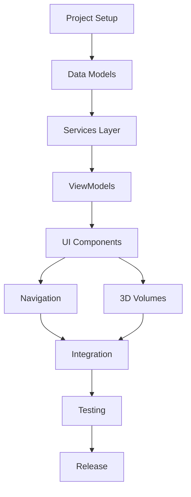

# Implementation Plan
## visionOS Executive Briefing App

### Document Version
- **Version**: 1.0
- **Date**: 2025-11-19
- **Status**: Ready for Execution

---

## 1. Development Phases and Milestones

### Phase 1: Foundation (Week 1)
**Goal**: Project setup and data layer implementation

**Milestones**:
- ✅ Architecture documentation complete
- ✅ Technical specification complete
- ✅ Design specification complete
- [ ] Xcode project structure created
- [ ] Data models implemented with unit tests
- [ ] SwiftData persistence working
- [ ] Markdown parser implemented
- [ ] Content seeded from markdown file

**Deliverable**: Working data layer with 100% test coverage

---

### Phase 2: Core UI (Week 2)
**Goal**: Main window interface with navigation

**Milestones**:
- [ ] Main window layout implemented
- [ ] Sidebar with table of contents
- [ ] Content area with section display
- [ ] Navigation between sections
- [ ] Content block rendering (text, metrics, lists)
- [ ] Basic UI tests for navigation flow
- [ ] Accessibility labels and VoiceOver support

**Deliverable**: Functional 2D window interface with all content accessible

---

### Phase 3: 3D Visualizations (Week 3)
**Goal**: Volumetric content for data visualization

**Milestones**:
- [ ] ROI comparison volume implemented
- [ ] 3D bar chart with RealityKit
- [ ] Interactive selection in 3D space
- [ ] Decision matrix volume
- [ ] Investment timeline volume
- [ ] Volume opening/closing animations
- [ ] Integration tests for 3D components

**Deliverable**: Three working volumetric visualizations

---

### Phase 4: Interactions & Polish (Week 4)
**Goal**: Advanced interactions and user experience refinement

**Milestones**:
- [ ] Gesture handling (tap, drag, rotate)
- [ ] Hover effects throughout UI
- [ ] Action item tracking and persistence
- [ ] Progress tracking system
- [ ] Spatial audio integration
- [ ] Performance optimization pass
- [ ] UI polish and animations

**Deliverable**: Polished, interactive experience with smooth performance

---

### Phase 5: Testing & Accessibility (Week 5)
**Goal**: Comprehensive testing and accessibility compliance

**Milestones**:
- [ ] Complete unit test suite (>80% coverage)
- [ ] Complete UI test suite (critical flows)
- [ ] Accessibility audit and fixes
- [ ] Performance testing and optimization
- [ ] Reduced motion support
- [ ] VoiceOver optimization
- [ ] Integration testing

**Deliverable**: Production-ready app with comprehensive test coverage

---

### Phase 6: Documentation & Deployment (Week 6)
**Goal**: Final documentation and release preparation

**Milestones**:
- [ ] User documentation and README
- [ ] Code documentation (DocC)
- [ ] TestFlight build
- [ ] Beta testing feedback
- [ ] Bug fixes and refinements
- [ ] Final performance tuning
- [ ] Release build

**Deliverable**: App Store / TestFlight ready build

---

## 2. Feature Breakdown and Prioritization

### 2.1 Must-Have (MVP)

**P0 - Critical**:
1. ✅ Project structure and setup
2. [ ] Data models and persistence
3. [ ] Content loading from markdown
4. [ ] Main window with navigation
5. [ ] Section content display
6. [ ] ROI visualization volume
7. [ ] Basic gestures (tap, select)
8. [ ] Action item tracking
9. [ ] Basic accessibility (VoiceOver)
10. [ ] Unit tests for core functionality

**P1 - High Priority**:
11. [ ] Decision matrix volume
12. [ ] Timeline volume
13. [ ] Progress tracking
14. [ ] Hover effects
15. [ ] UI animations
16. [ ] Spatial audio
17. [ ] UI tests
18. [ ] Performance optimization
19. [ ] Error handling
20. [ ] User documentation

### 2.2 Should-Have (Post-MVP)

**P2 - Medium Priority**:
- [ ] Immersive space experience
- [ ] Hand tracking gestures
- [ ] Voice commands
- [ ] Search functionality
- [ ] Bookmarks/favorites
- [ ] Export progress feature
- [ ] Multi-user SharePlay
- [ ] Advanced animations

### 2.3 Nice-to-Have (Future)

**P3 - Low Priority**:
- [ ] Cloud sync
- [ ] Multiple briefing topics
- [ ] Personalization engine
- [ ] AI-powered insights
- [ ] Custom briefing builder
- [ ] PDF/PowerPoint export
- [ ] Real-time data integration

---

## 3. Sprint Planning

### Sprint 1: Foundation (Days 1-7)

**Day 1-2**: Project Setup
- [x] Create design documents
- [ ] Create Xcode project
- [ ] Set up folder structure
- [ ] Configure build settings
- [ ] Set up SwiftData
- [ ] Create test targets

**Day 3-4**: Data Models
- [ ] Implement all @Model classes
- [ ] Create supporting structs and enums
- [ ] Write unit tests for models
- [ ] Implement markdown parser
- [ ] Test markdown parsing

**Day 5-7**: Services Layer
- [ ] Implement BriefingContentService
- [ ] Implement ProgressService
- [ ] Create data seeder
- [ ] Write unit tests for services
- [ ] Integration testing

**Sprint Goal**: Data layer complete with tests

---

### Sprint 2: Core UI (Days 8-14)

**Day 8-9**: Window Structure
- [ ] Create main app file
- [ ] Implement AppState
- [ ] Create main window layout
- [ ] Build sidebar component
- [ ] Build content area

**Day 10-11**: Content Rendering
- [ ] Implement ContentBlockView
- [ ] Create MetricCard component
- [ ] Create UseCaseCard component
- [ ] Create ChecklistItemView
- [ ] Test rendering all content types

**Day 12-14**: Navigation & State
- [ ] Implement navigation logic
- [ ] Create ViewModels
- [ ] Wire up state management
- [ ] Add progress tracking UI
- [ ] Write UI tests for navigation

**Sprint Goal**: Functional 2D interface

---

### Sprint 3: 3D Visualizations (Days 15-21)

**Day 15-16**: ROI Chart Volume
- [ ] Create DataVisualizationVolume
- [ ] Implement 3D bar chart
- [ ] Add materials and lighting
- [ ] Add labels and legends
- [ ] Test visualization rendering

**Day 17-18**: Decision Matrix
- [ ] Implement decision matrix layout
- [ ] Create 3D scatter plot
- [ ] Add quadrant visualization
- [ ] Add interaction handling
- [ ] Test matrix interactions

**Day 19-21**: Timeline & Integration
- [ ] Implement timeline volume
- [ ] Create 3D path visualization
- [ ] Add phase markers
- [ ] Test all visualizations
- [ ] Write integration tests

**Sprint Goal**: Three working volumes

---

### Sprint 4: Interactions (Days 22-28)

**Day 22-23**: Gesture System
- [ ] Implement tap gestures
- [ ] Implement drag gestures
- [ ] Implement rotation gestures
- [ ] Add hover effects
- [ ] Test gesture recognition

**Day 24-25**: Interactivity
- [ ] Add selection handling
- [ ] Implement detail panels
- [ ] Add action item completion
- [ ] Persist user actions
- [ ] Test user flows

**Day 26-28**: Polish
- [ ] Add animations
- [ ] Implement spatial audio
- [ ] Optimize performance
- [ ] Fix visual bugs
- [ ] Performance testing

**Sprint Goal**: Polished interactions

---

### Sprint 5: Testing (Days 29-35)

**Day 29-30**: Unit Testing
- [ ] Achieve 80%+ code coverage
- [ ] Test edge cases
- [ ] Test error handling
- [ ] Refactor for testability
- [ ] Document test strategy

**Day 31-32**: UI Testing
- [ ] Test critical user flows
- [ ] Test all navigation paths
- [ ] Test 3D interactions
- [ ] Test accessibility features
- [ ] Performance benchmarks

**Day 33-35**: Accessibility
- [ ] VoiceOver audit
- [ ] Dynamic Type testing
- [ ] Reduced motion support
- [ ] High contrast testing
- [ ] Accessibility tests

**Sprint Goal**: Comprehensive testing

---

### Sprint 6: Release (Days 36-42)

**Day 36-37**: Documentation
- [ ] Write README
- [ ] Create user guide
- [ ] Document code (DocC)
- [ ] API documentation
- [ ] Troubleshooting guide

**Day 38-39**: Beta Testing
- [ ] Create TestFlight build
- [ ] Distribute to testers
- [ ] Collect feedback
- [ ] Fix critical bugs
- [ ] Test on device

**Day 40-42**: Final Polish
- [ ] Address beta feedback
- [ ] Final performance tuning
- [ ] Final accessibility check
- [ ] Create release build
- [ ] Submit for review

**Sprint Goal**: Production release

---

## 4. Dependencies and Prerequisites

### 4.1 Technical Dependencies

**Required**:
- macOS 14.0+ (for Xcode 16)
- Xcode 16.0+ with visionOS SDK
- visionOS 2.0+ target
- Swift 6.0 compiler

**Optional**:
- Apple Vision Pro device (for device testing)
- Reality Composer Pro (for advanced 3D content)
- visionOS Simulator (for testing)

### 4.2 Knowledge Prerequisites

**Team Skills Needed**:
1. Swift 6.0 and SwiftUI expertise
2. RealityKit and 3D graphics knowledge
3. visionOS spatial computing concepts
4. SwiftData and persistence
5. XCTest and UI testing
6. Accessibility best practices

### 4.3 Task Dependencies



**Critical Path**:
1. Project Setup → Data Models → Services → UI → Testing → Release
2. Any delay in data models blocks all downstream work
3. UI and 3D work can proceed in parallel after services complete

---

## 5. Risk Assessment and Mitigation

### 5.1 Technical Risks

| Risk | Probability | Impact | Mitigation |
|------|------------|--------|------------|
| Performance issues with 3D rendering | Medium | High | Early performance testing, LOD system, profiling |
| SwiftData bugs or limitations | Low | Medium | Fallback to CoreData if needed |
| visionOS simulator limitations | High | Low | Test on actual device when possible |
| Complex gesture conflicts | Medium | Medium | Clear gesture priority system, testing |
| Accessibility compliance gaps | Medium | High | Early accessibility audit, expert review |

### 5.2 Schedule Risks

| Risk | Probability | Impact | Mitigation |
|------|------------|--------|------------|
| Underestimated complexity | Medium | High | Buffer time in each sprint, prioritize ruthlessly |
| Scope creep | High | Medium | Strict P0/P1 focus, defer nice-to-haves |
| Technical blockers | Medium | High | Daily standups, quick escalation, pair programming |
| Testing takes longer | Medium | Medium | Start testing early, automate where possible |

### 5.3 Resource Risks

| Risk | Probability | Impact | Mitigation |
|------|------------|--------|------------|
| No Vision Pro hardware | High | Medium | Use simulator, cloud device testing |
| Limited visionOS experience | Medium | High | Training, Apple docs, sample code |
| Single developer | High | High | Clear documentation, modular code |

### 5.4 Mitigation Strategies

**Technical Mitigations**:
1. **Performance**: Profile early and often with Instruments
2. **Quality**: Write tests alongside code, not after
3. **Accessibility**: Build in from start, not retrofitted
4. **Complexity**: Start simple, iterate based on feedback

**Process Mitigations**:
1. **Daily progress tracking**: Update todos daily
2. **Weekly reviews**: Assess progress vs. plan
3. **Flexible scope**: Ready to drop P2 features if needed
4. **Early device testing**: Test on Vision Pro ASAP

---

## 6. Testing Strategy

### 6.1 Unit Testing Approach

**Coverage Goal**: 80% minimum

**What to Test**:
```swift
// Models
- Data validation
- Computed properties
- Relationships
- Encodable/Decodable

// Services
- Business logic
- Data transformations
- Error handling
- Edge cases

// ViewModels
- State changes
- User actions
- Data loading
- Error states

// Utilities
- Parsers
- Formatters
- Extensions
- Helpers
```

**Testing Framework**:
```swift
import XCTest
@testable import ExecutiveBriefing

final class BriefingServiceTests: XCTestCase {
    var sut: BriefingContentService!
    var mockContext: ModelContext!

    override func setUp() async throws {
        mockContext = createInMemoryContext()
        sut = BriefingContentService(context: mockContext)
    }

    override func tearDown() async throws {
        sut = nil
        mockContext = nil
    }

    func testLoadBriefing_Success() async throws {
        // Given
        seedTestData(in: mockContext)

        // When
        let sections = try await sut.loadBriefing()

        // Then
        XCTAssertEqual(sections.count, 8)
        XCTAssertEqual(sections.first?.title, "Executive Summary")
    }

    func testLoadBriefing_EmptyDatabase() async throws {
        // When/Then
        await XCTAssertThrowsError(try await sut.loadBriefing())
    }
}
```

**Test Organization**:
```
ExecutiveBriefingTests/
├── ModelTests/
│   ├── BriefingSectionTests.swift
│   ├── UseCaseTests.swift
│   └── ...
├── ServiceTests/
│   ├── BriefingContentServiceTests.swift
│   ├── VisualizationServiceTests.swift
│   └── ...
├── ViewModelTests/
│   ├── SectionViewModelTests.swift
│   └── ...
├── UtilityTests/
│   ├── MarkdownParserTests.swift
│   └── ...
└── TestHelpers/
    ├── MockData.swift
    ├── TestUtilities.swift
    └── XCTestExtensions.swift
```

### 6.2 UI Testing

**Coverage Goal**: All critical user flows

**Test Scenarios**:
```swift
1. App Launch
   - App launches successfully
   - Main window appears
   - Initial content loads

2. Navigation
   - Select section from sidebar
   - Content updates
   - Back/forward navigation works
   - Breadcrumbs update

3. Content Interaction
   - Scroll through content
   - Expand/collapse sections
   - View metrics
   - Read use cases

4. 3D Visualizations
   - Open ROI chart volume
   - Volume appears in space
   - Tap to select bar
   - Details panel shows
   - Close volume

5. Action Items
   - View action items
   - Check off item
   - Persistence verified
   - Progress updates

6. Accessibility
   - VoiceOver navigation
   - All elements have labels
   - Dynamic Type scaling
   - Reduced motion respected
```

**UI Test Example**:
```swift
final class NavigationUITests: XCTestCase {
    var app: XCUIApplication!

    override func setUp() {
        continueAfterFailure = false
        app = XCUIApplication()
        app.launchArguments = ["--uitesting"]
        app.launch()
    }

    func testNavigateToExecutiveSummary() {
        // Given
        let sidebar = app.otherElements["sidebar"]
        XCTAssertTrue(sidebar.exists)

        // When
        let summaryButton = sidebar.buttons["Executive Summary"]
        summaryButton.tap()

        // Then
        let heading = app.staticTexts["Executive Summary"]
        XCTAssertTrue(heading.waitForExistence(timeout: 2))

        let content = app.staticTexts.containing(NSPredicate(
            format: "label CONTAINS 'Spatial computing'"
        ))
        XCTAssertTrue(content.firstMatch.exists)
    }

    func testOpenROIVisualization() {
        // Given
        navigateToSection("Top 10 Use Cases")

        // When
        let vizButton = app.buttons["View 3D ROI Chart"]
        vizButton.tap()

        // Then
        let chartTitle = app.staticTexts["ROI Comparison"]
        XCTAssertTrue(chartTitle.waitForExistence(timeout: 3))

        // Verify 3D content rendered
        let barCharts = app.otherElements.matching(
            identifier: "roi-bar-chart"
        )
        XCTAssertGreaterThan(barCharts.count, 0)
    }
}
```

### 6.3 Integration Testing

**Scope**: Test complete data flows

**Integration Test Scenarios**:
```swift
1. Data Seeding Flow
   - Load markdown file
   - Parse content
   - Create models
   - Save to SwiftData
   - Verify persistence

2. Content Display Flow
   - Service loads from database
   - ViewModel processes data
   - View renders content
   - User sees correct information

3. Visualization Flow
   - User requests visualization
   - Service fetches data
   - 3D entities created
   - Volume displays correctly
   - Interaction works

4. Progress Tracking Flow
   - User completes action
   - ViewModel updates state
   - Service persists change
   - UI reflects new state
   - Survives app restart
```

**Integration Test Example**:
```swift
final class ContentFlowIntegrationTests: XCTestCase {
    var container: ModelContainer!
    var context: ModelContext!
    var service: BriefingContentService!
    var viewModel: SectionViewModel!

    override func setUp() async throws {
        container = try ModelContainer(
            for: BriefingSection.self,
            configurations: ModelConfiguration(isStoredInMemoryOnly: true)
        )
        context = ModelContext(container)

        // Seed data
        try await DataSeeder.seedInitialData(modelContext: context)

        service = BriefingContentService(modelContext: context)
        viewModel = SectionViewModel(service: service)
    }

    func testCompleteUserFlowEndToEnd() async throws {
        // 1. Load content
        await viewModel.loadContent()

        XCTAssertFalse(viewModel.isLoading)
        XCTAssertNil(viewModel.errorMessage)
        XCTAssertGreaterThan(viewModel.sections.count, 0)

        // 2. Select section
        let firstSection = viewModel.sections.first!
        await viewModel.selectSection(firstSection)

        XCTAssertEqual(viewModel.currentSection?.id, firstSection.id)

        // 3. Mark action item complete
        let actionItem = ActionItem(
            role: .ceo,
            title: "Test Action",
            description: "Test",
            completed: false
        )
        context.insert(actionItem)

        await viewModel.toggleActionItem(actionItem)

        XCTAssertTrue(actionItem.completed)

        // 4. Verify persistence
        let fetchedItem = try context.fetch(
            FetchDescriptor<ActionItem>(
                predicate: #Predicate { $0.id == actionItem.id }
            )
        ).first

        XCTAssertNotNil(fetchedItem)
        XCTAssertTrue(fetchedItem!.completed)
    }
}
```

### 6.4 Performance Testing

**Metrics to Test**:
```swift
1. Launch Time
   - Target: < 2 seconds
   - Metric: Time to interactive

2. Content Load Time
   - Target: < 500ms
   - Metric: Service response time

3. Visualization Render Time
   - Target: < 1 second
   - Metric: Entity creation to display

4. Frame Rate
   - Target: 90 FPS
   - Metric: Sustained frame rate during interaction

5. Memory Usage
   - Target: < 500 MB
   - Metric: Peak memory consumption

6. Battery Impact
   - Target: Low rating
   - Metric: Energy impact in Instruments
```

**Performance Test Example**:
```swift
final class PerformanceTests: XCTestCase {
    func testAppLaunchPerformance() {
        measure(metrics: [XCTApplicationLaunchMetric()]) {
            let app = XCUIApplication()
            app.launch()
            app.terminate()
        }
        // Should complete in < 2 seconds
    }

    func testContentLoadPerformance() {
        let service = BriefingContentService()

        measure(metrics: [XCTClockMetric(), XCTMemoryMetric()]) {
            let expectation = XCTestExpectation()

            Task {
                _ = try await service.loadBriefing()
                expectation.fulfill()
            }

            wait(for: [expectation], timeout: 1.0)
        }
    }

    func testVisualizationRenderPerformance() {
        let vizService = VisualizationService()
        let useCases = TestData.tenUseCases

        measure(metrics: [XCTClockMetric(), XCTCPUMetric()]) {
            Task {
                _ = await vizService.generateROIChart(useCases: useCases)
            }
        }
        // Should complete in < 1 second
    }

    func testScrollPerformance() {
        let app = XCUIApplication()
        app.launch()

        measure(metrics: [XCTOSSignpostMetric.scrollDecelerationMetric]) {
            let scrollView = app.scrollViews.firstMatch
            scrollView.swipeUp(velocity: .fast)
        }
        // Should maintain 90 FPS
    }
}
```

### 6.5 Accessibility Testing

**Test Categories**:
```swift
1. VoiceOver
   - All elements have labels
   - Labels are descriptive
   - Navigation is logical
   - Actions are announced

2. Dynamic Type
   - Text scales properly
   - Layout adapts
   - No truncation at large sizes
   - Minimum readability maintained

3. Reduced Motion
   - Animations can be disabled
   - Functionality preserved
   - No reliance on animation cues

4. High Contrast
   - Colors remain distinguishable
   - Borders added where needed
   - Information not color-only

5. Alternative Inputs
   - Keyboard navigation works
   - Voice control works
   - Switch control supported
```

**Accessibility Test Example**:
```swift
final class AccessibilityTests: XCTestCase {
    func testVoiceOverLabels() {
        let app = XCUIApplication()
        app.launch()

        // All buttons should have labels
        let buttons = app.buttons.allElementsBoundByIndex
        for button in buttons {
            XCTAssertFalse(
                button.label.isEmpty,
                "Button at index \(buttons.firstIndex(of: button)!) missing label"
            )
        }

        // Metrics should have accessible values
        let metrics = app.staticTexts.matching(
            identifier: "metric-value"
        )
        for i in 0..<metrics.count {
            let metric = metrics.element(boundBy: i)
            XCTAssertFalse(metric.label.isEmpty)
            XCTAssertNotNil(metric.value)
        }
    }

    func testDynamicTypeScaling() {
        // Test at different type sizes
        let sizes: [UIContentSizeCategory] = [
            .extraSmall,
            .medium,
            .extraExtraExtraLarge,
            .accessibilityExtraExtraExtraLarge
        ]

        for size in sizes {
            let app = XCUIApplication()
            app.launchArguments = ["--ContentSizeCategory", size.rawValue]
            app.launch()

            // Verify content is still readable
            let heading = app.staticTexts["Executive Summary"]
            XCTAssertTrue(heading.exists)
            XCTAssertTrue(heading.isHittable)

            app.terminate()
        }
    }

    func testReducedMotion() {
        let app = XCUIApplication()
        app.launchArguments = ["--ReduceMotion", "1"]
        app.launch()

        // Verify app functions without animations
        let vizButton = app.buttons["View 3D ROI Chart"]
        vizButton.tap()

        // Chart should still appear (just without animation)
        let chart = app.otherElements["roi-chart"]
        XCTAssertTrue(chart.waitForExistence(timeout: 1))
    }
}
```

### 6.6 Test Automation

**CI/CD Pipeline** (Future):
```yaml
# Automated testing on commit
name: Test Suite

on: [push, pull_request]

jobs:
  unit-tests:
    runs-on: macos-14
    steps:
      - uses: actions/checkout@v3
      - name: Run Unit Tests
        run: xcodebuild test -scheme ExecutiveBriefing -destination 'platform=visionOS Simulator,name=Apple Vision Pro' -testPlan UnitTests

  ui-tests:
    runs-on: macos-14
    steps:
      - uses: actions/checkout@v3
      - name: Run UI Tests
        run: xcodebuild test -scheme ExecutiveBriefing -destination 'platform=visionOS Simulator,name=Apple Vision Pro' -testPlan UITests

  performance-tests:
    runs-on: macos-14
    steps:
      - uses: actions/checkout@v3
      - name: Run Performance Tests
        run: xcodebuild test -scheme ExecutiveBriefing -destination 'platform=visionOS Simulator,name=Apple Vision Pro' -testPlan PerformanceTests
```

---

## 7. Success Metrics

### 7.1 Development Metrics

| Metric | Target | Measurement |
|--------|--------|-------------|
| Code Coverage | > 80% | Xcode coverage report |
| Build Time | < 30s | Xcode build duration |
| Test Execution Time | < 5min | Total test suite run |
| Static Analysis Warnings | 0 | Xcode analyzer |
| SwiftLint Warnings | 0 | Linter output |

### 7.2 Quality Metrics

| Metric | Target | Measurement |
|--------|--------|-------------|
| Crash Rate | < 0.1% | Analytics |
| Bug Density | < 1 per KLOC | Bug tracker |
| Accessibility Score | 100% | Accessibility Inspector |
| Performance Score | > 90 FPS | Instruments |
| User Rating | > 4.5/5 | App Store reviews |

### 7.3 Feature Completeness

| Category | MVP Features | Status |
|----------|--------------|--------|
| Data Layer | 5/5 | Pending |
| UI Components | 8/8 | Pending |
| 3D Volumes | 3/3 | Pending |
| Interactions | 6/6 | Pending |
| Accessibility | 5/5 | Pending |
| Testing | 4/4 | Pending |

---

## 8. Release Criteria

### 8.1 Functional Requirements

**Must Pass**:
- [ ] All P0 features implemented
- [ ] All critical user flows work
- [ ] Content loads correctly
- [ ] Navigation works seamlessly
- [ ] 3D visualizations display properly
- [ ] Action items can be completed
- [ ] Progress persists across sessions
- [ ] No crashes in testing

### 8.2 Quality Requirements

**Must Pass**:
- [ ] 80%+ code coverage
- [ ] All UI tests pass
- [ ] Accessibility audit complete
- [ ] Performance targets met
- [ ] No high-severity bugs
- [ ] No memory leaks
- [ ] Battery impact is "Low"

### 8.3 Documentation Requirements

**Must Have**:
- [ ] README with setup instructions
- [ ] User guide
- [ ] API documentation
- [ ] Architecture documentation
- [ ] Testing documentation
- [ ] Troubleshooting guide

### 8.4 Deployment Requirements

**Must Complete**:
- [ ] TestFlight build created
- [ ] Beta testing completed
- [ ] Feedback addressed
- [ ] App Store screenshots
- [ ] App Store description
- [ ] Privacy policy
- [ ] Release notes

---

## 9. Post-Launch Plan

### 9.1 Monitoring

**Metrics to Track**:
- Daily active users
- Session duration
- Feature usage
- Crash rate
- Performance metrics
- User feedback

**Tools**:
- Xcode Organizer (crash logs)
- Analytics dashboard
- User feedback forms
- App Store reviews

### 9.2 Iteration Plan

**v1.1** (1 month post-launch):
- Bug fixes from user feedback
- Performance improvements
- Accessibility enhancements
- Minor feature additions

**v1.2** (3 months post-launch):
- Immersive space experience
- Hand tracking gestures
- Voice commands
- SharePlay support

**v2.0** (6 months post-launch):
- Multiple briefing topics
- Cloud sync
- Personalization
- AI-powered insights

---

## 10. Resource Allocation

### 10.1 Time Allocation

| Phase | Duration | Effort |
|-------|----------|--------|
| Foundation | 7 days | 1 FTE |
| Core UI | 7 days | 1 FTE |
| 3D Viz | 7 days | 1 FTE |
| Interactions | 7 days | 1 FTE |
| Testing | 7 days | 1 FTE |
| Release | 7 days | 1 FTE |
| **Total** | **42 days** | **1 FTE** |

**FTE**: Full-Time Equivalent developer

### 10.2 Skill Requirements

**Primary Skills** (must have):
- Swift/SwiftUI expert
- visionOS development
- RealityKit knowledge
- Testing experience

**Secondary Skills** (nice to have):
- 3D graphics
- Accessibility expertise
- UX design
- Technical writing

---

## 11. Decision Log

### Decision 001: Local-First Architecture
**Date**: 2025-11-19
**Decision**: All data stored locally, no network required for MVP
**Rationale**: Simpler implementation, better privacy, works offline
**Impact**: Content updates require app updates

### Decision 002: SwiftData Over CoreData
**Date**: 2025-11-19
**Decision**: Use SwiftData for persistence
**Rationale**: Modern API, better Swift integration
**Impact**: Requires visionOS 2.0+

### Decision 003: Progressive Disclosure
**Date**: 2025-11-19
**Decision**: Start with windows, expand to volumes on-demand
**Rationale**: Better UX, less overwhelming
**Impact**: More complex state management

### Decision 004: Test-Driven Development
**Date**: 2025-11-19
**Decision**: Write tests alongside code, aim for 80% coverage
**Rationale**: Better quality, easier refactoring, fewer bugs
**Impact**: More upfront time, faster iteration later

---

## 12. Communication Plan

### 12.1 Daily Updates
- Update todos in tracking system
- Log blockers immediately
- Document decisions

### 12.2 Weekly Reviews
- Review progress vs. plan
- Adjust timeline if needed
- Reprioritize features
- Update stakeholders

### 12.3 Milestone Reviews
- Demo working features
- Collect feedback
- Update documentation
- Plan next phase

---

## Appendix A: Testing Checklist

### Unit Tests
- [ ] All models tested
- [ ] All services tested
- [ ] All view models tested
- [ ] All utilities tested
- [ ] Edge cases covered
- [ ] Error cases covered
- [ ] 80%+ coverage achieved

### Integration Tests
- [ ] Data seeding flow
- [ ] Content display flow
- [ ] Visualization flow
- [ ] Progress tracking flow
- [ ] End-to-end user flows

### UI Tests
- [ ] App launch
- [ ] Navigation flows
- [ ] Content interaction
- [ ] 3D visualization interaction
- [ ] Action item completion
- [ ] Accessibility features

### Performance Tests
- [ ] Launch time < 2s
- [ ] Content load < 500ms
- [ ] Visualization render < 1s
- [ ] Frame rate > 90 FPS
- [ ] Memory < 500 MB
- [ ] Battery impact low

### Accessibility Tests
- [ ] VoiceOver complete
- [ ] Dynamic Type supported
- [ ] Reduced motion supported
- [ ] High contrast supported
- [ ] Alternative inputs work

### Manual Tests
- [ ] Device testing (if available)
- [ ] Full user journey
- [ ] Edge case scenarios
- [ ] Stress testing
- [ ] Beta user feedback

---

## Appendix B: Implementation Order

**Recommended implementation order for efficiency**:

1. ✅ ARCHITECTURE.md
2. ✅ TECHNICAL_SPEC.md
3. ✅ DESIGN.md
4. ✅ IMPLEMENTATION_PLAN.md
5. [ ] Project structure and Xcode project
6. [ ] Data models + tests
7. [ ] Markdown parser + tests
8. [ ] Services layer + tests
9. [ ] ViewModels + tests
10. [ ] Basic UI components
11. [ ] Main window layout
12. [ ] Content rendering
13. [ ] Navigation system
14. [ ] ROI visualization volume
15. [ ] Decision matrix volume
16. [ ] Timeline volume
17. [ ] Gesture handling
18. [ ] Hover effects
19. [ ] Animations
20. [ ] Spatial audio
21. [ ] Action item tracking
22. [ ] Progress system
23. [ ] UI tests
24. [ ] Accessibility features
25. [ ] Accessibility tests
26. [ ] Performance optimization
27. [ ] Performance tests
28. [ ] Documentation
29. [ ] TestFlight build
30. [ ] Release

---

**Document Status**: Implementation ready
**Next Step**: Create Xcode project structure
